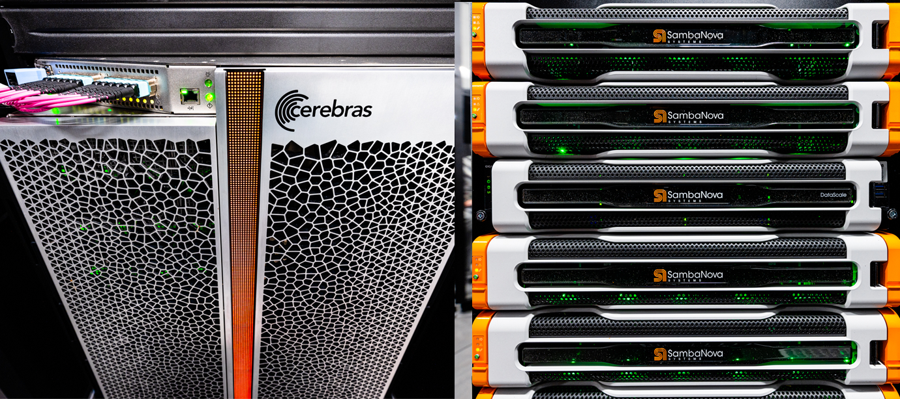

# ALCF AI Testbed

<figure markdown>
  { width="700" }
</figure>

The [ALCF AI Testbed](https://www.alcf.anl.gov/alcf-ai-testbed) houses some of the most advanced AI accelerators for scientific research. 

The goal of the testbed is to enable explorations into next-generation machine learning applications and workloads, enabling the ALCF and its user community to help define the role of AI accelerators in scientific computing and how to best integrate such technologies with supercomputing resources.

The AI accelerators complement the ALCF's current and next-generation supercomputers to provide a state-of-the-art computing environment that supports pioneering research at the intersection of AI, big data, and high performance computing (HPC). 

The platforms are equipped with architectural features that support AI and data-centric workloads, making them well suited for research tasks involving the growing deluge of scientific data produced by powerful tools, such as supercomputers, light sources, telescopes, particle accelerators, and sensors. In addition, the testbed will allow researchers to explore novel workflows that combine AI methods with simulation and experimental science to accelerate the pace of discovery.

## How to Get Access
Researchers interested in using the AI Testbed’s `Cerebras CS-2`, `SambaNova DataScale SN30`, `Graphcore Bow Pod64` and `GroqRack` platforms can now submit project proposals via the [ALCF’s Director’s Discretionary program](https://www.alcf.anl.gov/science/directors-discretionary-allocation-program). Access to additional testbed resources, including `Habana` accelerators, will be announced at a later date. 

Submit your proposal requests at: [Allocation Request Page](https://my.alcf.anl.gov/accounts/#/allocationRequests){:target="_blank"}

## Getting Started
1. Request a Director's Discretionary project on SambaNova/Cerebras/Graphcore/Groq.

2. Apply for an ALCF account after the project request is approved. Choose the SambaNova/Cerebras/Graphcore/Groq project that your PI has created at ALCF. If you have an active ALCF account, request to [join the project](https://my.alcf.anl.gov/){:target="_blank"} after your project is approved.

3. Transfer data to ALCF using Globus after your account has been created.

    a. The endpoint for your data in ALCF is ``` alcf#ai_testbed_projects ``` with the path to your project being  ``` /<project name> ```. 

    b. The endpoint for your home directory on the AI Testbeds in ALCF is ``` alcf#ai_testbed_home ```.

4. Add/invite team members to your ALCF project on SambaNova/Cerebras/Graphcore/Groq. 

## How to Contribute to Documentation
The documentation is based on [MkDocs](https://www.mkdocs.org/){:target="_blank"} and source files are
on [GitHub](https://github.com/argonne-lcf/ai-testbed-userdocs). You can contribute to the documentation by creating a pull request. 
 
 [Learn more on how to contribute to documentation.](https://github.com/argonne-lcf/user-guides/blob/main/README.md)
