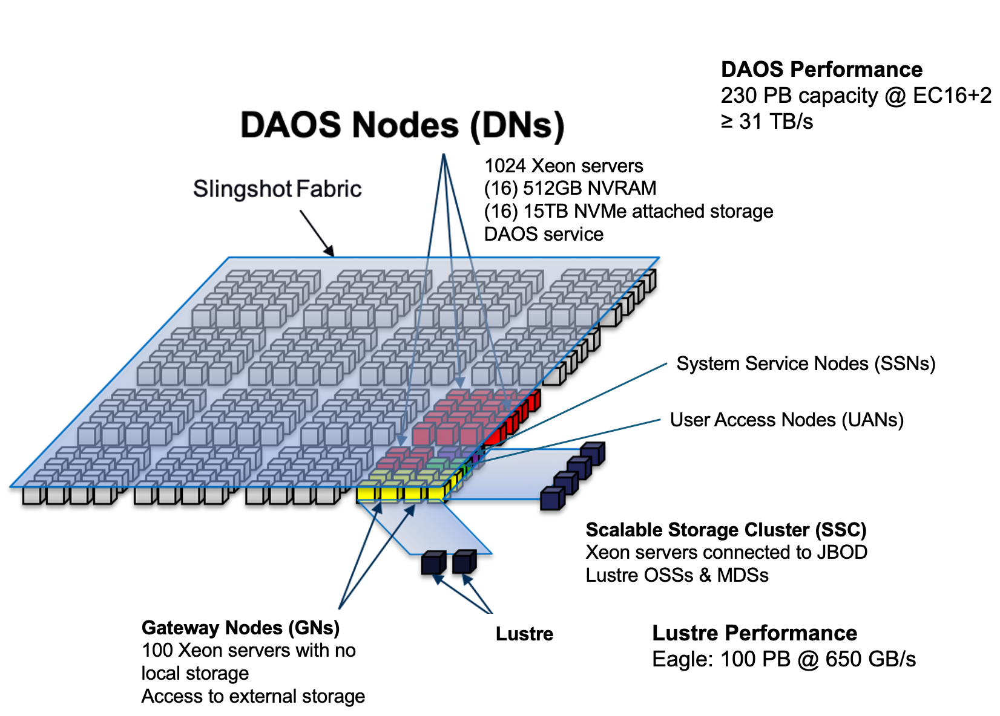
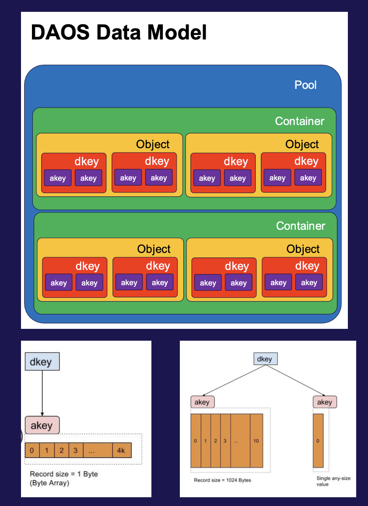
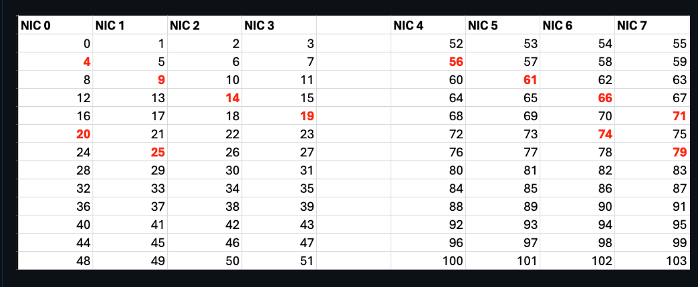
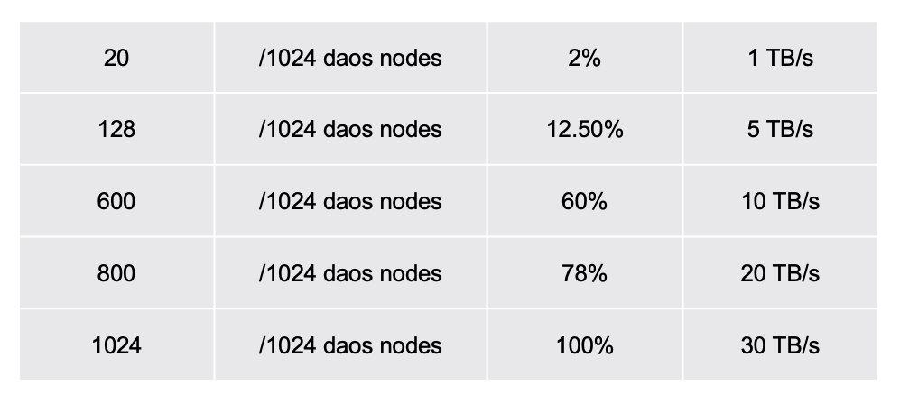

# DAOS Architecture

!!! warning

    DAOS is a scratch file system. Please note that data may be removed or unavailable at any time. 

DAOS is a major file system in Aurora with 230 PB delivering upto >30 TB/s with 1024 DAOS server storage Nodes.
DAOS is an open-source software-defined object store designed for massively distributed Non Volatile Memory (NVM) and NVMe SSD. 
DAOS presents a unified storage model with a native Key-array Value storage interface supporitng POSIX, MPIO, DFS and HDF5.
Users can use DAOS for their I/O and checkpointing on Aurora. 
DAOS is fully integrated with the wider Aurora compute fabric as can be seen in the overall storage architecture below.



## DAOS Overview

The first step in using DAOS is to get DAOS POOL space allocated for your project. 
Users should submit a request as noted below to have a DAOS pool created for your project.

## DAOS Pool Allocation

DAOS pool is a physically allocated dedicated storage space for your project. 

Email [support@alcf.anl.gov](mailto:support@alcf.anl.gov) to request a DAOS pool with the following information.

* Project Name
* ALCF User Names
* Total Space requested (typically 100 TBs++)
* Justification
* Preferred pool name 


### Note
This is an initial test DAOS configuration and as such, any data on the DAOS system will eventually be deleted when the configuration is changed into a larger system.
Warning will be given before the system is wiped to allow time for users to move any important data off.

## Modules
Please load the `daos` module when using DAOS. This should be done on the login node (UAN) or in the compute node (jobscript):

```bash
module use /soft/modulefiles
module load daos/base
```

## Pool
Pool is a dedicated space allocated to your project. Once your pool is allocated for your project space. 

Confirm you are able to query the pool via:
```bash
daos pool query <pool_name>
```

```output title="Example output:"
daos pool query hacc
Pool 050b20a3-3fcc-499b-a6cf-07d4b80b04fd, ntarget=640, disabled=0, leader=2, version=131
Pool space info:
- Target(VOS) count:640
- Storage tier 0 (SCM):
Total size: 6.0 TB
  Free: 4.4 TB, min:6.5 GB, max:7.0 GB, mean:6.9 GB
- Storage tier 1 (NVMe):
  Total size: 200 TB
  Free: 194 TB, min:244 GB, max:308 GB, mean:303 GB
Rebuild done, 4 objs, 0 recs
```

## DAOS Container

The container is the basic unit of storage. A POSIX container can contain hundreds of millions of files, you can use it to store all of your data.
You only need a small set of containers; perhaps just one per major unit of project work is sufficient.

There are 3 modes with which we can operate with the DAOS containers
1. POSIX container POSIX Mode
2. POSIX Container MPI-IO Mode
3. DFS container through DAOS APIs.


### Create a POSIX container


```shell-session
$ DAOS_POOL=datascience
$ DAOS_CONT=LLM-GPT-1T
$ daos container create --type POSIX ${DAOS_POOL}  ${DAOS_CONT} --properties rd_fac:1 
  Container UUID : 59747044-016b-41be-bb2b-22693333a380
  Container Label: LLM-GPT-1T                           
  Container Type : POSIX                               

Successfully created container 59747044-016b-41be-bb2b-22693333a380
```

If you prefer a higher data protection and recovery you can `--properties rd_fac:2` and if you don't need data protection and recovery, you can remove `--properties rd_fac:1`.
We recommend to have at least `--properties rd_fac:1`.



## DAOS sanity checks

If any of the following command results in an error, then you can confirm DAOS is currently down. 
'Out of group or member list' error is an exception and can be safely ignored. This error message will be fixed in the next daos release.

```bash
module use /soft/modulefiles
module load daos/base
env | grep DRPC       
ps –ef | grep daos                                   
clush --hostfile ${PBS_NODEFILE} ps –ef | grep agent | grep -v grep'  | dshbak -c     #to check on all compute nodes
export DAOS_POOL=Your_allocated_pool_name
daos pool query ${DAOS_POOL}
daos cont list ${DAOS_POOL}
daos container get-prop  $DAOS_POOL_NAME  $DAOS_CONT_NAME 

```

* Look for messages like `Rebuild busy and state degraded in the daos pool query.` 
* Look for messages like `Health (status) : UNCLEAN in the get prop`

```bash
daos pool      autotest  $DAOS_POOL_NAME 
daos container check --pool=$DAOS_POOL_NAME --cont=$DAOS_CONT_NAME 
```

### Mount a POSIX container

Currently, you must manually mount your container prior to use on any node you are working on.
In the future, we hope to automate some of this via additional `qsub` options.

#### To mount a POSIX container on a login node

```bash

mkdir –p /tmp/${DAOS_POOL}/${DAOS_CONT}
start-dfuse.sh -m /tmp/${DAOS_POOL}/${DAOS_CONT} --pool ${DAOS_POOL} --cont ${DAOS_CONT} # To mount
mount | grep dfuse # To confirm if its mounted

# Mode 1
ls /tmp/${DAOS_POOL}/${DAOS_CONT} 
cd /tmp/${DAOS_POOL}/${DAOS_CONT} 
cp ~/temp.txt ~ /tmp/${DAOS_POOL}/${DAOS_CONT}/ 
cat /tmp/${DAOS_POOL}/${DAOS_CONT}/temp.txt

fusermount3 -u /tmp/${DAOS_POOL}/${DAOS_CONT} # To unmount
```
 
#### To mount a POSIX container on Compute Nodes

You need to mount the container on all compute nodes.

```bash
launch-dfuse.sh ${DAOS_POOL_NAME}:${DAOS_CONT_NAME} # launched using pdsh on all compute nodes mounted at: /tmp/<pool>/<container>
mount | grep dfuse # To confirm if its mounted

ls /tmp/${DAOS_POOL}/${DAOS_CONT}/

clean-dfuse.sh  ${DAOS_POOL_NAME}:${DAOS_CONT_NAME} # To unmount on all nodes 
```
DAOS Data mover instruction is provided at [here](../moving_data_to_aurora/daos_datamover.md).

## Job Submission

The `-l filesystems=daos_user` and `-l daos=daos_user` switch will ensure that DAOS is accessible on the compute nodes.

Job submission without requesting DAOS:  
```bash
qsub -l select=1 -l walltime=01:00:00 -A <ProjectName> -k doe -l filesystems=flare -q debug ./pbs_script1.sh  or - I 
```

Job submission with DAOS: 
```bash
qsub -l select=1 -l walltime=01:00:00 -A <ProjectName> -k doe -l filesystems=flare:daos_user -l daos=daos_user -q debug ./pbs_script1.sh  or - I 
```

## NIC and Core Binding

Each Aurora compute node has 8 NICs and each DAOS server node has 2 NICs. 
Each NIC is capable of driving 20-25 GB/s unidirection for data transfer. 
Every read and write goes over the NIC and hence NIC binding is the key to achieve good performance. 

For 12 PPN, the following binding is recommended:
```bash
CPU_BINDING1=list:4:9:14:19:20:25:56:61:66:71:74:79
```


## Interception library for POSIX containers

The interception library (IL) is a next step in improving DAOS performance. This provides kernel-bypass for I/O data, leading to improved performance.
The libioil IL will intercept basic read and write POSIX calls while all metadata calls still go through dFuse. The libpil4dfs IL should be used for both data and metadata calls to go through dFuse.
The IL can provide a large performance improvement for bulk I/O as it bypasses the kernel and commuNICates with DAOS directly in userspace.
It will also take advantage of the multiple NICs on the node based on how many MPI processes are running on the node and which CPU socket they are on.


```bash
Interception library for POSIX mode 

mpiexec                                            # no interception
mpiexec --env LD_PRELOAD=/usr/lib64/libioil.so     # only data is intercepted 
mpiexec --env LD_PRELOAD=/usr/lib64/libpil4dfs.so  # preferred - both metadata and data is intercepted. This provides close to DFS mode performance.
```

## Sample job script

Currently, ``--no-vni`` is required in the ``mpiexec`` command to use DAOS. 

```bash linenums="1"
#!/bin/bash -x
#PBS -l select=512
#PBS -l walltime=01:00:00
#PBS -A <ProjectName>
#PBS -q prod
#PBS -k doe
#PBS -l filesystems=flare:daos_user
#PBS -l daos=daos_user

# qsub -l select=512:ncpus=208 -l walltime=01:00:00 -A <ProjectName> -l filesystems=flare:daos_user -l daos=daos_user -q prod ./pbs_script.sh or - I 

# please do not miss -l filesystems=daos_user and -l daos=daos_user in your qsub :'(

export TZ='/usr/share/zoneinfo/US/Central'
date
module use /soft/modulefiles
module load daos
env | grep DRPC                                     #optional
ps -ef|grep daos                                    #optional
clush --hostfile ${PBS_NODEFILE}  'ps -ef|grep agent|grep -v grep'  | dshbak -c  #optional
DAOS_POOL=datascience
DAOS_CONT=thundersvm_exp1
daos pool query ${DAOS_POOL}                        #optional
daos cont list ${DAOS_POOL}                         #optional
daos container destroy   ${DAOS_POOL}  ${DAOS_CONT} #optional
daos container create --type POSIX ${DAOS_POOL}  ${DAOS_CONT} --properties rd_fac:1 
daos container query     ${DAOS_POOL}  ${DAOS_CONT} #optional
daos container get-prop  ${DAOS_POOL}  ${DAOS_CONT} #optional
daos container list      ${DAOS_POOL}               #optional
launch-dfuse.sh ${DAOS_POOL}:${DAOS_CONT}           # To mount on a compute node 

# mkdir -p /tmp/${DAOS_POOL}/${DAOS_CONT}           # To mount on a login node
# start-dfuse.sh -m /tmp/${DAOS_POOL}/${DAOS_CONT}     --pool ${DAOS_POOL} --cont ${DAOS_CONT}  # To mount on a login node

mount|grep dfuse                                    #optional
ls /tmp/${DAOS_POOL}/${DAOS_CONT}                   #optional

# cp /lus/flare/projects/CSC250STDM10_CNDA/kaushik/thundersvm/input_data/real-sim_M100000_K25000_S0.836 /tmp/${DAOS_POOL}/${DAOS_CONT} #one time
# daos filesystem copy --src /lus/flare/projects/CSC250STDM10_CNDA/kaushik/thundersvm/input_data/real-sim_M100000_K25000_S0.836 --dst daos://tmp/${DAOS_POOL}/${DAOS_CONT}  # check https://docs.daos.io/v2.4/testing/datamover/ 


cd $PBS_O_WORKDIR
echo Jobid: $PBS_JOBID
echo Running on nodes `cat $PBS_NODEFILE`
NNODES=`wc -l < $PBS_NODEFILE`
RANKS_PER_NODE=12          # Number of MPI ranks per node
NRANKS=$(( NNODES * RANKS_PER_NODE ))
echo "NUM_OF_NODES=${NNODES}  TOTAL_NUM_RANKS=${NRANKS}  RANKS_PER_NODE=${RANKS_PER_NODE}"
CPU_BINDING1=list:4:9:14:19:20:25:56:61:66:71:74:79

export THUN_WS_PROB_SIZE=1024
export ZE_FLAT_DEVICE_HIERARCHY=COMPOSITE
export AFFINITY_ORDERING=compact
export RANKS_PER_TILE=1
export PLATFORM_NUM_GPU=6
export PLATFORM_NUM_GPU_TILES=2


date 
LD_PRELOAD=/usr/lib64/libpil4dfs.so mpiexec -np ${NRANKS} -ppn ${RANKS_PER_NODE} --cpu-bind ${CPU_BINDING1}  \
                                            --no-vni -genvall  thunder/svm_mpi/run/aurora/wrapper.sh thunder/svm_mpi/build_ws1024/bin/thundersvm-train \
                                            -s 0 -t 2 -g 1 -c 10 -o 1  /tmp/datascience/thunder_1/real-sim_M100000_K25000_S0.836 
date

clean-dfuse.sh ${DAOS_POOL}:${DAOS_CONT} #to unmount on compute node
# fusermount3 -u /tmp/${DAOS_POOL}/${DAOS_CONT} #to unmount on login node

```
 
## MPI-IO Mode

Mode 2 

The ROMIO MPI-IO layer provides multiple I/O backends including a custom DAOS backend.
MPI-IO can be used with dFuse and the interception library when using the `ufs` backend but the `daos` backend will provide optimal performance.
In order to use this, one can prefix the file names with `daos:` which will tell MPI-IO to use the DAOS backend.


```bash

export ROMIO_PRINT_HINTS=1

echo "cb_nodes 128" >> ${PBS_O_WORKDIR}/romio_hints

mpiexec  --env ROMIO_HINTS = romio_hints_file program daos:/mpi_io_file.data

or

mpiexec  --env MPICH_MPIIO_HINTS = path_to_your_file*:cb_config_list=#*:2#
       :romio_cb_read=enable
       :romio_cb_write=enable
       :cb_nodes=32 
       program daos:/mpi_io_file.data
```

## DFS Mode

Mode 3


DFS is the user level API for DAOS.
This API is very similar to POSIX but still has many differences that would require code changes to utilize DFS directly.
The DFS API can provide the best overall performance for any scenario other than workloads which benefit from caching.


Reference code for using DAOS through DFS mode and DAOS APIs
Full code at ``` /soft/daos/examples/src ```

```c linenums="1"
#include <stdio.h>
#include <stdlib.h>
#include <mpi.h>
#include <daos.h>
#include <daos_fs.h>
int main(int argc, char **argv)
{
    dfs_t *dfs;
    d_iov_t global;
    ret = MPI_Init(&argc, &argv);   
    ret = MPI_Comm_rank(MPI_COMM_WORLD, &rank);    
    ret = dfs_init();    
    ret = dfs_connect(getenv("DAOS_POOL"), NULL, getenv("DAOS_CONT"), O_RDWR, NULL, &dfs);    
    ret = dfs_open(dfs, NULL, filename, S_IFREG|S_IRUSR|S_IWUSR,  O_CREAT|O_WRONLY,  obj_class, chunk_size, NULL, &obj);
    ret = dfs_write(dfs, obj, &sgl, off, NULL);
    ret = dfs_read(dfs, obj, &sgl, off, &read, NULL);
    ret = dfs_disconnect(dfs);
    ret = daos_fini();
    ret = MPI_Finalize(); 
}
```

## DAOS Hardware
Each DAOS server nodes is based on the Intel Coyote Pass platform.
* (2) Xeon 5320 CPU (Ice Lake)
* (16) 32GB DDR4 DIMMs
* (16) 512GB Intel Optane Persistent Memory 200
* (16) 15.3TB Samsung PM1733 NVMe
* (2) HPE Slingshot NIC


## Darshan profiler for DAOS 

Currently, you need to install your own local darshan-daos profiler
You need to use DFS mode (3) or POSIX with interception library to profile

```bash
module use /soft/modulefiles
module load daos
module list
git clone https://github.com/darshan-hpc/darshan.git
git checkout snyder/dev-daos-module-3.4
./prepare.sh 
mkdir /home/kaushikvelusamy/soft/profilers/darshan-daos/darshan-install

./configure --prefix=/home/kaushikvelusamy/soft/profilers/darshan-daos/darshan-install  \
            --with-log-path=/home/kaushikvelusamy/soft/profilers/darshan-daos/darshan-logs \
            --with-jobid-env=PBS_JOBID \
            CC=mpicc --enable-daos-mod

make && make install 

chmod 755 ~/soft/profilers/darshan-daos/darshan/darshan-install/darshan-mk-log-dirs.pl
mkdir /home/kaushikvelusamy/soft/profilers/darshan-daos/darshan-logs
cd /home/kaushikvelusamy/soft/profilers/darshan-daos/darshan-logs
~/soft/profilers/darshan-daos/darshan/darshan-install/darshan-mk-log-dirs.pl
~/soft/profilers/darshan-daos/darshan-install/bin/darshan-config  --log-path
```

Preload darshan first then DAOS interception library:

```
mpiexec --env LD_PRELOAD=~/soft/profilers/darshan-daos/darshan-install/lib/libdarshan.so:/usr/lib64/libpil4dfs.so   
        -np 32 -ppn 16  --no-vni -genvall \
        ior -a DFS  --dfs.pool=datascience_ops --dfs.cont=ior_test1   \
            -i 5 -t 16M -b 2048M  -w  -r -C -e    -c  -v -o /ior_2.dat 
```

Install `darshan-util` from laptop:


```bash linenums="1"
conda info –envs
conda activate env-non-mac-darshan-temp
/Users/kvelusamy/Desktop/tools/spack/share/spack/setup-env.sh 

spack install darshan darshan-util
export DYLD_FALLBACK_LIBRARY_PATH=/Users/kvelusamy/Desktop/tools/spack/opt/spack/darwin-ventura-m1/apple-clang-14.0.3/darshan-util-3.4.4-od752jyfljrrey3d4gjeypdcppho42k2/lib/:$DYLD_FALLBACK_LIBRARY_PATH

darshan-parser ~/Downloads/kaushikv_ior_id917110-44437_10-23-55830-632270104473632905_1.darshan 
python3 -m darshan summary ~/Downloads/kaushikv_ior_id917110-44437_10-23-55830-632270104473632905_1.darshan #coming soon
```

## Cluster Size

DAOS cluster size is the number of available DAOS servers. While we are working towards bringing up the entire 1024 DAOS server available users, currently different number of DAOS nodes could be up. Please check with support or run an IOR test to get an estimate on the current number of DAOS servers available. The bandwidth listed here in the last column is a theoretical peak bandwidth.




## Best practices

```bash
Check that you requested DAOS
    qsub –l filesystems=daos_user -l daos=daos_user
Did you load DAOS module?
    module load daos
Do you have your DAOS pool allocated?
    daos pool query datascience
Is DAOS client running on all your nodes? 
    ps –ef | grep daos   
Is your container mounted on all nodes?
    mount | grep dfuse  
Can you ls in your container?  			      
    ls /tmp/${DAOS_POOL}/${DAOS_CONT}  
Did your I/O actually fail?
What is the health property in your container?  
    daos container get-prop $DAOS_POOL $CONT	
Is your space full? Min and max
    daos pool query datascience
Does your query show failed targets or rebuild in process?
    daos pool query datascience
	daos pool autotest
	daos container check 
```
