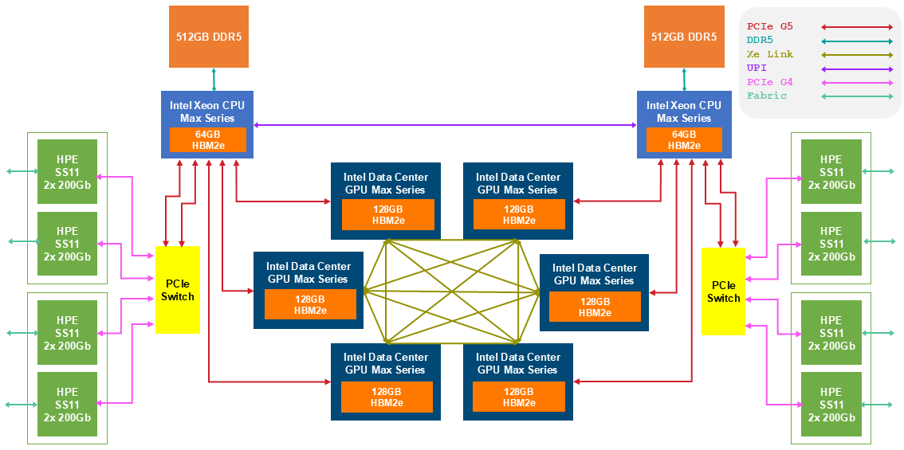

# Aurora Machine Overview

Aurora is a 10,624-node HPE Cray-Ex based system. It has 166 racks with 21,248 CPUs and 63,744 GPUs. Each node consists of 2 Intel Xeon CPU Max Series (codename Sapphire Rapids or SPR) with on-package HBM and 6 Intel Data Center GPU Max Series (codename Ponte Vecchio or PVC). Each Xeon CPU has 52 physical cores supporting 2 hardware threads per core and 64 GB of HBM. Each CPU socket has 512 GB of DDR5 memory. The GPUs are connected all-to-all with Intel X^e^ Link interfaces. Each node has 8 HPE Slingshot-11 NICs, and the system is connected in a Dragonfly topology. The GPUs may send messages directly to the NIC via PCIe, without the need to copy into CPU memory.

/// caption
Figure 1: Summary of the compute, memory, and communication hardware contained within a single Aurora node.
///

The Intel Data Center GPU Max Series is based on X^e^ Core. Each X^e^ core consists of 8 vector engines and 8 matrix engines with 512 KB of L1 cache that can be configured as cache or Shared Local Memory (SLM). 16 X^e^ cores are grouped together to form a slice. 4 slices are combined along with a large L2 cache and 4 HBM2E memory controllers to form a stack or tile. One or more stacks/tiles can then be combined on a socket to form a GPU. More detailed information about node architecture can be found [here](https://www.intel.com/content/www/us/en/products/details/discrete-gpus/data-center-gpu/max-series.html).

## Aurora Compute Node

| NODE COMPONENT | DESCRIPTION                       | PER NODE  | AGGREGATE           |
|----------------|-----------------------------------|-----------|---------------------|
| Processor      | 2000 MHz                          | 2         | 21,248              |
| Cores/Threads  | Intel Xeon CPU Max 9470C Series   | 104/208   | 1,104,896/2,209,792 |
| CPU HBM        | HBM2e                             | 64x2 GiB  | 1.328 PiB           |
| CPU DRAM       | DDR5                              | 512x2 GiB | 10.375 PiB          |
| GPUs           | Intel Data Center Max 1550 Series | 6         | 63,744              |
| GPU HBM        | HBM2e                             | 768 GiB   | 7.968 PiB           |

## Aurora GPU Architecture Summary

| GPU COMPONENT    | DESCRIPTION                    | COUNT                      | CAPABILITY           |
|------------------|--------------------------------|----------------------------|----------------------|
| Stack            | a.k.a. Tile                    | 2                          |                      |
| X^e^ Vector Engine | a.k.a. EU (execution unit)     | 512 per Stack (448 active) | 8 threads, 512b SIMD |
| X^e^ Matrix Engine | a.k.a. systolic part of EU     | 512 per Stack (448 active) |                      |
| Register         | 512-bit register               | 128 per thread             |                      |
| X^e^ Core          | a.k.a. subslice; unit of 8 EUs | 64 per Stack               | 128 per GPU          |
| L1 cache         |                                |                            | 128 KiB              |
| Last Level cache | a.k.a. RAMBO cache             |                            | 384 MiB per GPU      |

See [Aurora Overview](https://www.alcf.anl.gov/sites/default/files/2024-11/Overview-of-Aurora-Oct-2024.pdf) for more information.
