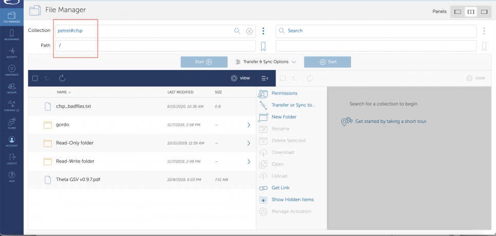
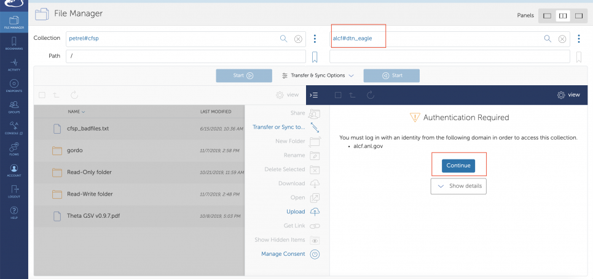
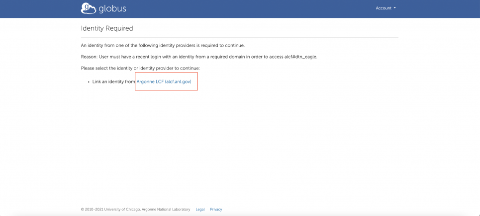
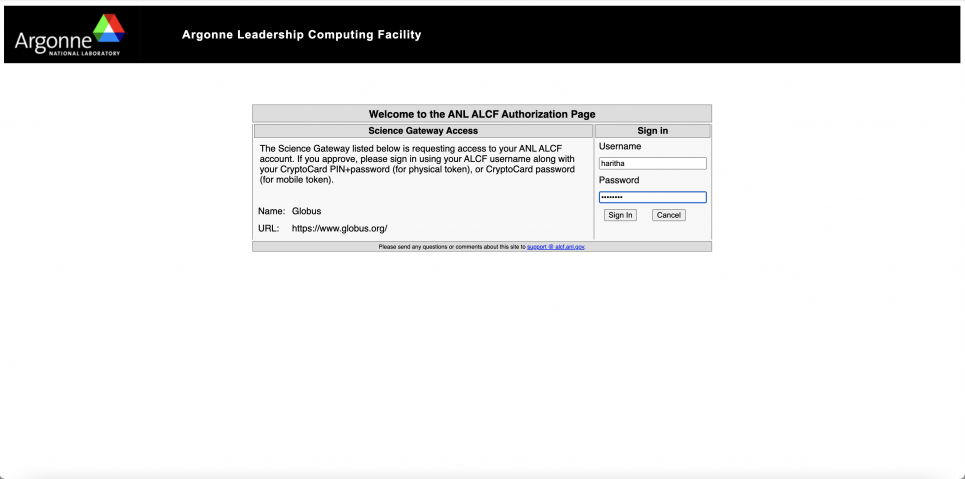
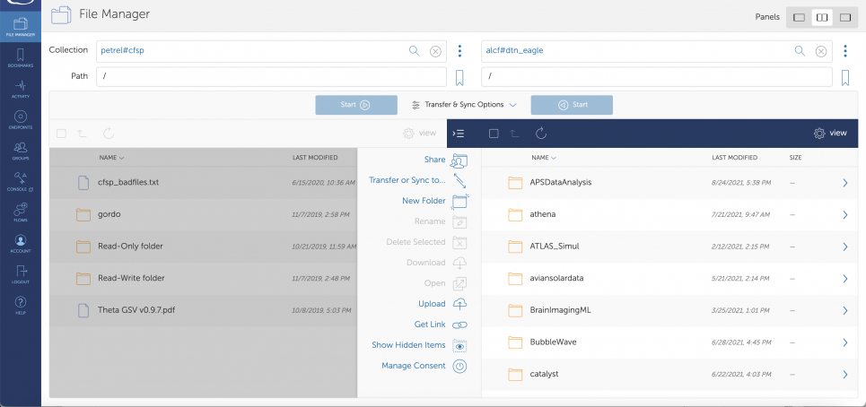
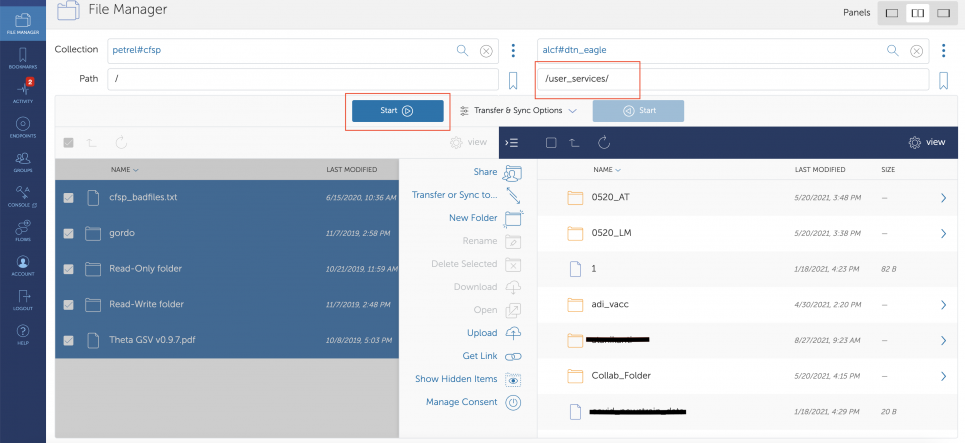
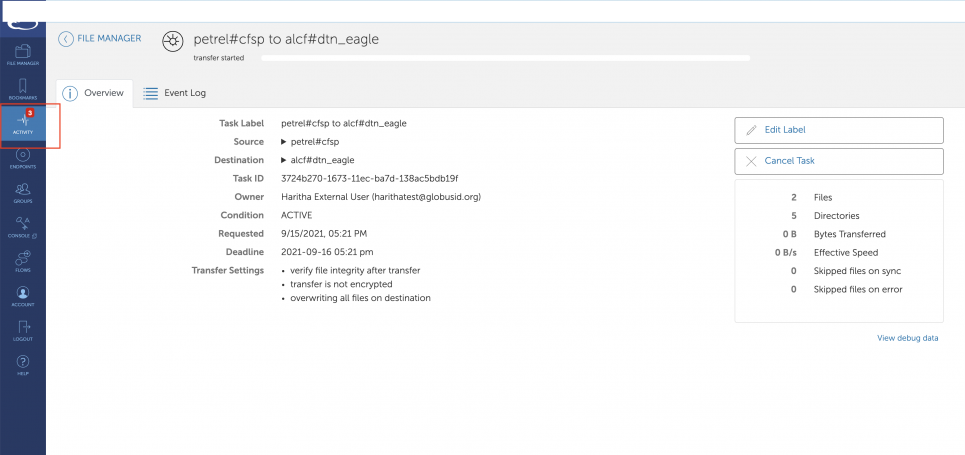
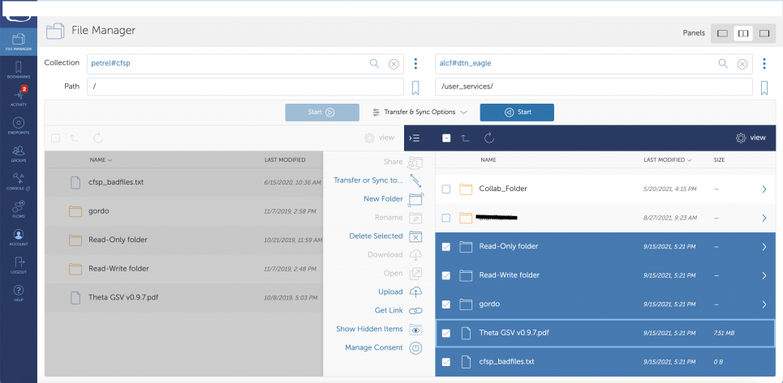

# Transferring Data to Eagle

## Evolution of the Petrel Data Service to the ALCF Community Data Co-Op

The Petrel data service is evolving into a more mature service called the ALCF Community Data Co-Op (ACDC), which will be launched later this year.

In preparation for this shift, all current Petrel project PIs will need to move their project data to ALCF's Eagle filesystem by December 2021.

For detailed instructions on how to move your data, please follow the steps outlined below. You will need to follow the order of the steps as listed.

If you have any questions, please email: [support@alcf.anl.gov](mailto:support@alcf.anl.gov).

## Transferring data to Eagle

### 1. Request a DD project on Eagle Filesystem

All Petrel project owners/PIs should request a Director's Discretionary project on the Eagle filesystem by filling out the form at [https://my.alcf.anl.gov/accounts/#/allocationRequests](https://my.alcf.anl.gov/accounts/#/allocationRequests). Select "New Project" and then "Eagle" as the resource and fill out the rest of the form. In the "Project and Justification Summary" section, along with the requested details, you should also state that you are migrating your data from Petrel.

Once the submission is reviewed and approved by the allocations committee, your project will be created on the Eagle filesystem, and you will be notified via email. The approval process may take 1-2 weeks. Once the project is approved, proceed to the next step.

### 2. Apply for an ALCF account

A project PI will need an active ALCF account to:

- Transfer their data from Petrel to the Eagle filesystem
- Enable data sharing on their Eagle project (See section "4 Share your data on Eagle using Globus Guest Collections" for more details)

**NOTE:** A collaborator does not need an ALCF account to access data that is shared on Eagle (as a Globus Guest Collection). They can sign into Globus with their institutional identity to access the data. The first time they log in, they will need to accept terms and conditions.

#### To apply for an ALCF account:

- Visit [https://my.alcf.anl.gov/](https://my.alcf.anl.gov/) and click on "Request An Account".
- When prompted for project name, please select the project on Eagle that was created for your Petrel data as a result of Step 1: Request a DD project on Eagle (you have to wait for your project to be created before you can apply for an account).
  - If you don't have one, please follow the directions under "Step 1: Request a DD project on Eagle" (above).
  - For more details on the ALCF account request process, visit the webpage Request an account.
- Once your account is created and you have the cryptocard/mobile token to log in to Eagle, proceed to the next step to transfer the data from Petrel to Eagle.

### 3. Transfer data from your source endpoint to Eagle using Globus

You can use the Globus web app to transfer data or the CLI. See [Using CLI](#Using-Globus-CLI-tool) for instructions on how to use the CLI to transfer data. The following set of instructions uses the Globus web app, using **alcf#dtn_eagle (path /projectname)** as the destination to transfer data from your source endpoint.

**NOTE:** Anonymous HTTPS read access is enabled on Eagle.

**Step 1:** Log into [https://app.globus.org/file-manager?destination_id=05d2c76a-e867-4f67-aa57-76edeb0beda0](https://app.globus.org/file-manager?destination_id=05d2c76a-e867-4f67-aa57-76edeb0beda0), which opens two panes in the Globus File Manager, with ALCF Eagle on the right-hand side.

- Enter the name of your source endpoint in the pane on the left-hand side.

<figure markdown>
  { width="700" }
  <figcaption>File Manager</figcaption>
</figure>

<figure markdown>
  { width="700" }
  <figcaption>Enter the name of your source endpoint</figcaption>
</figure>

**Step 2:** You may have to log in and link your ALCF identity to your Globus account.

<figure markdown>
  { width="700" }
  <figcaption>Log in and link your ALCF identity to your Globus account</figcaption>
</figure>

**Step 3:** Log in using your ALCF credentials.

<figure markdown>
  { width="700" }
  <figcaption>Use ALCF credentials</figcaption>
</figure>

**Step 4:** If the login is successful, the folders and files on the Eagle file system will be displayed in the project/file viewer.

<figure markdown>
  { width="700" }
  <figcaption>Eagle file system in the project/file viewer</figcaption>
</figure>

**Step 5:** Navigate to the correct destination (project folder) on the Eagle file system. Choose the files/folders to transfer in the left-hand side panel (Petrel endpoint).

**NOTE:** Before clicking the "Start" button, click on the Transfer and Sync Options and check the "sync" checkbox and then click start.

<figure markdown>
  { width="700" }
  <figcaption>Choose the files/folders</figcaption>
</figure>

**Step 6:** Click on the "Activity" tab on the left-hand side navigation panel to view the status and details of your transfers.

<figure markdown>
  { width="700" }
  <figcaption>Activity tab</figcaption>
</figure>

**Step 7:** Once the transfer is successful, you should see the files and folders on the Eagle file system. You will also receive an email notification from Globus letting you know that your transfer was successful.

<figure markdown>
  { width="700" }
  <figcaption>Files and folders on the Eagle file system</figcaption>
</figure>

#### Migrating permissions from Petrel to Eagle:

For PIs who had previously stored data on Petrel and are migrating to Eagle, the following tool automates the step of copying the permissions set on Petrel to Eagle. The tool, `migrate_permissions.py` at [https://github.com/globus/globus-tool-examples](https://github.com/globus/globus-tool-examples), takes the source endpoint (your shared endpoint on Petrel in this case) and destination endpoint (the guest collection on Eagle that has the data) and copies over all the permissions. The tool assumes the data was copied over as is from source to destination.

If you have any questions on the tool or need further support, please contact [support@globus.org](mailto:support@globus.org).

### 4. Share your data on Eagle using Globus Guest Collections

Your data on the Eagle file system can easily be shared with collaborators who are at ALCF or elsewhere. You have full control over which files your collaborator can access and whether they have read-only or read-write permissions.

See below for step-by-step instructions on how to share data from Eagle using Globus Guest Collections:

[https://docs.alcf.anl.gov/data-management/acdc/eagle-data-sharing/](../acdc/eagle-data-sharing.md)

**NOTE:** Guest Collections are tied to the project PI's account, so if the PI's account becomes inactive, the Guest Collections will also become inactive. Once the PI's account is reactivated, access to the Guest Collections is restored.

#### Using Globus CLI tool:

To copy data and permissions from a source collection, PIs can use a Globus CLI tool that automates the step of copying the permissions set on the source collection and applies them to the collection on Eagle. This is especially useful for PIs who had previously stored data on Petrel. See [https://github.com/globus/globus-tool-examples](https://github.com/globus/globus-tool-examples) for more information.

The tool, `migrate_permissions.py` in the GitHub repo, takes the source endpoint (the shared endpoint on Petrel, for example) and destination endpoint (the guest collection on Eagle that has the data) and copies over all the permissions. The tool assumes the data was copied over as is from source to destination. Note that you need to have a guest collection set up for your project on Eagle to use the CLI command and tool. See this page for instructions on [how to set up guest collections](eagle-data-sharing.md#Creating-a-Guest-Collection).

If you have any questions on the tool or need further support, please contact [support@globus.org](mailto:support@globus.org).

**Existing data portals:**

To reconfigure and update your existing data portals to point to your guest collections on Eagle, please work directly with the developer/maintainer of the portal.

## FAQs for migrating Petrel data to Eagle:

#### 1. Is it important for a Petrel project owner/PI to obtain an ALCF account?

Yes, the data from Petrel needs to be moved to an ALCF project directory on the Eagle filesystem. The PI will need an ALCF account to log into Globus and move the data to their Eagle project directory.

#### 2. What is the workflow for migrating data from Petrel and giving access to collaborators on Eagle?

1. PI requests an Eagle allocation project.
2. Allocations Committee reviews and approves requests.
3. Once the allocation request is approved, the project is created and associated with a UNIX group and project directory on Eagle.
4. PI requests an ALCF account (if they don't have one).
5. Once the ALCF account is created and tied to the project on Eagle, the PI moves the data from Petrel to Eagle using Globus.
6. PI creates guest collections for the project on Eagle, using the Globus web app using the mapped collection/endpoint for Eagle (alcf#dtn_eagle). Note that:
   - The PI needs to have an active ALCF Account and will need to log in to Globus using their ALCF credentials.
   - Only the PI (and not a proxy) can create guest collections.
   - If the PI already has a Globus account, it needs to be linked to their ALCF account.
7. PI adds collaborators to the guest collection.
   - Added with read-only or read-write permissions.
   - **Note:** Anonymous HTTPS write is disabled, and only anonymous HTTPS read is allowed.
8. Existing data portals on Petrel should be updated to point to the new guest collection on Eagle. Please work directly with the developer/maintainer of the portal.

#### 3. What endpoints should the PI use to move data from Petrel?

- Source: Globus endpoint on Petrel for the Petrel allocation
- Destination: Globus endpoint on the Eagle filesystem and the path to the directory (alcf#dtn_eagle, path /<ALCF projectname>) OR the name of the guest collection on Eagle