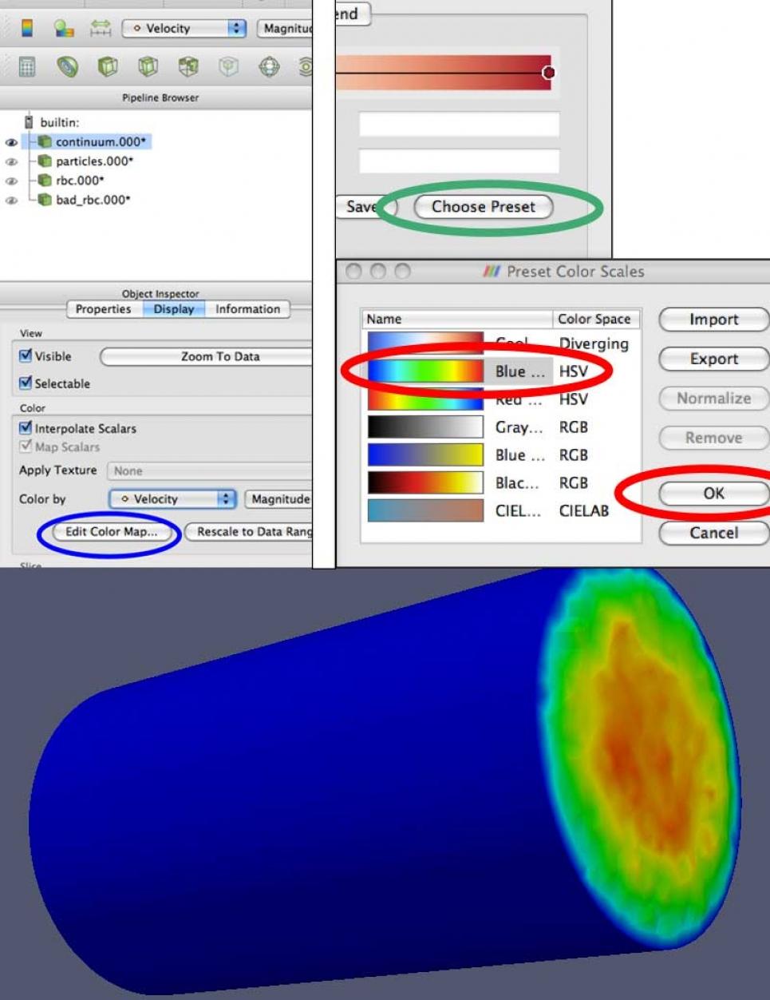
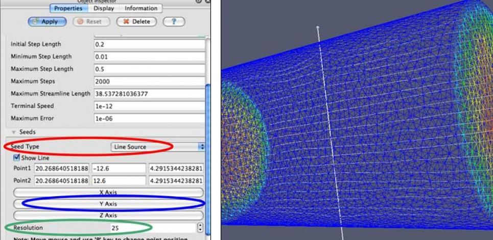
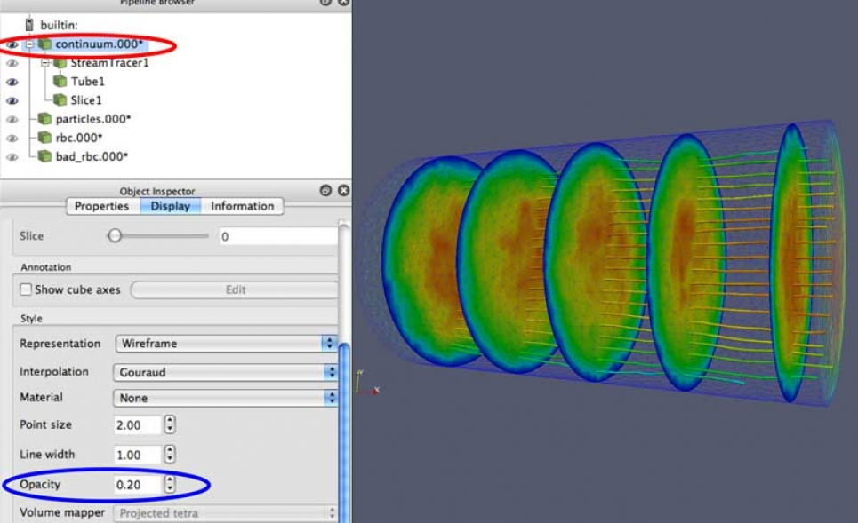
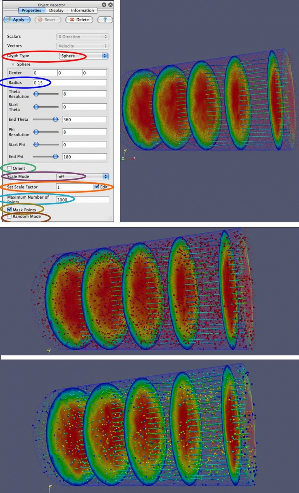
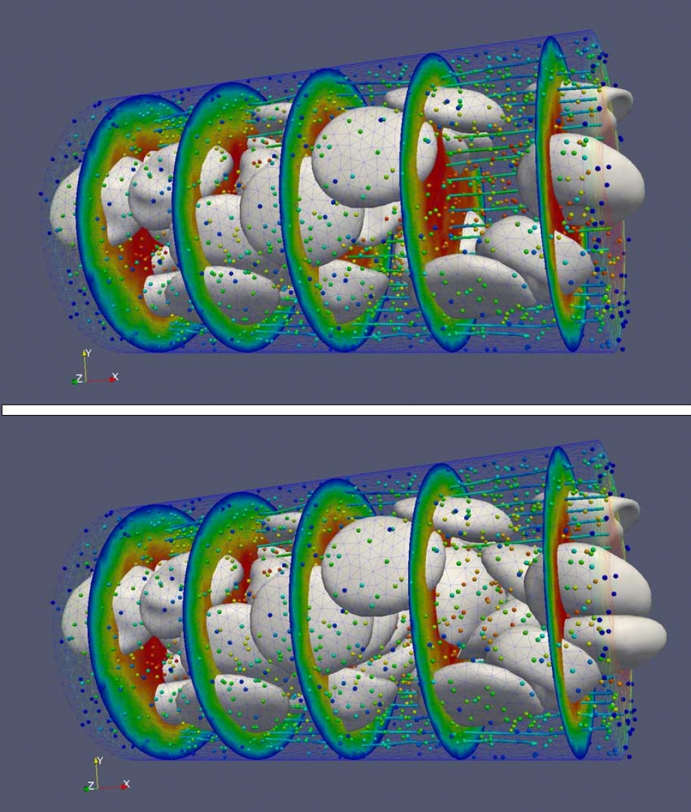
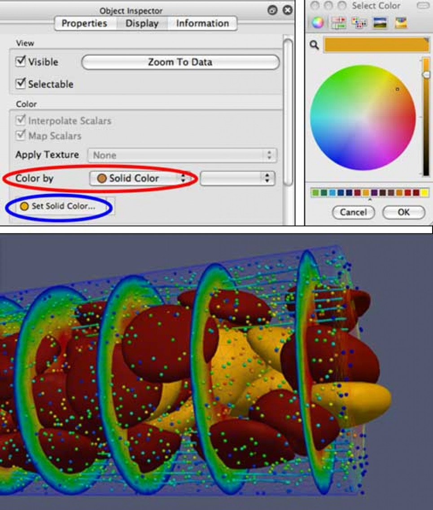
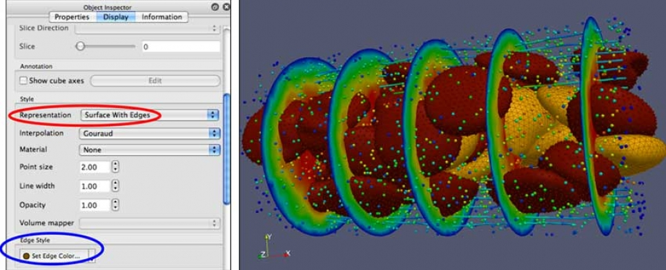
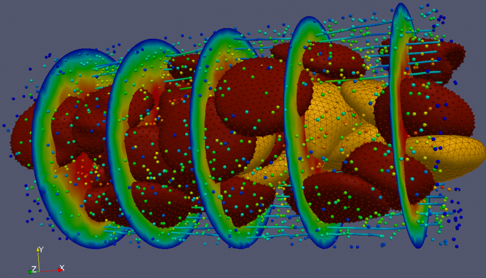
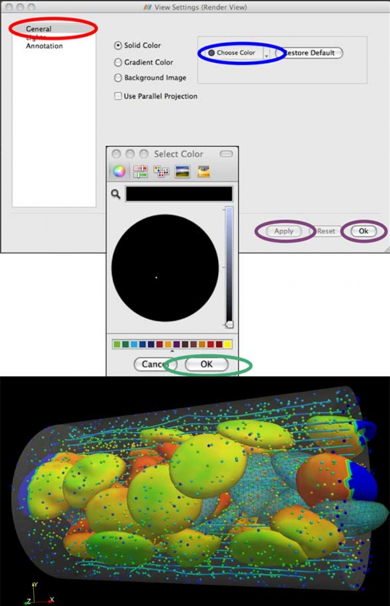

# ParaView Tutorial

## Overview

This tutorial is intended to be a hands-on resource for users interested in learning the basic concepts of ParaView. The examples can easily be run on a laptop, using the example data set provided.

- Tour of ParaView
- Show range of visualization methods
- Walk through various visualization techniques, hopefully illustrating how these can apply to your own data
- Feel for ParaView "way"
- Terminology and step-by-step process peculiar to ParaView, which may differ from other packages, e.g., VisIt

<figure markdown>
  { width="700" }
  <figcaption>Bloodflow Visualization by Joe Insley, ALCF</figcaption>
</figure>

## Data

The data used for this tutorial is:

- Blood flow simulation data
- Multiple data types
  - Continuum data field (unstructured mesh, tetrahedral): fluid field, plasma
  - Particle data (unstructured points): individual particles moving in the flow
  - Red Blood Cells (RBC, unstructured mesh, triangle): mesh of the surface of an RBC
    - Healthy
    - Diseased
- Generated using an integrated Nektar/LAMMPS simulation code
- Courtesy of George Karniadakis and Leopold Grinberg of Brown University

The data is available for download here (~27MB compressed, ~39MB uncompressed):  
[Data set for ParaView Red Blood Cell Tutorial](https://web.cels.anl.gov/projects/alcf_vis_internal/MISC/BLOODFLOW_TUTORIAL_DATA.tar.gz)

## 1. Load Multi-component Dataset

- From the File menu, (you can also click the file folder icon, shown above) open each of the following data sets (select then click "OK").
- The files will then appear in the Pipeline Browser.
- Click Apply in the Object Inspector.
- You will need to do this one at a time:
  - continuum...vtu
  - particles...vtu
  - rbc_...vtu
  - bad_rbc...vtu

**Note:** The "..." in the name, and the arrow in the file browser, indicates that there are multiple time steps for each of these files.

<figure markdown>
  { width="700" }
  <figcaption>With all of the default settings, you should see something like this</figcaption>
</figure>

## 2. Select which data to view

Let's start by looking at the continuum.000\* data. This is an unstructured mesh that has velocity and count (density) values.

- Hide other data sets using the Eyeball icon next to their names in the Pipeline Browser.
  - Black = visible, Grey = hidden
- Select continuum.000\* (name is highlighted) in the Pipeline Browser.
  - Click on the name to highlight it.
- When manipulating appearance or applying filters, these always affect the selected data set.
- Switch to the Display tab in the Object Inspector.
- Under Color by, select Velocity from the dropdown.
  - There is also a shortcut to Color by in the menu bar near the top of the GUI.

<figure markdown>
  { width="700" }
  <figcaption>Select which data to view</figcaption>
</figure>

## 3. Manipulating the Color Map

To change the colors used to represent the Velocity:

- Under Color by, click the Edit Color Map... button.
- On the Color Scale Editor window, click the Choose Preset button.
- On the Preset Color Scales window, select: Blue to Red Rainbow, and click OK. Then click Close on the Color Scale Editor window.
- You can also create and save your own color maps.

<figure markdown>
  { width="700" }
  <figcaption>Manipulating the Color Map</figcaption>
</figure>

## 4. Data Representation

In order to be able to see the particles and red blood cells inside the cylinder, we need to be able to see through it. If we scroll down a bit in the Object Inspector view:

- Group of controls labeled Style
- In the Representation dropdown, select Wireframe

<figure markdown>
  { width="700" }
  <figcaption>Data Representation</figcaption>
</figure>

## 5. Generate Streamlines

- ParaView enables the generation of different types of data from existing data sets in the Pipeline.
- Streamlines: Generated from vectors of the flow field. These curves show the direction a fluid element will travel in at any point in time.
- Make sure that the continuum.000\* data is selected in the Pipeline Browser.
- From the main menu select: Filters->Alphabetical->Stream Tracer, or click on the Stream Tracer icon from the menu bar.
- In the Object Inspector make sure the Properties tab is selected.
- Scroll down to seeds, and change Seed Type to Line Source.
- Click the Y Axis button to set the seed line to run along the Y axis.
- The default Resolution is set to 100. This will make things a bit cluttered, especially when we start adding in the other data, so let's reduce this to 25.
- Click the Apply button.

<figure markdown>
  { width="700" }
  <figcaption>Generate Streamlines</figcaption>
</figure>

## 6. Streamlines as Tubes

The streamlines are just that, lines. We can use the Tubes filter to represent them as 3D objects, rather than just lines.

- With StreamTracer1 selected in the Pipeline Browser, from the main menu select: Filters->Alphabetical->Tube.
- In the Object Inspector make sure the Properties tab is selected.
- The default value for the Radius is a bit too large for this data, let's set that value to 0.
- Click the Apply button.
- Notice that the StreamLine1 object has automatically been hidden.
- There are many different ways to color these tubes.
- With Tubes1 selected, switch to the Display tab in the Object Inspector.
- The Color by dropdown lets you choose from a handful of different variables.

<figure markdown>
  { width="700" }
  <figcaption>Streamlines as Tubes</figcaption>
</figure>

## 7. Cutting Planes (Slices)

Now let's add some cutting planes, or slices, to see what the cross-section of the continuum data looks like.

- Again, be sure that the ```continuum.000* data``` is selected in the Pipeline Browser.
- Filters->Alphabetical->Slice or Click on the Slice icon from the menu bar.
- In the Object Inspector make sure the Properties tab is selected.
- At the bottom of the Object Inspector is a section titled Slice Offset Values. Here we can generate values for multiple slices to be made.
- First click the Delete All button to remove initial values.
- Next, click the New Range button. This will bring up an Add Range dialog box.
- Set the number of Steps to 7. Click OK.
- Click the Apply button.
- With Slice1 selected in the Object Inspector, switch to the Display tab.
- Set Color by value to Velocity.

<figure markdown>
  { width="700" }
  <figcaption>Cutting Planes (Slices)</figcaption>
</figure>

## 8. Data Representation: Opacity

Even with the continuum data represented as wireframe, there is still considerable occlusion of the interior structures. In order to further reduce this occlusion by the wireframe, we can make it more transparent.

- Again, be sure that the ```continuum.000* data``` is selected in the Pipeline Browser.
- In the Object Inspector make sure the Display tab is selected.
- In the Object Inspector there is a section titled Style.
- Set Opacity to 0.2.

<figure markdown>
  { width="700" }
  <figcaption>Data Representation: Opacity</figcaption>
</figure>

## 9. Animating Simulation Data

Since our data has multiple time steps, we can easily animate through them to see how the data changes over time.

- Simply click the Play button on the animation bar at the top of the GUI.
- Pause to make it stop.
- Loop: With this button toggled on, animation will repeat until stopped.

<figure markdown>
  { width="700" }
  <figcaption>Animating Simulation Data</figcaption>
</figure>

## 10. Animations

Animations can be saved to disk as a movie file, to be played back later.

- From the main menu: File->Save Animation.
- Animation Settings Dialog: Save Animation.
- Files of type: AVI files (*.avi).
- Enter a name in File name:
- Click OK.
- Movie can be played back with standard media players (Windows Media Player, QuickTime, VLC, etc.).

<figure markdown>
  { width="700" }
  <figcaption>Animations</figcaption>
</figure>

## 11. Particles as Glyphs

Glyphs are another way of visually representing data where the attributes of a graphical element are dictated by attributes of the data.

All of the particles are displayed as red points in the graphics window. There are ~39K particles in this particular data set, which makes the display a bit cluttered. In order to both filter some of these out, and create 3D representations for them, let's apply a glyph filter to this data.

Now let's add some of our other data back into the scene. Let's start with the particle data.

All of the particles are displayed as red points in the graphics window. There are ~39K particles in this particular data set, which makes the display rather cluttered. In order to both filter some of these out, and create 3D representations for them, we will apply the glyph filter to this data.

**Note:** that the particles.000* is still visible.

- Unhide the ```particles.000* data```: click Eye icon.
- Select ```particles.000* data```: click on name.
- Filters->Alphabetical->Glyph or click on the Glyph icon from the menu bar.
- Glyph Type: Sphere.
- Radius: 0.15.
- Orient: Unchecked.
- Scale Mode: off.
- Set Scale Factor: 1 - Edit: Checked.
- Maximum Number of Points: 3000.
- Mask Points: Checked.
- Random Mode: Unchecked.
- Click the Apply button.
- Since our goal was to unclutter the display, let's hide the particles.000* by toggling them off, by clicking on the Eye icon next to it in the Pipeline Browser.
- Let's also switch to the Display tab in the Object Inspector, with Glyph1 selected, and change the Color by value to GlyphVector. Since the GlyphVector value is based on the velocity, we can Edit Color Map... and choose the same Blue to Red Rainbow preset that we previously chose for velocity.

<figure markdown>
  { width="700" }
  <figcaption>Particles as Glyphs</figcaption>
</figure>

## 12. Enter: Red Blood Cells

Now let's add in both of the other data sets, which are polygonal meshes that make up Red Blood Cells (RBCs).

These two data sets are essentially the same kind of data, so we can apply the same filters and make the same types of representation changes to each of them. However, some of the RBCs are marked by the simulation that generated them as healthy (rbc.000*) and some of them are marked as diseased (bad_rbc.000*).

- Unhide the rbc.000* and bad_rbc.000* data sets by clicking the Eye icon next to each of them to make them visible.

<figure markdown>
  { width="700" }
  <figcaption>Enter: Red Blood Cells</figcaption>
</figure>

## 13. Using Color to Differentiate Data

To enable us to distinguish these two types of data from one another, we can vary their representations.

One way to do this is by setting the color of the two data sets to different colors. Repeat this process for each of rbc.000* and bad_rbc.000*, picking different colors.

- Select one of the rbc data sets in the Pipeline Browser.
- Go to the Display tab in the Object Inspector.
- In the Color by: dropdown select Solid Color.
- Click on the Set Solid Color... button.
- Select a color from the Select Color dialog that appears.
- Repeat for the other RBC data set, choosing a different color.

<figure markdown>
  { width="700" }
  <figcaption>Using Color to Differentiate Data</figcaption>
</figure>

## 14. Further Exploration: Highlight the Mesh

Change the representation of one of the RBC data sets.

In this example, the continuum.000* data is also hidden to reduce confusion with showing multiple overlapping meshes.

- Select one of the RBC data sets.
- Go to the Display tab in the Object Inspector.
- For the Representation select Surface With Edges.
- In the Edge Style section click on the Set Edge Color... button to select a different color from the Select Color dialog.

<figure markdown>
  { width="700" }
  <figcaption>Further Exploration: Highlight the Mesh</figcaption>
</figure>

## 15. Further Exploration: Highlight the Vertices

Add glyphs to illustrate the position of the vertices of one of the RBC data sets.

- Select one of the RBC data sets.
- Select the Glyph filter.
  - Since this filter was used recently, it can also be found under: Filters->Recent->Glyph.
- As in the earlier example, set the various configuration options for the glyph attributes.
- **Note:** that this time, we want to show all of the vertices of the RBC, so we should uncheck the Mask Points option.

<figure markdown>
  { width="700" }
  <figcaption>Further Exploration: Highlight the Vertices</figcaption>
</figure>

## 16. Further Exploration: Color by Variable

Try playing around with the viewing options and representations of the other data objects.

Change the:

- Color by values
- Opacity
- Representation
- Etc.

<figure markdown>
  { width="700" }
  <figcaption>Further Exploration: Color by Variable</figcaption>
</figure>

## 17. Background Color

- Background color is an important part of final visualization.
- From the main menu choose: Edit->View Settings...
- Under General in the View Settings dialog box, select Choose Color.
- Select Color: OK.
- Apply, then OK.

<figure markdown>
  { width="700" }
  <figcaption>Background Color</figcaption>
</figure>

This tutorial was developed with support from National Science Foundation Grant OCI-0904190, and from the Argonne Leadership Computing Facility at Argonne National Laboratory, which is supported by the Office of Science of the U.S. Department of Energy under contract DE-AC02-06CH11357.