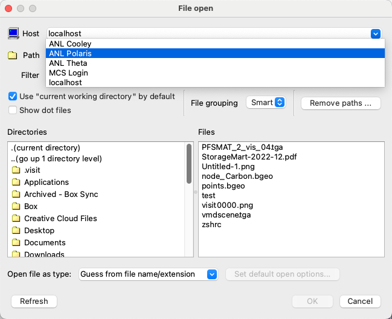
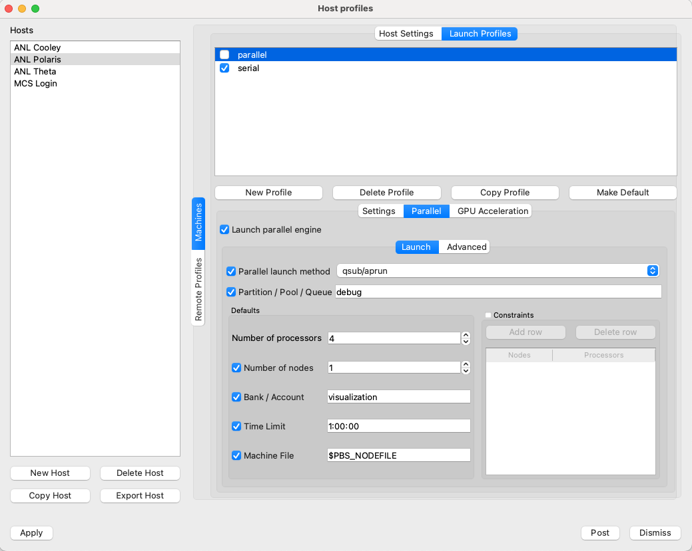

# VisIt on Polaris

## Getting Started

The latest VisIt versions installed on Polaris are 3.3.3 and 3.4.0.

Please note that at the time of this writing, VisIt version 3.4.0 does not yet have a client for Mac available.

Follow these steps to install VisIt on your local machine:

- Download and install VisIt for your local platform (macOS, Windows, Linux). The version you download must match the server version installed on Polaris. [Use this page](https://visit-dav.github.io/visit-website/releases-as-tables/)
- Download the [Polaris host profile for VisIt](scripts/host_anl_polaris.xml) (you may need to right-click and choose "Save link as..." or "Save target as...")
- Copy this file to a file called `~/.visit/hosts/host_anl_polaris.xml` on Mac or Linux. For Windows, specify the equivalent path.

Note: VisIt allows the user to download host profiles for ANL, but all these settings are outdated. We are working with the VisIt developers to update the ANL host list.

Additional information for using VisIt in client/server mode is available [here](https://visit-sphinx-github-user-manual.readthedocs.io/en/v3.4.0/using_visit/ClientServer/index.html).

## Running VisIt

- Start up VisIt on your local machine.
- Click File -> Open File and choose "ANL Polaris" from the "Host" dropdown.

  

- You'll be prompted for your password; enter your ALCF authenticator app response.
- When you open a selected file, it will launch a job on Polaris.
  - You will need to specify the "Bank" (Project) to use when VisIt submits jobs to the queue on Polaris. Specify a project in the Options box.
  - If your environment doesn't get sourced correctly with non-interactive SSH, you can set the default project to use under Options -> Host profiles.

  

  - **Note:** Don't change the contents of the "Machine file" field (it should be `$PBS_NODEFILE`).
  - **Note:** The default Launch Profile is set to serial. We recommend leaving this setting in its default value, but using the parallel method to launch jobs on Polaris.
  - **Note:** Don't change the contents of "launchMethod". It must be `qsub/aprun` even though Polaris does not use `aprun`.
  - If you'd like to change other job parameters (like the number of processes, nodes, and walltime), you can do so. Please enter time in the format required by the PBS scheduler (i.e., 1:00:00 for one hour).
  - If you'd like these changes to be used as your default, be sure to save them using Save Settings under the Options menu.

## Additional Information

- [VisIt user manual](https://visit-sphinx-github-user-manual.readthedocs.io/en/v3.4.0/index.html)
- [VisIt wiki](http://www.visitusers.org)