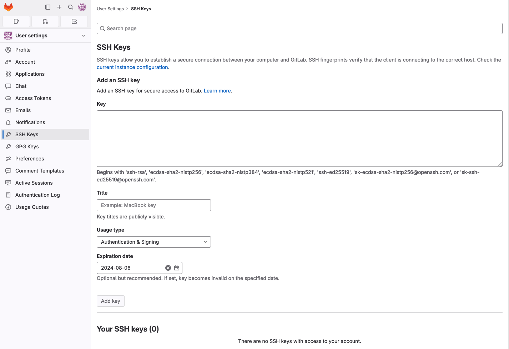
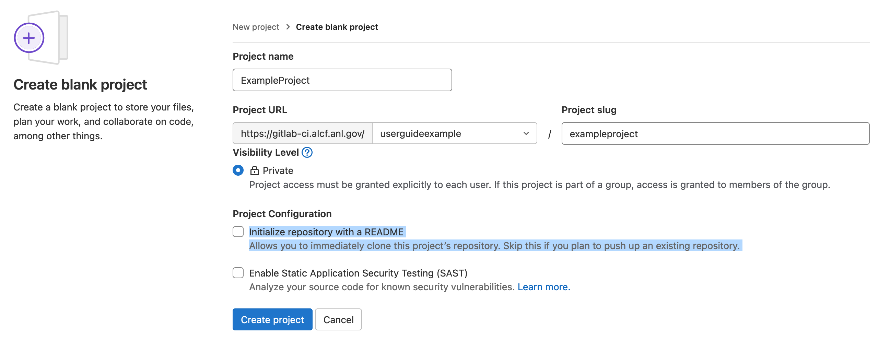
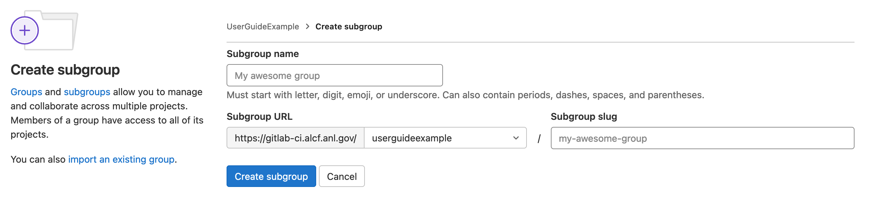
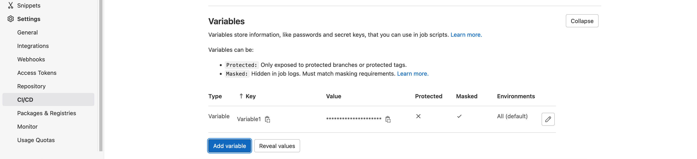
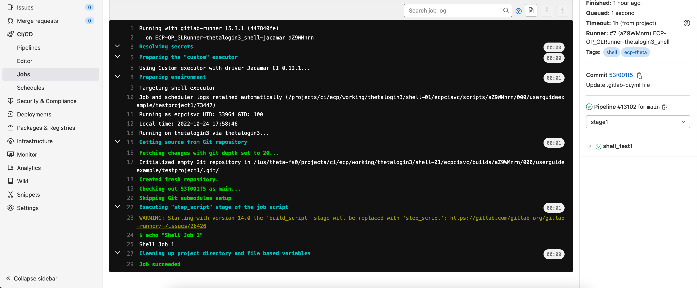

# Continuous Integration via GitLab-CI

## GitLab-CI
GitLab is an application that offers combined functionality as a git repository, issue tracker, and CI/CD platform. The ALCF implementation of the GitLab-CI environment leverages upstream GitLab runners combined with the [ECP's Jacamar custom executor](https://gitlab.com/ecp-ci/jacamar-ci). As CI/CD is built directly into GitLab, it can allow for tighter DevOps processes.

GitLab-CI is meant to provide CI/CD services for projects using GitLab-CI to store your git repositories and execute code on our HPC clusters. ALCF does not allow users to join their own private runners to our existing GitLab CI/CD environment and provides dedicated runners for our supported systems.

Additional information, technical and user documentation, and community support can be found on [GitLab's Runner website](https://docs.gitlab.com/runner/).

Also see [GitLab's CI/CD YAML syntax reference](https://docs.gitlab.com/ee/ci/yaml) for the full list of keywords supported by GitLab CI.

ALCF's GitLab-CI environment can be accessed by logging into the [ALCF GitLab-CI web portal](https://gitlab-ci.alcf.anl.gov) using your ALCF credentials (ALCF username and cryptocard token password).

## Quickstart
* A user emails [ALCF Support](mailto:support@alcf.anl.gov) requesting access for their ALCF Project for [gitlab-ci.alcf.anl.gov](https://gitlab-ci.alcf.anl.gov).
* ALCF Support will add the ALCF Project to the appropriate system(s) via the Account and Project management system.
* ALCF will create a `GitLab Group/SubGroup` for the ALCF Project and map it to the appropriate LDAP group that maps to the ALCF Project.
* ALCF Support will reply back to the user and inform them that the project is created.
* User(s) will need to log in to [gitlab-ci.alcf.anl.gov](https://gitlab-ci.alcf.anl.gov) and configure their initial GitLab profile. Users will add an SSH key so they can pull/push code to the GitLab server.
* User will then need to create a `GitLab Project` in their assigned `GitLab Group/SubGroup`.
* CI/CD needs to be enabled for the GitLab Project.
* When ready to run CI/CD jobs, users will add a `.gitlab-ci.yml` file to their git repositories.
* They will need to set any [ALCF specific variable(s)](gitlab-ci.md#alcf-specific-variables).

_Example: `.gitlab-ci.yml` file for Aurora_
```yaml
# this include allows us to reference defaults in anl/ci-resource/defaults
include:
  - project: 'anl/ci-resources/defaults'
    ref: main
    file:
      - '/runners.yml'

stages:
  - my_batch # stages may have any name

# the below submits a batch job to the scheduler
submit_batch: # CI jobs may have any name
  stage: my_batch  # from the stages list above
  extends: .aurora-batch-runner # this includes the defaults provided in the 'anl/ci-resources/defaults' project
  variables:  # scheduler parameters must be included, adjust the below to match your values
    ANL_AURORA_SCHEDULER_PARAMETERS: "-A ProjectName -l select=1,walltime=10:00,filesystems=home -q myQueue"
  script:
    - id
    - hostname
    - echo "Running on $(hostname) with setuid shell runner"
```

To run a stage on a different system, change the `extends` key and the scheduler parameters. The list of ALCF provided `extends` is in the `include`ed [runners.yml](https://gitlab-ci.alcf.anl.gov/anl/ci-resources/defaults/-/blob/main/runners.yml?ref_type=heads) file. For Crux, proxy variables are provided through the same file.

For a more complete example, see the [.gitlab-ci.yml](https://gitlab-ci.alcf.anl.gov/anl/ci-resources/examples/large-example/-/blob/master/.gitlab-ci.yml?ref_type=heads) file in the [large-example](https://gitlab-ci.alcf.anl.gov/anl/ci-resources/examples/large-example) project.

## Glossary
* **Group** - A collection of projects. Certain settings can be applied at the `Group` level and apply down to all child `SubGroups` and/or `Projects`. When an ALCF Project is allocated resources on the GitLab-CI environment, we will create a GitLab `Group` that will map to your ALCF Project allocation.
* **Jacamar-CI** - A Custom Executor we use that runs jobs as a given user on the shell and is capable of submitting jobs to schedulers like Cobalt and PBS.
* **Job** - An individual set of commands that are run. This is the lowest unit of GitLab-CI abstraction.
* **Pipeline** - GitLab organizes your jobs for each run into a `pipeline`.
* **Project** - GitLab Projects can be thought of as an individual git repository plus all services and features GitLab layers on top. This term is unrelated to the ALCF Project concept. ALCF Projects often map to LDAP groups and/or quotas and allocations.
* **Stage** - A collection of jobs in a pipeline. Jobs in the next stage will not start until the jobs in the current stage complete. If a job fails, the pipeline will not run the following stages by default.
* **Triggering User** - The user whose actions cause a CI/CD job to run and who the Jacamar-CI executor will run the jobs as. Examples include pushing commits up to the server, creating a merge request, and/or merging one branch into another branch.

## Projects Using CI/CD
Any project with a git repository on the GitLab-CI environment has access to the CI/CD environment by default. In order to launch a shell job on a system, you must already have access to that system.

### On-Boarding with CI/CD
To gain access to the GitLab-CI environment, send an email to [support@alcf.anl.gov](mailto:support@alcf.anl.gov) requesting access for your project(s).
Include with the request:

* That you are requesting access to the GitLab-CI environment at https://gitlab-ci.alcf.anl.gov
* The ALCF Project shortname
* The PI’s name 

GitLab-CI jobs run as the triggering user on relevant systems. The triggering user's home directory will be used by Jacamar-CI to copy the git repository and cache files into `~/.jacamar-ci`. This job will run out of their home directory and consume filesystem quota. If you need more space, you should try to reference files in any ALCF Project allocations you have on shared filesystems. Unfortunately, the initial git clone must run out of `~/.jacamar-ci` in your home directory.

The triggering user is defined as the user account who caused the CI/CD pipeline to execute, via scheduling a re-occurring job, pushing commits up to the server, creating a merge request, and/or merging a branch. When the CI/CD jobs run, they will run as that user on the relevant systems. For a job to succeed, the `triggering user` must have appropriate permissions and access to all relevant systems and files.

### Initial Login and Profile Setup of GitLab-CI
* Log in to [gitlab-ci.alcf.anl.gov](https://gitlab-ci.alcf.anl.gov) using your username and Cryptocard token.
* Once logged in, add your public key you already have or created earlier so that it can be associated with your account.
  * Click the Profile icon on the upper right-hand corner, then click "Edit Profile"
    <figure markdown>
    { width="200" }
    <figcaption>GitLab Profile Dropdown screenshot</figcaption>
    </figure>
  * Click "SSH Keys" on the left-hand menu.
    <figure markdown>
    { width="700" }
    <figcaption>GitLab Profile Add SSH Key screenshot</figcaption>
    </figure>
  * Copy/Paste your SSH public key into the large text box under the word Key.
    * On Linux, Unix, and OSX-based systems using OpenSSH, your SSH public key is commonly found at `~/.ssh/id_rsa.pub`. If using Windows, you will need to consult your application's documentation on the location of your public key.
    * Give it a descriptive title such as where the key resides; by default, it will extract the name from the end of the public key if possible.
  * Click the `Add Key` button. The button is disabled until you paste a key.

### GitLab Projects (repositories)
GitLab takes a git repository, adds additional functionality, and calls it a `GitLab Project`. This is the most common level you will be interacting with GitLab at. Please do not confuse ALCF Projects with `GitLab Projects` as they are two separate things. ALCF Projects more closely map to the `GitLab Group/SubGroup` concept, which we explain in the next section. 
Once you are assigned access to a `GitLab Group/SubGroup`, you will be able to create arbitrary `GitLab Projects` underneath, configuring CI/CD jobs for each independently.

To create a new `GitLab Project`:

* In the left pane, click "Groups", and then click the "Explore groups" link on the right.
<figure markdown>
  { width="700" }
  <figcaption>GitLab Your Groups Page screenshot</figcaption>
</figure>

* From the list in the "Explore groups" page, click the group you were informed corresponds to your `ALCF Project`.

<figure markdown>
  { width="700" }
  <figcaption>GitLab Explore Groups Page screenshot</figcaption>
</figure>

* Click the `New project` button near the upper right. If this is the first project you are creating, you will have two large square buttons near the middle of the screen to create `GitLab SubGroups` or `GitLab Projects`.
<figure markdown>
  { width="700" }
  <figcaption>GitLab Empty Group Page screenshot</figcaption>
</figure>
* On the `Create new project` page, click `Create blank project`.
<figure markdown>
  { width="700" }
  <figcaption>GitLab Create New Project screenshot</figcaption>
</figure>
* Fill in the `Project Name` field. The `Project slug` field will auto-populate based on the `Project Name`; do not change it. If you are pushing an existing repository, you *MUST* uncheck the default `Initialize repository with a README` option. Failure to uncheck this option will result in a merge conflict that you will need to resolve manually between your existing "local" git repository and the one you just created on the server.
<figure markdown>
  { width="700" }
  <figcaption>GitLab Create New Project screenshot</figcaption>
</figure>
* Click the `Create project` button near the bottom.
* After creating the project, navigate to "Settings" > "General", expand the "Visibility, project features, permissions" section, and enable the "CI/CD" toggle.

### GitLab Groups/SubGroups (Folders)
GitLab organizes `GitLab Projects` into "folders" called `Groups` or `SubGroups`. When an ALCF Project is granted access to GitLab-CI, a GitLab `Group` will be created with access for all members of that ALCF Project. Users will then be able to create arbitrary GitLab `Projects`. 

Each ALCF Project will have a top-level `Group` or `SubGroup` created with the ALCF Project’s name. It is used for organization in the multi-project environment and is required for implementing the needed level of security. The `Group` folder is where all of your `GitLab Projects` are to be stored. You can additionally create new `SubGroups`, `Projects`, group variables, etc., within your designated `Group`, `SubGroups`, and/or `Projects`.

To create a new `GitLab SubGroup`:

* In the left pane, click "Groups", and then click the "Explore groups" link on the right.

<figure markdown>
  { width="700" }
  <figcaption>GitLab Your Groups Page screenshot</figcaption>
</figure>

* From the list in the "Explore groups" page, click the group you were informed corresponds to your `ALCF Project`.

<figure markdown>
  { width="700" }
  <figcaption>GitLab Explore Groups Page screenshot</figcaption>
</figure>

* Click the `New subgroup` button near the upper right. If this is the first project you are creating, you will have two large square buttons near the middle of the screen to create `GitLab SubGroups` or `GitLab Projects`.
<figure markdown>
  { width="700" }
  <figcaption>GitLab Empty Group Page screenshot</figcaption>
</figure>
* On the `Create subgroup` page, enter the `Subgroup name`. `Subgroup slug` will auto-populate; do not change it.
<figure markdown>
  { width="700" }
  <figcaption>GitLab Create New SubGroup screenshot</figcaption>
</figure>
* Click the `Create subgroup` button near the bottom.

### GitLab Runner Nodes
Each system is assigned one or more GitLab runner node(s) that are shared by all users in GitLab-CI. Each runner is only capable of running one user's pipeline at a time, while multiple jobs in that pipeline may run in parallel.

Each node will have two runners available, `shell` and `batch`. `shell` will run shell jobs directly on the runner node as the user. `batch` will submit the job to the HPC cluster's scheduler that is paired to that node. You will need to select the appropriate runner in your `.gitlab-ci.yml` file for the job to be executed properly. For more details on the `.gitlab-ci.yml` file, please see upstream [docs](https://docs.gitlab.com/ee/ci/yaml/gitlab_ci_yaml.html).

### `.gitlab-ci.yml` Configuration Sections
GitLab uses a per repository `.gitlab-ci.yml` file. On any commit, merge request, or merge, GitLab will attempt to trigger a CI/CD pipeline based on the contents of this file. Within the `.gitlab-ci.yml` file, you can limit jobs to only run under certain conditions. A common workflow is to have linting and validation happen on every commit to a non-master/non-main branch. Larger, more complex tasks are then performed when that branch is merged back into master/main. All jobs launched on a given event are organized into a `Pipeline`. You can watch the progress of your pipeline via the CI/CD pipeline page for your `Project`.

<figure markdown>
  { width="700" }
  <figcaption>GitLab Group and Projects screenshot</figcaption>
</figure>

<figure markdown>
  { width="700" }
  <figcaption>GitLab Group and Projects screenshot</figcaption>
</figure>

#### Tags
Tags are used to select which runner a job will be sent to. Improper tags can prevent your job from running and result in a failed job. Tags should be added by extending the defaults in the 'anl/ci-resources/defaults' runner.yml file. ALCF specific tags are described here in case overrides are needed.

##### ALCF Specific tags
Two tags are necessary to run on our systems. One tag will select which cluster the jobs are sent to. The other will determine if the job is to be run locally on the GitLab runner host, or if it is to be submitted to a job scheduler on an HPC cluster.

_Cluster Tag(s)_

| Cluster | tag | Description |
|:--------|:---------:|:-------------:|
| Polaris | polaris   | This tag will send jobs to the Polaris HPC runners  |
| Aurora  | aurora    | This tag will send jobs to the Aurora HPC runners  |
| Crux    | crux      | This tag will send jobs to the Crux HPC runners |

_Job Type Tag(s)_

| tag | Description |
|:---------:|:------------:|
| shell | This tag will execute the job locally on the GitLab runner host. |
| batch | This tag will submit the job to the HPC cluster's job scheduler. |

#### Variables
Variables can be stored two ways: inline in the `.gitlab-ci.yml` file or as a setting in the GitLab `Group` or `Project` itself. Variables are exported as environment variables by gitlab-runner for each job and can be used inside the `.gitlab-ci.yml` file.

GitLab also has a list of [predefined variables](https://docs.gitlab.com/ee/ci/variables/predefined_variables.html) available in every GitLab CI/CD pipeline.

To set a variable directly in the `.gitlab-ci.yml` file, declare a `variables:` section with each `VariableName: "VariableValue"` being on its own line. `variables:` can be declared globally or in individual jobs.

_Example: Declaring variables_
```yaml
variables:
  GlobalVariable1: "Global Value 1"
  GlobalVariable2: "Global Value 2"

job:
  variables:
    LocalVariable: 'This is a local variable'
  script:
    - 'echo $LocalVariable'
```

To store variables in the `Group` or `Project` settings, in the left side menu, click `Settings>CI/CD`. Expand the Variables option on the right side frame. You can then add variables by clicking `Add variable`.

For more details, please see the upstream [docs](https://docs.gitlab.com/ee/ci/variables/#create-a-custom-cicd-variable-in-the-gitlab-ciyml-file).

<figure markdown>
  { width="700" }
  <figcaption>GitLab Group and Projects screenshot</figcaption>
</figure>

<figure markdown>
  { width="700" }
  <figcaption>GitLab Group and Projects screenshot</figcaption>
</figure>

##### ALCF Specific Variables
If you are planning to submit jobs to a scheduler, then you will need to specify a per system variable `ANL_${CLUSTER}_SCHEDULER_PARAMETERS`; where `${CLUSTER}` is the name of the cluster. This variable will contain any command line flags you would need to submit jobs as if you were on the command line/scripting. Please consult the below table for more info.

| Cluster | Scheduler | Variable Name | Support docs |
|:--------|:---------:|:-------------:|:------------:|
| Polaris | PBS       | ANL_POLARIS_SCHEDULER_PARAMETERS  | [Polaris Getting Started](../polaris/getting-started.md) |
| Aurora  | PBS       | ANL_AURORA_SCHEDULER_PARAMETERS   | [Aurora Getting Started](../aurora/getting-started-on-aurora.md) |
| Crux    | PBS       | ANL_CRUX_SCHEDULER_PARAMETERS   | [Crux Getting Started](../crux/getting-started.md) |

_Example: Running a batch job_
```yaml
include:
  - project: 'anl/ci-resources/defaults'
    ref: main
    file:
      - '/runners.yml'

batch_test:
  extends: .polaris-batch-runner
  variables:
    ANL_POLARIS_SCHEDULER_PARAMETERS: "-A ProjectName -l select=1,walltime=10:00,filesystems=home -q myQueue"
  script:
    - echo "Job start"
    - aprun -n 1 id
    - aprun -n 1 hostname
    - aprun -n 1 echo "Running with setuid batch runner"
    - echo "Job end"
```

#### Stages
Jobs can be organized into `stages`. Jobs in the next stage will not start until all dependencies in the previous stage have completed. This is often used if there are building and testing steps required before code may be run or packaged. These stages are assembled in a `Pipeline`, a directed graph of `stages`. By default, GitLab includes the following stages executed in the below order:
```
.pre
build
test
deploy
.post
```

You may declare your own stages by first declaring a `stages:` array near the top of your `.gitlab-ci.yml` file. Stages will be processed in the order given in the array.

_Example: Declaring Stages_
```yaml
stages:
  - stage1
  - stage2
  - stage3
```

_Example: Pipeline with custom stages_
```yaml
# this include allows us to reference defaults in anl/ci-resource/defaults
include:
  - project: 'anl/ci-resources/defaults'
    ref: main
    file:
      - '/runners.yml'

variables:
  ANL_POLARIS_SCHEDULER_PARAMETERS: "-A ProjectName -l select=1,walltime=10:00,filesystems=home -q myQueue"
stages:
  - stage1
  - stage2
test1:
  stage: stage1
  extends: .polaris-shell-runner
  script:
    - export
    - id
    - hostname
    - echo "Running with setuid shell runner" 
    - echo test > test.txt
test2:
  stage: stage2
  extends: .polaris-batch-runner
  script:
    - echo "Job 2 start"
    - aprun -n 1 id
    - aprun -n 1 hostname
    - aprun -n 1 echo "Running with setuid batch runner"
    - echo "Job 2 end"
```

#### Rules
GitLab allows for CI/CD jobs to be launched only if certain conditions are met. GitLab sets a series of variables in addition to any the user explicitly sets when a job launches. A job can check these variables and choose to run or not based on the results. This is often used to ensure certain jobs only run on commits, merge requests, and/or merges. By default, if any rule matches, it will run. You can override this behavior with commands like `when: never` when a conditional matches.

For more details, please see the upstream [docs](https://docs.gitlab.com/ee/ci/yaml/index.html#rules).

Rules can use the following conditional checks:
```
if
changes
exists
allow_failure
variables
when
```

_Example: GitLab job designed to only run on merge requests_
```yaml
test1:
  rules:
    - if: $CI_COMMIT_TAG                    # Do not execute jobs for tag context
      when: never
    - if: $CI_COMMIT_BRANCH == "master"     # Do not run on master, since will run on the merge request just prior
      when: never
    - if: $CI_MERGE_REQUEST_IID             # CI_MERGE_REQUEST_IID exists, so run job
  stage: stage1
  extends: .polaris-shell-runner
  script:
    - echo "Run test 1"
```

#### Job Scheduling
GitLab provides pipeline scheduling functionality to support recurring pipelines, specified using a Cron-like syntax. Pipeline scheduling is available in the project sidebar under "Build" > "Pipeline schedules". For more details, see the [upstream documentation](https://gitlab-ci.alcf.anl.gov/help/ci/pipelines/schedules).

#### Template Jobs
GitLab allows you to create `template jobs`, these are pieces of job specifications which can be included in jobs. Each `template job` name must begin with a period (.) and follow the same syntax as normal jobs. To instantiate a job based on the `template job`, use the keyword `extends`. If your specific job declares a key/value already in the template, the specific job will overwrite it.

_Example: Use a job template so two tests will only run on merge requests_
```yaml
.MR_rules:
  rules:
    - if: $CI_COMMIT_TAG                    # Do not execute jobs for tag context
      when: never
    - if: $CI_COMMIT_BRANCH == "master"     # Do not run on master, otherwise runs everything from scratch on merge
      when: never
    - if: $CI_MERGE_REQUEST_IID
    - if: '$CI_PIPELINE_SOURCE == "merge_request_event"'    

test1:
  extends: .MR_rules
  stage: stage1
  extends: .polaris-shell-runner
  script:
    - echo "Run test 1"
test2:
  extends: .MR_rules
  stage: stage2
  extends: .polaris-shell-runner
  script:
    - echo "Run test 2"
```   

### Console Output
To see the output of a job, click on it in the GUI, and it will show the STDOUT and STDERR from the job run. If the job did not launch successfully, it will have error messages from gitlab-runner or Jacamar-CI or both. Please be aware of any sensitive data you do not want exported or saved to the output console, such as passwords. Please do not output large amounts of data from your jobs to the stdout. If your CI/CD job outputs large amounts of text to STDOUT or STDERR, consider redirecting it into a job log.

<figure markdown>
  { width="700" }
  <figcaption>GitLab Group Job Console</figcaption>
</figure>

## Storage Use and Policy 
### GitLab Project Quota
Each repository has a default quota of 1GB. Quota increases may be requested by emailing [Support](mailto:support@alcf.anl.gov). This quota is separate from the storage quotas allocated to ALCF Projects and ALCF Users on the HPC clusters and shared filesystems.

### CI/CD Filesystem Usage
CI/CD jobs will run out of your home directory by default. Each job will begin by cloning the repository into a path under `~/.jacamar-ci` and will continue to write there unless you reference other destinations in your CI/CD job. You will need to ensure that you have the minimum amount of space for this runner operation. If you do not, the job will fail to run. Each GitLab runner will create a new subdirectory under `~/.jacamar-ci` for itself; however, it will reuse space for subsequent pipelines launched for that project on that runner.

It is recommended that if you need more space than your home directory can provide, you leverage any ALCF Project space you may have been allocated on a shared filesystem.

## GitLab-CI Access Termination Policy
Projects that have been inactive for at least 6 months will have their access disabled and their repositories deleted. Notification will be sent to the PI 30 days prior to the day of the action. 

Inactivity is defined as, but not limited to:

* No new projects created
* No new commits to an existing project
* Prolonged period of continuously failing CI/CD jobs (In the case of re-occurring scheduled jobs)

## GitLab REST API
The GitLab REST API provides programmatic access to read and modify GitLab resources by using standard HTTP
methods and JSON data formats.[^1]
The examples below demonstrate how to fetch the logs and artifacts from a GitLab pipeline in a GitLab project.

In order to use the REST API,  a personal access token is required.
Please follow the instructions at
[GitLab Personal Access Token](https://docs.gitlab.com/user/profile/personal_access_tokens/) documentation to
create one.
This token is used to authenticate the user and must be kept secure and not shared with others.
Next, we need to find the project id for the GitLab project.
In order to find the project ID, navigate to the project homepage in the GitLab web interface and click the
button with three vertical dots in the upper right corner of the page and then click `Copy project ID` (see
the figure below).

{ width="700" }

/// caption
GitLab Project ID screenshot
///

We use the `curl` command to interact with the GitLab REST API. First, lets get all the pipeline IDs for the
given project ID. Each of the GitLab CI run (or a pipeline) has an unique ID.

```bash linenums="1"
source ./secrets.data

# GitLab project ID
PROJ_ID="18"
# Gitlab project URL
PROJ_URL="https://gitlab-ci.alcf.anl.gov/api/v4/projects/${PROJ_ID}/"

# GitLab API endpoint to list pipelines.
PIPELINE_URL="${PROJ_URL}/pipelines"

# Make the request to list pipelines.
response=$(curl --silent --header \
  "PRIVATE-TOKEN: ${SECRET_ACCESS_TOKEN}" \
  "${PIPELINE_URL}")

# Extract pipeline IDs
pipeline_ids=$(echo "$response" | jq -r '.[].id')

# Print pipeline IDs
echo "Pipeline IDs:"
for id in $pipeline_ids; do
  echo "$id"
done
```

The file `secret.data` contains the `SECRET_ACCESS_TOKEN` variable which stores the personal access token
for the user.
The `jq` command is used to parse the JSON response from the GitLab REST API and extract the pipeline IDs
(you can read more about the `jq` command at [jq Manual](https://jqlang.org/manual/)).
Note that you may want to change the `PROJ_URL` based on the root endpoint of your GitLab instance (i.e.,
appropriately replace `gitlab-ci.alcf.anl.gov` with your GitLab instance URL).
Once the pipeline IDs are obtained, we can fetch the logs and artifacts for a specific pipeline as shown below.

```bash linenums="1"
source ./secrets.data

# GitLab pipeline ID
PIPELINE_ID="2040"
# Directory to save the logs
LOG_DIR="pipeline_logs"

# Create the log directory if it doesn't exist
mkdir -p "$LOG_DIR"

# Function to get all jobs in a given pipeline
get_pipeline_jobs() {
  curl --header "PRIVATE-TOKEN: ${SECRET_ACCESS_TOKEN}" \
       "${PROJ_URL}/pipelines/${PIPELINE_ID}/jobs"
}

# Function to download the log of a given job
download_job_log() {
  local job_id=$1
  local job_name=$2
  curl --header "PRIVATE-TOKEN: ${SECRET_ACCESS_TOKEN}" \
    "${PROJ_URL}/jobs/${job_id}/trace" \
    -o "${LOG_DIR}/${job_id}_${job_name}.txt"
  echo "Downloaded log for job ${job_name} (ID: ${job_id})"
}

# Function to download job artifacts
download_job_artifacts() {
  local job_id=$1
  local job_name=$2
  curl --header "PRIVATE-TOKEN: ${SECRET_ACCESS_TOKEN}" \
    "${PROJ_URL}/jobs/${job_id}/artifacts" \
    -o "${LOG_DIR}/${job_id}_${job_name}.zip"
  echo "Downloaded artifacts for job ${job_name} (ID: ${job_id})"
}

# Get the list of jobs in the pipeline
jobs=$(get_pipeline_jobs)

# Extract job IDs and names from the jobs list and download their logs
echo "$jobs" | jq -c '.[]' | while read -r job; do
  job_id=$(echo "${job}" | jq -r '.id')
  job_name=$(echo "${job}" | jq -r '.name')
  download_job_log "${job_id}" "${job_name}"
  download_job_artifacts "${job_id}" "${job_name}"
done
```

Note that the `gitlab-ci.alcf.anl.gov` doesn't require a proxy or to be connected to Argonne network.
If you run into issue, please contact [ALCF Support](mailto:support@alcf.anl.gov).

[^1]: [GitLab REST API](https://docs.gitlab.com/api/rest/)

