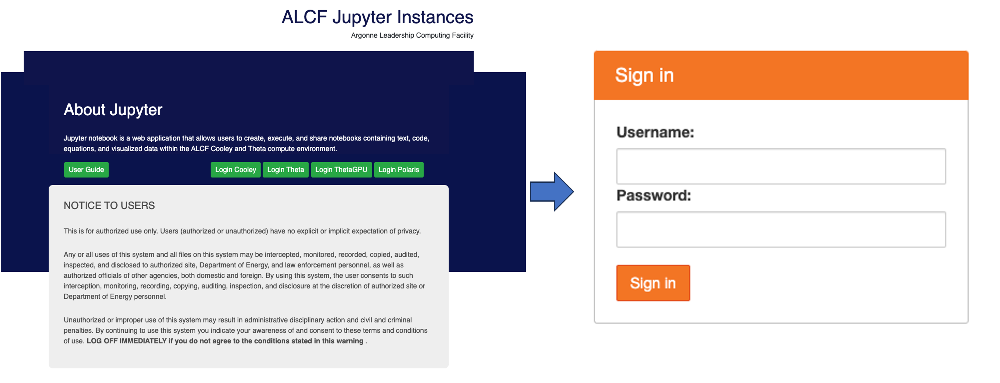
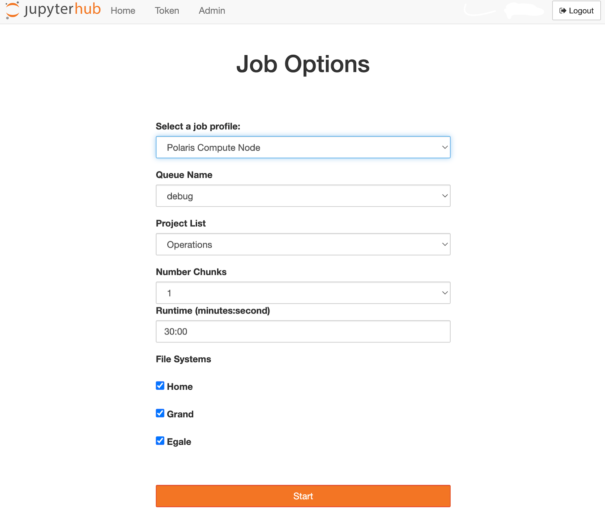
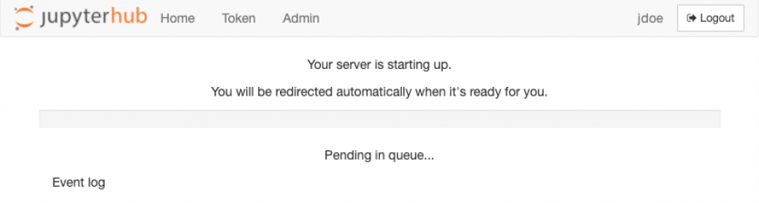

# JupyterHub

JupyterHub is an open-source service application that enables users to launch
separate Jupyter instances on a remote server.

[ALCF JupyterHub](https://jupyter.alcf.anl.gov)
provides access to Polaris with the same
[authentication protocol](../account-project-management/accounts-and-access/obtaining-a-token.md)
that is used to access these systems, but through a web interface rather than a
terminal.

On the [ALCF JupyterHub home page](https://jupyter.alcf.anl.gov), users can
choose their desired system.

Upon selection, they'll be directed to the sign-in page to enter their ALCF
username and 
[passcode token](../account-project-management/accounts-and-access/logging-in-with-tokens.md).



/// caption
ALCF JupyterHub home page and sign-in screen
///

We describe below how to use JupyterHub on Polaris in more detail.

## Polaris

The Polaris JupyterHub server runs on a Polaris login node and launches
individual users' environments on the compute nodes through the PBS job
scheduler.

After the authentication step, the user will be presented with the
menu of the available job options to start the Jupyter instance.

- Select a job profile: This field lists the available profiles, which is
  limited to "Polaris Compute Node" at this time.
- Queue Name: This field provides a list of available queues on the system.
- Project List: This field displays the active projects associated with the
  user on Polaris.
- Number of Nodes: This field allows the user to select the number of compute
  nodes to be allocated.
- Runtime (minutes:seconds): This field allows the user to set the runtime of
  the job in minutes and seconds. The user should refer to the
  [Polaris queue scheduling policy](../polaris/running-jobs/index.md)
  for minimum and maximum runtime allowed for the selected queue.
- File Systems: This field allows the user to select the file systems to be
  mounted.
  By default, all the file systems are selected.



/// caption
Polaris Job options
///

Once the appropriate information is provided, the user will click the "Start"
button and wait for the job to spawn.

If there's an extended wait time due to a lengthy job queue, the interface
might time out, leading to the job's removal from the queue.

If not, the job kicks off and it begins to use up the user's allocation based
on the chosen job options.

It's crucial for users to shut down the server when resources are no longer
required.

Failing to do so will result in continued consumption of the allocated time
until the predetermined runtime concludes.



/// caption
Job queued
///

!!! warning

    If you would like to change your selection about where to run the Jupyter
    instance after the Notebook has started, you need to stop the server to be able
    to see the drop-down menu again.

## Known Issues

### Spawn Failed: Timeout

This happens when the queue is backed up.
Since Jupyter is interactive, it expects an immediate connection.
Therefore, it waits 5 minutes for your job to begin before throwing this error.
You can monitor the queue usage with
[Gronk](https://status.alcf.anl.gov/#/polaris)
and submit when there isn't a wait.

## Additional Notes

### Custom IPython Kernels

ALCF JupyterHub provides a set of pre-configured IPython kernels for the users
to select.

However, users may need custom kernels with additional packages installed.

This can be achieved by first creating custom Python environments either
through
[venv](https://docs.python.org/3/library/venv.html)
or
[conda](https://conda.io/projects/conda/en/latest/user-guide/tasks/manage-environments.html).

More information on creating custom Python environments can be found in our
documentation for [Polaris](../polaris/data-science/python.md).

After activating the custom environment, the `ipykernel` package needs to be
installed with the following command:

```bash
pip install ipykernel
```

Once `ipykernel` is installed, the custom kernel can be added to the list of
available kernels with the following command:

```bash
python -m ipykernel install --user --name custom_kernel_name
```

where `custom_kernel_name` is the name of the kernel that will appear in the
kernel list.

This name does not have to match the name of the environment, but
should not contain spaces.

If you want more flexibility in naming, you can add
the `--display-name` argument as shown below.

```bash
python -m ipykernel install --user --name custom_kernel_name --display-name "Polaris Python 3.11 Tensorflow 2.4.1"
```

Note that you still need to provide `--name` with a simple name that does not
contain spaces.

Additionally, you can also set environment variables for the kernel with the
`--env` argument, i.e:

```bash
python -m ipykernel install --user --name custom_kernel_name --env http_proxy http://proxy.alcf.anl.gov:3128 --env https_proxy http://proxy.alcf.anl.gov:3128
```

You can see the list of available kernels with the following command:

```bash
jupyter kernelspec list
```

By default, the kernels are installed in the user's home directory under
`~/.local/share/jupyter/kernels/`.

All the configuration is specified in the `kernel.json` file under the kernel
directory.

For the example above, the path for the json file will be
`~/.local/share/jupyter/kernels/custom_kernel_name/kernel.json`.

You can edit this file to add additional environment variables or change the
display name.

Once you've followed the steps above, your new kernel will be visible on
JupyterHub.

It's recommended to perform these steps in a terminal, ideally on the login
node of the system you're using.

After setting up a custom kernel, you can easily add more packages directly
within JupyterHub.

Simply create a new notebook using your custom kernel and use the `%pip` or
`%conda` magic commands to install packages.

If you're on a compute node, remember to enable internet access by configuring
the `http_proxy` and `https_proxy` environment variables as previously
mentioned.

### Accessing Project Folders

The Jupyter file browser limits the user to view files and directories within
their home directory.

To access directories located outside of the user home directory, a symbolic
link to the directory must be created within the user home directory.

An example of this is:

```bash
ln -s /project/ABC ~/ABC_project_link
```

Please note that one can run any shell command directly on a Jupyter notebook
by simply adding an exclamation mark, `!`, to the beginning of the command.

For example, the above command can be run from a notebook cell as follows:

```bash
!ln -s /project/ABC ~/ABC_project_link
```

### Ending a Jupyter Notebook running on a compute node

Failing to correctly end a running Jupyter Notebook will continue to consume
the selected project's allocation on the resource in question.

When a user has completed their task in Jupyter, the user should stop the
Jupyter instance running on the compute node before logging out.

To stop the Notebook, click the "Control Panel" button in the top right, then
click "Stop My Server".


/// caption
Stop panel
///


/// caption
Stop server
///

## Resources

- Jupyter Lab [documentation](https://jupyterlab.readthedocs.io/en/stable/).
- ALCF Hands-on HPC Workshop presentation on Python and Jupyter on Polaris:
    - [slides](https://www.alcf.anl.gov/support-center/training-assets/python-jupyter-notebook-and-containers)
    - [video](https://youtu.be/fhCe5eO1RSM)
- ALCF webinar on JupyterHub:
    - [slides](https://github.com/keceli/ezHPC/blob/main/webinar/jupyterhub_webinar.pdf)
    - [video](https://youtu.be/X9g9eQcYseI?feature=shared)
