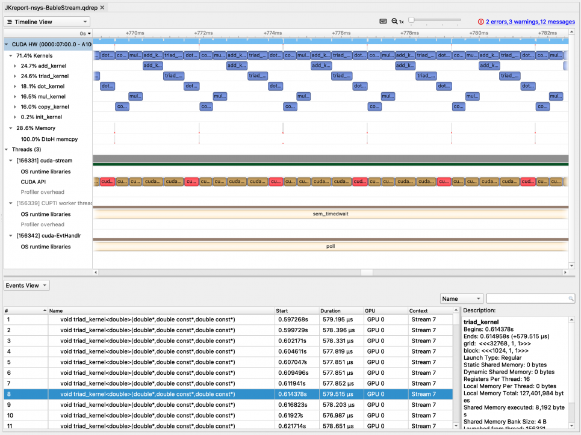
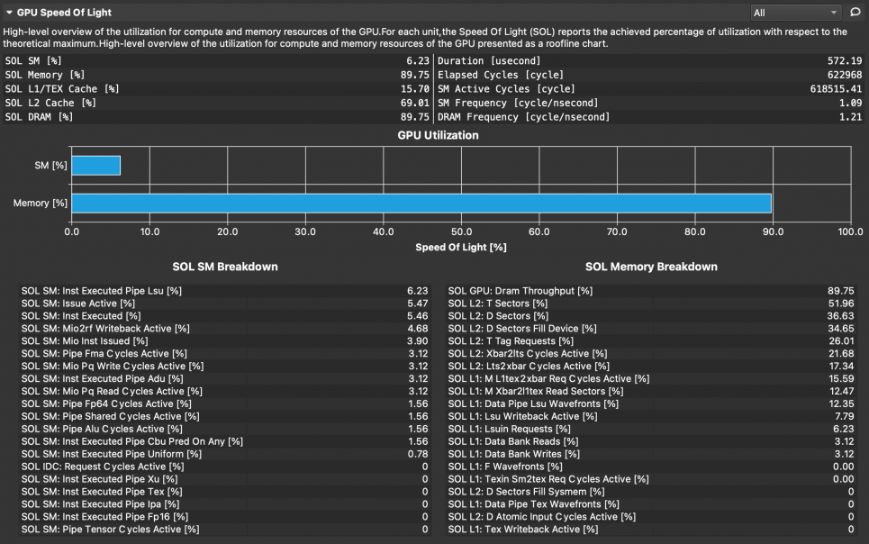
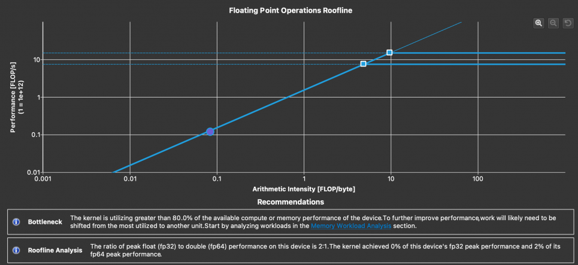

# NVIDIA Nsight

## References

- [NVIDIA Nsight Systems Documentation](https://docs.nvidia.com/nsight-systems/)
- [NVIDIA Nsight Compute Documentation](https://docs.nvidia.com/nsight-compute/NsightCompute/index.html)

## Introduction

NVIDIA® Nsight™ Systems provides developers with a system-wide visualization of an application's performance. Developers can optimize bottlenecks to scale efficiently across any number or size of CPUs and GPUs on ThetaGPU. For further optimizations to compute kernels, developers should use Nsight Compute.

NVIDIA Nsight Compute is an interactive kernel profiler for CUDA applications. It provides detailed performance metrics and API debugging via a user interface and command-line tool.

In addition, the baseline feature of this tool allows users to compare results within the tool. NVIDIA Nsight Compute provides a customizable and data-driven user interface, metric collection, and can be extended with analysis scripts for post-processing results.

## Step-by-step guide

### 1. Common part on ThetaGPU

Build your application for ThetaGPU and submit your job script to ThetaGPU or start an interactive job mode on ThetaGPU as follows:

```bash
$ module load cobalt/cobalt-gpu
$ qsub -I -n 1 -t 30 -q full-node -A {your_project}
```

### 2. Nsight Systems

Run your application with Nsight Systems as follows:

```bash
$ nsys profile -o {output_filename} --stats=true ./{your_application}
```

### 3. Nsight Compute

Run your application with Nsight Compute.

```bash
$ ncu --set detailed -k {kernel_name} -o {output_filename} ./{your_application}
```

**Note:** Without the -o option, Nsight Compute provides performance data as standard output.

### 4. Post-processing the profiled data

#### Post-processing via CLI

```bash
$ nsys stats {output_filename}.qdrep
$ ncu -i {output_filename}.ncu-rep
```

#### Post-processing on your local system via GUI

- Install NVIDIA Nsight Systems and NVIDIA Nsight Compute after downloading both of them from the NVIDIA Developer Zone.
- Download nsys output files (i.e., ending with .qdrep and .sqlite) to your local system, and then open them with NVIDIA Nsight Systems on your local system.
- Download ncu output files (i.e., ending with .ncu-rep) to your local system, and then open them with NVIDIA Nsight Compute on your local system.

For more options for performance analysis with Nsight Systems and Nsight Compute:

```bash
$ nsys --help
$ ncu --help
```

## A quick example

### Nsight Systems

#### Running a stream benchmark with Nsight Systems

```bash
jkwack@thetagpu18:~/HPC_benchmarks/BabelStream/JK_thetaGPU$ nsys profile -o JKreport-nsys-BableStream --stats=true ./cuda-stream

Warning: LBR backtrace method is not supported on this platform. DWARF backtrace method will be used.

Collecting data...

BabelStream

Version: 3.4

Implementation: CUDA

Running kernels 100 times

Precision: double

Array size: 268.4 MB (=0.3 GB)

Total size: 805.3 MB (=0.8 GB)

Using CUDA device A100-SXM4-40GB

Driver: 11000

Function    MBytes/sec  Min (sec)   Max         Average     

Copy        1381210.283 0.00039     0.00040     0.00039     

Mul         1339635.322 0.00040     0.00041     0.00040     

Add         1357739.235 0.00059     0.00061     0.00060     

Triad       1366533.461 0.00059     0.00061     0.00060     

Dot         1210611.093 0.00044     0.00047     0.00046     

Processing events...

Capturing symbol files...

Saving temporary "/tmp/nsys-report-b948-7122-9b9a-feb1.qdstrm" file to disk...

Creating final output files...

Processing [==============================================================100%]

Saved report file to "/tmp/nsys-report-b948-7122-9b9a-feb1.qdrep"

Exporting 7098 events: [==================================================100%]

Exported successfully to

/tmp/nsys-report-b948-7122-9b9a-feb1.sqlite

Generating CUDA API Statistics...

CUDA API Statistics (nanoseconds)

Time(%)      Total Time       Calls         Average         Minimum         Maximum  Name                                                                            

-------  --------------  ----------  --------------  --------------  --------------  --------------------------------------------------------------------------------

   44.8       280504347           4      70126086.8         1050249       276881346  cudaMalloc                                                                      

   31.4       196878210         401        490968.1          381542          600948  cudaDeviceSynchronize                                                           

   22.4       140280462         103       1361946.2          436597        32339232  cudaMemcpy                                                                      

    1.0         6263864           4       1565966.0         1236542         1884610  cudaFree                                                                        

    0.4         2729558         501          5448.2            4970           36269  cudaLaunchKernel                                                                

Generating CUDA Kernel Statistics...

CUDA Kernel Statistics (nanoseconds)

Time(%)      Total Time   Instances         Average         Minimum         Maximum  Name                                                                                                                                                                                                                                                                                                                                         

-------  --------------  ----------  --------------  --------------  --------------  --------------------------------------------------------------------------------------------------------------------                                                                                                                                                                                                                         

   24.7        58518170         100        585181.7          580347          594395  void add_kernel<double>(double const*, double const*, double*)                                                                                                                                                                                                                                                                               

   24.6        58312184         100        583121.8          576987          595067  void triad_kernel<double>(double*, double const*, double const*)                                                                                                                                                                                                                                                                             

   18.1        42942748         100        429427.5          419548          438333  void dot_kernel<double>(double const*, double const*, double*, int)                                                                                                                                                                                                                                                                          

   16.5        39062588         100        390625.9          388733          392125  void mul_kernel<double>(double*, double const*)                                                                                                                                                                                                                                                                                              

   16.0        37980930         100        379809.3          376541          392925  void copy_kernel<double>(double const*, double*)                                                                                                                                                                                                                                                                                             

    0.2          521628           1        521628.0          521628          521628  void init_kernel<double>(double*, double*, double*, double, double, double)                                                                                                                                                                                                                                                                  

Generating CUDA Memory Operation Statistics...

CUDA Memory Operation Statistics (nanoseconds)

Time(%)      Total Time  Operations         Average         Minimum         Maximum  Name                                                                            

-------  --------------  ----------  --------------  --------------  --------------  --------------------------------------------------------------------------------

  100.0        94988808         103        922221.4            2335        32089877  [CUDA memcpy DtoH]                                                              

CUDA Memory Operation Statistics (KiB)

              Total      Operations              Average            Minimum              Maximum  Name                                                                            

-------------------  --------------  -------------------  -----------------  -------------------  --------------------------------------------------------------------------------

         786632.000             103             7637.204              2.000           262144.000  [CUDA memcpy DtoH]                                                              

Generating Operating System Runtime API Statistics...

Operating System Runtime API Statistics (nanoseconds)

Time(%)      Total Time       Calls         Average         Minimum         Maximum  Name                                                                            

-------  --------------  ----------  --------------  --------------  --------------  --------------------------------------------------------------------------------

   47.6      1184528854          22      53842220.6           10240       100064607  sem_timedwait                                                                   

   36.2       901118663          20      45055933.1           16792       100119932  poll                                                                            

   15.9       395394013        1456        271561.8            1012        17141907  ioctl                                                                           

    0.2         4052477         105         38595.0            2064          111321  open64                                                                          

    0.1         1716108          86         19954.7            1042          509715  mmap                                                                            

    0.0          963824          51         18898.5            1363          771371  fopen                                                                           

    0.0          208937           4         52234.3           42771           62549  pthread_create                                                                  

    0.0          141128           3         47042.7           41178           58621  fgets                                                                           

    0.0           52102          11          4736.5            1824           18145  munmap                                                                          

    0.0           41950           6          6991.7            1783           19146  putc                                                                            

    0.0           37641           5          7528.2            2444           13065  open                                                                            

    0.0           32953          11          2995.7            1422            6402  write                                                                           

    0.0           31581          23          1373.1            1042            1823  fclose                                                                          

    0.0           16470           2          8235.0            1412           15058  sched_yield                                                                     

    0.0            8927           2          4463.5            3437            5490  socket                                                                          

    0.0            8586           1          8586.0            8586            8586  pipe2                                                                           

    0.0            7324           3          2441.3            1593            3627  fwrite                                                                          

    0.0            5782           2          2891.0            1844            3938  fread                                                                           

    0.0            5751           1          5751.0            5751            5751  connect                                                                         

    0.0            4369           2          2184.5            1714            2655  read                                                                            

    0.0            3998           3          1332.7            1082            1603  fcntl                                                                           

    0.0            1433           1          1433.0            1433            1433  fflush                                                                          

    0.0            1252           1          1252.0            1252            1252  bind                                                                            


Generating NVTX Push-Pop Range Statistics...

NVTX Push-Pop Range Statistics (nanoseconds)

Report file moved to "/gpfs/mira-home/jkwack/HPC_benchmarks/BabelStream/JK_thetaGPU/JKreport-nsys-BableStream.qdrep"

Report file moved to "/gpfs/mira-home/jkwack/HPC_benchmarks/BabelStream/JK_thetaGPU/JKreport-nsys-BableStream.sqlite"
```

<figure markdown>
  { width="700" }
</figure>

### Nsight Compute

#### Running a stream benchmark with Nsight Compute for triad_kernel

```bash
jkwack@thetagpu18:~/HPC_benchmarks/BabelStream/JK_thetaGPU$ ncu --set detailed -k triad_kernel -o JKreport-ncu_detailed-triad_kernel-BableStream ./cuda-stream

BabelStream

Version: 3.4

Implementation: CUDA

Running kernels 100 times

Precision: double

Array size: 268.4 MB (=0.3 GB)

Total size: 805.3 MB (=0.8 GB)

==PROF== Connected to process 166971 (/gpfs/mira-home/jkwack/HPC_benchmarks/BabelStream/JK_thetaGPU/cuda-stream)

Using CUDA device A100-SXM4-40GB

Driver: 11000

==PROF== Profiling "triad_kernel": 0%....50%....100% - 19 passes

Function    MBytes/sec  Min (sec)   Max         Average     

Copy        1336793.345 0.00040     0.00042     0.00041     

Mul         1307948.274 0.00041     0.00043     0.00042     

Add         1335561.797 0.00060     0.00062     0.00062     

Triad       976.089     0.82503     1.00961     0.87930     

Dot         1081921.148 0.00050     0.00055     0.00053     

==PROF== Disconnected from process 166971

==PROF== Report: /gpfs/mira-home/jkwack/HPC_benchmarks/BabelStream/JK_thetaGPU/JKreport-ncu_detailed-triad_kernel-BableStream.ncu-rep
```

<figure markdown>
  { width="700" }
</figure>

<figure markdown>
  { width="700" }
</figure>

<figure markdown>
  { width="700" }
</figure>

<figure markdown>
  { width="700" }
</figure>

---