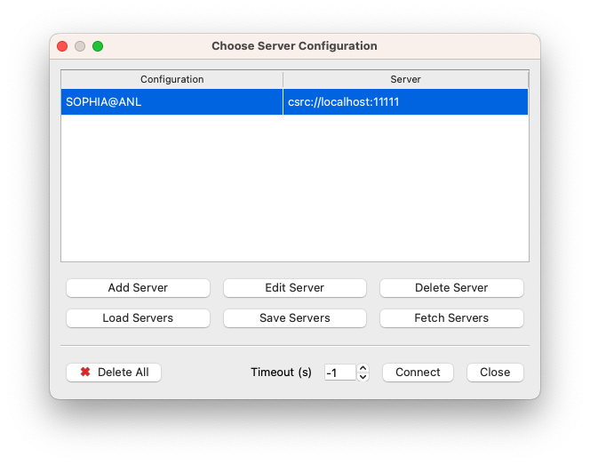
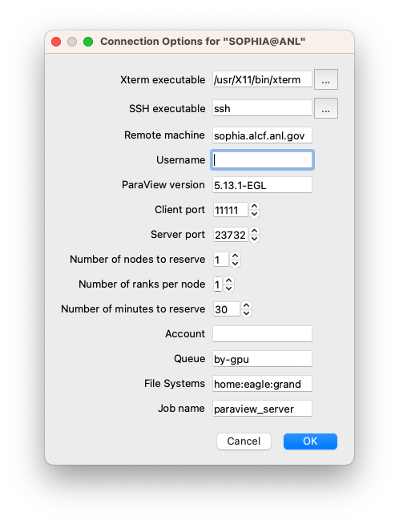
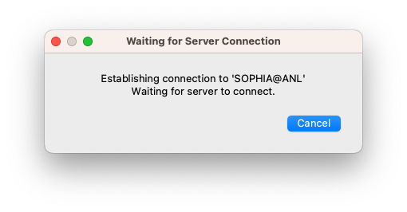
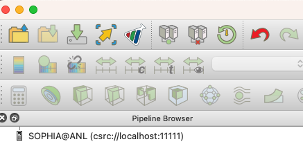

# ParaView on Sophia

The recommended way of running ParaView on Sophia is in client/server mode. This consists of running the ParaView client on your local resource and the ParaView server on the Sophia compute nodes. The ParaView client needs to first be installed on your local resource and needs to match the version that you run on Sophia.

There may be multiple versions of ParaView installed on Sophia. To find the versions of ParaView currently available on Sophia, run the following command on a login node: 
```bash
module use /soft/modulefiles
module avail paraview
```

Binary and source packages of the ParaView client for Linux, macOS, and Windows are available from the [ParaView Download Page](https://www.paraview.org/download/).

## Connecting to the ParaView server on Sophia

This section describes how to launch the ParaView server on Sophia from a local ParaView client.

### Start ParaView Client

First, launch the ParaView client on your local resource. You will need to configure some server settings in the client. This initial setup should only need to be done once and can be reused each time you want to run ParaView on Sophia.

### Server Configuration

#### 1. Select Connect

From the ParaView client, choose to connect to a server by either clicking on the "Connect" icon in the menu bar


or selecting File->Connect from the main menu.

<figure markdown>
  { width="700" }
</figure>

#### 2. Set Up Servers (first time only)

The first time you want to run a server on Sophia and have it connect to your local ParaView client, you will need to set up a server. Once this server is set up, you can reuse it each time you run the ParaView client with the ParaView server on Sophia.

Kitware, the developers of ParaView, maintain a database of server configurations which you can retrieve through the ParaView client.

!!! note "NOTE"
    At this time, there are no specific files for Sophia available from Kitware. We will update this page when the files are available. In the meantime, you can download configuration files here and import them with the `Load Servers` option. Please use the `Save link as` option in your browser. [Mac](serverfiles/sophia.pvsc) [Windows](serverfiles/windowsToSophia.pvsc)

<!--
<figure markdown>
  { width="700" }
</figure>
-->

#### 3. Use ParaView

After the previous step, you can now select SOPHIA@ANL in the File->Connect menu and press Connect.

<figure markdown>
  { width="700" }
</figure>

At this point, a new window will pop up.

<figure markdown>
  { width="700" }
</figure>

There are a number of parameters that you must enter manually here:

- **Xterm executable:** The path of a terminal on your system. The figure shows the case of a Mac with XQuartz. You may need to change these values for Windows or Linux.
- **SSH executable:** The name of your ssh command. It may be different on Windows depending on the ssh client installed (e.g., PuTTY).
- **Remote machine:** Leave this value at sophia.alcf.anl.gov.
- **Username:** Your ALCF username.
- **ParaView version:** The version of ParaView that you want to use. Verify first that this version is installed on the system (as described at the top of this document). You will also need to add a `-EGL` suffix.

Example:
```
5.13.1-EGL
```

- **Client port:** It is safe to use the default value.
- **Server port:** It is safe to use the default value.
- **Number of nodes to reserve:** Enter the number of Sophia compute nodes you want to use for your job.
- **Number of ranks per node:** Enter the number of ranks per node.
- **Number of minutes to reserve:** The duration of your job in minutes.
- **Account:** Enter here the name of your ALCF allocation.
- **Queue:** The name of the Sophia queue you would like to use (e.g., `by-gpu` or `by-node`). We recommend `by-gpu` for most jobs so that the nodes are used efficiently.
- **File Systems:** Enter here the file systems you need for your job, separated with colons, no spaces. Keep in mind that your job may not run if one of these file systems is not available at that time, so enter these values carefully.
- **Job name:** Safe to use the default value. The PBS scheduler will assign this name to your job.

Now you can press OK to establish the connection with a ParaView server on Sophia.

An SSH connection will be established with a Sophia login node, and a password will be requested in a terminal, similar to the process you normally use to connect and work on the system.

After you enter your password, a job will be queued, and you will see a window like this:

<figure markdown>
  { width="700" }
</figure>

When the job is launched on the compute nodes, the previous window will go away, and ParaView will show it is connected to Sophia in its Pipeline Browser:

<figure markdown>
  { width="700" }
</figure>

At this point, you can open datasets stored on the ALCF file systems and use ParaView normally.

## Additional Information

- [ParaView Documentation](https://docs.paraview.org/en/latest/)
- [ParaView Community Support](https://discourse.paraview.org/)

---