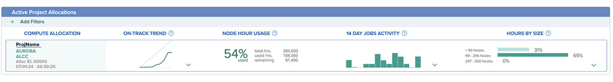

# Managing Your Allocations

Allocations require management – balance checks, resource allocation, requesting more time, etc. Allocation information is available via the [MyALCF user portal](https://my.alcf.anl.gov) or through the command line interface. 

## Active Allocations on MyACLF

Select data for active allocations are shown on the dashboard of the MyALCF portal when signed into an ALCF user account. The dashboard section labeled "Active Project Allocations" provides an overview of activity with allocation start and end dates, allocation node hour usage, remaining node hours, usage trend data for future planning, and job sizes run. More detailed queries can be done using the sbank graphic interface in the [sbank section](https://my.alcf.anl.gov/ni/#/list/:command%3Dsbank-list-allocations) of the MyALCF portal. Further information on how to use the sbank graphic interface is available in the [MyALCF documentation.](../../account-project-management/MyALCF.md)



/// caption
An active project allocation on the dashboard provides an overview of allocation data.
///

## Active Allocations Through Command Line

To determine if there is an active allocation, check [Job Submission](../../running-jobs/index.md#qsub).

For information on how to run the query, look at our documentation on our [sbank Allocations Accounting System](sbank-allocation-accounting-system.md) or email [support@alcf.anl.gov](mailto:support@alcf.anl.gov) and ask for all active allocations.

## Using sbank to Determine the Balance of an Allocation

To determine which platforms have an active balance, check our allocation accounting system [sbank](sbank-allocation-accounting-system.md).

- To obtain the allocation balance, check the `sbank` command [sbank-list-allocations](not_in_nav/sbank-list-allocations.md).
- DD projects with a negative balance will not be able to run jobs until they have requested additional time; see the "Getting More Time" subsection below.
- INCITE and ALCC PIs automatically receive an email summary of project usage. If this is a DD project, please email [support@alcf.anl.gov](mailto:support@alcf.anl.gov).

## Allocation Expiration

Projects and allocations at the ALCF are different. A particular project might have multiple allocations of time. For example, a discretionary project that has been approved more than three times will have three allocations
(two are probably expired) but just one project. Projects will not expire -- allocations will. If allocations are expired, or have no hours left, jobs will not be able to run. Consult the two above sections
to determine active allocations.

## Getting More Time

To request an extension of your existing discretionary allocation or to request additional hours, please complete an allocation renewal request [here](https://my.alcf.anl.gov/accounts/#/allocationRequests).

To renew or extend storage allocations, email [support@alcf.anl.gov](mailto:support@alcf.anl.gov) with answers to the following information:
- What have you accomplished with your original allocation?
- Please include a brief description of any publications or major presentations that were (or will be) generated in full or in part because of this allocation.
- What will you do with the extra time?
- How much additional storage (in TB) do you need?
- When should the allocation end?

## Sub-allocations

!!! tip inline end

    See `sbank new suballocation -h` for all the options.

Suballocations let PIs control who in their team can run jobs, how much they are allowed to consume (allocation amount), and when they are allowed to run jobs (start and end dates).

!!! note

    Once submanagement is enabled for a project allocation, all job submissions must specify the suballocationID or the suballocationName. You can no longer submit jobs with just the project name.

### Step 1: Create Suballocations (Project PI):

PI creates suballocations 

```bash
sbank new sub <allocationid> --name <nameofsuballoc>
```

### Step 2: Manage Suballocations (Project PI):

#### PI adds users to suballocations

```bash
sbank e sub <projectname>::<nameofsuballoc> --add-user="<username1> <username2> ..."
```

#### PI can change the name of a suballocation 

```bash
sbank e sub <suballocationID> --name=<new_name_of_suballocation>
```

By default, the primary suballocation (which is the default suballocation created when the allocation is created by ALCF) is unrestricted, i.e., enabled for all project members. That means all project members can submit jobs against the primary suballocation by default. All other suballocations are restricted by default, and users have to be added for each of them.

#### To change the default for the primary suballocation to restrict usage, PI must first edit the suballocation:

```bash
sbank-edit-suballocation --restrict <primary suballocation id>
```

#### Then add users with this command:

```bash
sbank e sub <primary suballocation id> --add-user="<username1> <username2> ..."
```

#### PI changes start and end dates for a suballocation:

```bash
sbank e sub <suballocationID> -S <start_date> -E <end_date>
```

#### PI adds hours to a suballocation:

```bash
sbank e sub <projectname>::<nameOfSourceSuballoc> --hours-to-move <hours> --to-suballocation <projectname>::<nameOfDestSuballoc>
```

!!! note

    `hours` must be less than or equal to the available balance for the suballocation `nameOfSourceSuballoc`.

!!! tip inline end

    See `sbank e suballocation -h` for all the options.

### Step 3: Submit Jobs (Project team):

Submit jobs to a suballocation. Note that the user should be on the suballocation’s user list. **Once submanagement is enabled for a project allocation, all job submissions must specify the `suballocationID` or the `suballocationName`.**

Example:

```bash
#Specify suballocationID
qsub -l select=10,walltime=30:00,filesystems=eagle:home -A <suballocationID> -q demand test.sh
```
or

```bash
#Specify suballocation name
qsub -l select=10,walltime=30:00,filesystems=eagle:home -A <projectname>::<suballocationName> -q demand test.sh
```


### Useful commands:

List all suballocations for a project that shows the number of jobs run, charges, allocation balance, suballocation name, and list of users:

```bash
sbank-list-allocations -r polaris -p <projectname> -f "+subname users_list"
```

!!! tip 

    See `sbank l a -h` for all the options and `sbank –f\?` for a list of fields that can be displayed.
