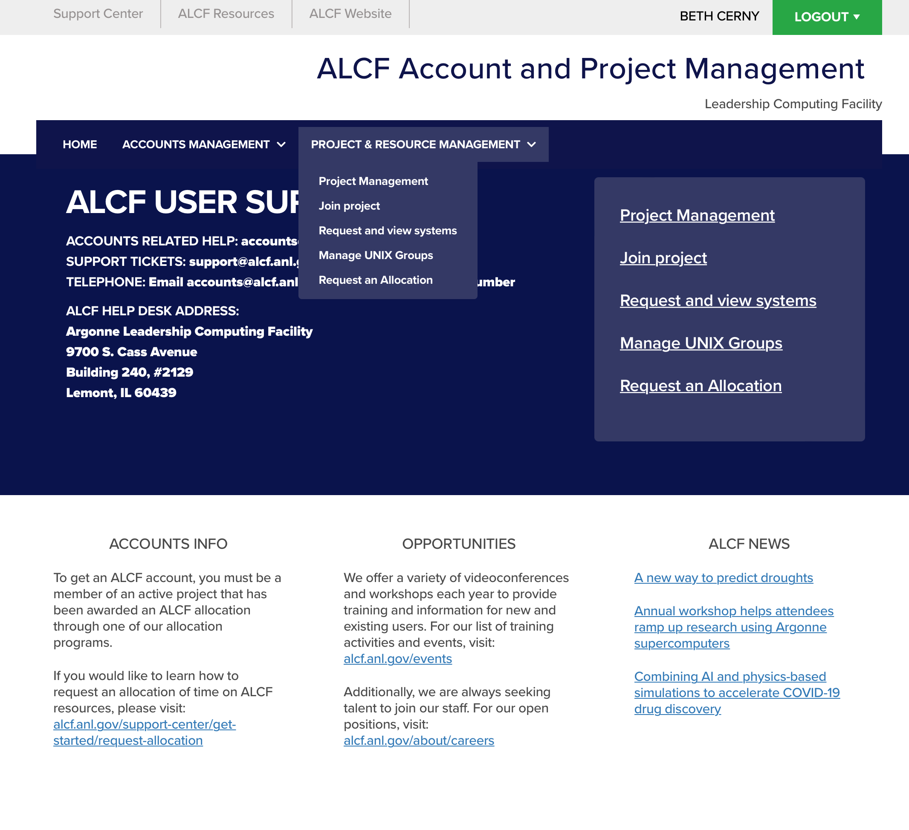

# Allocations on ALCF Computing Resources

## Getting an Allocation Award
### INCITE, ALCC, and ADSP
Researchers gain access to ALCF systems for computational science and engineering projects—typically with awards of millions of core-hours—through competitive, peer-reviewed allocation programs supported by the DOE and Argonne. Our peer-reviewed award programs consist of the [INCITE](https://www.alcf.anl.gov/science/incite-allocation-program), [ALCC](https://www.alcf.anl.gov/science/alcc-allocation-program), and [ADSP](https://www.alcf.anl.gov/science/adsp-allocation-program) programs. More information about the programs, including dates for our CFPs, can be found on their web pages.

### Director's Discretionary 
Alternatively, ALCF offers a Director's Discretionary allocation award program to leadership computing preparation, INCITE and ALCC scaling, and application performance to maximize scientific application efficiency and productivity on leadership computing platforms. See the [Director's Discretionary (DD) Program page](https://www.alcf.anl.gov/science/directors-discretionary-allocation-program) for more information.

## Initializing Your Awarded Allocation 
Projects with INCITE, ALCC, and ADSP awards will be contacted directly by the ALCF staff with information on creating accounts.

Director's Discretionary awards will receive information in the award confirmation email. 

## Allocation Resources
While requesting an allocation, users can choose from:

**Computes:** 
* Polaris

**File System:** 
* Eagle (Community Sharing)

## Policy Information Related to Allocations
[Pullback Policy](../../policies/queue-scheduling/pullback-policy.md)

## Requesting Additional Allocation Hours
If you are a PI of a Director's Discretionary project that has an active allocation, you can request additional time or an extension using the [allocation request form](https://accounts.alcf.anl.gov/allocationRequests).

<figure markdown>
  { width="700" }
  <figcaption>To request more hours, renew your project using the allocation request form.</figcaption>
</figure>
