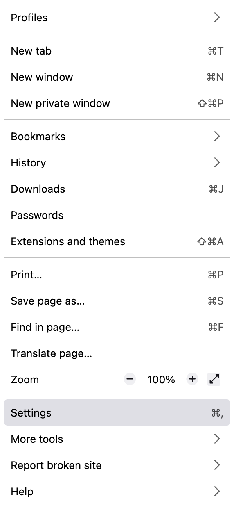
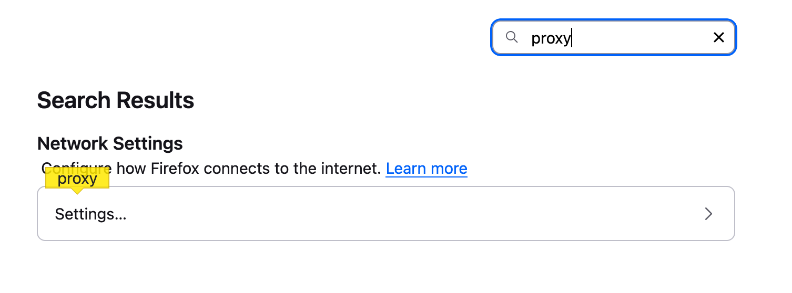
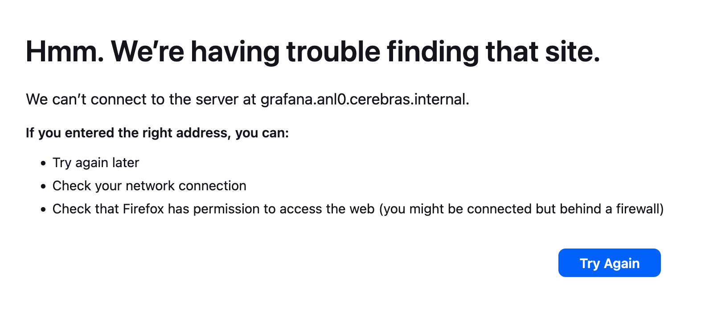
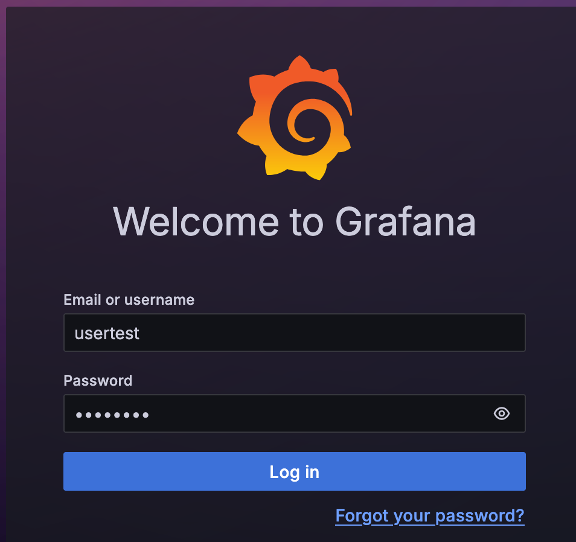

# Tunneling and Forwarding Ports

The Cerebras grafana dashboard is only accessible from system's within ALCF internal networks.  To access it you will need to open a socks proxy to `cerebras.alcf.anl.gov` and then route your connection via the socks proxy.  

## Setup the socks proxy via ssh
* SSH's -D option will open a local socks proxy at the specified port.  In this example we use port 5555
  * `ssh -D5555 ${yourUsername}@cerebras.alcf.anl.gov`

## Instuctions for setting up via Firefox
* Open Firefox's Application menu and click settings
  * {width=25%}
* In search box, type `proxy`. Under `Network Settings` click `settings`.
  * {width=60%}
* Under `Connection Settings` :
  * select `Manual proxy configuration` and `Proxy DNS when using SOCKS v5`
    * {width=60%}
  * For `SOCKS Host` put in `127.0.0.1` and for the `Port` put 5555 (Or whatever port you used for ssh's -D option
    * {width=75%}
  * Click "OK" to save"
* Exit out of Firefox settings/preferences tab

## Using Grafana Dashboard
* Login by going to [https://grafana.anl0.cerebras.internal](https://grafana.anl0.cerebras.internal/login){width=75%}
    * If you get an `Hmm. We’re having trouble finding that site.` or `We can’t connect to the server at grafana.anl0.cerebras.internal.` then likely your browser and proxy settings are not working.
    * {width=50%}
* Enter your ALCF username and MobilePass+ token.  
  * It can take upto 10 seconds before letting you in.
    * {width=50%}
* We make serveral read only dashboards avaible under the Dashboard folder [UserDashboards](https://grafana.anl0.cerebras.internal/dashboards/f/bfdit1mx49ypsc/?orgId=1) 
    * 
* If you wish to create your own dashboards please email [support](mailto:support@alcf.anl.gov) and request write access for a cerebras grafana dashboard.
