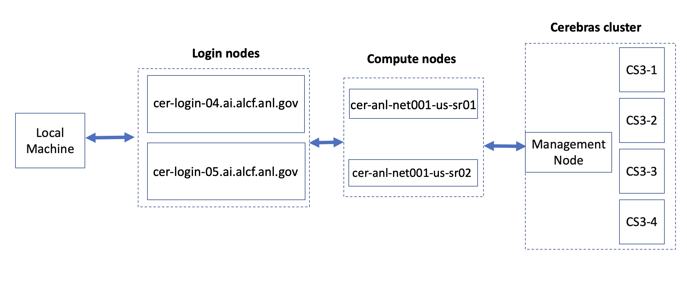

<!---# Connecting to a CS-3 node--->
# Getting Started

## Connection to a CS-3 node

<!---These instructions presume that you have completed steps 1 and 2 on ALCFs
[Get Started](https://www.alcf.anl.gov/support-center/get-started)--->



Connection to one of the **CS-3** cluster login nodes requires an MFA passcode for authentication - a passcode generated by the MobilePASS+ app on your mobile device or by a physical hardware token. The same passcode system is used to authenticate into other ALCF systems, such as Polaris.

_In the examples below, **replace ALCFUserID with your ALCF user ID.**_

To connect to a CS-3 login node, first ssh to the login node:
```bash
ssh ALCFUserID@cerebras.alcf.anl.gov
```

Then ssh to a cerebras user node:
```bash
ssh cer-usn-01
```
or
```bash
ssh cer-usn-02
```
