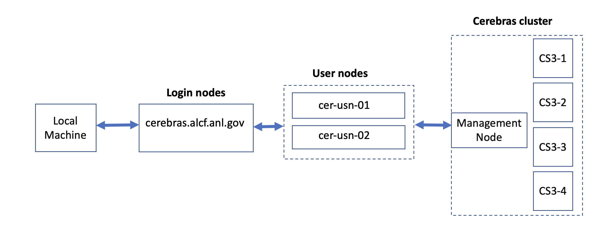

<!---# Connecting to a CS-3 node--->
# Getting Started

## Connection to a CS-3 node

<!---These instructions presume that you have completed steps 1 and 2 on ALCFs
<a href="https://www.alcf.anl.gov/support-center/get-started">Get Started - Follow these steps to get your research project up and running on ALCF computing resources</a>--->


Connection to one of the **CS-3** cluster login nodes requires an MFA passcode for authentication - an 8-digit passcode generated by an app on your mobile device (MobilePASS+) or Cryptocard. The same passcode system is used to authenticate into other ALCF systems, such as Polaris.<br>
*In the examples below, <strong>replace ALCFUserID with your ALCF user id.</strong>*<br>
To connect to a CS-3 login:<br>

ssh to the login node:
```bash
ssh ALCFUserID@cerebras.alcf.anl.gov
```

Then ssh to a cerebras user node:
```bash
ssh cer-usn-01
```
or
```bash
ssh cer-usn-02
```
