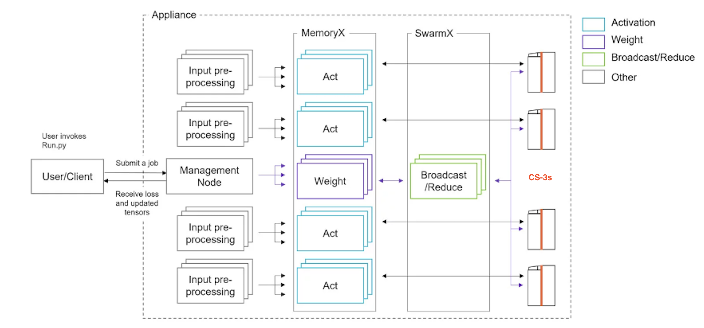

# System Overview

The Cerebras CS-2 is a wafer-scale deep learning accelerator comprising 850,000 processing cores, each providing 48KB of dedicated SRAM memory for an on-chip total of 40GB and interconnected to optimize bandwidth and latency. Its software platform integrates the popular machine learning framework PyTorch.

The ALCF CS-2 systems are configured as a Cerebras Wafer-Scale Cluster, designed to support large-scale models (up to and well beyond 1 billion parameters) and large-scale inputs. The cluster currently contains one CS-2 system. 

The supporting CPU cluster consists of MemoryX, SwarmX, management, and input worker nodes. The Cerebras Wafer-Scale cluster is run as an appliance: a user submits a job to the appliance, and the appliance manages preprocessing and streaming of the data, IO, and device orchestration within the appliance. It provides programming via PyTorch. This installation supports both Pipelined execution for models up to 1 billion parameters and Weight Streaming execution for models up to and above 1 billion parameters.

The public Cerebras documentation is available [here](https://training-docs.cerebras.ai/getting-started/overview).

A typical Cerebras Wafer-Scale Cluster is shown in the figure below. Users connect via SSH to one of the three login nodes. Either ssh to `cerebras.ai.alcf.anl.gov`, which randomly resolves to one of cer-login-0[1-3].ai.alcf.anl.gov, or ssh to a specific node, `cer-login-01.ai.alcf.anl.gov`, `cer-login-02.ai.alcf.anl.gov`, `cer-login-03.ai.alcf.anl.gov`.
The rest of the nodes in the cluster infrastructure are not directly accessible, except by admins.
The trees `/home`, `/projects`, and `/software` are shared across all three login nodes, the relevant cluster infrastructure nodes, and all ALCF AI testbed platforms.

/// caption
Figure: topology of CS-2 cluster ([source](https://training-docs.cerebras.ai/rel-2.4.0/concepts/cerebras-wafer-scale-cluster))
///

As indicated in the figures, which represent a two-CS2 cluster, a CS-2 node on the right is responsible only for running and accelerating the computations for training and predictions with the model. The other work, including compilation, is performed by input nodes, and by MemoryX nodes, which are used for weight storage and broadcast, and SwarmX nodes, which are used for gradient accumulation. Some model verification work can be done on login nodes.
