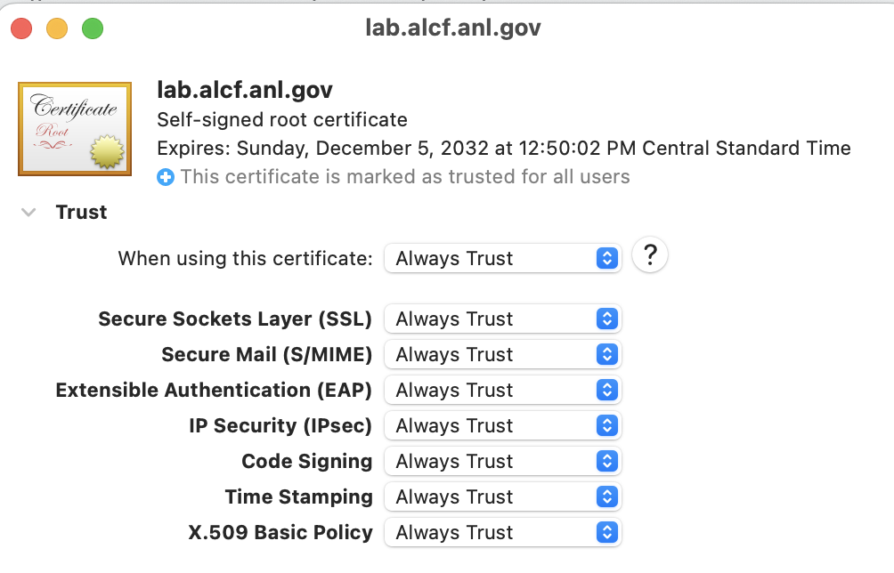

# Miscellaneous

## Porting applications to the CS-2

Cerebras documentation for porting code to run on a Cerebras CS-2 system:<br>
[Port Pytorch Models to Cerebras](https://training-docs.cerebras.ai/model-zoo/migration/porting-pytorch-models-to-cerebras#port-pytorch-models-to-cerebras)

<!--- Disabled for now
## Grafana WsJob Dashboard for Cerebras jobs
A Grafana dashboard provides support for visualizing, querying, and exploring the CS2 system’s metrics and enables to access system logs and traces.
See the Cerebras documentation for the [ML User Dashboard](https://training-docs.cerebras.ai/cluster-monitoring/cerebras-job-scheduling-and-monitoring/cluster-monitoring-with-grafana#ml-user-dashboard)

Here is a summary (tested to work on Ubuntu and MacOS)<br>

On your work machine with a web browser, e.g. your laptop,<br>
edit /etc/hosts, using your editor of choice
```console
sudo nano /etc/hosts
```
Add this line
```console
127.0.0.1	grafana.cerebras1.lab.alcf.anl.gov
```
Save, and exit the editor

Download the Grafana certificate present on the Cerebras node at /opt/cerebras/certs/grafana_tls.crt to your local machine. To add this certificate to your browser keychain, 

1. On chrome, go to Settings->Privacy and security->Security->Manage device certificates
2. Select System under "System Keychains" on the left hand side of your screen. Also select the "Certificate" tab.
3. Drag and drop the downloaded certificate. Once it is added, it is visible as "lab.alcf.anl.gov"
   
4. Select the certificate, and ensure that the "Trust" section is set to "Always Trust"
   


On your work machine with a web browser, e.g. your laptop,<br>
tunnel the grafana https port on the cerebras grafana host through to localhost
```
ssh -L 8443:grafana.cerebras1.lab.alcf.anl.gov:443 arnoldw@cer-login-03.ai.alcf.anl.gov
```

Point a browser at grafana. (Tested with Firefox and Chrome/Brave)<br>
Open browser to a job grafana url shown in csctl get jobs, adding :8443 to hostname, e.g.<br>
```console
https://grafana.cerebras1.lab.alcf.anl.gov:8443/d/WebHNShVz/wsjob-dashboard?orgId=1&var-wsjob=wsjob-49b7uuojdelvtrcxu3cwbw&from=1684859330000&to=noww
```
--->
<!---
NO LONGER NEEDED - python environments are available, and singularity not available

## Downloading a Kaggle competition dataset to a CS-2 node using the command line

These notes may be helpful for downloading some Kaggle datasets

Inside a singularity shell (e.g. `singularity shell -B /opt:/opt /software/cerebras/cs2-02/container/cbcore_latest.sif` )

```console
virtualenv env
source env/bin/activate
pip3 install kaggle
```

Go to www.kaggle.com in a browser, log in (create account if first time). In user(icon upper right) -&gt; Account tab, there is a button (scroll down) to "Create New API Token". Click it. It will open a download window for a one line json.

put the json in `~/.kaggle/kaggle.json`</br>
e.g. scp the downloaded file, or single quote the json text and echo it as shown</br>
```console
mkdir ~/.kaggle
echo '{"username":"REDACTED","key":"REDACTED"}' > ~/.kaggle/kaggle.json
chmod 600 ~/.kaggle/kaggle.json
```

On www.kaggle.com, the kaggle api command for download of a dataset is displayed in the data tab. It can be selected and copied to the local clipboard, or copied with the "Copy API command to clipboard" icon.<br>
Before attempting a download, if there is a button on the kaggle download page to agree to any terms and conditions, e.g. agreement to the competition rules, click on it (after reading them); downloads with your access token will fail with a 403 error until you agree to those T&Cs.

Paste the API command to the command line inside the singularity shell with the venv activated. E.g.<br>
```bash
kaggle datasets download -d mhskjelvareid/dagm-2007-competition-dataset-optical-inspection
```

It will download as a zip file.

Exit the singularity container (with `exit`), then unzip the dataset zip file.<br>
`unzip` is available on the CS-2 worker nodes.

Note: the kaggle download shown above included two identical copies of the dataset; one copy was in a subdirectory.
--->
