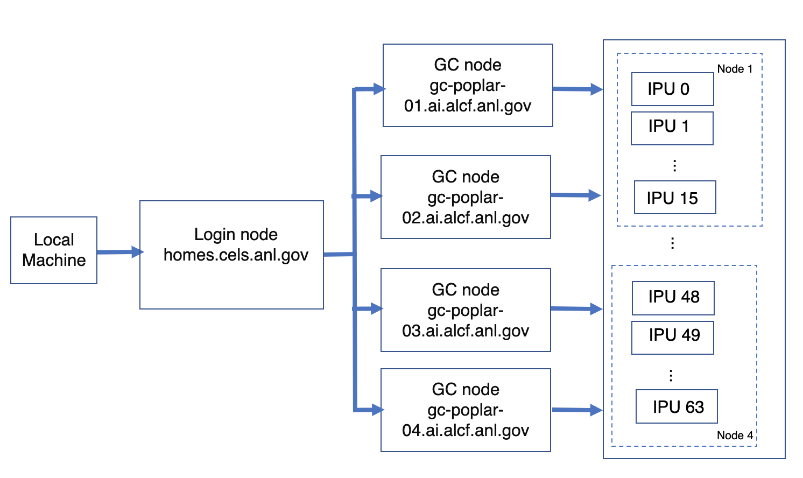

# Getting Started

<!---## On-Boarding--->

<!---See [Get Started](https://www.alcf.anl.gov/support-center/get-started)
to request an account and additional information.--->

<!---Logging into the Graphcore BOW-2000 processors requires a GCE account that can be requested at [Get Started](https://www.alcf.anl.gov/support-center/get-started).--->

## Setup

### System View

Connection to a Graphcore node is a two-step process.

The first step is to **ssh** to the **login node**.

The second step is to log in to a Graphcore node from the **login node**.



### Log in to Login Node

Login to the homes-gce login node from your local machine using the below command. This uses the CELS GCE account ID.

*In the examples below, replace* ***CELSGCEUserID*** *with your CELS GCE user id.*

```bash
ssh CELSGCEUserID@homes.cels.anl.gov
```

**NOTE: Use the ssh "-v" option in order to debug any ssh problems.**

### Log in to a Graphcore Node

Once you are on the login node, one of the four Graphcore nodes can be accessed using **ssh**.

```bash
ssh gc-poplar-01.ai.alcf.anl.gov
# or
ssh gc-poplar-02.ai.alcf.anl.gov
# or
ssh gc-poplar-03.ai.alcf.anl.gov
# or
ssh gc-poplar-04.ai.alcf.anl.gov
```

**NOTE: Each system has a separate scheduler.  If you have already
ssh'd into one of those nodes, you are all set.**
