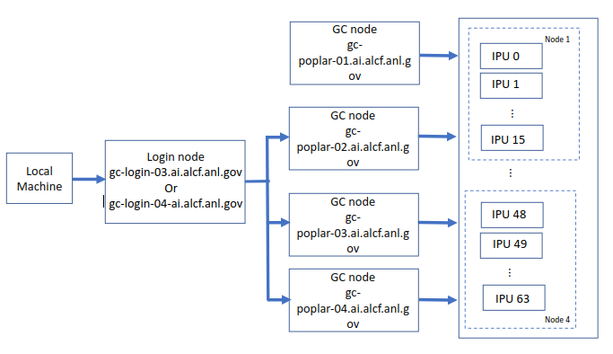

# Getting Started

Connection to a Graphcore node is a two-step process.

The first step is to ssh from a local machine to the login node.

The second step is to log in to a Graphcore node from the login node.



## Log in to Login Node

Login to the Graphcore login node from your local machine using the below command. This uses the ALCF account ID that uses the password generated from the MobilePASS+.

> **Note**:  In the examples below, replace ALCFUserID with your ALCF user id.

```bash
ssh ALCFUserID@gc-login-03.ai.alcf.anl.gov
# or
ssh ALCFUserID@gc-login-04.ai.alcf.anl.gov
```

> **Note**: Use the ssh "-v" option in order to debug any ssh problems.

### Log in to a Graphcore Node

Once you are on the login node, ssh to one of the Graphcore nodes.

```bash
ssh gc-poplar-02.ai.alcf.anl.gov
# or
ssh gc-poplar-03.ai.alcf.anl.gov
# or
ssh gc-poplar-04.ai.alcf.anl.gov
```

> **Note: `ssh gc-poplar-01.ai.alcf.anl.gov` is not accessible to users. However, its IPU resources are assigned by the slurm tasks.

