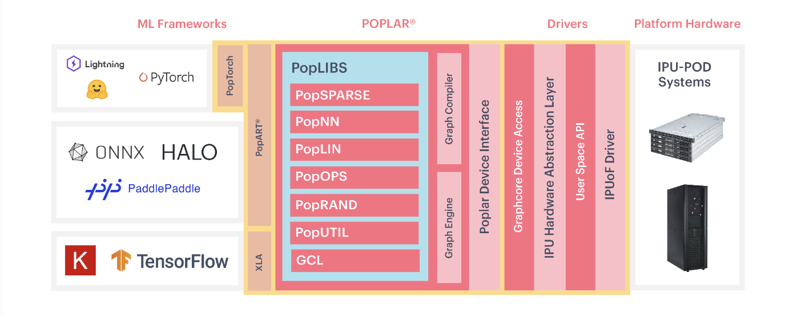

# System Overview
<!---
## Introduction

The Bow-2000™ IPU-Machine™ is a 1U compute platform for AI infrastructure and is scalable for both direct attach and switched Bow™ Pod systems. The Bow-2000 is characterized by the following high-level features:

* 4x Bow IPUs

        1.4 petaFLOPS FP16.16 AI compute
        5,888 processor cores
        35,000 independent parallel threads

* Up to ~260GB of memory comprised of:

        Up to 256GB Streaming Memory™
        3.6GB In-Processor-Memory™

* IPU-Fabric™ for compiled-in networking comprised of:

        IPU-Link™ - 512Gbps for communication within Bow Pods
        GW-Link - 2x 100Gbps Gateway-Links for communication between Bow Pods
        Sync-Link - dedicated hardware signalling for BSP, low jitter on IPU to IPU synchronization
        Host-Link - PCIe Gen4 RoCEv2 NIC/SmartNIC Interface for Bow-2000 to server communication

Graphcore’s Bow-2000 IPU-Machine is designed to support scale-up and scale-out machine intelligence compute. The Bow Pod reference designs, based on the Bow-2000, deliver scalable building blocks for the Bow Pod systems range of products: Bow Pod16 (4 Bow-2000 machines directly attach to a single host server), Bow Pod64 (16 Bow-2000 machines in a switched system with 1-4 host servers).
--->

The Graphcore Bow-Pod64 system is the latest-generation AI accelerator from Graphcore. This is a one-rack system consisting of 64 Bow-class Intelligence Processing Units (IPU) with a custom interconnect. The system provides for an aggregate 22 Petaflops/s of performance in half precision. It has a total of 57.6 GB In-Processor-Memory with a total of 94,208 IPU cores. The system consists of four servers for data-processing. 

For more details refer to the [POD64 spec](https://www.graphcore.ai/products/bow-pod64#product-spec).

/// caption
Figure from [Graphcore Poplar](https://www.graphcore.ai/products/poplar))
///

The Graphcore software stack includes support for TensorFlow and PyTorch using the Poplar SDK. The Poplar® SDK is t is the toolchain specifically designed for creating graph software for ML applications.  It integrates with the traditional ML frameworks like PyTorch and TensorFlow allowing users to port their existing code to the IPU hardware-specific code. The various components of the poplar SDK stack are shown in the figure. It includes the PopTorch framework which is a wrapper over the PyTorch framework optimized to the IPU hardware. It also enlists the different PopLibs libraries supported, which enables to construct graphs, define tensor data and control how the code and data are mapped onto the IPU for execution.
