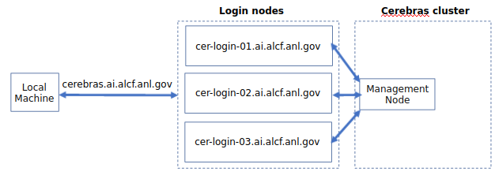

<!---# Connecting to SambaStudio -->
# Getting Started

## Connecting to SambaStudio

Need a browser/cli/api to/from SambaStudio diagram here. Placeholder image.

Connection to the SambaStudio GUI requires an MFA passcode for authentication - either an 8-digit passcode generated by an app on your mobile device (e.g. MobilePASS+) or a CRYPTOCard-generated passcode prefixed by a 4-digit pin. This is the same passcode used to authenticate into other ALCF systems, such as Polaris.

The UI is at ... TODO need url

You will need the web GUI to get the API Authorization Key, if otherwise scripting interactions.  

