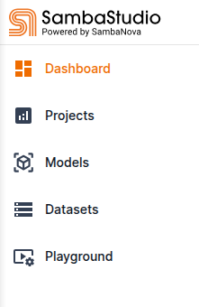

# Running a Model/Program

## Getting Started

### Connecting to SambaStudio
The GUI is accessible at URL HERE.
Placeholder describing cloud instance: Login is via 2FA. Use your ALCF username/password, and an authetication code from the application.

### SambaStudio Object Types
The main abstractions in SambaStudio are projects, models, datasets, and endpoints. Tenants and users control or share resources.

[TODO] diagram here. Either from the GUI, or maybe a UML diagram.


#### Projects
A project is logical grouping of workloads and artifacts within a tenant. It contains endpoints, and batch jobs for training and inference.

#### Models
Models are the ML models available in SambaStudio. Each model has a model card that may be viewed in the GUI. 

#### Datasets

#### Endpoints


### Using endpoints
#### Making an endpoint, and stopping/restarting/deleting it.

Lots of screencaps.

#### GUI

Lots of screencaps.
LLM example using a chat bot endpoint, e.g. LLama

#### CLI

Install the SambaStudio CLI into a python virtual environment.

First, create and activate a virtual environment:
```console
python3 -m venv ~/SambaStudio_cli_venv
source ~/SambaStudio_cli_venv/bin/activate
pip3 install -U pip
```

Next, download the SDK to your workstation


Use CLI - example (llava, perhaps?) 

#### REST API

The three available SambaStudio APIs are described at
[API reference documents](https://docs.sambanova.ai/sambastudio/latest/api-ref-landing.html)

Sample curl command. (DePlot)
How to get curl commands from the GUI, for supported applications.
Curl command templates.

Use jq for output parsing. (install if needed, e.g. on a laptop. Most ANL ai testbed hosts will have it.)

##### Python API

Package installs.
Sample

