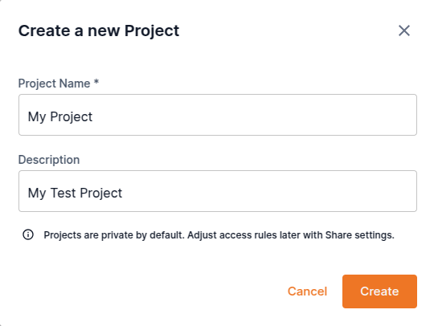
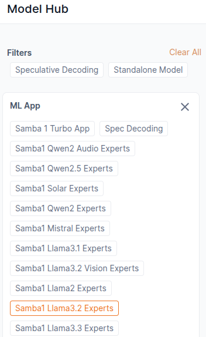
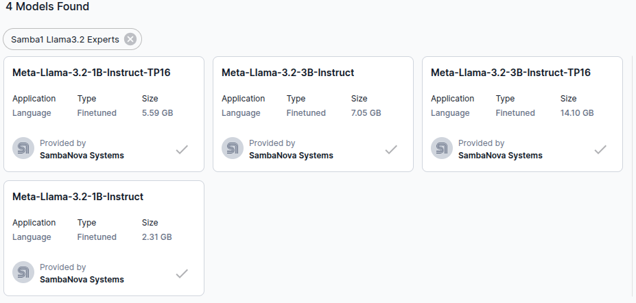
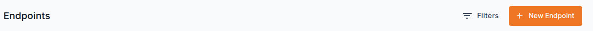
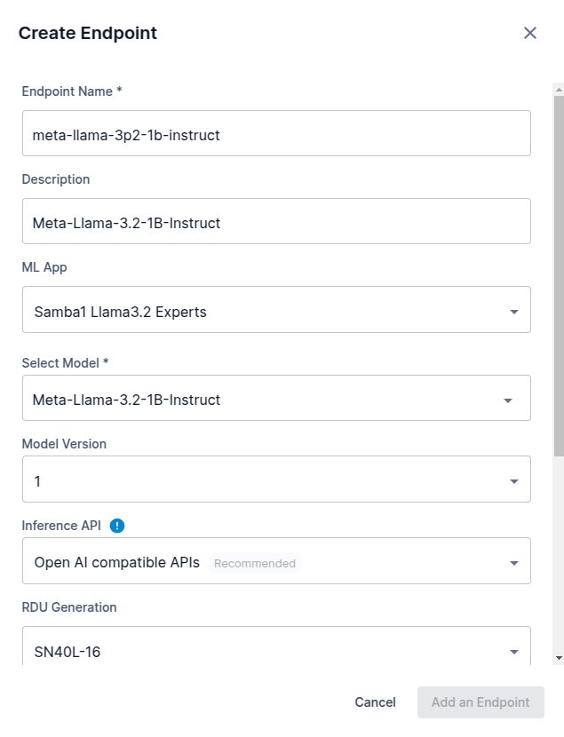
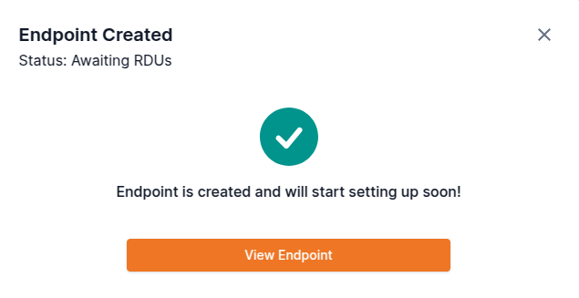
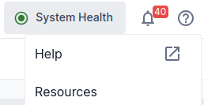
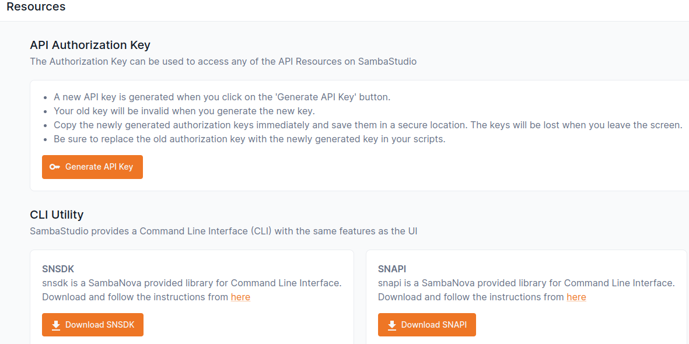

# Using SambaStudio

## Getting Started

### Connecting to SambaStudio
The GUI is accessible at `https://metis.alcf.anl.gov`
Login is via 2FA. Use your ALCF username/password, and an authetication code from the MobilePASS+ application.

After logging in, change the tenant using the botton at the top of the screen, from `default` to `metis`.
You will need to change the current tenant to `metis` after every login. If resources are not showing as expected, check the tenant setting.

### SambaStudio Object Types
The main resource abstractions in SambaStudio are models, datasets, and endpoints. Tenants and users control or share resources. Users [eventually: with greater than viewer privileges] own projects, which contain endpoints and jobs. Jobs have two types: training and batch inference.
[Most users will have viewer-only rights, also allowing interactions with endpoints]


#### Dashboard
The Dashboard displays the endpoints available for use by the logged-in user, and jobs, including completed jobs.

#### Playground
The Playground supports interaction with endpoints. Multiple models can be queried with the same prompt, and the results can be easily compared. 

#### Models
Models are the ML models available in SambaStudio. Each model has a model card that may be viewed in the GUI.

The SambaStudio documentation for models is [Models](https://docs.sambanova.ai/sambastudio/latest/model-hub.html)

#### Endpoints

Endpoints are how SambaStudio exposes models for inference.

The SambaStudio documentation for endpoints is [Create and use endpoints](https://docs.sambanova.ai/sambastudio/latest/endpoints.html)

#### Projects
A project is logical grouping of workloads and artifacts within a tenant. It contains endpoints, and batch jobs for training and inference. Projects are created and owned by users, who are members of one or more tenants. (TODO: Will ALCF expose tenants to users?)

The SambaStudio documentation for projects is [Projects](https://docs.sambanova.ai/sambastudio/latest/projects.html)

#### Datasets

The SambaStudio documentation for datasets is [Datasets](https://docs.sambanova.ai/sambastudio/latest/add-datasets.html)

<!---  Commenting out this in anticipation of a viewer user privilege level
### Creating a project
Projects are easily created (and deleted) with the web GUI.

1. Select the Projects button on the left menu
2. Press the New Project button in the upper right
3. Fill in the Project Name and Description fields
4. Press the Create button



A project can also be created (or deleted) with snapi, if it is installed.
For details: 
```
snapi project create --help
```

If a project is deleted, endpoints and jobs within it will also be deleted.

-->

### Using endpoints
<!--- Commenting out this in anticipation of a viewer user privilege level
#### Making an endpoint, and stopping/restarting/deleting it.

Endpoints are easily created (and deleted) using the web GUI

First, find the model that you want to use as an endpoint.
Select "Models" in the left menu. Then find the model that you want to use.
Check the existing public endpoints to verify that the model is not already made available as an endpoint.
In this example, we filter using the `ML App` selector for `Samba1 Llama3.2 Experts`



The filtered list of models looks like this:



Select a model, for example `Meta-Llama-3.2-1B-Instruct`
The model card for the model will be displayed.
Consider copying the model name for labeling the endpoint
If the model to be used shows "Download" in the upper right corner, not "Available", press the download button and wait for it to complete.


Select your project, or create a new project as describe in a previous section

Scroll down, and click on the `New Endpoint` button.



The `New Endpoint` form will pop up. Fill in the fields. In this example, we leave most fields with the defaults, filling in the `Endpoint Name`, `Description`, `ML App`, `Select Model`



Press the `Add an Endpoint` button.


This message panel will pop up:


Dismiss it, or press the `View Endpoint` button.

Wait until the endpoint has `Live` status (in green). This will take at least several minutes, and more for larger models. 

An endpoint can also be created (or deleted) with snapi, if it is installed.
For details:
```
snapi endpoint create --help
```

Live endpoints are allocated RDUs. 

When not using an endpoint for an extended period, please stop it using the Stop button from the pulldown at the upper right, or the `...` pulldown in the endpoint list, or with snapi as shown below, replacing project name and endpoint name.  The endpoint can be restarted quickly (e.g. a minute or two) when needed.
```
snapi endpoint stop --project=<project name> --endpoint=<endpoint name>
```

TODO currently restarting an endpoint with snapi is kludgy, and uses update and an instance count greater than zero. This may be correctly soon.
--->

#### Playground

Lots of screencaps.

LLM example using a chat bot endpoint, e.g. LLama

Example of comparing two models with a single prompt

#### CLI

Note: if using Windows, follow the instructions at [SambaStudio setup guide: Windows](https://docs.sambanova.ai/sambastudio/latest/cli-setup.html#_user_guide_windows)

Install the SambaStudio CLI into a python virtual environment.
See [SambaStudio CLI setup guide](https://docs.sambanova.ai/sambastudio/latest/cli-setup.html) for more details.
You will need python 3.9 or 3.10 available. If needed, install in the usual way for your operating system. (e.g. `sudo apt install python3.9` in Debian Linuxes). (Note: simple install of a new python version will not override your default python command.)


Note: the CLI can be also be installed in, and used from, your enviroment on a SambaNova login node, which has python 3.9 installed. If you chose to use a login node, access it as follows:
```bash
ssh ALCFUserID@sambanova.alcf.anl.gov
Password: < MobilePASS+ code >
```

First, create and activate a virtual environment. 
```console
# or python3.10
python3.9 -m venv ~/SambaStudio_cli_venv
source ~/SambaStudio_cli_venv/bin/activate
pip3 install -U pip
```

Next, download the SDK to your workstation
From the help dropdown in the upper right of the SambaStudio GUI, select Resources.



This panel will open:

 

If you have not already done so:

1. Click on `Generate API Key`
2. Click on `Generate`
3. Click on the icon to the right of the API key preview to copy it.
4. Save the key in a secure location.

Click on `Download SNSDK` and download it to your selected location.

Click on `Download SNAPI` and download it to your selected location.

Install the packages in the following order. These examples assume download to ~/Downloads and a specific release name. 

```
pip3 install ~/Downloads/snsdk-25.1.1+rc3-py3-none-any.whl
pip3 install ~/Downloads/SambaStudio_API_Client-25.1.1+rc3-py3-none-any.whl 
```

Make a snapi config directory:
```
mkdir ~/.snapi
```

In the `~/.snapi` directory, create a `config.json` with the following contents:
```
{
    "HOST_NAME": "https://metis.alcf.anl.gov/",
    "CONFIG_DIR": "./",
    "DISABLE_SSL_WARNINGS": "false"
}
```

- Create a file named secret.txt under the ~/.snapi directory.
- Paste your API key into `~/.snapi/secret.txt`. 
- Save, and then close it.
- Set permissions to user-only: `chmod 600 ~/.snapi/secret.txt`

Set the default tenant.
```
snapi config set --tenant default
```

Verify installation:
```
snapi version
snapi model list
```

TODO Use CLI - examples.
- Do inference.
- Get model descriptions.
- A few other key tasks. 

#### REST API for inference tasks

The three available SambaStudio APIs for inference tasks are described at
[API reference documents](https://docs.sambanova.ai/sambastudio/latest/api-ref-landing.html)

SambaStudio suggests templating scripts that use curl to access the api.

<!--
```bash
#!/bin/bash

# Set endpoint key and prediction (inference) url
# Edit these for the DePlot instance being used
export ENDPOINT_KEY=0b4d7b17-f319-48eb-a5dd-fa53aad3f4bb
export PREDICT_URL=https://sjc3-e3.sambanova.net/api/predict/generic/d5937c37-8a90-4114-867f-4208ff76b996/e515bdf9-af6a-40f7-9971-b6569f70ebcd

# Convert image of a paper figure to base64
export IMAGE_PATH=./deplot_vs_baselines_chartqa.png
export IMG_BASE64_DATA=$(cat "$IMAGE_PATH" | base64 -w 0)

# Build the request json using a template
echo '{"instances":["'"$IMG_BASE64_DATA"'"], "params":{"max_new_tokens":{"type":"int","value":"512"}}}' > ./input_deplot.json

# Request a prediction, in this case conversion of an image to a table. 
curl -X POST -H 'Content-Type: application/json' -H "key: $ENDPOINT_KEY" --data @./input.json $PREDICT_URL > output_deplot.json

# Get prediction from output, and format it as a table. 
cat output_deplot.json | jq .predictions[0] | sed 's/\\n/\n/g' | sed 's/^"//' | sed 's/"$//' > prediction.md
cat prediction.md
```

Use `bash -x post_deplot.sh` to see details of the constructed curl command.

-->

For supported models, the Playground will give sample code for the snapi tool, for curl, and a sample python script.

<!---
Example of curl command template. 

This sample uses jq for parsing of the output JSON. (Install it if needed, e.g. on a laptop. Most ANL ai testbed hosts will have it.)
--->

##### Python SDK

SambaNova's documentation for the Pyton SDK is at
[SambaStudio Python SDK](https://docs.sambanova.ai/snsdk-api/index.html)

The Playground gives sample python code for supported models for performing an inference query. You will need to set an environment variable for the api key.

Package installs.

Another sample here, crib from SN documentation, with link. 


