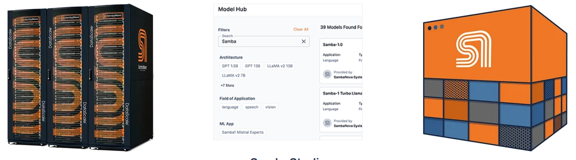

# System Overview

The SambaNova Suite at ALCF comprises:

- A cluster of two SambaNova SN40L-16 nodes. A SN40L-16 node comprises sixteen SN40L RDU sockets and a host. RDUs use a 3-tier memory system, with 8GB SRAM, 1TB HBM, and 24TB DDR.
- SambaStudio, a rich, GUI-based platform that provides the functionality to train, deploy, and manage models.

SambaStudio is a rich, GUI-based platform that provides the functionality to train models, deploy them for inference, and manage them. It is backed by an API, and in addition to the GUI, supports interactions using a CLI. For inference, raw APIs (e.g. with curl) and python scripts are also supported. 

The SambaStudio platform at the ALCF is the front end and management system for the SN40L cluster.

Interactions with SambaStudio are from any machine that has network access to SambaStudio.

See [SambaNova SN40L: Scaling the AI Memory Wall with Dataflow and Composition of Experts](https://arxiv.org/pdf/2405.07518) for more about the SN40L.

<figure markdown>
  { width="700" }
  <figcaption>SambaNova Suite</figcaption>
</figure>
(Figure from [https://sambanova.ai/products/enterprise-ai-platform-sambanova-suite](https://sambanova.ai/products/enterprise-ai-platform-sambanova-suite))
