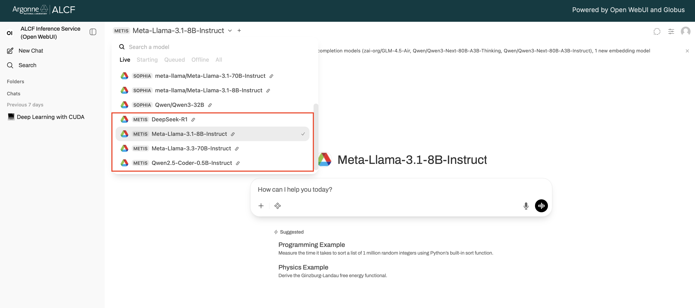

# Accessing the Metis inference endpoint
The Sambanova SN40L cluster (Metis) is integrated as part of the ALCF inference service provided through API access to the models running on the Metis cluster.
The models running on Metis can be accessed in two ways. 

    1. Web UI
    2. API Access
    
## Accessing the endpoints using the Web UI.  

The easiest way to get started is through the web interface, accessible at [https://inference.alcf.anl.gov/](https://inference.alcf.anl.gov/)

The UI is based on the popular Open WebUI platform. After logging in with your ANL or ALCF credentials, you can:

1.  Select a model from the dropdown menu at the top of the screen.
2.  Start a conversation directly in the chat interface.

In the model selection dropdown, you can see the status of each model:



- **Live:** These models are "hot" and ready for immediate use.
- **Starting:** A node has been acquired and the model is being loaded into memory.
- **Queued:** The model is in a queue waiting for resources to become available.
- **Offline:** The model is available but not currently loaded. It will be queued for loading when a user sends a request.
- **All:** Lists all available models regardless of their status.

## Accessing the endpoints using the API. 

For programmatic access, you can use the API endpoints directly.

#### 1. Setup Your Environment

You can run the following setup from any internet connected machine (your local machine, or an ALCF machine).

```bash
# Create a new Conda environment
conda create -n globus_env python==3.11.9 --y
conda activate globus_env

# Install necessary packages
pip install openai globus_sdk
```
Note: A python virtual environment may be used as well.
```bash
virtualenv -p python3.10 globus_env
source globus_env/bin/activate
pip install openai globus_sdk
```

#### 2. Authenticate

To access the endpoints, you need an authentication token.

```bash
# Download the authentication helper script
wget https://raw.githubusercontent.com/argonne-lcf/inference-endpoints/refs/heads/main/inference_auth_token.py

# Authenticate with your Globus account
python inference_auth_token.py authenticate
```

This will generate and store access and refresh tokens in your home directory. To see how much time you have left before your access token expires, type the following command (`units` can be seconds, minutes, or hours):

```bash
python inference_auth_token.py get_time_until_token_expiration --units seconds
```

!!! warning "Token Validity"
    - Access tokens are valid for 48 hours. The `get_access_token` command will automatically refresh your token if it has expired.
    - An internal policy requires re-authentication every 7 days. If you encounter permission errors, logout from Globus at [app.globus.org/logout](https://app.globus.org/logout) and re-run `python inference_auth_token.py authenticate --force`.

#### 3. Make a Test Call

Once authenticated, you can make a test call using cURL or Python.

=== "cURL"

    ```bash
    #!/bin/bash

    # Get your access token
    access_token=$(python inference_auth_token.py get_access_token)

    curl -X POST "https://inference-api.alcf.anl.gov/resource_server/metis/api/v1/chat/completions" \
         -H "Authorization: Bearer ${access_token}" \
         -H "Content-Type: application/json" \
         -d '{
                "model": "Meta-Llama-3.1-8B-Instruct",
                "messages":[{"role": "user", "content": "Explain quantum computing in simple terms."}]
             }'
    ```

=== "Python (OpenAI SDK)"

    ```python
    from openai import OpenAI
    from inference_auth_token import get_access_token

    # Get your access token
    access_token = get_access_token()

    client = OpenAI(
        api_key=access_token,
        base_url="https://inference-api.alcf.anl.gov/resource_server/metis/api/v1"
    )

    response = client.chat.completions.create(
        model="Meta-Llama-3.1-8B-Instruct",
        messages=[{"role": "user", "content": "Explain quantum computing in simple terms."}]
    )

    print(response.choices[0].message.content)
    ```
    

!!! tip "Discovering Available Models"
The endpoint information can be accessed using the [Metis status page](https://metis.alcf.anl.gov/status). It provides the status of the endpoints and the models and the associated configurations.

The list of currently supported chat-completion models on Metis are : 
- gpt-oss-120b-131072
- DeepSeek-R1-0528
  
<!---
- Meta-Llama-3.3-70B-Instruct
- Meta-Llama-3.1-8B-Instruct
-  Qwen2.5-Coder-0.5B-Instruct
-  DeepSeek-R1 --->

You can programmatically query all available models and endpoints:

```bash
    access_token=$(python inference_auth_token.py get_access_token)
    curl -X GET "https://inference-api.alcf.anl.gov/resource_server/list-endpoints" \
         -H "Authorization: Bearer ${access_token}" | jq -C '.clusters.metis'
```
If you need any other models to be provisioned via these endpoints, please reach out to support[at]alcf.anl.gov.

See SambaNova's documentation for additional information to supplement the instructions below: [OpenAI compatible API](https://docs.sambanova.ai/sambastudio/latest/open-ai-api.html).

<!--- ## Generic Code examples 
### Using environment variables for endpoint url, api key, model name
The information files may be sourced to put the necessary values into environment variables. For example:
```console
source [endpoint description file]
# copy the environment variables to what the openai package expects
export MODEL_NAME=<The name of the model you want to use>
export OPENAI_BASE_URL=$BASE_URL
export OPENAI_API_KEY=$SAMBANOVA_API_KEY
```

### Python example
Make a virtual env and activate it, or use an existing virtualenv or conda env. You will need python 3.8 or newer. 
```console
virtualenv openai_venv
# Or specify the python version, e.g.
# virtualenv --system-site-packages -p python3.8 venv_p3.8
source openai_venv/bin/activate
```
Then install the openai package needed for chat completions
```console
pip install openai
```
Write a python script that

- imports the openai package
- makes an openai client
- calls the chat.completions.create method
- extracts what is wanted from the response

Source one of the SN40L endpoint information files to set some environment variables, then copy them to the environment variables expected by the openai python package and the sample scripts below:
```
# source ~/metis_endpoint_<endpoint number>.txt
# e.g. 
source ~/metis_endpoint_1.txt
export OPENAI_BASE_URL=$BASE_URL
export OPENAI_API_KEY=$SAMBANOVA_API_KEY
echo $MODELS
export MODEL_NAME=<a name from above> # e.g. DeepSeek-R1
```

Here is a simple sample python script, that uses environment variables `OPENAI_API_KEY`, `OPENAI_BASE_URL`, and `MODEL_NAME`, and accepts a (quoted) prompt as a command line parameter:
```python
import os
import openai
import sys

client = openai.OpenAI(
    api_key=os.environ.get("OPENAI_API_KEY"),
    base_url=os.environ.get("OPENAI_BASE_URL")
)

modelname = os.environ.get("MODEL_NAME")
query = sys.argv[1]
response = client.chat.completions.create(
    model=modelname,
    messages=[{"role":"user","content":query}],
    temperature =  0.1,
    top_p = 0.1
)

print(response.choices[0].message.content)
```

Pass the script a query as a command line parameter, e.g.
```console
python chat_completion.py "What is an \"extinction vortex\"?"
```

### curl example
Sample curl command. Change the `PROMPT` environment variable as desired.

```bash
# Sample prompt that shows quoting of quote marks
export PROMPT="What are \\\"telescoping generations\\\" in biology?"
export D='{
    "stream": false,
    "model": "'${MODEL_NAME}'",
    "messages": [
        {
            "role": "user",
            "content": '\"${PROMPT}\"'
        }
    ]
    }'
curl -H "Authorization: Bearer ${OPENAI_API_KEY}" \
     -H "Content-Type: application/json" \
     -d "${D}" \
     -X POST ${OPENAI_BASE_URL}/chat/completions
```

If `jq` is installed, it can be used to parse the json output; e.g. add `-s | jq '{response: .choices[0].message.content}` to the command line:
```console
curl -H "Authorization: Bearer ${OPENAI_API_KEY}" \
  -H "Content-Type: application/json" \
  -X POST ${OPENAI_BASE_URL}/chat/completions \
  -d "${D}" \
  -s | jq '{response: .choices[0].message.content}'
```  

Multiple completions can be requested in a single call by passing an array of requests e.g.
```console
export PROMPT1="Why is red red?"
export PROMPT2="Why is green green?"
export D='[
{
    "stream": false,
    "model": "'${MODEL_NAME}'",
    "messages": [
        {
            "role": "user",
            "content": '\"${PROMPT1}\"'
        }
    ]
},
{
    "stream": false,
    "model": "'${MODEL_NAME}'",
    "messages": [
        {
            "role": "user",
            "content": '\"${PROMPT2}\"'           
        }
    ]
}
]'
curl -H "Authorization: Bearer ${OPENAI_API_KEY}" \
     -H "Content-Type: application/json" \
     -d "${D}" \
     -X POST ${OPENAI_BASE_URL}/chat/completions
```
--->
