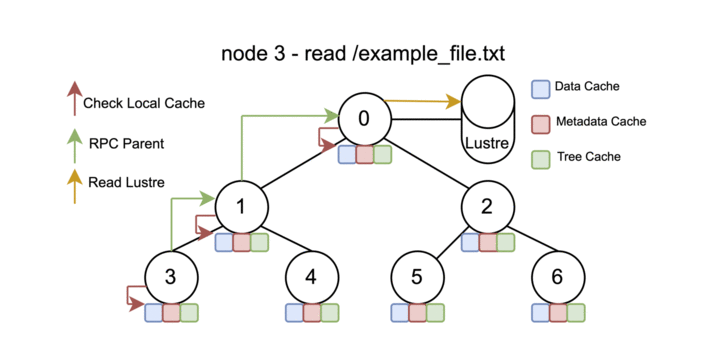

# Copper

Copper is a co-operative caching layer for scalable parallel data movement in Exascale Supercomputers developed at Argonne Leadership Computing Facility.

## Introduction

* Copper is a lightweight library designed to address the I/O bottleneck caused by all compute nodes loading the same files simultaneously.
* To reduce file system contention and improve efficiency, Copper enables a single designated process to load data from the file system and transfer to other ranks through high-speed interconnects.
* This approach significantly reduces redundant file access and improves scalability in distributed training and simulation workloads.
* Copper is a **read-only** cooperative caching layer designed to enable scalable data loading across massive numbers of compute nodes.
* It aims to avoid I/O bottlenecks, network contention, and interference with the storage network, file system, and compute network, thereby allowing more effective use of the compute network for data movement—both for your job and for other jobs running on the system.
* The current intended use of Copper is to improve the performance of Python imports - dynamic shared library loading on Aurora.
* However, Copper can be used to improve the performance of any type of redundant data loading (Note: this is for the case where all the processes are loading the same files) on a supercomputer.
* It is recommended to use Copper for any applications [preferably Python and I/O <500 MB] in order to scale beyond 2k nodes.

      

## How to use Copper on Aurora

In your job script or from an interactive session:

```bash
module load copper
launch_copper.sh
PYTHONPATH=/tmp/${USER}/copper/lus/flare/projects/datascience/kaushik/copper-test/lus_custom_pip_env/:$PYTHONPATH
```

Then run your `mpiexec` as you would normally run.

* If you want your I/O to go through Copper, add `/tmp/${USER}/copper/` to the beginning of your `PYTHONPATH`. Here, only the root compute node will do the I/O directly with the Lustre file system.
* If `/tmp/${USER}/copper/` is not added to the beginning of your paths, then all compute nodes would do I/O directly to the Lustre file system.

## Copper Options

```bash
-l log_level                [Allowed values: 6[no logging], 5[less logging], 4, 3, 2, 1[more logging]] [Default: 6]
-t log_type                 [Allowed values: file or file_and_stdout] [Default: file]
-T trees                    [Allowed values: any number] [Default: 1]
-M max_cacheable_byte_size  [Allowed values: any number in bytes] [Default: 10MB]
-s sleeptime                [Allowed values: Any number] [Default: 20 seconds] Recommended to use 60 seconds for 4k nodes
-b physcpubind              [Allowed values: "CORE NUMBER-CORE NUMBER"] [Default: "48-51"]
```

For example, you can change the default values to:

```bash
launch_copper.sh -l 2 -t stdout_and_file -T 2 -s 40
```

## Examples:

### Example 1: Standard packages

If you are not using any custom packages in your application and you are using only default packages from `module load frameworks`, you do not need copper.

### Example 2: Custom packages

```bash
module load frameworks
# The below line is required only for the first time setup to install a package on a custom directory. This can be done in login node. 
python -m pip install  --target=/lus/flare/projects/datascience/kaushik/copper-test/lus_custom_pip_env/ dragonhpc

module load copper 
launch_copper.sh

time mpirun --np ${NRANKS} --ppn ${RANKS_PER_NODE} --cpu-bind=list:4:56:9:61:14:66:19:71:20:74:25:79 --genvall \
            --genv=PYTHONPATH=/tmp/${USER}/copper/lus/flare/projects/datascience/kaushik/copper-test/lus_custom_pip_env/:$PYTHONPATH \
             python3 -c "import dragon; print(dragon.__file__)"

stop_copper.sh # optional - enabled by default on the PBS epilog during cleanup.
```

### Example 3: Conda environemnts

This example is divided into 2 sections: 1) How to install and create a clean conda environment without any dependency on the `~/home` directory and 2) A sample job script with Copper and conda. 

#### Creating a conda environment

Step 0. Make sure your miniconda is not installed in `~/home`

```bash
mkdir /lus/flare/projects/datascience/kaushik/copper-tests/dharma-test/miniconda-src
wget https://repo.anaconda.com/miniconda/Miniconda3-latest-Linux-x86_64.sh -O /lus/flare/projects/datascience/kaushik/copper-tests/dharma-test/miniconda-src/miniconda.sh
bash miniconda-src/miniconda.sh -b -u -p /lus/flare/projects/datascience/kaushik/copper-tests/dharma-test/miniconda-src
```

Step 1. Create conda environment with `--prefix` option instead of `conda create --name`

```bash
conda create --prefix  /lus/flare/projects/datascience/kaushik/copper-tests/dharma-test/dharma-s-env python=3.9 
```

Step 2. Delete contents of .conda and .local directories under ~/home

```bash
rm -rf ~/.conda/* and ~/.local/*
```

Step 3. update .condarc file to have the right cache-package dirs and env dirs 

```bash
vi ~/.condarc 
channels:
  - conda-forge
envs_dirs:
  - /lus/flare/projects/datascience/kaushik/copper-tests/dharma-test/dharma-s-env
pkgs_dirs:
  - /lus/flare/projects/datascience/kaushik/copper-tests/dharma-test/conda-cache1
  - /lus/flare/projects/datascience/kaushik/copper-tests/dharma-test/conda-cache2
```

Step 4. verify your source `~/.bashrc` does not contain any `~/home` paths 

Step 5. remove anyother hidden or unknown site-packages under `~/home`

Step 6. verify all these below outputs are not pointing to `~/home` after `conda activate`, including the output of the `which python` command

```bash
ls -lah ~/.local
ls -lah ~/.conda
du -sh ~/.local
du -sh ~/.conda
echo $PYTHONUSERBASE $PYTHONPATH $VIRTUAL_ENV $CONDA_PREFIX $CONDA_ROOT $CONDARC
which python
which conda
```

Step 7. Set --target lustre directory on pip install

```bash
python -m pip install  --target=/lus/flare/projects/datascience/kaushik/copper-tests/dharma-test/main-packages torch
```

#### Example job script with copper and conda. 

```bash
module restore
module load copper # Do not load python or frameworks module unless needed
launch_copper.sh 
/lus/flare/projects/datascience/kaushik/copper-tests/dharma-test/miniconda-src/bin/conda init  
conda activate /lus/flare/projects/datascience/kaushik/copper-tests/dharma-test/dharma-s-env  
export PYTHONPATH=/tmp/${USER}/copper//lus/flare/projects/datascience/kaushik/copper-tests/dharma-test/main-packages/:$PYTHONPATH

ls -lah ~/.local
ls -lah ~/.conda
du -sh ~/.local
du -sh ~/.conda
echo $PYTHONUSERBASE $PYTHONPATH $VIRTUAL_ENV $CONDA_PREFIX $CONDA_ROOT $CONDARC
which python
which conda
cat ~/.condarc 
cat ~/.bashrc 


time mpirun --np ${NRANKS} --ppn ${RANKS_PER_NODE} --cpu-bind=list:4:56:9:61:14:66:19:71:20:74:25:79 --genvall \
            --genv=PYTHONPATH=/tmp/${USER}/copper//lus/flare/projects/datascience/kaushik/copper-tests/dharma-test/main-packages/:$PYTHONPATH \
             python3 -c "import torch; import intel_extension_for_pytorch; import oneccl_bindings_for_pytorch;"

```

### Example 4: Python virtual environments

```bash
# The below lines are required only for the first time setup to install a package on a python virtual environments. This can be done in login node. 
module load frameworks
python3 -m venv --system-site-packages copper-test-app-special-pyenv
source /lus/flare/projects/datascience/kaushik/copper-tests/copper-aurora/copper-normal-rpc/copper-test-app-special-pyenv/bin/activate
pip install dragonhpc


# From compute node 
module load frameworks
source /lus/flare/projects/datascience/kaushik/copper-tests/copper-aurora/copper-normal-rpc/copper-test-app-special-pyenv/bin/activate
module load copper 
launch_copper.sh

time mpirun --np ${NRANKS} --ppn ${RANKS_PER_NODE} --cpu-bind=list:4:56:9:61:14:66:19:71:20:74:25:79 --genvall \
            --genv=PYTHONPATH=/tmp/${USER}/copper/lus/flare/projects/datascience/kaushik/copper-tests/copper-aurora/copper-normal-rpc/copper-test-app-special-pyenv/lib64/python3.10/site-packages:$PYTHONPATH \
             python3 -c "import dragon; print(dragon.__file__)"

stop_copper.sh # optional - enabled by default on the PBS epilog during cleanup.
```

### Example 5: Non-Python Example where input files for the application are moved through copper

```bash
# Note thundersvm-train is the app and input_file_M100000_K25000_S0.836 is the input file passed as an argument to the app
# Each individual input file (not the entire input directory) is recommended to be less than 10MB. 
# launch_copper -M max_cacheable_byte_size  [Allowed values: any number in bytes] [Default: 10MB] . Here I/O greater than 10 MB will not moved through copper and all compute nodes will directly access the files from lustre file system.

module load copper 
launch_copper.sh
time mpiexec -np $ranks -ppn 12 --cpu-bind list:4:9:14:19:20:25:56:61:66:71:74:79 --no-vni -genvall \
        /lus/flare/projects/CSC250STDM10_CNDA/kaushik/thunder/svm_mpi/run/aurora/wrapper.sh \
        /lus/flare/projects/CSC250STDM10_CNDA/kaushik/thunder/svm_mpi/build_ws1024/bin/thundersvm-train \
            -s 0 -t 2 -g 1 -c 10 -o 1 /tmp/${USER}/copper/lus/flare/projects/CSC250STDM10_CNDA/kaushik/thunder/svm_mpi/data/sc-40-data/input_file_M100000_K25000_S0.836

stop_copper.sh # optional - enabled by default on the PBS epilog during cleanup.
```

### Example 6: Pytorch datasets and data loaders

```bash
import torch
import torch.nn as nn
import torch.optim as optim
from torch.utils.data import DataLoader
from torchvision import datasets, transforms, models
train_dataset = datasets.ImageFolder(root='/tmp/${USER}/copper/lus/flare/projects/agpt/resnet/dataset/train', transform=transform)
train_loader = DataLoader(train_dataset, batch_size=32, shuffle=True, num_workers=4)
...

```

### Verifying with Strace 

You can use the [strace](https://github.com/strace/strace) tool on Aurora to verify all the paths used in your Python program

```bash
# strace -o trace_output.log python import-test.py 
# which strace
# /usr/bin/strace
# strace -- version 5.14 

> cat import-test.py

import torch
import intel_extension_for_pytorch
import oneccl_bindings_for_pytorch

```

### Best practices

1. The basic principle is to have a clean environment and the entire environment files and binaries under `/lus/project` directory and not under any hidden directories in home.
2. Prepending `/tmp/${USER}/copper`/ to different environment variables should be done in a careful and need basis manner.
3. You should not prepend copper path to all known variables like `PYTHON_PATH, VIRTUAL_ENV, CONDA_PREFIX, CONDA_ROOT, LD_LIBRARY_PATH and PATH`.
4. When using python virutal environment, prepending `/tmp/${USER}/copper/` only to `PYTHONPATH` variable is sufficient.
5. When using a personal conda environment, prepending `/tmp/${USER}/copper/` only to `PYTHONPATH` variable is sufficient.
6. If you prefer the python and pip binary or any other binary under the virtual_env or conda_prefix to be in copper path, only then you should prepend `/tmp/${USER}/copper/..path_to_venv or path_to_conda ..bin/`  to $`PATH` variable.
7. If your application is taking input files as argument, which you prefer to go through copper, you can prepend `/tmp/${USER}/copper/` to the input file path argument only.
8. If there is a specific library say `/lus/flare/projects/agpt/custom_lib/libcustom.so` file that you want to move through copper, you can set `LD_LIBRARY_PATH=/tmp/${USER}/copper/lus/flare/projects/agpt/custom_lib/libcustom.so:$LD_LIBRARY_PATH`. Again prepending copper path to all paths in `LD_LIBRARY_PATH` is not recommended.
9. Copper is read only and cannot be used to write any files. So, you should not use copper path for any output files or temporary files.
10. Copper runs by default on cores `physcpubind="48-51"` which should not be used in your application cpu bind list. You can also change the copper cores by `launch_copper.sh -b "core_range"` .
11. You should be aware and cautious of any other hardcoded paths in your package or your application.
12. The current copper supported filesystem operations are  init, open, read, readdir, readlink, getattr, ioctl, destroy.
13. Note, write, unlink, rename, mkdir, rmdir, symlink, statfs, fsync, flush, mmap and other operations are not supported.
14. System default modules like frameworks, python, intel, mpich whose metadata are baked into the os image do not require copper.
15. Copper works only from the compute nodes, and you need a minimum of 2 nodes up to a max of any number of nodes (Aurora max 10624 nodes).
16. Recommended size for max cacheable byte size is 10MB to 100MB.
17. Recommended trees are 1 or 2.
18. [GitHub Copper Examples](https://github.com/argonne-lcf/copper/tree/main/example)
