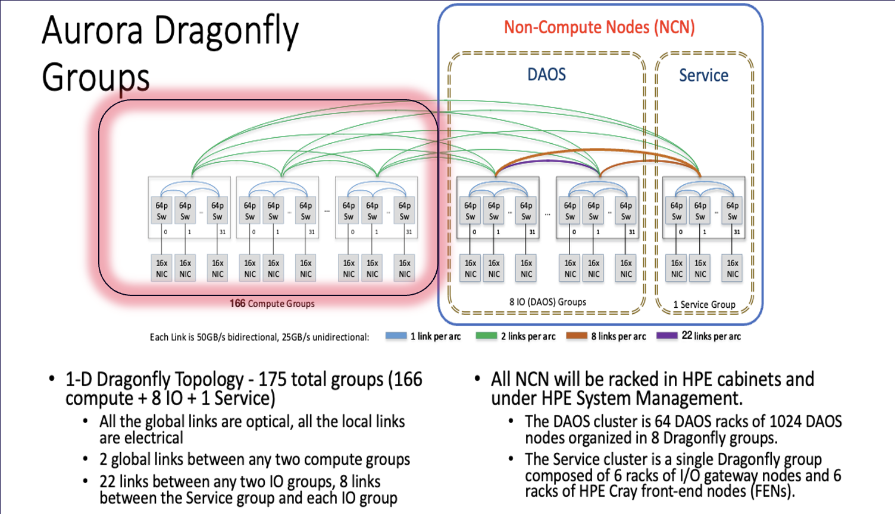
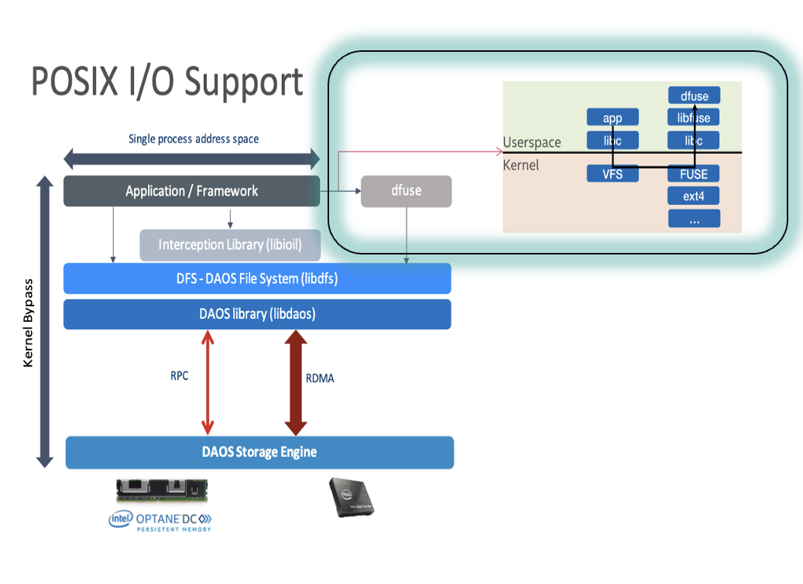

# DAOS Architecture

DAOS is a major file system in Aurora with 230 PB delivering up to >30 TB/s with 1024 DAOS server storage Nodes. DAOS is an open-source software-defined object store designed for massively distributed Non-Volatile Memory (NVM) and NVMe SSD. DAOS presents a unified storage model with a native Key-array Value storage interface supporting POSIX, MPIO, DFS and HDF5. Users can use DAOS for their I/O and checkpointing on Aurora. DAOS is fully integrated with the wider Aurora compute fabric as can be seen in the overall storage architecture below.



## DAOS Overview

The first step in using DAOS is to get DAOS POOL space allocated for your project.
Users should submit a request as noted below to have a DAOS pool created for your project.

## DAOS Pool Allocation

DAOS pool is a physically allocated dedicated storage space for your project.

Email [support@alcf.anl.gov](mailto:support@alcf.anl.gov) to request a DAOS pool with the following information:

- Project Name
- ALCF User Names
- Total Space requested (typically 100 TBs++)
- Justification
- Preferred pool name

### Note

This is an initial test DAOS configuration and as such, any data on the DAOS system will eventually be deleted when the configuration is changed into a larger system. Warning will be given before the system is wiped to allow time for users to move any important data off.

## Modules

Please load the `daos` module when using DAOS. This should be done on the login node (UAN) or in the compute node (jobscript):

```bash linenums="1"
module use /soft/modulefiles
module load daos/base
```

## Pool

A pool is a dedicated space allocated to your project. Once your pool has been allocated for your project space, confirm that you are able to query the pool:

```bash linenums="1"
daos pool query <pool_name>
```

```output title="Example output:"
daos pool query hacc
Pool 050b20a3-3fcc-499b-a6cf-07d4b80b04fd, ntarget=4096, disabled=0, leader=2, version=131
Pool space info:
- Target(VOS) count:640
- Storage tier 0 (SCM):
Total size: 6.0 TB
  Free: 4.4 TB, min:6.5 GB, max:7.0 GB, mean:6.9 GB
- Storage tier 1 (NVMe):
  Total size: 200 TB
  Free: 194 TB, min:244 GB, max:308 GB, mean:303 GB
Rebuild done, 4 objs, 0 recs
```

The size of your current daos cluster can be found using ntarget=4096/ 32 targets per node = daos cluster size or daos server size = 128 daos servers

## POSIX Containers

In DAOS general terms, a container is a logical space within a pool where data and metadata are stored. It's essentially a self-contained object namespace and versioning space.  There are several types of containers, but all of the focus in this guide and all future references will be on utilizing containers of the POSIX type in the context of the DAOS File System (DFS). DFS is essentially a POSIX emulation layer on top of DAOS and is implemented in the libdfs library, allowing a DAOS container to be accessed as a hierarchical POSIX namespace. libdfs supports files, directories, and symbolic links, but not hard links.  The DAOS official documentation on DFS can be found [here](https://docs.daos.io/v2.6/user/filesystem).

With more than 1024 servers at full deployment, the user-accessible cluster named `daos_user` has 16,384 solid state drives (SSDs) and 16,384 persistent memory modules, and without some amount of data redundancy a hardware failure on any one could result in the loss of your data.  DAOS has several data redundancy options available, and a tradeoff must be made between data resiliency, performance, and volume.  The recommended tradeoff is to specify a redundancy factor of 2 on the container for both files and directories via the `rd_fac:2` container property.  By default, this means files will utilize an erasure coding algorithm with a ratio of 16 data blocks to 2 parity blocks (in DAOS file object class terms `EC_16P2GX`), which in simplest terms, means 18 blocks of erasure coding stores 16 blocks of data. For directories, the default is to create 2 full duplicates of the directory, which is basically an emulation of an inode in traditional file system terms, by setting the directory object class to `RP_3G1`. For this default setting, there is little performance tradeoff for directories at this redundancy level, since it just contains metadata.

In the scenario with the above settings, when a server failure occurs, be it a software or hardware failure (e.g. an SSD, persistent memory module, or a networking switch failure) on up to 2 servers, a process called a _rebuild_ occurs. During rebuild, the data on the failed servers is reconstructed to preserve data integrity, and the servers with the failures are excluded from the cluster. The servers or network can be repaired in the future so that the servers are eventually reintegrated to the cluster.  The rebuild process in this scenario does not disrupt service, and the cluster does not experience any outage.  If more than 2 servers are lost (say, due to a network issue) or more servers are lost during the rebuild, then the cluster will be taken offline to conduct repairs.

These parameters are set at container creation as follows along with others which will be described below for best practices:
```bash linenums="1"
daos container create --type=POSIX  --chunk-size=2097152  --properties=rd_fac:2,ec_cell_sz:131072,cksum:crc32,srv_cksum:on <pool name> <container name>
```

The chunk-size of 2 MB and the `ec_cell_sz` (erasure coding cell size) of 128 KB work together to optimally stripe the data across the 16 data servers plus 2 parity servers (18 erasure coding servers) and set the maximum amount of data written to one SSD on one server by one client per transaction to the `ec_cell_sz` of 128 KB. The general rule of thumb is the chunk-size should equal the number of data servers (excluding parity servers) multiplied by the `ec_cell_sz` or at least be an even multiple of it.  If your application does large amounts of IO per process, you could experiment with the settings by increasing them proportionately, e.g. setting the chunk-size to 16 MB and the `ec_cell_sz` to 1 MB.  DAOS containers have a property for both server and client checksum, whereby the client will retry the data transfer to or from the server in the case of corruption, however by default this is disabled, to enable it for best performance and acceptable accuracy usage of the CRC-32 algorithm is recommended with the above parameters `cksum:crc32,srv_cksum:on`.

Now, the `GX` in `EC_16P2GX` tells the container to stripe the data across all servers in the pool, which is optimum if your application is writing a single shared file, but instead if your application is writing many files, say file per process, for best performance you should change the `GX` to `G32`, the 32 being the hard-coded number of servers the data in the file will be striped across.  You can do this in one of two ways:

1. Use the `--file-oclass` parameter explicitly in the container creation. The call would look like:
```bash
daos container create --type=POSIX  --chunk-size=2097152 --file-oclass=EC_16P2G32  --properties=rd_fac:2,ec_cell_sz:131072,cksum:crc32,srv_cksum:on <pool name> <container name>
```
2. Create a subdirectory in the container and set the attribute on it. For example, if your container was created with `EC_16P2GX` and you wanted a subdirectory `<dir name>` to have `EC_16P2G32`, mount the container (this is described in the 'Mount a POSIX container' section below) with directory `<dir name>` at `/tmp/<pool name>/<container name>` and then:
```bash
daos fs set-attr --path=/tmp/<pool name>/<container name>/<dir name> --oclass=EC_16P2G32
```
By default any top-level directory created in a container will inherit the directory and file object class from the container, and any subdirectory inherits from its parent, so in this fashion you can change the default and have a mix of file object classes in the same container.

There is maintenance overhead with containers, therefore it is advisable to create just one or a few containers and create multiple directories in the few containers to partition your work.


## DAOS sanity checks (is daos_user cluster up or down?)

If any of the following command results in an error, then you can confirm DAOS is currently down

```bash linenums="1"
Note qsub ... -l filesystems=flare:daos_user 

module use /soft/modulefiles
module load daos/base
env | grep DRPC
ps –ef | grep daos
clush --hostfile ${PBS_NODEFILE} ps –ef | grep agent | grep -v grep'  | dshbak -c
export DAOS_POOL=Your_allocated_pool_name
export DAOS_CONTAINER=any_label_name
daos container create --type=POSIX  --chunk-size=2097152  --properties=rd_fac:2,ec_cell_sz:131072,cksum:crc32,srv_cksum:on ${DAOS_POOL} ${DAOS_CONTAINER}
daos pool query ${DAOS_POOL}
daos cont list ${DAOS_POOL}
daos container get-prop  $DAOS_POOL  $DAOS_CONTAINER

```

- Look for messages like `Rebuild busy and state degraded in the daos pool query.`
- Look for messages like `Health (status) : UNCLEAN in the get prop` . If found use this command `daos container set-prop <DAOS_POOL> <DAOS_CONTAINER> status:HEALTHY` to set it back to healthy.
- 'Out of group or member list' error is an exception and can be safely ignored. This error message will be fixed in the next DAOS release.

You can also use the following commands for further diagnosis.

```bash
daos pool      autotest  $DAOS_POOL
daos container check --pool=$DAOS_POOL --cont=$DAOS_CONTAINER
```

There are example programs and job scripts provided under `/soft/daos/examples/`.

## Mount a POSIX container

Currently, you must manually mount your container prior to use on any node you are working on.
In the future, we hope to automate some of this via additional `qsub` options.

#### 1. To mount a POSIX container on a login node

```bash linenums="1"
mkdir -p /tmp/${USER}/${DAOS_POOL}/${DAOS_CONT}
start-dfuse.sh -m /tmp/${USER}/${DAOS_POOL}/${DAOS_CONT} --pool ${DAOS_POOL} --cont ${DAOS_CONT} # To mount
mount | grep dfuse # To confirm if its mounted

# Mode 1
ls /tmp/${USER}/${DAOS_POOL}/${DAOS_CONT}
cd /tmp/${USER}/${DAOS_POOL}/${DAOS_CONT}
cp ~/temp.txt ~ /tmp/${USER}/${DAOS_POOL}/${DAOS_CONT}/
cat /tmp/${USER}/${DAOS_POOL}/${DAOS_CONT}/temp.txt

fusermount3 -u /tmp/${USER}/${DAOS_POOL}/${DAOS_CONT} # To unmount
```

#### 2. To mount a POSIX container on Compute Nodes

You need to mount the container on all compute nodes.

```bash linenums="1"
launch-dfuse.sh ${DAOS_POOL}:${DAOS_CONT} # launched using pdsh on all compute nodes mounted at: /tmp/<pool>/<container>
mount | grep dfuse # To confirm if its mounted

ls /tmp/${DAOS_POOL}/${DAOS_CONT}/

clean-dfuse.sh  ${DAOS_POOL}:${DAOS_CONT} # To unmount on all nodes
```

DAOS Data mover instruction is provided at [here](../moving_data_to_aurora/daos_datamover.md).

To optimize performance, you may need to copy the contents of `launch-dfuse.sh`, add `-o multi-user`, enable caching, and then use the updated file to mount the container.

## Job Submission

The `-l filesystems=daos_user` switch will ensure that DAOS is accessible on the compute nodes.

Job submission without requesting DAOS:

```bash
# replace `./pbs_script1.sh` with `-I` for an interactive job
qsub -l select=1 -l walltime=01:00:00 -A <ProjectName> -k doe -l filesystems=flare -q debug ./pbs_script1.sh
```

Job submission with DAOS:

```bash
qsub -l select=1 -l walltime=01:00:00 -A <ProjectName> -k doe -l filesystems=flare:daos_user -q debug ./pbs_script1.sh
```

## NIC and Core Binding

Each Aurora compute node has 8 NICs and each DAOS server node has 2 NICs. Each NIC is capable of driving 20-25 GB/s unidirectional for data transfer. Every read and write goes over the NIC and hence NIC binding is the key to achieve good performance.

For 12 PPN, the following binding is recommended:

```bash
CPU_BINDING1=list:4:9:14:19:20:25:56:61:66:71:74:79
```

|               NIC 0               |               NIC 1               |               NIC 2               |               NIC 3               |               NIC 4               |               NIC 5               |               NIC 6               |               NIC 7               |
| :-------------------------------: | :-------------------------------: | :-------------------------------: | :-------------------------------: | :-------------------------------: | :-------------------------------: | :-------------------------------: | :-------------------------------: |
|                 0                 |                 1                 |                 2                 |                 3                 |                52                 |                53                 |                54                 |                55                 |
| <span style="color:red">4</span>  |                 5                 |                 6                 |                 7                 | <span style="color:red">56</span> |                57                 |                58                 |                59                 |
|                 8                 | <span style="color:red">9</span>  |                10                 |                11                 |                60                 | <span style="color:red">61</span> |                62                 |                63                 |
|                12                 |                13                 | <span style="color:red">14</span> |                15                 |                64                 |                65                 | <span style="color:red">66</span> |                67                 |
|                16                 |                17                 |                18                 | <span style="color:red">19</span> |                68                 |                69                 |                70                 | <span style="color:red">71</span> |
| <span style="color:red">20</span> |                21                 |                22                 |                23                 |                72                 |                73                 | <span style="color:red">74</span> |                75                 |
|                24                 | <span style="color:red">25</span> |                26                 |                27                 |                76                 |                77                 |                78                 | <span style="color:red">79</span> |
|                28                 |                29                 |                30                 |                31                 |                80                 |                81                 |                82                 |                83                 |
|                32                 |                33                 |                34                 |                35                 |                84                 |                85                 |                86                 |                87                 |
|                36                 |                37                 |                38                 |                39                 |                88                 |                89                 |                90                 |                91                 |
|                40                 |                41                 |                42                 |                43                 |                92                 |                93                 |                94                 |                95                 |
|                44                 |                45                 |                46                 |                47                 |                96                 |                97                 |                98                 |                99                 |
|                48                 |                49                 |                50                 |                51                 |                100                |                101                |                102                |                103                |

: Sample NIC to Core binding

## Interception library for POSIX containers

The interception library (IL) is a next step in improving DAOS performance. This provides kernel-bypass for I/O data, leading to improved performance. The `libioil` IL will intercept basic read and write POSIX calls while all metadata calls still go through dFuse. The `libpil4dfs` IL should be used for both data and metadata calls to go through dFuse.

The IL can provide a large performance improvement for bulk I/O as it bypasses the kernel and commuNICates with DAOS directly in userspace. It will also take advantage of the multiple NICs on the node based on how many MPI processes are running on the node and which CPU socket they are on.



```bash linenums="1" title="Interception library for POSIX mode"
mpiexec                                            # no interception
mpiexec --env LD_PRELOAD=/usr/lib64/libioil.so     # only data is intercepted
mpiexec --env LD_PRELOAD=/usr/lib64/libpil4dfs.so  # preferred - both metadata and data is intercepted. This provides close to DFS mode performance.
```

## Sample job script

Currently, `--no-vni` is required in the `mpiexec` command to use DAOS.

```bash linenums="1"
#!/bin/bash -x
#PBS -l select=512
#PBS -l walltime=01:00:00
#PBS -A <ProjectName>
#PBS -q prod
#PBS -k doe
#PBS -l filesystems=flare:daos_user

# qsub -l select=512:ncpus=208 -l walltime=01:00:00 -A <ProjectName> -l filesystems=flare:daos_user -q prod ./pbs_script.sh or - I

# please do not miss -l filesystems=daos_user and in your qsub :'(

export TZ='/usr/share/zoneinfo/US/Central'
date
module use /soft/modulefiles
module load daos
env | grep DRPC                                     #optional
ps -ef|grep daos                                    #optional
clush --hostfile ${PBS_NODEFILE}  'ps -ef|grep agent|grep -v grep'  | dshbak -c  #optional
DAOS_POOL=datascience
DAOS_CONT=thundersvm_exp1
daos pool query ${DAOS_POOL}                        #optional
daos cont list ${DAOS_POOL}                         #optional
daos container destroy   ${DAOS_POOL}  ${DAOS_CONT} #optional
daos container create --type POSIX ${DAOS_POOL}  ${DAOS_CONT} --properties rd_fac:1
daos container query     ${DAOS_POOL}  ${DAOS_CONT} #optional
daos container get-prop  ${DAOS_POOL}  ${DAOS_CONT} #optional
daos container list      ${DAOS_POOL}               #optional
launch-dfuse.sh ${DAOS_POOL}:${DAOS_CONT}           # To mount on a compute node

# mkdir -p /tmp/${USER}/${DAOS_POOL}/${DAOS_CONT}           # To mount on a login node
# start-dfuse.sh -m /tmp/${USER}/${DAOS_POOL}/${DAOS_CONT}     --pool ${DAOS_POOL} --cont ${DAOS_CONT}  # To mount on a login node

mount|grep dfuse                                    #optional
ls /tmp/${USER}/${DAOS_POOL}/${DAOS_CONT}         #optional for login node
ls /tmp/${DAOS_POOL}/${DAOS_CONT}                   #optional for compute node

# cp /lus/flare/projects/CSC250STDM10_CNDA/kaushik/thundersvm/input_data/real-sim_M100000_K25000_S0.836 /tmp/${DAOS_POOL}/${DAOS_CONT} #one time
# daos filesystem copy --src /lus/flare/projects/CSC250STDM10_CNDA/kaushik/thundersvm/input_data/real-sim_M100000_K25000_S0.836 --dst daos://tmp/${DAOS_POOL}/${DAOS_CONT}  # check https://docs.daos.io/v2.4/testing/datamover/


cd $PBS_O_WORKDIR
echo Jobid: $PBS_JOBID
echo Running on nodes `cat $PBS_NODEFILE`
NNODES=`wc -l < $PBS_NODEFILE`
RANKS_PER_NODE=12          # Number of MPI ranks per node
NRANKS=$(( NNODES * RANKS_PER_NODE ))
echo "NUM_OF_NODES=${NNODES}  TOTAL_NUM_RANKS=${NRANKS}  RANKS_PER_NODE=${RANKS_PER_NODE}"
CPU_BINDING1=list:4:9:14:19:20:25:56:61:66:71:74:79

export THUN_WS_PROB_SIZE=1024
export ZE_FLAT_DEVICE_HIERARCHY=COMPOSITE
export AFFINITY_ORDERING=compact
export RANKS_PER_TILE=1
export PLATFORM_NUM_GPU=6
export PLATFORM_NUM_GPU_TILES=2


date
LD_PRELOAD=/usr/lib64/libpil4dfs.so mpiexec -np ${NRANKS} -ppn ${RANKS_PER_NODE} --cpu-bind ${CPU_BINDING1}  \
                                            --no-vni -genvall  thunder/svm_mpi/run/aurora/wrapper.sh thunder/svm_mpi/build_ws1024/bin/thundersvm-train \
                                            -s 0 -t 2 -g 1 -c 10 -o 1  /tmp/datascience/thunder_1/real-sim_M100000_K25000_S0.836
date

clean-dfuse.sh ${DAOS_POOL}:${DAOS_CONT} #to unmount on compute node
# fusermount3 -u /tmp/${USER}/${DAOS_POOL}/${DAOS_CONT} #to unmount on login node

```

## MPI-IO Container Access

The MPICH MPI-IO layer on Aurora (ROMIO) provides multiple I/O backends including one for DAOS. ROMIO can be used with dFuse and the interception library utilizing the UFS backend, but the DAOS backend will provide optimal performance. By default ROMIO will auto-detect DFS and use the DAOS backend.   MPI-IO itself is a common backend for many I/O libraries, including HDF5 and PNetCDF.  Whether using collective I/O MPI-IO calls directly or indirectly via an I/O library, a  process called collective buffering can be done where data from small non-contiguous chunks across many compute nodes in the collective is aggregated into larger contiguous buffers on a few compute nodes, referred to as aggregators, from which DFS API calls are made to write to or read from DAOS.  Collective buffering can improve or degrade I/O performance depending on the I/O pattern, and in the case of DAOS, disabling it can lead to I/O failures in some cases, where the I/O traffic directly from all the compute nodes in the collective to DAOS is too stressful in the form of extreme numbers of small non-contiguous data reads and writes.  In ROMIO there are hints that should be set to either optimally enable or disable collective buffering.  At this time you should explicitly enable collective buffering in the most optimal fashion, as disabling it or allowing it to default to disabled could result in I/O failures.  To optimally enable collective buffering, create a file with the following contents:
```bash linenums="1"
romio_cb_write enable
romio_cb_read enable
cb_buffer_size 16777216
cb_config_list *:8
striping_unit 2097152
```

Then simply set the following environment variable at run time to point to it:
```bash linenums="1"
export ROMIO_HINTS=<path to hints file>
```

If you want to verify the settings, additionally set:
```bash linenums="1"
export ROMIO_PRINT_HINTS=1
```

Which will print out all the ROMIO hints at run time.

## DFS Container Access

DFS is the user level API for DAOS. This API is very similar to POSIX but still has many differences that would require code changes to utilize DFS directly. The DFS API can provide the best overall performance for any scenario other than workloads which benefit from caching.

```c linenums="1" title="Reference code for using DAOS through DFS mode and DAOS APIs"
#include <stdio.h>
#include <stdlib.h>
#include <mpi.h>
#include <daos.h>
#include <daos_fs.h>
int main(int argc, char **argv)
{
    dfs_t *dfs;
    d_iov_t global;
    ret = MPI_Init(&argc, &argv);
    ret = MPI_Comm_rank(MPI_COMM_WORLD, &rank);
    ret = dfs_init();
    ret = dfs_connect(getenv("DAOS_POOL"), NULL, getenv("DAOS_CONT"), O_RDWR, NULL, &dfs);
    ret = dfs_open(dfs, NULL, filename, S_IFREG|S_IRUSR|S_IWUSR,  O_CREAT|O_WRONLY,  obj_class, chunk_size, NULL, &obj);
    ret = dfs_write(dfs, obj, &sgl, off, NULL);
    ret = dfs_read(dfs, obj, &sgl, off, &read, NULL);
    ret = dfs_disconnect(dfs);
    ret = daos_fini();
    ret = MPI_Finalize();
}
```

The full code is available on the Aurora filesystem within `/soft/daos/examples/src/`

## Pydaos.daos_torch Example

```bash linenums="1"
qsub ... -l filesystem:flare,daos_perf 

module use /soft/modulefiles
module load daos_perf
module load frameworks
launch-dfuse_perf.sh ${DAOS_POOL}:${DAOS_CONT}

export LD_LIBRARY_PATH=/lus/flare/projects/datasets/softwares/py_daos/daos_client_master_build_may2/lib64:$LD_LIBRARY_PATH
export PYTHONPATH     =/lus/flare/projects/datasets/softwares/py_daos/just_pydaos_new/:$PYTHONPATH

## Python program

import torch as sys_torch
from pydaos.daos_torch import Dataset as DaosDataset
from pydaos.daos_torch import Checkpoint as DaosCheckpoint
from io import BytesIO
from mpi4py import MPI

comm = MPI.COMM_WORLD
pydaos_torch_ckpt = DaosCheckpoint("datascience", "my_container", "") #To connect to DFS container
a    = sys_torch.ones(1048576)
data = dict()
data = { "a": a, }
name = f"/data-{comm.rank}-of-{comm.size}.pt"

# PyDAOS Torch dataloader example
def transform(data):
     return np.load(BytesIO(data), allow_pickle=True)['x']
ds = DaosDataset(pool="datascience", cont="my-dataset", transform_fn=transform)

# PyDAOS Torch checkpoint save example
with pydaos_torch_ckpt.writer(name) as f:
    sys_torch.save(data, f)
print(f"Torch save completed")

# PyDAOS Torch checkpoint load example
stream = pydaos_torch_ckpt.reader(name)
loaded_data = sys_torch.load(stream, weights_only=True)  
print(f"Torch load completed")
```

* Pydaos uses dfs_write/read which is faster than posix dfuse_write/read.
* Pydaos uses dfs containers and python daos containers.
* The path to the dataset folders inside these containers does not include /tmp and just starts from /dataset_dir1 which assumes a folder inside the DAOS_POOL and DAOS_CONT
* The above build path might be upgraded with newer builds
* More examples can be found at : https://github.com/daos-stack/daos/tree/master/src/client/pydaos/torch

## DAOS Hardware

Each DAOS server node is based on the Intel Coyote Pass platform:

- (2) Xeon 5320 CPU (Ice Lake)
- (16) 32GB DDR4 DIMMs
- (16) 512GB Intel Optane Persistent Memory 200
- (16) 15.3TB Samsung PM1733 NVMe
- (2) HPE Slingshot NIC


## Darshan profiler for DAOS

Darshan is a lightweight I/O profiling tool consisting of a shared library your application preloads at runtime which generates a binary log file at program termination, and a suite of utilities to analyze this file.  Full official documentation can be found [here](https://www.mcs.anl.gov/research/projects/darshan/documentation/).

### 1. Darshan

On Aurora, Darshan has been built in the programming environment in `/soft`.

To get the Darshan utilities loaded into your programming environment, execute the following:

```bash linenums="1"
module use /soft/perftools/darshan/darshan-3.4.7/share/craype-2.x/modulefiles
module load darshan
```

However it has not yet been fully modularized so the shared library must be manually preloaded at run time via `LD_PRELOAD`, along with PNetCDF and HDF5 shared libraries since support for those I/O libraries is included, and all 3 must precede any DAOS interception library, so the specification would be:

```bash linenums="1"
LD_PRELOAD=/soft/perftools/darshan/darshan-3.4.7/lib/libdarshan.so:/opt/aurora/24.347.0/spack/unified/0.9.2/install/linux-sles15-x86_64/oneapi-2025.0.5/hdf5-1.14.5-zrlo32i/lib/libhdf5.so:/opt/aurora/24.347.0/spack/unified/0.9.2/install/linux-sles15-x86_64/oneapi-2025.0.5/parallel-netcdf-1.12.3-cszcp66/lib/libpnetcdf.so:/usr/lib64/libpil4dfs.so
```

If your application is using `gpu_tile_compact.sh` then this whole `LD_PRELOAD` will go in your personal copy of the Bash script via the `export` builtin command.

Run your application normally as you would do with mpiexec/ mpirun.

This generates a binary log file which has two additional modules: DFS for the DAOS file system API layer, and DAOS for the underlying object store.

By default, the binary log file is stored here:

```bash linenums="1"
/lus/flare/logs/darshan/aurora/YYYY/M/D
```

where the last 3 directories are the date the file is generated, with your user ID, job ID and timestamp in the file name.  Alternatively, at run time you can specify the file name to be saved with a specified name in a different location with the following environment variable:

```bash
export DARSHAN_LOGFILE=<full path to binary file name>
```

### 2. Darshan-util

`module load darshan-util` is needed for darshan-parser and pydarshan

`LD_PRELOAD=/soft/perftools/darshan/darshan-3.4.7/lib/libdarshan-util.so:$LD_PRELOAD`

### 3. Darshan-Parser

Darshan parser can be used on the binany log file to get a text output of all the metrics as follows:

```bash linenums="1"
/soft/perftools/darshan/darshan-3.4.7/bin/darshan-parser /lus/flare/logs/darshan/aurora/2025/5/21/myfile.darshan > out.txt. 
```

### 4. PyDarshan

For generating a graphical summary report, it is recommended to use the PyDarshan module on Aurora. It is a simple process of creating and activating a Python environment, installing the Darshan package, and then running the summary report generation command:

For custom build

```bash linenums="1"
module load python
mkdir <pyton env dir>
python -m venv <pyton env dir>
cd <pyton env dir>
source bin/activate
pip install darshan
python -m darshan summary <binary log file>
```

For system build

```bash linenums="1"
module load python
. /soft/daos/pydarshan_plots_venv/bin/activate 
pip show darshan

#The above 3 lines should be replaced by module load pydarshan soon
```

```bash linenums="1"
python -m darshan summary /lus/flare/logs/darshan/aurora/2025/5/21/my.darshan

```

should generate the .html darshan report

## Cluster Size

DAOS cluster size is the number of available DAOS servers. While we are working towards bringing up the entire 1024 DAOS server available users, currently different number of DAOS nodes could be up. Please check with support or run an IOR test to get an estimate on the current number of DAOS servers available. The bandwidth listed here in the last column is a theoretical peak bandwidth.

**Expected Bandwidth** Expected number of DAOS servers and its approximate expected bandwidth

| Nodes | Percentage | Throughput |
| :---: | :--------: | :--------: |
|  20  |     2%     |   1 TB/s   |
|  128  |   12.50%   |   5 TB/s   |
|  600  |    60%    |  10 TB/s  |
|  800  |    78%    |  20 TB/s  |
| 1024 |    100%    |  30 TB/s  |

The size of your current daos cluster can be found using ntarget=4096/ 32 targets per node = daos cluster size or daos server size = 128 daos servers from

```bash linenums="1"
daos pool query <pool_name>
```

## Known issues and workarounds

### 1. Large bulk I/O write issue

There is a known issue python with pil4dfs- Fix provided in DAOS-17499 - Current workaround set D_IL_COMPATIBLE=1. You can skip pil4dfs for now if that happens.

``python: can't open file '/home/jlo/dfuse/./app.py': [Errno 95] Operation not supported``

### 2. Pydaos.daos_torch disconnect and clean up

There is a dfs disconnect clean up issue. This should be fixed in the next release.

### 3. Libfabric endpoint creation error

Occasionally at a high number of nodes and/or high PPN the following error that looks like this may show up in your stderr log:

```output
04/02-11:03:16.60 x4319c0s0b0n0 DAOS[53174/53174/0] external ERR  # [1092097.708457] mercury->ctx [error] /builddir/build/BUILD/mercury-2.4.0/src/na/na_ofi.c:5400 na_ofi_eq_open() fi_cq_open failed, rc: -17 (File exists)
04/02-11:03:16.61 x4319c0s0b0n0 DAOS[53174/53174/0] external ERR  # [1092097.722714] mercury->cls [error] /builddir/build/BUILD/mercury-2.4.0/src/na/na_ofi.c:5191 na_ofi_basic_ep_open() Could not open event queues
04/02-11:03:16.61 x4319c0s0b0n0 DAOS[53174/53174/0] external ERR  # [1092097.722737] mercury->cls [error] /builddir/build/BUILD/mercury-2.4.0/src/na/na_ofi.c:5158 na_ofi_endpoint_open() na_ofi_basic_ep_open() failed
04/02-11:03:16.61 x4319c0s0b0n0 DAOS[53174/53174/0] external ERR  # [1092097.722743] mercury->cls [error] /builddir/build/BUILD/mercury-2.4.0/src/na/na_ofi.c:7712 na_ofi_initialize() Could not create endpoint
04/02-11:03:16.61 x4319c0s0b0n0 DAOS[53174/53174/0] external ERR  # [1092097.722976] mercury->cls [error] /builddir/build/BUILD/mercury-2.4.0/src/na/na.c:879 NA_Initialize_opt2() Could not initialize plugin
04/02-11:03:16.61 x4319c0s0b0n0 DAOS[53174/53174/0] external ERR  # [1092097.722988] mercury->cls [error] /scratchbox/daos/mschaara/io500/daos/build/external/debug/mercury/src/mercury_core.c:1347 hg_core_init() Could not initialize NA class (info_string=ofi+cxi://cxi4, listen=0)
04/02-11:03:16.61 x4319c0s0b0n0 DAOS[53174/53174/0] external ERR  # [1092097.723007] mercury->cls [error] /scratchbox/daos/mschaara/io500/daos/build/external/debug/mercury/src/mercury_core.c:6074 HG_Core_init_opt2() Cannot initialize core class
04/02-11:03:16.61 x4319c0s0b0n0 DAOS[53174/53174/0] external ERR  # [1092097.723014] mercury->cls [error] /scratchbox/daos/mschaara/io500/daos/build/external/debug/mercury/src/mercury.c:1128 HG_Init_opt2() Could not create HG core class
```

You can disregard this, as the DAOS client will simply retry the operation until it succeeds.

### 4. Issue with the `gpu_tile_compact.sh` bash script and the DAOS Interception Libraries

There is currently a bug between the oneAPI Level Zero, the DAOS Interception Libraries (/usr/lib64/libpil4dfs.so and /usr/lib64/libioil.so) and the /soft/tools/mpi_wrapper_utils/gpu_tile_compact.sh bash script where you may get an error like this sporadically at scale:
```bash linenums="1"
terminate called after throwing an instance of 'std::invalid_argument'
  what():  stoul
/soft/tools/mpi_wrapper_utils/gpu_tile_compact.sh: line 47: 38240 Aborted                 "$@"
x4616c3s4b0n0.hostmgmt2616.cm.aurora.alcf.anl.gov: rank 2355 exited with code 134
x4616c3s4b0n0.hostmgmt2616.cm.aurora.alcf.anl.gov: rank 2358 died from signal 15
```

This issue is still under investigation, in the mean time there is a workaround which is to take the `/soft/tools/mpi_wrapper_utils/gpu_tile_compact.sh` Bash script and create your own version of it to do the `LD_PRELOAD` of the interception library within this script, so in the case of the `libpil4dfs.so` adding the line:
```bash linenums="1"
export LD_PRELOAD=/usr/lib64/libpil4dfs.so
```
(just before the execution of the binary). For an example, see: 
```bash linenums="1"
/lus/flare/projects/Aurora_deployment/pkcoff/scripts/gpu_tile_compact_LD_PRELOAD.sh
```

## Best practices

1. Check that you **requested** DAOS:

   ```bash linenums="1"

   qsub –l filesystems=daos_user
   ```
2. Check that you **loaded** the DAOS module:

   ```bash linenums="1"
   module load daos
   ```
3. Check that you have your DAOS pool **allocated**:

   ```bash linenums="1"
   daos pool query datascience
   ```
4. Check that the DAOS client is **running** on all your nodes:
   ```bash linenums="1"

   ps -ef | grep daos
   ```
5. Check that your container is **mounted** on all nodes:

   ```bash linenums="1"
   mount | grep dfuse
   ```
6. Check that you **can `ls`** in your container:

   ```bash linenums="1"

   ls /tmp/${DAOS_POOL}/${DAOS_CONT}
   ```
7. Check that your I/O **actually failed**.
8. Check the **health property** in your container:

   ```bash linenums="1"

   daos container get-prop $DAOS_POOL $CONT
   ```
9. Check if your space is **full** (min and max):

   ```bash linenums="1"

   daos pool query datascience
   ```
10. Check if your query shows **failed targets** or **rebuild in process**:

    ```bash linenums="1"

    daos pool query datascience
    ```
11. Run the following commands to **check the health** of your DAOS pool and container:

    ```bash linenums="1"

    daos pool autotest
    daos container check
    ```
12. If you are still having issues, please contact [help @ ALCF](mailto:support@alcf.anl.gov)
