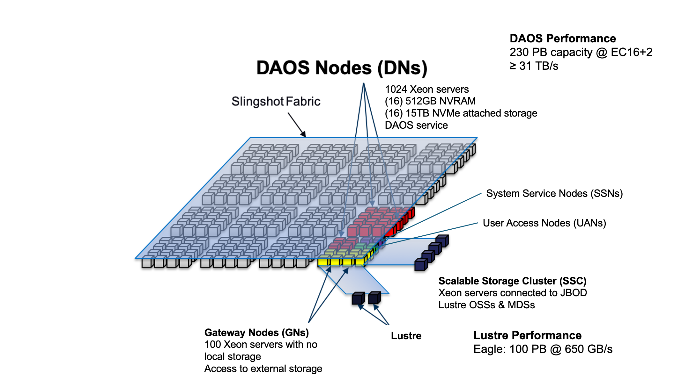
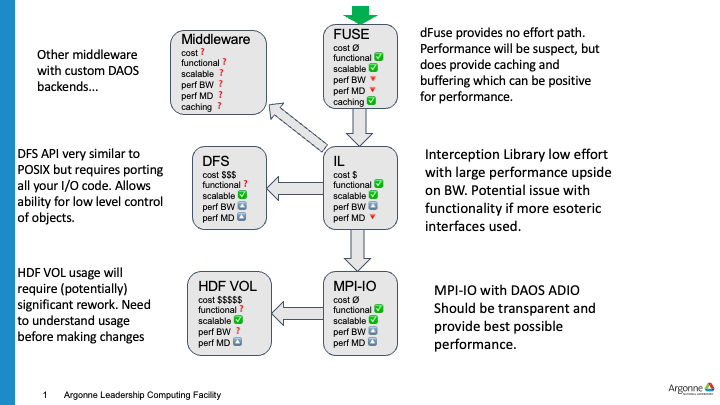

# DAOS Architecture
DAOS is a high performance storage system for storing checkpoints and analysis files.
DAOS is fully integrated with the wider Aurora compute fabric as can be seen in the overall storage architecture below.

# DAOS Overview
Users should submit a request as noted below to have a DAOS pool created for their project.
Once created, users may create and manage containers within the pool as they wish.
If you need assistance 

### Note
This is an initial test DAOS configuration and as such, any data on the DAOS system will envtually be deleted when
the configuration is changed into a larger system.
Warning will be given before the system is wiped to allow time for users to move any important data off.

## Pool Allocation
Email support@alcf.anl.gov to request a pool and provide which primary project you're on.
The pool will be set to allow anyone in the project unix group to access the pool.
Please request the capacity of allocation you would like.

## Modules
Please load the daos/base module when using DAOS.
This should be done when logging into the UAN or when using DAOS from a compute job script.

`module load daos/base`

## Pool
Confirm you are able to query the pool.

`daos pool query <pool name>`

Example output
> daos pool query software  
> Pool 050b20a3-3fcc-499b-a6cf-07d4b80b04fd, ntarget=640, disabled=0, leader=2, version=131  
> Pool space info:  
> - Target(VOS) count:640  
> - Storage tier 0 (SCM):  
> Total size: 6.0 TB  
>   Free: 4.4 TB, min:6.5 GB, max:7.0 GB, mean:6.9 GB  
> - Storage tier 1 (NVMe):  
>   Total size: 200 TB  
>   Free: 194 TB, min:244 GB, max:308 GB, mean:303 GB  
> Rebuild done, 4 objs, 0 recs

## Container
The container is the basic unit of storage.
A POSIX container can contain hundres of millions of files, you can use it to store all of your date.
You only need a small set of containers perhaps just one per major unit of project work.

### Create a container
ALCF has provided a script, `mkcont`, to help create a container with reasonable defaults.
You can of course use the `daos` command to create a contaienr directly.

`mkcont --type POSIX --pool <pool name> --user $USER --group <group> <container name>`

Example output
> mkcont --type=POSIX --pool iotest --user harms --group users random  
>   Container UUID : 9a6989d3-3835-4521-b9c6-ba1b10f3ec9c  
>   Container Label: random                                
>   Container Type : POSIX                                 
>  
> Successfully created container 9a6989d3-3835-4521-b9c6-ba1b10f3ec9c  
> 0  

### Mount a container
Currently, you must manually mount your container prior to use on any node you are working on.
In the future, we hope to automate some of this via additional `qsub` options.

#### UAN
Create a directory to mount the POSIX container on and then mount the container via `dfuse`
`dfuse --pool=<pool name> --cont=<cont name> -m $HOME/daos/<pool>/<cont>`

> mkdir -p $HOME/daos/iotest/random
> dfuse --pool=iotest --cont=random -m $HOME/daos/iotest/random  
> mount | grep iotest  
> dfuse on /home/harms/daos/iotest/random type fuse.daos (rw,nosuid,nodev,noatime,user_id=4211,group_id=100,default_permissions)

#### Compute Node
From a compute node (CN), you need to mount the container on all compute nodes.
We provide some scripts to help perform this from within your job script.
More examples are available in /soft/daos/examples.
The following examples uses two support scripts to startup dfuse on each compute node and then shut it down at job end.

Job Script Example
> #!/bin/bash
> #PBS -A <project>  
> #PBS -lselect=1  
> #PBS -lwalltime=30:00  
> #PBS -k doe  
> \#  
> \# Test case for MPI-IO code example  
>   
> \# ranks per node  
> rpn=4  
>   
> \# threads per rank  
> threads=1  
>   
> \# nodes per job  
> nnodes=$(cat $PBS_NODEFILE | wc -l)  
>   
> \# Verify the pool and container are set  
> if [ -z "$DAOS_POOL" ];  
> then  
>     echo "You must set DAOS_POOL"  
>     exit 1  
> fi  
>   
> if [ -z "$DAOS_CONT" ];  
> then  
>     echo "You must set DAOS_CONT"  
>     exit 1  
> fi  
>   
> \# load daos/base module (if not loaded)  
> module load daos/base  
>   
> \# print your module list (useful for debugging)  
> module list
> 
> \# print your environment (useful for debugging)  
> #env  
>  
> \# turn on output of what is executed  
> set -x  
>   
> \#  
> \# clean previous mounts (just in case)  
> \#  
> clean-dfuse.sh ${DAOS_POOL}:${DAOS_CONT}  
>   
> \# launch dfuse on all compute nodes  
> \# will be launched using pdsh  
> \# arguments:  
> \#   pool:container  
> \# may list multiple pool:container arguments  
> \# will be mounted at:  
> \#   /tmp/\<pool\>/\<container\>  
> launch-dfuse.sh ${DAOS_POOL}:${DAOS_CONT}  
>   
> \# change to submission directory  
> cd $PBS_O_WORKDIR  
>   
> \# run your job(s)  
> \# these test cases assume 'testfile' is in the CWD  
> cd /tmp/${DAOS_POOL}/${DAOS_CONT}  
>   
> echo "write"  
>   
> mpiexec -np $((rpn*nnodes)) \  
> -ppn $rpn \  
> -d $threads \  
> --cpu-bind numa \  
> --no-vni \ # enables DAOS access  
> -genvall \  
> /soft/daos/examples/src/posix-write  
>   
> echo "read"  
> mpiexec -np $((rpn*nnodes)) \  
> -ppn $rpn \  
> -d $threads \  
> --cpu-bind numa \  
> --no-vni \ # enables DAOS access  
> -genvall \  
> /soft/daos/examples/src/posix-read  
>  
> \# cleanup dfuse mounts  
> clean-dfuse.sh ${DAOS_POOL}:${DAOS_CONT}  
>   
> exit 0  

Job Submission

This job script above expects two environment variables which you set to the relevant pool and container.
The -ldaos=default switch will ensure that DAOS is available on the compute node.

`qsub -v DAOS_POOL=<name>,DAOS_CONT=<name> -ldaos=default ./job-script.sh`

## oneScratch
The current DAOS system is configured with 20 server nodes.
The remaining balance of server nodes is still reserved for internal testing.

### Hardware
Each DAOS server nodes is based on the Intel Coyote Pass platform.
* (2) Xeon 5320 CPU (Ice Lake)
* (16) 32GB DDR4 DIMMs
* (16) 512GB Intel Optane Persistent Memory 200
* (16) 15.3TB Samsung PM1733 NVMe
* (2) HPE Slingshot NIC

### Performance
The peak performance of the oneScratch storage is approximately 800 GB/s to 1000 GB/s.
Obtaining this performance should be possible from a job running in the available user partition but there are many considerations to understand achieving good performance.

#### Single Node
First is to consider the throughput you can obtain from a single compute node in the test case.
* dfuse is a single process and will therefore attach to a single NIC, limiting throughput to ~20 GB/s per compute node.
* dfuse offers caching and can thus show performance greater than theoretical due to cache effects based on the workload running.
* MPI-IO, Intercept Library, or other interfaces that use libdfs will bond to a NIC per-process.
  * DAOS will bond to NICs in a round-robin fashion to NICs which are located on the same socket.
  * For Aurora, DAOS processes running on socket 0 will only use 4 NICs assuming at least four processes are used but will not use more until the second socket is used.
  * IF running with a lower process count such as 24, the processes should be distributed between socket 0 and socket 1 for best I/O performance.

#### Dragonfly Groups
The next element is to consider how many dragonfly groups the job is running within.
Each dragonfly groups has 2 links to each I/O group and the current DAOS servers are distributed amoung the full 8 I/O groups.
* If a single compute group is used, that limits performance to 8 groups 2 links/group * 25 GB/s/link = 400 GB/s
* Thus it requires at least 2 compute groups to reach max performance.
* However, Slingshot support dynamic routing allowing traffic to use non-minimal routes via other compute groups which will result in performance greater that the theoretical peak of the number of compute groups being used.
  * Dynamic routing performance will be sensitive to other workloads running on the system and not be consistent.

#### Object Class
The object class selected for your container will influence the performance potential of I/O.
An object class which is <something>[SG]X is distributed across all of the targets in the system.
* All pools in the test system are enabled to use 100% of the targets.
* SX/GX will provide best performance for large data which distributes on all server targets but will lower IOp performance for metadata as each target must be communicated with.
* S1/G1 will provide good performance for small data with need for high IOps as it places data only on 1 target.

# Porting I/O to DAOS
There is no need to specifically modify code to use DAOS, however, DAOS can be used in several different modes so some consideration should be given on where to start.
The diagram below provides a suggested path to testing an application beginning at the green downward arrow.

## dFuse
The first suggested step to test with dFuse.
dFuse utilizes the linux FUSE layer to provide a POSIX compatible API layer for any application that uses POSIX directly or indirectly though an I/O library.
The dFuse component provides a simple method for using DAOS with no modifications.
Once the DAOS container is mounted via dFuse, applications and utilities can access data as before.
dFuse will scale as more compute nodes are added, but is not efficient on a per-node basis so will not provide ideal results at small scale.
dFuse doesn't provide ideal metadata performance either but it does have the advatange of utilizing the Linux page cache, so workloads that benefit from caching may see better performance than other methods.

## Interception Library
The interception library (IL) is a next step in improving DAOS performance.
The IL will intercept basic read and write POSIX calls while all metadata calls still go through dFuse.
The IL can provide a large performance improvement for bulk I/O as it bypasses the kernel and communicates with DAOS directly in userspace.
It will also take advantage of the multiple NICs on the node based on who many MPI processes are running on the node and which CPU socket they are on.

## MPI-IO
The ROMIO MPI-IO layer provides multiple I/O backends including a custom DAOS backend.
MPI-IO can be used with dFuse and the interception library when using the `ufs` backend but the `daos` backend will provide optimal performance.
In order to use this, one can prefix the file names with `daos:` which will tell MPI-IO to use the DAOS backend.

## HDF DAOS VOL
The HDF5 library can be used with POSIX or MPI-IO layers utilizing dFuse, IL or MPI-IO with DAOS.
The first suggestion would be to start with dFuse and then move to MPI-IO.
Once the performance of these methods has been evaluated, using the custom DAOS VOL can be attempted.
The DAOS VOL will provide a performance improvement under certain types of HDF workloads.
Using the VOL has other complications/benefits which should be considered as well.
The VOL maps a single HDF file into a single container.
This means a workload that tries to use multiple HDF files per checkpoint, will create one DAOS container for each one.
This is not ideal and will likely lead to performance issues.
The HDF code should be such that a single HDF file is used per checkpoint/analysis file/etc.
An entire campaign might generate thousands of containers which might be some overhead on an individual to manage so many containers.
As such, it might be beneficial to convert the code to write each checkpoint/time step into a HDF Group and then a single HDF file can be used for the entire campaign.
This solution is more DAOS specific, as it will be functionally compatible on any system, however a traditinoal PFS may loose the entire contents of the file if a failure occurs during write while DAOS will be resilent to those failures and rollback to a previous good version.

## DFS
DFS is the user level API for DAOS.
This API is very similar to POSIX but still has many differences that would require code changes to utilize DFS directly.
The DFS API can provide the best overall performance for any scenario other than workloads which benefit from caching.
