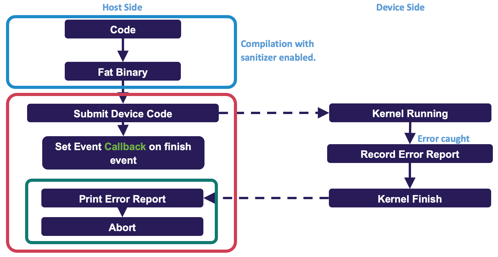

# Intel Sanitizer on Aurora

## Introduction

Intel Sanitizer is a correctness tool to detect addressability issues, memory leaks, data races and deadlocks, and use of uninitialized memory. With the addition of the sanitizer compiler flags, a sanitizer device image is created. At runtime, the sanitized images are checked. If they exist, the runtime enables a specific sanitizer layer in the unified runtime module to support sanitizer functionality.



Address, Memory, and Thread Sanitizers are provided with the oneAPI compiler for device codes on Aurora with the following features:

* Address Sanitizer (ASAN)
  * Out-of-bound check
  * Use-after-free
  * Misaligned access
  * Mismatched deallocation
  * Misusing host & device pointers
  * Invalid kernel argument
  * Mismatched queue
* Memory Sanitizer (MSAN)
  * Use of uninitialized memory
* Thread Sanitizer (TSAN)
  * Deadlock
  * Data race


## Building and running instruction with Sanitizers

### Address Sanitizer (ASAN) 

* Enabling device-side ASAN on a SYCL kernel
```bash
icpx –fsycl –Xarch_device –fsanitize=address -g demo.cpp
./demo 
```

* Enabling device-side ASAN on OpenMP code (with `icx`, `icpx` or `ifx`)
```bash
icpx -fiopenmp -Xarch_device -fsanitize=address -fopenmp-targets=spir64 -g demo.cpp
LIBOMPTARGET_PLUGIN=unified_runtime UR_ENABLE_LAYERS=UR_LAYER_ASAN ./demo
```

* An error message example (e.g., OpenMP Fortran example)
```bash
==== DeviceSanitizer: ASAN
…
====ERROR: DeviceSanitizer: out-of-bounds-access on Device USM (0xff00fffff4a00280)
WRITE of size 8 at kernel <__omp_offloading_10301_140c146_gpu_rhf_j01_ssss__l85> LID(163, 0, 0) GID(12707, 0, 0)
#0 OMP TARGET outline from gpu_rhf_j01_ssss_ line 85 /tmp/debug-bench/applications/GAMESS/build/Release/object/tgpu_ompmod_sp.F90:106
```


### Memory Sanitizer (MSAN) 

* Enabling device-side MSAN on a SYCL kernel
```bash
icpx –fsycl –Xarch_device –fsanitize=memory -g demo.cpp
./demo 
```

* Enabling device-side MSAN on OpenMP code (with `icx`, `icpx` or `ifx`)
```bash
icpx -fiopenmp -Xarch_device -fsanitize=memory -fopenmp-targets=spir64 -g demo.cpp
LIBOMPTARGET_PLUGIN=unified_runtime UR_ENABLE_LAYERS=UR_LAYER_MSAN ./demo
```

* An error message example (e.g., OpenMP C++ example)
```bash
==== DeviceSanitizer: MSAN
…
====WARNING: DeviceSanitizer: use-of-uninitialized-value
use of size 1 at kernel <__omp_offloading_10301_12070fb__ZN6openmc19process_init_eventsEi_l178> LID(0, 0, 0) GID(3648, 0, 0)
#0 OMP TARGET outline from openmc::process_init_events(int) line 178 /localdisk2/maosuzha/ics_workspace/debug-bench/applications/OpenMC/src/src/event.cpp:180
```


### Thread Sanitizer (TSAN) 

* Enabling device-side TSAN on a SYCL kernel
```bash
icpx –fsycl –Xarch_device –fsanitize=thread -g demo.cpp
./demo 
```

* Enabling device-side TSAN on OpenMP code (with `icx`, `icpx` or `ifx`)
```bash
icpx -fiopenmp -Xarch_device -fsanitize=thread -fopenmp-targets=spir64 -g demo.cpp
LIBOMPTARGET_PLUGIN=unified_runtime UR_ENABLE_LAYERS=UR_LAYER_TSAN ./demo
```

* An error message example (e.g., SYCL example)
```bash
==== DeviceSanitizer: TSAN
…
====WARNING: DeviceSanitizer: data race
When write of size 1 at 0xff00fffffffe0000 in kernel <typeinfo name for main::{lambda(sycl::_V1::handler&)#1}::operator()(sycl::_V1::handler&) const::Test> LID(7, 0, 0) GID(23, 0, 0)
  #0 typeinfo name for main::'lambda'(sycl::_V1::handler&)::operator()(sycl::_V1::handler&) const::Test /tmp/demo.cpp:10 
```

## Notes
* For CPU-side sanitizers, you can build your code with `-Xarch_host` instead of `-Xarch_device`. 
* To enable memory sanitizer origin tracking, you can use `-fsanitizer-memory-track-origins=1`.


## Known issues and workarounds
### No DEEPBIND support from host-side sanitizers
The host-side sanitizer does not support DEEPBIND. You will get errors like the following:
```bash
==104942==You are trying to dlopen a libigc.so.2 shared library with RTLD_DEEPBIND flag which is incompatible with sanitizer runtime (see https://github.com/google/sanitizers/issues/611 for details). If you want to run libigc.so.2 library under sanitizers please remove RTLD_DEEPBIND from dlopen flags.
```
To avoid this issue, users should disable DEEPBIND when `dlopen` other libraries with the following environemental variables:
```bash
export ASAN_OPTIONS=clear_deepbind_flag=1             // for address sanitizer
export MSAN_OPTIONS=clear_deepbind_flag=1             // for Memory sanitizer
export TSAN_OPTIONS=clear_deepbind_flag=1             // for thread sanitizer
```
or 
```bash
export DisableDeepBind=1
```


## References  
[Intel Sanitizer documentation](https://www.intel.com/content/www/us/en/developer/articles/technical/find-bugs-quickly-using-sanitizers-with-oneapi-compiler.html)

[2025 ALCF Developer Session](https://www.alcf.anl.gov/sites/default/files/2025-11/2025_Oct_ALCF_DevSession_Debugging_tools_v02.pdf)


