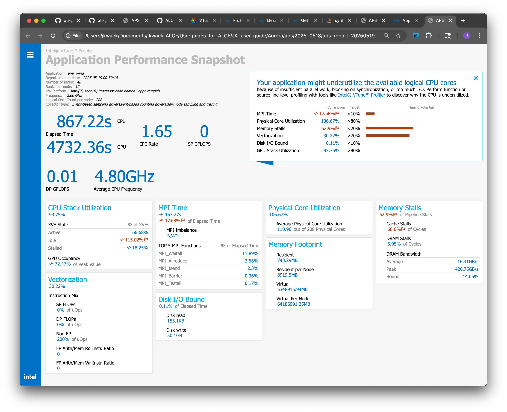

# Application Performance Snapshot

## Introduction

Use Application Performance Snapshot for a quick scan of performance aspects that relate to compute-intensive applications:

* MPI usage
* OpenMP usage
* Intel® oneAPI Collective Communications Library (oneCCL) usage
* CPU/GPU usage
* Efficiency of memory access
* Vectorization
* I/O and memory footprint

Application Performance Snapshot displays key optimization areas and suggests specialized tools for tuning particular performance aspects, such as Intel VTune Profiler and Intel® Advisor. You can run Application Performance Snapshot on large MPI workloads to analyze scalability issues. 


## Instruction

### Loading the module
```
$ module load oneapi
$ aps --version
Intel(R) VTune(TM) Profiler 2025.0.1 (build 629235) Command Line Tool
Copyright (C) 2009 Intel Corporation. All rights reserved.

```

### Usage of `aps` and `aps-report`
```console
$ aps -h
Intel(R) VTune(TM) Profiler 2025.0.1 (build 629235) Command Line Tool
Copyright (C) 2009 Intel Corporation. All rights reserved.
Usage: 1. aps [--result-dir=<dir> | -r=<dir>] [--start-paused] [--collection-mode=<mode> | -c=<mode>] <app>
       2. <mpi_launcher> <mpi_parameters> aps [--result-dir=<dir> | -r=<dir>] [--collection-mode=<mode> | -c=<mode>] [--stat-level=<0-5> | -L <0-5>] [--mpi-imbalance=<0-2> | -I <0-2>] [--storage-format=<format> | -F <format>] <app>
       3. aps --report | -O <option> <dir>
       4. aps <option>
1. Run analysis for an application or script <app> and store results in <dir>
2. Run analysis for an MPI application <app> and store results in <dir>
     --collection-mode=<mode>       Specify a comma separated list of data to collect. Possible values: hwc - hardware counters, omp - OpenMP statistics, mpi - MPI statistics, all - all possible data (default).
     --start-paused                 "Start data collection in the paused mode. Data collection resumes when the application calls __itt_resume or MPI_Pcontrol(1).
     --stat-level                   Set MPI statistic collection level.
     --mpi-imbalance                Set MPI imbalance collection mode.
     --tmp-dir=<path>               Specify the directory path where temporary data (generated during the collection run) is saved.
     --storage-format=<format>      Specify the trace format: simple (a small number of MPI ranks per node) or compact (numerous MPI ranks per node).
3. Show analysis report based on data from <dir>
     Tip: use
       aps-report --help
     to review report options. Additional details include statistics view by ranks, message sizes, collective operations, and communicators, as well as the ability to explore rank-to-rank and node-to-node communication statistics.
4. Show additional product info. Where <option> can be:
     --help, -h show this help and exit
     --version show version information and exit


$ aps-report -h
Usage: aps-report [keys] [options] <file-name(s)>

General KEYS:
  -h [ --help ]                         Show this help and exit.
  -a [ --all ]                          Show all available diagrams.

Specific KEYS:
  -s [ --summary ]                      Show Summary information. Default 
                                        option.
  -g [ --html-summary ]                 Generate Summary HTML report file. 
                                        Default option. (See option '-H' to set
                                        the file name.)
  -o [ --counters ]                     Show Counters & Memory usage 
                                        statistics.
  -f [ --functions ]                    Show MPI Function Summary for all ranks
                                        diagram. (Use Time filter. See '-T' 
                                        option.)
  -t [ --mpi-time-per-rank ]            Show MPI Function Time per Rank 
                                        diagram. (Use Time filter. See '-T' 
                                        option.)
  -m [ --message-sizes ]                Show Message Size diagram. (Use Time 
                                        filter. See '-T' option.)
  -x [ --transfers-per-communication ]  Show Data Transfers per Communication 
                                        diagram. (Use Time filter. See '-T' 
                                        option.) Use -v option to generate Data
                                        Transfers by volume, not by time (which
                                        is the default value)
  -e [ --transfers-per-rank ]           Show Data Transfers per Rank diagram. 
                                        (Use Volume filter. See '-V' option.)
  -n [ --node-to-node ]                 Show Node-to-Node Transfers(MB)
  -u [ --transfers-per-function ]       Show Data Transfers per Function 
                                        diagram. (Use Volume filter. See '-V' 
                                        option.)
  -l [ --communicators-list ]           Show list of communicators used.
  --node-topology                       Show the association between ranks, 
                                        nodes, and PCI devices in the collected
                                        data.
  --metrics arg                         Show the selected performance metrics 
                                        per node/rank. The metric names should 
                                        be separated using the comma. Use 
                                        --metrics=? to see the list of metrics 
                                        available for the selected result. The 
                                        special value "all" enables the display
                                        of all available metrics. Example: 
                                        --metrics="Elapsed Time, Vectorization,
                                        PCI"
  -j [ --itac-config ] arg              Generate specified Intel(R) Trace 
                                        Analyzer and Collector config. 
                                        Available config types are "time", 
                                        "imbalance", "volume". Use -N to 
                                        specify number of MPI functions in 
                                        config file.

OPTIONS:
  -R [ --rank ] arg                     Specify ranks to show in the report 
                                        (the list of ranks should be defined 
                                        using comma and dash separators, 
                                        example: -R 0,1,4,4-10).
  --node arg                            Specify nodes to show in the report 
                                        (the list of nodes should be defined 
                                        using commas as separators, example: 
                                        --node=localhost,test1).
  -X [ --comm-matrix-size ] arg         Show Communication matrix as a square 
                                        with specific dimensions. Applied to 
                                        '-x'.
  -M [ --comm-id ] arg                  Show detailed info about collective 
                                        operations for specified communicator 
                                        ID. Applied to '-f'.
  -D [ --details ]                      Show details for the ranks with 
                                        minimum, average, and maximum time 
                                        values from the selected diagram. For 
                                        Message Size diagram shows detailed 
                                        info about functions for each size. 
                                        Applied to the options '-t', '-c', '-f'
                                        and '-m'.
  -C [ --communicators ]                Shows additional information about 
                                        communicators for collective 
                                        operations. Applied to the options '-f'
                                        and '-m -D'.
  -E [ --internal-communicators ]       Shows information about internal IDs of
                                        communicators provided by Intel(R) MPI.
                                        Applied to '-l', '-f -C', '-m -D -C'.
  -P [ --func-group ]                   Group data by function name. Applied to
                                        the options '-m -D'.
  -V [ --volume-threshold ] arg         Threshold for data volume in % from 
                                        total transferred volume. Lines with 
                                        volume less than the threshold will be 
                                        skipped. Set to 0 to disable the 
                                        filter. By default - 1%.
  -T [ --time-threshold ] arg           Threshold for time in % from total 
                                        process lifetime. Lines with time less 
                                        than the threshold will be skipped. Set
                                        to 0 to disable the filter. By default 
                                        - 1%.
  --functions-filter arg                Gather statistics only for specified 
                                        MPI functions
  -v [ --by-volume ]                    Show Data Transfers per Communication 
                                        diagram by volume
  --format arg                          Generate file of specified format for 
                                        the diagram. Supported values: txt, 
                                        csv, html
  -H [ --html-summary-file ] arg        Name of Summary HTML report file. By 
                                        default - 'aps_report_<date>_<time>.htm
                                        l' in current folder.


The following environment variables are used:
    APS_STAT_DIR_PREFIX    a string to define the base name for the results directory.
                           By default, the results directory is "stat"

    APS_STAT_DIR_POSTFIX   a string to define a postfix for the results directory name and _mpi postfix.
                           The default value for the bundled version is _%D-%T, where:
                           %D - current date in the format YYYYMMDD
                           %T - current time in the format hhmmss
                           These placeholders are supported by the Intel MPI Library only.
    APS_STAT_FILE_PREFIX   a string to define the base name for statistics files.
                           The default value is "stat-". Rank number and ".bin" are added automatically.

FILE-NAMES:
  Path to the results directory or any statistics file inside the results directory.
  Examples: `aps-report -t -D stat_20160923-141516`  -  APS parses this directory.
            `aps-report -t -D stat-0.bin`  -  APS tries to recognize all stat* files in the current directory.


```

### Running with an MPI application

#### Collection on compute nodes
```
$ mpirun <mpi arguments> aps -r <aps_result_dir> <application> <args>
```

#### HTML report generation
```
$ aps --report <aps_result_dir>
```

## Simple examples

### `aps` collection for `amr-wind` application with 48 MPI ranks on four Aurora nodes

#### Collection

```
$ mpirun -n 48 --ppn 12 gpu_tile_compact.sh aps -r aps_report_amr-wind_4N ../amr_wind abl_godunov_4N_ST100.inp 
==============================================================================
                AMR-Wind (https://github.com/exawind/amr-wind)

  AMR-Wind version :: v3.4.2
  AMR-Wind Git SHA :: ed475a0533dfacf1fdff0b707518ccf99040d9f9
  AMReX version    :: 25.04-9-g30a9768150c4

...<skipping application standard output>...

AMReX (25.04-9-g30a9768150c4) finalized

Intel(R) VTune(TM) Profiler 2025.0.1 collection completed successfully. Use the "aps --report /lus/flare/projects/Aurora_deployment/jkwack/JK_AT_Tools/Apps/amr-wind_v3.4.2/build_20250513/jk_test/aps_report_amr-wind_4N" command to generate textual and HTML reports for the profiling session.

```

During the collection, the following warning can be ignored:
```
vtune: Warning: EMON Collector Message: Warning: PMU counter(s) [FP0 FP1 FP2 ] is (are) already in use by other software and the data collected on these counter(s) may be incorrect
```

#### Report

```
$ aps --report /lus/flare/projects/Aurora_deployment/jkwack/JK_AT_Tools/Apps/amr-wind_v3.4.2/build_20250513/jk_test/aps_report_amr-wind_4N
| Summary information
|--------------------------------------------------------------------
  Application                   : amr_wind
  Report creation date          : 2025-05-19 00:39:10
  Number of ranks               : 48
  Ranks per node                : 12
  HW Platform                   : Intel(R) Xeon(R) Processor code named Sapphirerapids
  Frequency                     : 2.00 GHz
  Logical core count per node   : 208
  Collector type                : Event-based sampling driver,Event-based counting driver,User-mode sampling and tracing
  Used statistics               : /lus/flare/projects/Aurora_deployment/jkwack/JK_AT_Tools/Apps/amr-wind_v3.4.2/build_20250513/jk_test/aps_report_amr-wind_4N
|
| Your application might underutilize the available logical CPU cores
| because of insufficient parallel work, blocking on synchronization, or too much I/O. Perform function or source line-level profiling with tools like Intel(R) VTune(TM) Profiler to discover why the CPU is underutilized.
|
  Elapsed Time:                             867.22 s
  SP GFLOPS:                                  0.00
  DP GFLOPS:                                  0.01
  Average CPU Frequency:                      4.80 GHz
  IPC Rate:                                   1.65
  GPU Accumulated Time:                    4732.36 s
  MPI Time:                                 153.27 s            17.68% of Elapsed Time
| Your application is MPI bound. This may be caused by high busy wait time
| inside the library (imbalance), non-optimal communication schema or MPI
| library settings. Explore the MPI Imbalance metric if it is available or use
| MPI profiling tools like Intel(R) Trace Analyzer and Collector to explore
| possible performance bottlenecks.
| Some of the individual values contributing to this average metric are
| statistical outliers that can significantly distort the average metric value.
| They can also be a cause of performance degradation.
| Please use --counters or --metrics="MPI Time" reports for details.
    MPI Imbalance:                            N/A*
| * No information about MPI Imbalance time is available. Set APS_IMBALANCE_TYPE
| to 1 or 2 to collect it.
    Top 5 MPI functions (avg time):
        MPI_Waitall:                        103.02 s            11.89% of Elapsed Time
        MPI_Allreduce:                       22.22 s             2.56% of Elapsed Time
        MPI_Isend:                           19.92 s             2.30% of Elapsed Time
        MPI_Barrier:                          3.14 s             0.36% of Elapsed Time
        MPI_Testall:                          1.46 s             0.17% of Elapsed Time
  Physical Core Utilization:                106.67%
  Average Physical Core Utilization:        110.96 out of 208 Physical Cores
  GPU Stack Utilization:                     93.75%
    XVE State:
       Active:                               66.68%
       Stalled:                              18.25%
| Some of the individual values contributing to this average metric are
| statistical outliers that can significantly distort the average metric value.
| They can also be a cause of performance degradation.
| Please use --counters or --metrics="XVE State: Stalled" reports for details.
       Idle:                                115.02%
| A significant portion of GPU time is spent idle. This is usually caused by
| imbalance or thread scheduling problems.
| Some of the individual values contributing to this average metric are
| statistical outliers that can significantly distort the average metric value.
| They can also be a cause of performance degradation.
| Please use --counters or --metrics="XVE State: Idle" reports for details.
  GPU Occupancy:                             72.47% of Peak Value
| Some of the individual values contributing to this average metric are
| statistical outliers that can significantly distort the average metric value.
| They can also be a cause of performance degradation.
| Please use --counters or --metrics="GPU Occupancy" reports for details.
  Memory Stalls:                             62.90% of Pipeline Slots
| The metric value can indicate that a significant fraction of execution
| pipeline slots could be stalled due to demand memory load and stores. See the
| second level metrics to define if the application is cache- or DRAM-bound and
| the NUMA efficiency. Use Intel(R) VTune(TM) Profiler Memory Access analysis to
| review a detailed metric breakdown by memory hierarchy, memory bandwidth
| information, and correlation by memory objects.
    Cache Stalls:                            66.60% of Cycles
| A significant proportion of cycles are spent on data fetches from cache. Use
| Intel(R) VTune(TM) Profiler Memory Access analysis to see if accesses to L2 or
| L3 cache are problematic and consider applying the same performance tuning as
| you would for a cache-missing workload. This may include reducing the data
| working set size, improving data access locality, blocking or partitioning the
| working set to fit in the lower cache levels, or exploiting hardware
| prefetchers.
    DRAM Stalls:                              3.95% of Cycles
    DRAM Bandwidth
       Peak:                                426.75 GB/s
       Average:                              16.41 GB/s
       Bound:                                14.05%
  Vectorization:                             30.22%
     Instruction Mix:
       SP FLOPs:                              0.00% of uOps
       DP FLOPs:                              0.00% of uOps
       Non-FP:                              200.00% of uOps
     FP Arith/Mem Rd Instr. Ratio:            0.00
     FP Arith/Mem Wr Instr. Ratio:            0.00
 Average PCI Bandwidth:
   Average PCIe Bandwidth Usage by GPU:
     Inbound PCIe Read:                     607.84 MB/s
     Inbound PCIe Write:                   6826.98 MB/s
   Average PCIe Bandwidth Usage by Network Controller Devices:
     Inbound PCIe Read:                    6120.50 MB/s
     Inbound PCIe Write:                   4131.81 MB/s
 Disk I/O Bound:                              0.94 s             0.11% of Elapsed Time
      Disk read:                             153.1 KB
      Disk write:                             50.1 GB
 Memory Footprint:
 Resident:
       Per node:
           Peak resident set size    :         8944.00 MB (node x4013c2s1b0n0)
           Average resident set size :         8919.50 MB
       Per rank:
           Peak resident set size    :          906.00 MB (rank 24)
           Average resident set size :          743.29 MB
 Virtual:
       Per node:
           Peak memory consumption    :     64187493.00 MB (node x4013c2s0b0n0)
           Average memory consumption :     64186991.25 MB
       Per rank:
           Peak memory consumption    :      5349075.00 MB (rank 36)
           Average memory consumption :      5348915.94 MB

Graphical representation of this data is available in the HTML report: /lus/flare/projects/Aurora_deployment/jkwack/JK_AT_Tools/Apps/amr-wind_v3.4.2/build_20250513/jk_test/aps_report_20250519_004709.html

```


Download the HTML file and open it on a web browser.

  
<!-- [APS HTML report for this example](./results/aps_report_20250519_004709.html) -->


#### `aps-report` CLI interface for the details

```
$ aps-report --metrics=? aps_report_amr-wind_4N/
| Available Metrics:
|--------------------
Elapsed Time
MPI Time
MPI Time
MPI Imbalance
MPI Hotspot 1 - MPI_Waitall
MPI Hotspot 1 - MPI_Waitall
MPI Hotspot 2 - MPI_Allreduce
MPI Hotspot 2 - MPI_Allreduce
MPI Hotspot 3 - MPI_Isend
MPI Hotspot 3 - MPI_Isend
MPI Hotspot 4 - MPI_Barrier
MPI Hotspot 4 - MPI_Barrier
MPI Hotspot 5 - MPI_Testall
MPI Hotspot 5 - MPI_Testall
Disk I/O Bound
Disk I/O Bound
Disk read
Disk write
Resident Memory Usage per Rank
Resident Memory Usage per Node
Virtual Memory Usage per Rank
Virtual Memory Usage per Node
Instructions Per Cycle Rate
Average CPU Frequency
Physical Core Utilization
Average Physical Core Utilization
Memory Stalls
Cache Stalls
DRAM Stalls
Average DRAM Bandwidth
DRAM Bandwidth Peak
DRAM Bandwidth Average
DRAM Bandwidth Bound
SP GFLOPS
DP GFLOPS
Vectorization
SP FLOPs
DP FLOPs
Non-FP
FP Arith/Mem Rd Instr. Ratio
FP Arith/Mem Wr Instr. Ratio
GPU Accumulated Time
GPU Stack Utilization
XVE State: Active
XVE State: Stalled
XVE State: Idle
GPU Occupancy
GPU Inbound PCIe Read
GPU Inbound PCIe Write
GPU Outbound PCIe Read
GPU Outbound PCIe Write
Network Controller Inbound PCIe Read
Network Controller Inbound PCIe Write
Network Controller Outbound PCIe Read
Network Controller Outbound PCIe Write
Inbound PCIe Read Per Device
Inbound PCIe Write Per Device
Outbound PCIe Read Per Device
Outbound PCIe Write Per Device
GPU Accumulated Time Per Device
GPU Stack Utilization Per Device
XVE State: Active Per Device
XVE State: Stalled Per Device
XVE State: Idle Per Device
GPU Occupancy Per Device


$ aps-report --metrics="GPU Stack Utilization Per Device, OpenMP Offload Time, GPU Accumulated Time Per Device, MPI Time" aps_report_amr-wind_4N
| Metric Table%
|--------------------------------------------------------------------------------------------------------------------------------
Metric Name                                Node Name           Rank    Device Type      Device Name   Metric Value   Outlier Type
MPI Time, s                            x4013c2s1b0n0             14            N/A              N/A        166.471           None
MPI Time, s                            x4013c2s1b0n0             15            N/A              N/A        165.058           None
MPI Time, s                            x4013c2s3b0n0             36            N/A              N/A        164.408           None
MPI Time, s                            x4013c2s2b0n0             29            N/A              N/A        163.307           None
MPI Time, s                            x4013c2s3b0n0             39            N/A              N/A        162.385           None
MPI Time, s                            x4013c2s3b0n0             38            N/A              N/A        162.119           None
MPI Time, s                            x4013c2s3b0n0             41            N/A              N/A        162.084           None
MPI Time, s                            x4013c2s2b0n0             28            N/A              N/A        161.303           None
MPI Time, s                            x4013c2s1b0n0             16            N/A              N/A        159.364           None
MPI Time, s                            x4013c2s2b0n0             25            N/A              N/A          159.1           None
MPI Time, s                            x4013c2s3b0n0             37            N/A              N/A        158.898           None
MPI Time, s                            x4013c2s0b0n0              4            N/A              N/A        157.763           None
MPI Time, s                            x4013c2s1b0n0             13            N/A              N/A        157.692           None
MPI Time, s                            x4013c2s1b0n0             20            N/A              N/A        157.515           None
MPI Time, s                            x4013c2s0b0n0              5            N/A              N/A        156.837           None
MPI Time, s                            x4013c2s2b0n0             30            N/A              N/A        156.188           None
MPI Time, s                            x4013c2s2b0n0             34            N/A              N/A        155.781           None
MPI Time, s                            x4013c2s1b0n0             21            N/A              N/A        155.483           None
MPI Time, s                            x4013c2s1b0n0             12            N/A              N/A        155.452           None
MPI Time, s                            x4013c2s3b0n0             44            N/A              N/A        155.092           None
MPI Time, s                            x4013c2s1b0n0             22            N/A              N/A        154.587           None
MPI Time, s                            x4013c2s2b0n0             26            N/A              N/A        154.353           None
MPI Time, s                            x4013c2s2b0n0             27            N/A              N/A        154.302           None
MPI Time, s                            x4013c2s1b0n0             18            N/A              N/A        154.197           None
MPI Time, s                            x4013c2s2b0n0             32            N/A              N/A        154.155           None
MPI Time, s                            x4013c2s0b0n0              8            N/A              N/A        153.864           None
MPI Time, s                            x4013c2s3b0n0             42            N/A              N/A        153.821           None
MPI Time, s                            x4013c2s1b0n0             19            N/A              N/A        153.713           None
MPI Time, s                            x4013c2s3b0n0             43            N/A              N/A        153.701           None
MPI Time, s                            x4013c2s2b0n0             33            N/A              N/A        153.685           None
MPI Time, s                            x4013c2s3b0n0             47            N/A              N/A        153.273           None
MPI Time, s                            x4013c2s3b0n0             45            N/A              N/A         153.21           None
MPI Time, s                            x4013c2s2b0n0             31            N/A              N/A        152.941           None
MPI Time, s                            x4013c2s3b0n0             46            N/A              N/A         152.49           None
MPI Time, s                            x4013c2s0b0n0              9            N/A              N/A        151.611           None
MPI Time, s                            x4013c2s2b0n0             35            N/A              N/A         151.37           None
MPI Time, s                            x4013c2s0b0n0              6            N/A              N/A         150.94           None
MPI Time, s                            x4013c2s0b0n0              1            N/A              N/A        150.864           None
MPI Time, s                            x4013c2s0b0n0              3            N/A              N/A        150.579           None
MPI Time, s                            x4013c2s0b0n0              7            N/A              N/A        150.239           None
MPI Time, s                            x4013c2s1b0n0             23            N/A              N/A        149.236           None
MPI Time, s                            x4013c2s0b0n0             10            N/A              N/A        148.357           None
MPI Time, s                            x4013c2s0b0n0             11            N/A              N/A        144.026           None
MPI Time, s                            x4013c2s0b0n0              0            N/A              N/A        140.557           None
MPI Time, s                            x4013c2s3b0n0             40            N/A              N/A        136.304           None
MPI Time, s                            x4013c2s1b0n0             17            N/A              N/A        134.898           None
MPI Time, s                            x4013c2s2b0n0             24            N/A              N/A        131.685           None
MPI Time, s                            x4013c2s0b0n0              2            N/A              N/A        121.563      Statistic
MPI Time, % of Elapsed Time            x4013c2s1b0n0             14            N/A              N/A        19.2067           None
MPI Time, % of Elapsed Time            x4013c2s1b0n0             15            N/A              N/A        19.0436           None
MPI Time, % of Elapsed Time            x4013c2s3b0n0             36            N/A              N/A        18.9743           None
MPI Time, % of Elapsed Time            x4013c2s2b0n0             29            N/A              N/A        18.8438           None
MPI Time, % of Elapsed Time            x4013c2s3b0n0             39            N/A              N/A        18.7408           None
MPI Time, % of Elapsed Time            x4013c2s3b0n0             38            N/A              N/A        18.7101           None
MPI Time, % of Elapsed Time            x4013c2s3b0n0             41            N/A              N/A        18.7061           None
MPI Time, % of Elapsed Time            x4013c2s2b0n0             28            N/A              N/A        18.6125           None
MPI Time, % of Elapsed Time            x4013c2s1b0n0             16            N/A              N/A        18.3867           None
MPI Time, % of Elapsed Time            x4013c2s2b0n0             25            N/A              N/A        18.3583           None
MPI Time, % of Elapsed Time            x4013c2s3b0n0             37            N/A              N/A        18.3384           None
MPI Time, % of Elapsed Time            x4013c2s1b0n0             13            N/A              N/A        18.1938           None
MPI Time, % of Elapsed Time            x4013c2s0b0n0              4            N/A              N/A        18.1918           None
MPI Time, % of Elapsed Time            x4013c2s1b0n0             20            N/A              N/A        18.1733           None
MPI Time, % of Elapsed Time            x4013c2s0b0n0              5            N/A              N/A        18.0851           None
MPI Time, % of Elapsed Time            x4013c2s2b0n0             30            N/A              N/A        18.0223           None
MPI Time, % of Elapsed Time            x4013c2s2b0n0             34            N/A              N/A        17.9754           None
MPI Time, % of Elapsed Time            x4013c2s1b0n0             21            N/A              N/A        17.9389           None
MPI Time, % of Elapsed Time            x4013c2s1b0n0             12            N/A              N/A        17.9353           None
MPI Time, % of Elapsed Time            x4013c2s3b0n0             44            N/A              N/A        17.8991           None
MPI Time, % of Elapsed Time            x4013c2s1b0n0             22            N/A              N/A        17.8356           None
MPI Time, % of Elapsed Time            x4013c2s2b0n0             26            N/A              N/A        17.8105           None
MPI Time, % of Elapsed Time            x4013c2s2b0n0             27            N/A              N/A        17.8047           None
MPI Time, % of Elapsed Time            x4013c2s1b0n0             18            N/A              N/A        17.7905           None
MPI Time, % of Elapsed Time            x4013c2s2b0n0             32            N/A              N/A        17.7878           None
MPI Time, % of Elapsed Time            x4013c2s3b0n0             42            N/A              N/A        17.7524           None
MPI Time, % of Elapsed Time            x4013c2s0b0n0              8            N/A              N/A        17.7422           None
MPI Time, % of Elapsed Time            x4013c2s3b0n0             43            N/A              N/A        17.7386           None
MPI Time, % of Elapsed Time            x4013c2s1b0n0             19            N/A              N/A        17.7347           None
MPI Time, % of Elapsed Time            x4013c2s2b0n0             33            N/A              N/A        17.7335           None
MPI Time, % of Elapsed Time            x4013c2s3b0n0             47            N/A              N/A        17.6892           None
MPI Time, % of Elapsed Time            x4013c2s3b0n0             45            N/A              N/A        17.6819           None
MPI Time, % of Elapsed Time            x4013c2s2b0n0             31            N/A              N/A        17.6477           None
MPI Time, % of Elapsed Time            x4013c2s3b0n0             46            N/A              N/A        17.5988           None
MPI Time, % of Elapsed Time            x4013c2s0b0n0              9            N/A              N/A        17.4825           None
MPI Time, % of Elapsed Time            x4013c2s2b0n0             35            N/A              N/A        17.4664           None
MPI Time, % of Elapsed Time            x4013c2s0b0n0              6            N/A              N/A        17.4051           None
MPI Time, % of Elapsed Time            x4013c2s0b0n0              1            N/A              N/A        17.3963           None
MPI Time, % of Elapsed Time            x4013c2s0b0n0              3            N/A              N/A        17.3635           None
MPI Time, % of Elapsed Time            x4013c2s0b0n0              7            N/A              N/A        17.3243           None
MPI Time, % of Elapsed Time            x4013c2s1b0n0             23            N/A              N/A        17.2182           None
MPI Time, % of Elapsed Time            x4013c2s0b0n0             10            N/A              N/A        17.1073           None
MPI Time, % of Elapsed Time            x4013c2s0b0n0             11            N/A              N/A        16.6078           None
MPI Time, % of Elapsed Time            x4013c2s0b0n0              0            N/A              N/A        16.2078           None
MPI Time, % of Elapsed Time            x4013c2s3b0n0             40            N/A              N/A        15.7308           None
MPI Time, % of Elapsed Time            x4013c2s1b0n0             17            N/A              N/A        15.5639           None
MPI Time, % of Elapsed Time            x4013c2s2b0n0             24            N/A              N/A        15.1949           None
MPI Time, % of Elapsed Time            x4013c2s0b0n0              2            N/A              N/A        14.0176      Statistic
GPU Accumulated Time Per Device, s     x4013c2s0b0n0            N/A            GPU    GPU 0 Stack 0        574.952           None
GPU Accumulated Time Per Device, s     x4013c2s0b0n0            N/A            GPU    GPU 0 Stack 1        561.112           None
GPU Accumulated Time Per Device, s     x4013c2s1b0n0            N/A            GPU    GPU 0 Stack 0        555.666           None
GPU Accumulated Time Per Device, s     x4013c2s2b0n0            N/A            GPU    GPU 0 Stack 0        552.534           None
GPU Accumulated Time Per Device, s     x4013c2s3b0n0            N/A            GPU    GPU 0 Stack 0        546.085           None
GPU Accumulated Time Per Device, s     x4013c2s3b0n0            N/A            GPU    GPU 0 Stack 1        543.687           None
GPU Accumulated Time Per Device, s     x4013c2s0b0n0            N/A            GPU    GPU 1 Stack 1        543.447           None
GPU Accumulated Time Per Device, s     x4013c2s2b0n0            N/A            GPU    GPU 0 Stack 1        543.261           None
GPU Accumulated Time Per Device, s     x4013c2s1b0n0            N/A            GPU    GPU 0 Stack 1        543.069           None
GPU Accumulated Time Per Device, s     x4013c2s0b0n0            N/A            GPU    GPU 1 Stack 0        541.997           None
GPU Accumulated Time Per Device, s     x4013c2s0b0n0            N/A            GPU    GPU 2 Stack 0        533.238           None
GPU Accumulated Time Per Device, s     x4013c2s0b0n0            N/A            GPU    GPU 2 Stack 1        529.018           None
GPU Accumulated Time Per Device, s     x4013c2s2b0n0            N/A            GPU    GPU 1 Stack 1        526.305           None
GPU Accumulated Time Per Device, s     x4013c2s2b0n0            N/A            GPU    GPU 1 Stack 0        525.409           None
GPU Accumulated Time Per Device, s     x4013c2s1b0n0            N/A            GPU    GPU 2 Stack 0        523.241           None
GPU Accumulated Time Per Device, s     x4013c2s3b0n0            N/A            GPU    GPU 1 Stack 0        521.108           None
GPU Accumulated Time Per Device, s     x4013c2s3b0n0            N/A            GPU    GPU 1 Stack 1         520.34           None
GPU Accumulated Time Per Device, s     x4013c2s2b0n0            N/A            GPU    GPU 2 Stack 1        518.369           None
GPU Accumulated Time Per Device, s     x4013c2s2b0n0            N/A            GPU    GPU 2 Stack 0         516.94           None
GPU Accumulated Time Per Device, s     x4013c2s1b0n0            N/A            GPU    GPU 2 Stack 1        516.645           None
GPU Accumulated Time Per Device, s     x4013c2s1b0n0            N/A            GPU    GPU 1 Stack 0        516.139           None
GPU Accumulated Time Per Device, s     x4013c2s3b0n0            N/A            GPU    GPU 2 Stack 0        514.991           None
GPU Accumulated Time Per Device, s     x4013c2s3b0n0            N/A            GPU    GPU 2 Stack 1        513.923           None
GPU Accumulated Time Per Device, s     x4013c2s1b0n0            N/A            GPU    GPU 1 Stack 1         513.66           None
GPU Accumulated Time Per Device, s     x4013c2s0b0n0            N/A            GPU    GPU 5 Stack 0        268.919           None
GPU Accumulated Time Per Device, s     x4013c2s0b0n0            N/A            GPU    GPU 5 Stack 1        268.893           None
GPU Accumulated Time Per Device, s     x4013c2s0b0n0            N/A            GPU    GPU 4 Stack 1        268.416           None
GPU Accumulated Time Per Device, s     x4013c2s0b0n0            N/A            GPU    GPU 4 Stack 0        266.623           None
GPU Accumulated Time Per Device, s     x4013c2s0b0n0            N/A            GPU    GPU 3 Stack 0        266.087           None
GPU Accumulated Time Per Device, s     x4013c2s0b0n0            N/A            GPU    GPU 3 Stack 1        262.871           None
GPU Accumulated Time Per Device, s     x4013c2s2b0n0            N/A            GPU    GPU 4 Stack 1        258.085           None
GPU Accumulated Time Per Device, s     x4013c2s2b0n0            N/A            GPU    GPU 4 Stack 0        256.988           None
GPU Accumulated Time Per Device, s     x4013c2s2b0n0            N/A            GPU    GPU 5 Stack 1         255.12           None
GPU Accumulated Time Per Device, s     x4013c2s2b0n0            N/A            GPU    GPU 5 Stack 0        254.068           None
GPU Accumulated Time Per Device, s     x4013c2s2b0n0            N/A            GPU    GPU 3 Stack 1        253.944           None
GPU Accumulated Time Per Device, s     x4013c2s3b0n0            N/A            GPU    GPU 4 Stack 1        252.502           None
GPU Accumulated Time Per Device, s     x4013c2s1b0n0            N/A            GPU    GPU 3 Stack 0        252.348           None
GPU Accumulated Time Per Device, s     x4013c2s1b0n0            N/A            GPU    GPU 5 Stack 1        252.127           None
GPU Accumulated Time Per Device, s     x4013c2s1b0n0            N/A            GPU    GPU 5 Stack 0        251.616           None
GPU Accumulated Time Per Device, s     x4013c2s1b0n0            N/A            GPU    GPU 4 Stack 1        250.515           None
GPU Accumulated Time Per Device, s     x4013c2s3b0n0            N/A            GPU    GPU 3 Stack 0        250.468           None
GPU Accumulated Time Per Device, s     x4013c2s1b0n0            N/A            GPU    GPU 3 Stack 1        250.404           None
GPU Accumulated Time Per Device, s     x4013c2s1b0n0            N/A            GPU    GPU 4 Stack 0         250.19           None
GPU Accumulated Time Per Device, s     x4013c2s3b0n0            N/A            GPU    GPU 5 Stack 1        250.123           None
GPU Accumulated Time Per Device, s     x4013c2s2b0n0            N/A            GPU    GPU 3 Stack 0        249.972           None
GPU Accumulated Time Per Device, s     x4013c2s3b0n0            N/A            GPU    GPU 3 Stack 1        248.308           None
GPU Accumulated Time Per Device, s     x4013c2s3b0n0            N/A            GPU    GPU 4 Stack 0        248.101           None
GPU Accumulated Time Per Device, s     x4013c2s3b0n0            N/A            GPU    GPU 5 Stack 0        247.606           None
GPU Stack Utilization Per Device, %    x4013c2s0b0n0            N/A            GPU    GPU 0 Stack 0          132.9           None
GPU Stack Utilization Per Device, %    x4013c2s0b0n0            N/A            GPU    GPU 0 Stack 1          129.9           None
GPU Stack Utilization Per Device, %    x4013c2s1b0n0            N/A            GPU    GPU 0 Stack 0          128.3           None
GPU Stack Utilization Per Device, %    x4013c2s2b0n0            N/A            GPU    GPU 0 Stack 0          127.4           None
GPU Stack Utilization Per Device, %    x4013c2s0b0n0            N/A            GPU    GPU 1 Stack 1          126.2           None
GPU Stack Utilization Per Device, %    x4013c2s3b0n0            N/A            GPU    GPU 0 Stack 0          126.1           None
GPU Stack Utilization Per Device, %    x4013c2s0b0n0            N/A            GPU    GPU 1 Stack 0          125.8           None
GPU Stack Utilization Per Device, %    x4013c2s3b0n0            N/A            GPU    GPU 0 Stack 1          125.5           None
GPU Stack Utilization Per Device, %    x4013c2s2b0n0            N/A            GPU    GPU 0 Stack 1          125.4           None
GPU Stack Utilization Per Device, %    x4013c2s1b0n0            N/A            GPU    GPU 0 Stack 1          125.4           None
GPU Stack Utilization Per Device, %    x4013c2s0b0n0            N/A            GPU    GPU 2 Stack 0          123.7           None
GPU Stack Utilization Per Device, %    x4013c2s0b0n0            N/A            GPU    GPU 2 Stack 1          122.7           None
GPU Stack Utilization Per Device, %    x4013c2s2b0n0            N/A            GPU    GPU 1 Stack 1          121.8           None
GPU Stack Utilization Per Device, %    x4013c2s2b0n0            N/A            GPU    GPU 1 Stack 0          121.7           None
GPU Stack Utilization Per Device, %    x4013c2s1b0n0            N/A            GPU    GPU 2 Stack 0          121.2           None
GPU Stack Utilization Per Device, %    x4013c2s3b0n0            N/A            GPU    GPU 1 Stack 0          120.8           None
GPU Stack Utilization Per Device, %    x4013c2s3b0n0            N/A            GPU    GPU 1 Stack 1          120.4           None
GPU Stack Utilization Per Device, %    x4013c2s2b0n0            N/A            GPU    GPU 2 Stack 1            120           None
GPU Stack Utilization Per Device, %    x4013c2s1b0n0            N/A            GPU    GPU 2 Stack 1          119.7           None
GPU Stack Utilization Per Device, %    x4013c2s2b0n0            N/A            GPU    GPU 2 Stack 0          119.7           None
GPU Stack Utilization Per Device, %    x4013c2s1b0n0            N/A            GPU    GPU 1 Stack 0          119.6           None
GPU Stack Utilization Per Device, %    x4013c2s3b0n0            N/A            GPU    GPU 2 Stack 0          119.3           None
GPU Stack Utilization Per Device, %    x4013c2s3b0n0            N/A            GPU    GPU 2 Stack 1            119           None
GPU Stack Utilization Per Device, %    x4013c2s1b0n0            N/A            GPU    GPU 1 Stack 1          118.9           None
GPU Stack Utilization Per Device, %    x4013c2s0b0n0            N/A            GPU    GPU 5 Stack 1           67.5      Threshold
GPU Stack Utilization Per Device, %    x4013c2s0b0n0            N/A            GPU    GPU 5 Stack 0           67.5      Threshold
GPU Stack Utilization Per Device, %    x4013c2s0b0n0            N/A            GPU    GPU 4 Stack 1           67.4      Threshold
GPU Stack Utilization Per Device, %    x4013c2s0b0n0            N/A            GPU    GPU 4 Stack 0           66.9      Threshold
GPU Stack Utilization Per Device, %    x4013c2s0b0n0            N/A            GPU    GPU 3 Stack 0           66.8      Threshold
GPU Stack Utilization Per Device, %    x4013c2s0b0n0            N/A            GPU    GPU 3 Stack 1             66      Threshold
GPU Stack Utilization Per Device, %    x4013c2s2b0n0            N/A            GPU    GPU 4 Stack 1           64.9      Threshold
GPU Stack Utilization Per Device, %    x4013c2s2b0n0            N/A            GPU    GPU 4 Stack 0           64.6      Threshold
GPU Stack Utilization Per Device, %    x4013c2s2b0n0            N/A            GPU    GPU 5 Stack 1           64.1      Threshold
GPU Stack Utilization Per Device, %    x4013c2s2b0n0            N/A            GPU    GPU 5 Stack 0           63.9      Threshold
GPU Stack Utilization Per Device, %    x4013c2s2b0n0            N/A            GPU    GPU 3 Stack 1           63.8      Threshold
GPU Stack Utilization Per Device, %    x4013c2s3b0n0            N/A            GPU    GPU 4 Stack 1           63.5      Threshold
GPU Stack Utilization Per Device, %    x4013c2s1b0n0            N/A            GPU    GPU 5 Stack 1           63.4      Threshold
GPU Stack Utilization Per Device, %    x4013c2s1b0n0            N/A            GPU    GPU 3 Stack 0           63.4      Threshold
GPU Stack Utilization Per Device, %    x4013c2s1b0n0            N/A            GPU    GPU 5 Stack 0           63.2      Threshold
GPU Stack Utilization Per Device, %    x4013c2s1b0n0            N/A            GPU    GPU 4 Stack 1             63      Threshold
GPU Stack Utilization Per Device, %    x4013c2s3b0n0            N/A            GPU    GPU 3 Stack 0             63      Threshold
GPU Stack Utilization Per Device, %    x4013c2s3b0n0            N/A            GPU    GPU 5 Stack 1           62.9      Threshold
GPU Stack Utilization Per Device, %    x4013c2s1b0n0            N/A            GPU    GPU 4 Stack 0           62.9      Threshold
GPU Stack Utilization Per Device, %    x4013c2s1b0n0            N/A            GPU    GPU 3 Stack 1           62.9      Threshold
GPU Stack Utilization Per Device, %    x4013c2s2b0n0            N/A            GPU    GPU 3 Stack 0           62.8      Threshold
GPU Stack Utilization Per Device, %    x4013c2s3b0n0            N/A            GPU    GPU 4 Stack 0           62.4      Threshold
GPU Stack Utilization Per Device, %    x4013c2s3b0n0            N/A            GPU    GPU 3 Stack 1           62.4      Threshold
GPU Stack Utilization Per Device, %    x4013c2s3b0n0            N/A            GPU    GPU 5 Stack 0           62.2      Threshold

```


## References  
[Intel Application Performance Snapshot User's Guide](https://www.intel.com/content/www/us/en/docs/vtune-profiler/user-guide-application-snapshot-linux/2025-0/overview.html)

[2025 ALCF INCITE Hackathon virtual week](./Presentations/2025_INCITE_Hackathon_Part_2_Intel_Analyzers.pdf)

