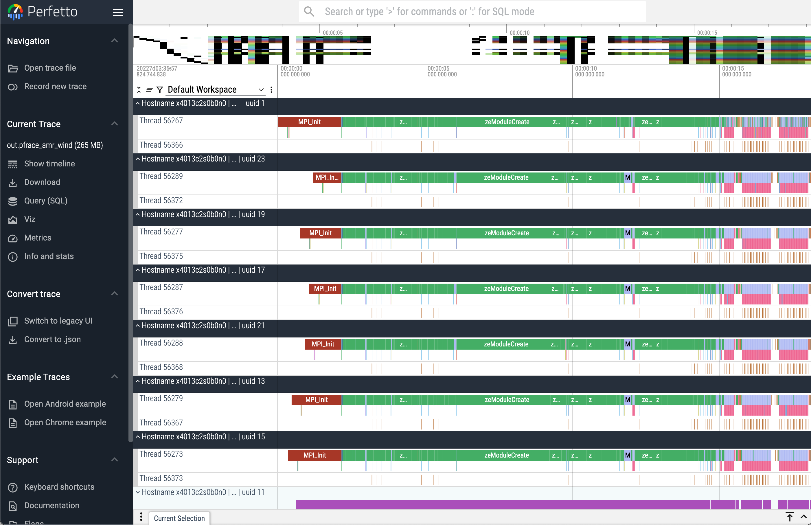

# THAPI/iprof

## Introduction

THAPI is a portable tracing infrastructure for heterogeneous computing applications with backends for OpenCL, L0, CUDA HIP, OPMT and MPI. 
`iprof` is a wrapper around the OpenCL, Level Zero, and CUDA tracers. It gives aggregated profiling information.

## Instruction

### Loading the THAPI module
```
$ module load thapi
$ iprof --version
v0.0.12-23-g9f2ed86
```

### Usage of `iprof`
```
$ iprof -h
Usage: iprof [options] [--] [command]
        --trace-output PATH          Define where the CTF trace will be saved.
                                     Default: `$THAPI_HOME/thapi-traces/thapi--[trace-type][date]`
                                     (`$THAPI_HOME` defaults to `$HOME`,
                                      and `date` is formatted using ISO 8601 convention).
        --analysis-output PATH       Define where the analysis output (summary, pretty printing, etc.) will be saved.
                                     Default: printed to `stdout`.
    -m, --tracing-mode MODE          Define the category of events to trace.
                                     Values allowed: ["minimal", "default", "full"]
                                     Default: default
        --traced-ranks RANK          Select which MPI ranks will be traced.
                                     Use -1 to trace all ranks.
                                     Default: -1
        --[no-]profile               Enable or disable device profiling.
                                     Default: true
        --[no-]analysis              Enable or disable analysis of the LTTng trace.
                                     Default: true
    -b, --backends BACKENDS          Select which backends to use and their grouping level.
                                     Format: backend_name[:backend_level],...
                                     Default: mpi:3,omp:2,cl:1,ze:1,cuda:1,hip:1
        --[no-]archive               Enable or disable archive support.
                                     Default: false
    -r, --replay [PATH]              Replay traces for post-mortem analysis.
                                     If `PATH` is omitted, it defaults to the newest trace in `$HOME/thapi-traces/`.
    -t, --trace                      Pretty-print the LTTng trace.
    -l, --timeline [PATH]            Dump the trace timeline to a binary file.
                                     If `PATH` is omitted, defaults to `out.pftrace`.
                                     Open with Perfetto: `https://ui.perfetto.dev/#!/viewer`.
    -j, --json                       Output the tally in JSON format.
    -e, --extended                   Print the tally for for each Hostname / Process / Thread / Device.
    -k, --kernel-verbose             The tally will report kernels execution time with SIMD width and global/local sizes.
        --max-name-size SIZE         Set the maximum allowed kernels name size.
                                     Use -1 for no limit.
                                     Default: 80
    -s, --sample                     Enable counters sampling.
        --metadata                   Display trace metadata.
    -v, --version                    Print the Version String.
    -h, --help                       Display this message.
        --debug [LEVEL]              Set the debug level.
                                     If `LEVEL` is omitted, it defaults to 1.
                                     Default: 3
                                                      __
For complaints, praises, or bug reports please use: <(o )___
   https://github.com/argonne-lcf/THAPI              ( ._> /
   or send email to {apl,bvideau}@anl.gov             `---'

```

### Running with an MPI application
```
$ mpirun <mpi arguments> iprof <iprof arguments> -- <application excutable binary> <application arguments>
```

## Simple examples

### `iprof` for `amr-wind` application with 24 MPI ranks on two Aurora nodes

```
$ mpirun -n 24 --ppn 12 gpu_tile_compact.sh iprof -- ../amr_wind abl_godunov.inp 
==============================================================================
                AMR-Wind (https://github.com/exawind/amr-wind)

  AMR-Wind version :: v3.4.2
  AMR-Wind Git SHA :: ed475a0533dfacf1fdff0b707518ccf99040d9f9
  AMReX version    :: 25.04-9-g30a9768150c4

...<skipping application standard output>...

AMReX (25.04-9-g30a9768150c4) finalized
THAPI: Trace location: /home/jkwack/thapi-traces/thapi_aggreg--2025-05-18T22:32:29-05:00
BACKEND_MPI | 2 Hostnames | 24 Processes | 24 Threads | 

                  Name |     Time | Time(%) |  Calls |  Average |      Min |      Max |         
         MPI_Allreduce |  2.15min |  35.78% |  21703 |   5.95ms |    145ns |    2.21s |         
       MPI_Comm_create |  1.90min |  31.63% |    408 | 279.75ms |  35.80us |    6.51s |         
              MPI_Init |  1.59min |  26.38% |     24 |    3.97s | 343.86ms |    7.21s |         
           MPI_Waitall |   15.80s |   4.38% |  58360 | 270.78us |    193ns | 226.00ms |         
         MPI_Allgather |    2.26s |   0.63% |     72 |  31.45ms |  29.37us | 182.51ms |         
           MPI_Barrier |    2.14s |   0.59% |    120 |  17.82ms |  16.84us |  81.07ms |         
             MPI_Bcast | 558.40ms |   0.15% |     48 |  11.63ms |  29.18us |  22.95ms |         
           MPI_Testall | 430.25ms |   0.12% |  42384 |  10.15us |    125ns |   2.01ms |         
            MPI_Reduce | 425.03ms |   0.12% |    336 |   1.26ms |   2.82us |  70.40ms |         
          MPI_Finalize | 246.94ms |   0.07% |     24 |  10.29ms |   7.28ms |  17.41ms |         
             MPI_Isend | 209.20ms |   0.06% | 173930 |   1.20us |    819ns | 535.44us |         
          MPI_Comm_dup | 111.12ms |   0.03% |     24 |   4.63ms |  96.50us |   9.21ms |         
             MPI_Irecv | 110.05ms |   0.03% | 173930 | 632.71ns |    137ns | 309.75us |         
MPI_Type_create_struct |  26.75ms |   0.01% |     72 | 371.50us |   1.13us |   1.18ms |         
   MPI_Type_contiguous |  25.81ms |   0.01% |     24 |   1.08ms |   1.01ms |   1.13ms |         
   MPI_Comm_split_type |  24.47ms |   0.01% |     24 |   1.02ms | 970.41us |   1.07ms |         
           MPI_Gatherv |  15.68ms |   0.00% |    552 |  28.40us |    387ns |   7.18ms |         
        MPI_Allgatherv |   1.26ms |   0.00% |     24 |  52.31us |  47.35us |  62.52us |         
         MPI_Comm_rank | 833.41us |   0.00% |   3342 | 249.38ns |    104ns |   7.03us |         
         MPI_Comm_size | 761.44us |   0.00% |   2118 | 359.51ns |    112ns |   5.63us |         
         MPI_Comm_free | 687.23us |   0.00% |     65 |  10.57us |    984ns |  83.16us |         
        MPI_Comm_group | 505.78us |   0.00% |    745 | 678.90ns |    199ns |   1.99us |         
        MPI_Group_free | 465.72us |   0.00% |   1153 | 403.92ns |    120ns |   4.80us |         
        MPI_Group_incl | 384.95us |   0.00% |    408 | 943.50ns |    339ns |   8.11us |         
             MPI_Wtime | 313.32us |   0.00% |   1056 | 296.70ns |    118ns |   3.01us |         
         MPI_Type_free | 305.71us |   0.00% |     96 |   3.18us |    113ns |  15.24us |         
MPI_Get_processor_name |  61.66us |   0.00% |     24 |   2.57us |   1.63us |   4.55us |         
       MPI_Type_commit |  50.33us |   0.00% |     96 | 524.22ns |    119ns |   3.46us |         
       MPI_Get_address |  30.23us |   0.00% |     72 | 419.89ns |    118ns |    843ns |         
     MPI_Comm_get_attr |  25.78us |   0.00% |     24 |   1.07us |    722ns |   2.29us |         
   MPI_Type_get_extent |  25.09us |   0.00% |     72 | 348.47ns |    127ns |    958ns |         
      MPI_Query_thread |  23.46us |   0.00% |     24 | 977.71ns |    813ns |   1.50us |         
       MPI_Initialized |  17.52us |   0.00% |     24 | 730.12ns |    325ns |   1.15us |         
                 Total |  6.01min | 100.00% | 481378 |                                          

BACKEND_ZE | 2 Hostnames | 24 Processes | 32 Threads | 

                               Name |     Time | Time(%) |   Calls |  Average |     Min |      Max |         
                     zeModuleCreate |  1.65min |  93.53% |    1260 |  78.52ms | 88.01us |    2.94s |         
      zeCommandListAppendMemoryCopy |    2.21s |   2.09% |  198146 |  11.16us |  4.65us |   1.99ms |         
    zeCommandListAppendLaunchKernel |    1.83s |   1.73% |  229951 |   7.96us |  5.83us |   2.24ms |         
             zeEventHostSynchronize |    1.63s |   1.54% |  213448 |   7.61us |   144ns |   1.83ms |         
                   zeEventHostReset | 618.33ms |   0.58% |  427929 |   1.44us |   181ns |   1.29ms |         
  zeCommandQueueExecuteCommandLists | 123.55ms |   0.12% |   80518 |   1.53us |  1.08us | 620.24us |         
               zeMemGetAddressRange |  70.47ms |   0.07% |  441272 | 159.71ns |   122ns | 533.06us |         
                     zeEventDestroy |  56.18ms |   0.05% |   98472 | 570.52ns |   137ns |   1.05ms |         
     zexDriverImportExternalPointer |  52.44ms |   0.05% |      96 | 546.30us | 19.31us | 717.93us |         
               zeKernelSetGroupSize |  38.86ms |   0.04% |  229951 | 169.00ns |   129ns | 313.42us |         
                      zeEventCreate |  37.08ms |   0.04% |   98472 | 376.56ns |   224ns |  95.31us |         
       zeCommandListCreateImmediate |  27.44ms |   0.03% |      72 | 381.06us | 64.80us |   1.00ms |         
        zeContextMakeMemoryResident |  22.52ms |   0.02% |      96 | 234.57us |  5.69us | 749.01us |         
                    zeModuleDestroy |  19.59ms |   0.02% |    1260 |  15.55us |  1.74us | 475.10us |         
                 zeCommandListReset |  19.53ms |   0.02% |   80474 | 242.74ns |   182ns | 299.30us |         
                   zeMemAllocDevice |  16.35ms |   0.02% |      96 | 170.36us | 14.93us | 331.10us |         
                          zeMemFree |  16.34ms |   0.02% |     216 |  75.64us |  3.02us | 875.15us |         
                 zeCommandListClose |  13.37ms |   0.01% |   80518 | 166.07ns |   130ns | 307.78us |         
                     zeKernelCreate |  11.66ms |   0.01% |    4980 |   2.34us |   663ns |  22.81us |         
                   zeMemAllocShared |   9.10ms |   0.01% |      72 | 126.33us | 23.36us | 280.39us |         
zeDriverGetExtensionFunctionAddress |   4.02ms |   0.00% |     336 |  11.97us |   303ns | 257.23us |         
               zeCommandQueueCreate |   4.02ms |   0.00% |      64 |  62.75us |  9.60us | 218.51us |         
                    zeKernelDestroy |   3.22ms |   0.00% |    4980 | 646.74ns |   211ns |  23.05us |         
                   zeContextDestroy |   1.74ms |   0.00% |      48 |  36.27us |   855ns | 241.75us |         
                  zeEventPoolCreate |   1.30ms |   0.00% |      72 |  18.00us |  7.56us |  45.93us |         
                     zeMemAllocHost |   1.12ms |   0.00% |      48 |  23.26us | 13.35us |  32.95us |         
              zeDeviceGetSubDevices |   1.06ms |   0.00% |    2136 | 495.30ns |   149ns |   1.45us |         
    zexDriverReleaseImportedPointer |   1.01ms |   0.00% |      96 |  10.53us |  5.00us |  24.42us |         
                 zeEventPoolDestroy | 991.51us |   0.00% |      72 |  13.77us |  5.33us |  29.80us |         
                zeCommandListCreate | 900.73us |   0.00% |      44 |  20.47us |  5.90us |  53.93us |         
                zeMemCloseIpcHandle | 588.25us |   0.00% |      50 |  11.76us |  7.35us |  31.52us |         
               zexMemOpenIpcHandles | 557.27us |   0.00% |      50 |  11.15us |  4.43us |  38.08us |         
          zeKernelSetIndirectAccess | 459.64us |   0.00% |     996 | 461.48ns |   180ns |    931ns |         
               zeCommandListDestroy | 417.36us |   0.00% |     116 |   3.60us |   785ns |  22.47us |         
                        zeDeviceGet | 343.86us |   0.00% |     240 |   1.43us |   155ns |  35.11us |         
            zeModuleBuildLogDestroy | 200.46us |   0.00% |     996 | 201.27ns |   133ns |    946ns |         
                    zeContextCreate | 134.03us |   0.00% |      96 |   1.40us |   980ns |   1.97us |         
                             zeInit | 109.94us |   0.00% |      96 |   1.15us |   487ns |   3.00us |         
                zexMemGetIpcHandles | 104.26us |   0.00% |      16 |   6.52us |   829ns |  15.77us |         
                        zeDriverGet |  85.08us |   0.00% |     168 | 506.40ns |   186ns |    949ns |         
              zeDeviceGetRootDevice |  74.26us |   0.00% |     312 | 238.02ns |   111ns |    723ns |         
              zeCommandQueueDestroy |  49.05us |   0.00% |      64 | 766.41ns |   384ns |   2.08us |         
              zeDriverGetApiVersion |  12.64us |   0.00% |      24 | 526.54ns |   416ns |    674ns |         
                  zeMemPutIpcHandle |   8.43us |   0.00% |       8 |   1.05us |   959ns |   1.23us |         
                              Total |  1.76min | 100.00% | 2198427 |                                         

Device profiling | 2 Hostnames | 24 Processes | 24 Threads | 24 Devices | 24 Subdevices | 

                                                                            Name |     Time | Time(%) |  Calls |  Average |      Min |      Max |         
amrex::launch<amrex::detail::Parallel[...]nst::{lambda(sycl::_V1::nd_item<1>)#1} | 373.05ms |  20.68% |  69551 |   5.36us |   3.20us |  27.04us |         
amrex::ParallelFor<256, int, amrex::e[...]nst::{lambda(sycl::_V1::nd_item<1>)#1} | 248.76ms |  13.79% |  35200 |   7.07us |   5.60us |  39.20us |         
                                              zeCommandListAppendMemoryCopy(D2D) | 164.99ms |   9.15% |  80830 |   2.04us |    720ns |  11.04us |         
amrex::launch<amrex::detail::Parallel[...]nst::{lambda(sycl::_V1::nd_item<1>)#1} | 158.63ms |   8.79% |  23756 |   6.68us |   5.28us |  16.48us |         
amrex::ParallelFor<256, amrex::mlndla[...]nst::{lambda(sycl::_V1::nd_item<1>)#1} | 106.01ms |   5.88% |   6634 |  15.98us |  14.72us |  33.28us |         
amrex::ParallelFor<256, amrex::MLPois[...]nst::{lambda(sycl::_V1::nd_item<1>)#1} |  89.72ms |   4.97% |  14168 |   6.33us |   5.28us |  13.76us |         
amrex::ParallelFor<256, int, amrex::e[...]nst::{lambda(sycl::_V1::nd_item<1>)#1} |  85.32ms |   4.73% |   4576 |  18.65us |   9.28us |  24.48us |         
                                              zeCommandListAppendMemoryCopy(D2H) |  35.39ms |   1.96% |   8491 |   4.17us |   1.04us |  33.52us |         
amrex::ParallelFor<256, int, amrex::F[...]nst::{lambda(sycl::_V1::nd_item<1>)#1} |  31.76ms |   1.76% |   9521 |   3.34us |   1.60us |  19.84us |         
amrex::ParallelFor<256, int, amrex::C[...]nst::{lambda(sycl::_V1::nd_item<1>)#1} |  28.53ms |   1.58% |   7564 |   3.77us |   2.72us |  24.16us |         
                                              zeCommandListAppendMemoryCopy(D2M) |  28.49ms |   1.58% |   2376 |  11.99us |   2.32us |  21.60us |         
amrex::launch<256, amrex::ReduceOps<a[...]nst::{lambda(sycl::_V1::nd_item<1>)#1} |  27.39ms |   1.52% |   4150 |   6.60us |   3.20us |  15.52us |         
amrex::ParallelFor<256, int, amrex::F[...]nst::{lambda(sycl::_V1::nd_item<1>)#1} |  27.21ms |   1.51% |   6707 |   4.06us |   2.40us |  10.88us |         
amrex::ParallelFor<256, amr_wind::FPl[...]nst::{lambda(sycl::_V1::nd_item<1>)#1} |  20.01ms |   1.11% |    176 | 113.71us |  59.20us | 178.88us |         
amrex::ParallelFor<256, int, amrex::a[...]nst::{lambda(sycl::_V1::nd_item<1>)#1} |  19.48ms |   1.08% |   2629 |   7.41us |   4.32us |  15.52us |         
amrex::MLTensorOp::apply(int, int, am[...]nst::{lambda(sycl::_V1::nd_item<2>)#1} |  18.22ms |   1.01% |    936 |  19.47us |  18.24us |  26.24us |         
amrex::ParallelFor<256, int, amrex::e[...]nst::{lambda(sycl::_V1::nd_item<1>)#1} |  16.09ms |   0.89% |   2234 |   7.20us |   4.32us |  14.40us |         
amrex::ParallelFor<256, int, amrex::e[...]nst::{lambda(sycl::_V1::nd_item<1>)#1} |  15.37ms |   0.85% |   1521 |  10.11us |   4.64us |  18.40us |         
amrex::ParallelFor<256, int, amrex::M[...]nst::{lambda(sycl::_V1::nd_item<1>)#1} |  14.67ms |   0.81% |   2343 |   6.26us |   4.80us |  10.72us |         
amrex::ParallelFor<256, amr_wind::FPl[...]nst::{lambda(sycl::_V1::nd_item<1>)#1} |  14.25ms |   0.79% |    264 |  53.96us |  32.00us |  95.20us |         
amrex::ParallelFor<256, amr_wind::Vel[...]nst::{lambda(sycl::_V1::nd_item<1>)#1} |  12.80ms |   0.71% |     88 | 145.48us | 136.32us | 158.72us |         
amrex::ParallelFor<256, int, amrex::A[...]nst::{lambda(sycl::_V1::nd_item<1>)#1} |  12.54ms |   0.70% |   2848 |   4.40us |   3.52us |  11.20us |         
amrex::ParallelFor<256, amrex::MLPois[...]nst::{lambda(sycl::_V1::nd_item<1>)#1} |  12.42ms |   0.69% |   3387 |   3.67us |   2.40us |  15.52us |         
amrex::MLTensorOp::apply(int, int, am[...]nst::{lambda(sycl::_V1::nd_item<1>)#1} |  12.17ms |   0.67% |    936 |  13.00us |  12.48us |  17.44us |         
                                              zeCommandListAppendMemoryCopy(H2D) |  11.55ms |   0.64% | 105873 | 109.05ns |     80ns | 214.32us |         
amrex::ParallelFor<256, int, amrex::F[...]nst::{lambda(sycl::_V1::nd_item<1>)#1} |  10.76ms |   0.60% |   2565 |   4.20us |   2.88us |  11.36us |         
amrex::launch<amrex::MLTensorOp::appl[...]nst::{lambda(sycl::_V1::nd_item<1>)#1} |   9.51ms |   0.53% |    936 |  10.16us |   8.96us |  16.96us |         
_ZTSZZN5amrex6launchILi256EZNS_9Reduc[...]lerEE_clES19_EUlNS17_7nd_itemILi1EEEE_ |   9.44ms |   0.52% |   1579 |   5.98us |   3.36us |  12.80us |         
amrex::ParallelFor<256, amrex::GpuBnd[...]nst::{lambda(sycl::_V1::nd_item<1>)#1} |   8.19ms |   0.45% |    768 |  10.67us |   7.20us |  17.76us |         
_ZTSZZN5amrex6launchILi256EZNS_9Reduc[...]lerEE_clES1B_EUlNS19_7nd_itemILi1EEEE_ |   7.63ms |   0.42% |   1012 |   7.54us |   4.80us |  14.08us |         
amrex::ParallelFor<256, int, amrex::e[...]nst::{lambda(sycl::_V1::nd_item<1>)#1} |   7.45ms |   0.41% |   1100 |   6.77us |   6.08us |  13.92us |         
amrex::ParallelFor<256, int, amrex::e[...]nst::{lambda(sycl::_V1::nd_item<1>)#1} |   6.58ms |   0.36% |   1100 |   5.98us |   4.80us |  13.12us |         
amrex::launch<amrex::detail::Parallel[...]nst::{lambda(sycl::_V1::nd_item<1>)#1} |   6.48ms |   0.36% |    636 |  10.19us |   6.08us |  17.76us |         
amrex::ParallelFor<256, int, PPM::Pre[...]nst::{lambda(sycl::_V1::nd_item<1>)#1} |   6.24ms |   0.35% |    208 |  30.01us |  19.04us |  40.80us |         
amrex::launch<256, amrex::ReduceOps<a[...]nst::{lambda(sycl::_V1::nd_item<1>)#1} |   6.20ms |   0.34% |    456 |  13.59us |   6.24us |  29.12us |         
amrex::ParallelFor<256, int, amrex::a[...]nst::{lambda(sycl::_V1::nd_item<1>)#1} |   5.62ms |   0.31% |    858 |   6.55us |   3.52us |  13.44us |         
amrex::ParallelFor<256, amrex::GpuBnd[...]nst::{lambda(sycl::_V1::nd_item<1>)#1} |   5.30ms |   0.29% |    576 |   9.20us |   8.00us |  14.40us |         
amrex::ParallelFor<256, int, amrex::M[...]nst::{lambda(sycl::_V1::nd_item<1>)#1} |   4.20ms |   0.23% |    912 |   4.60us |   4.16us |  10.72us |         
amrex::ParallelFor<256, int, amrex::M[...]nst::{lambda(sycl::_V1::nd_item<1>)#1} |   4.05ms |   0.22% |    936 |   4.33us |   3.04us |  20.80us |         
amrex::ParallelFor<256, int, amrex::a[...]nst::{lambda(sycl::_V1::nd_item<1>)#1} |   3.78ms |   0.21% |    520 |   7.26us |   6.08us |  32.64us |         
amrex::ParallelFor<256, int, int, God[...]nst::{lambda(sycl::_V1::nd_item<1>)#1} |   3.77ms |   0.21% |    208 |  18.12us |  14.08us |  21.60us |         
amrex::ParallelFor<256, int, int, int[...]nst::{lambda(sycl::_V1::nd_item<1>)#1} |   3.76ms |   0.21% |    208 |  18.09us |  13.92us |  22.40us |         
amrex::ParallelFor<256, int, PPM::Pre[...]nst::{lambda(sycl::_V1::nd_item<1>)#1} |   3.73ms |   0.21% |    104 |  35.87us |  32.80us |  40.80us |         
amrex::ParallelFor<256, int, int, God[...]nst::{lambda(sycl::_V1::nd_item<1>)#1} |   3.72ms |   0.21% |    208 |  17.87us |  13.92us |  21.76us |         
amrex::ParallelFor<256, int, int, God[...]nst::{lambda(sycl::_V1::nd_item<1>)#1} |   3.69ms |   0.20% |    208 |  17.75us |  13.92us |  21.28us |         
amrex::ParallelFor<256, amr_wind::Vel[...]nst::{lambda(sycl::_V1::nd_item<1>)#1} |   3.54ms |   0.20% |     88 |  40.24us |  39.20us |  43.04us |         
_ZTSZZN5amrex6launchILi256EZNS_9Reduc[...]lerEE_clES1F_EUlNS1D_7nd_itemILi1EEEE_ |   3.10ms |   0.17% |    444 |   6.98us |   4.00us |  15.36us |         
amrex::ParallelFor<256, int, amrex::F[...]nst::{lambda(sycl::_V1::nd_item<1>)#1} |   2.90ms |   0.16% |    728 |   3.98us |   2.72us |  10.88us |         
amrex::ParallelFor<256, int, Godunov:[...]nst::{lambda(sycl::_V1::nd_item<1>)#1} |   2.90ms |   0.16% |    208 |  13.93us |  10.56us |  17.76us |         
amrex::ParallelFor<256, int, Godunov:[...]nst::{lambda(sycl::_V1::nd_item<1>)#1} |   2.88ms |   0.16% |    208 |  13.86us |  10.40us |  16.96us |         
amrex::ParallelFor<256, int, Godunov:[...]nst::{lambda(sycl::_V1::nd_item<1>)#1} |   2.63ms |   0.15% |    208 |  12.62us |   9.60us |  15.84us |         
amrex::ParallelFor<256, amrex::GpuBnd[...]nst::{lambda(sycl::_V1::nd_item<1>)#1} |   2.59ms |   0.14% |    312 |   8.30us |   7.04us |  13.60us |         
amrex::ParallelFor<256, int, int, int[...]nst::{lambda(sycl::_V1::nd_item<1>)#1} |   2.57ms |   0.14% |    104 |  24.75us |  23.68us |  28.32us |         
amrex::ParallelFor<256, int, amrex::F[...]nst::{lambda(sycl::_V1::nd_item<1>)#1} |   2.42ms |   0.13% |    448 |   5.40us |   1.44us |  20.48us |         
amrex::ParallelFor<256, int, amrex::I[...]nst::{lambda(sycl::_V1::nd_item<1>)#1} |   2.33ms |   0.13% |    528 |   4.42us |   3.36us |  11.20us |         
amrex::ParallelFor<256, amrex::MultiM[...]nst::{lambda(sycl::_V1::nd_item<1>)#1} |   2.27ms |   0.13% |    552 |   4.12us |   1.60us |  20.16us |         
amrex::ParallelFor<256, amrex::MLCell[...]nst::{lambda(sycl::_V1::nd_item<1>)#1} |   2.22ms |   0.12% |    416 |   5.33us |   4.16us |  11.68us |         
amrex::ParallelFor<256, int, amrex::F[...]nst::{lambda(sycl::_V1::nd_item<1>)#1} |   2.18ms |   0.12% |    520 |   4.20us |   2.88us |  11.52us |         
_ZTSZZN5amrex6launchILi256EZNS_9Reduc[...]lerEE_clES1C_EUlNS1A_7nd_itemILi1EEEE_ |   2.07ms |   0.11% |    474 |   4.36us |   3.36us |  14.88us |         
amrex::MLNodeLinOp::buildMasks()::{la[...]nst::{lambda(sycl::_V1::nd_item<1>)#1} |   1.91ms |   0.11% |    168 |  11.36us |   4.16us |  33.60us |         
amrex::ParallelFor<256, int, amrex::e[...]nst::{lambda(sycl::_V1::nd_item<1>)#1} |   1.90ms |   0.11% |    320 |   5.95us |   3.84us |  21.76us |         
amrex::ParallelFor<256, int, amrex::F[...]nst::{lambda(sycl::_V1::nd_item<1>)#1} |   1.82ms |   0.10% |    552 |   3.29us |   1.60us |  15.68us |         
amrex::launch<amrex::detail::Parallel[...]nst::{lambda(sycl::_V1::nd_item<1>)#1} |   1.74ms |   0.10% |    400 |   4.35us |   3.04us |  14.56us |         
amrex::ParallelFor<256, int, amrex::F[...]nst::{lambda(sycl::_V1::nd_item<1>)#1} |   1.48ms |   0.08% |    267 |   5.54us |   4.00us |  11.68us |         
amrex::ParallelFor<256, Godunov::Comp[...]nst::{lambda(sycl::_V1::nd_item<1>)#1} |   1.40ms |   0.08% |    104 |  13.44us |  12.48us |  19.04us |         
oneapi::mkl::rng::device::detail::ini[...]::mkl::rng::device::philox4x32x10<1> > |   1.39ms |   0.08% |     24 |  58.11us |  56.48us |  59.84us |         
amrex::ParallelFor<256, int, HydroUti[...]nst::{lambda(sycl::_V1::nd_item<1>)#1} |   1.39ms |   0.08% |    208 |   6.67us |   5.76us |  10.40us |         
amrex::ParallelFor<256, Godunov::Extr[...]nst::{lambda(sycl::_V1::nd_item<1>)#1} |   1.34ms |   0.07% |    104 |  12.85us |  12.00us |  16.80us |         
amrex::ParallelFor<256, int, HydroUti[...]nst::{lambda(sycl::_V1::nd_item<1>)#1} |   1.30ms |   0.07% |    208 |   6.27us |   4.80us |  11.52us |         
amrex::ParallelFor<256, int, amrex::e[...]nst::{lambda(sycl::_V1::nd_item<1>)#1} |   1.30ms |   0.07% |    104 |  12.50us |  11.68us |  18.24us |         
amrex::ParallelFor<256, int, amrex::e[...]nst::{lambda(sycl::_V1::nd_item<1>)#1} |   1.23ms |   0.07% |    208 |   5.93us |   5.28us |  13.12us |         
amrex::ParallelFor<256, amr_wind::pde[...]nst::{lambda(sycl::_V1::nd_item<1>)#1} |   1.22ms |   0.07% |    208 |   5.86us |   5.28us |  11.68us |         
amrex::ParallelFor<256, Godunov::Extr[...]nst::{lambda(sycl::_V1::nd_item<1>)#1} |   1.19ms |   0.07% |    104 |  11.45us |  10.56us |  17.44us |         
amrex::ParallelFor<256, int, amrex::D[...]nst::{lambda(sycl::_V1::nd_item<1>)#1} |   1.19ms |   0.07% |    312 |   3.82us |   3.04us |  10.24us |         
amrex::ParallelFor<256, Godunov::Extr[...]nst::{lambda(sycl::_V1::nd_item<1>)#1} |   1.18ms |   0.07% |    104 |  11.38us |  10.24us |  17.44us |         
amrex::ParallelFor<256, int, amrex::M[...]nst::{lambda(sycl::_V1::nd_item<1>)#1} |   1.16ms |   0.06% |    312 |   3.71us |   2.88us |   9.92us |         
amrex::ParallelFor<256, Godunov::Extr[...]nst::{lambda(sycl::_V1::nd_item<1>)#1} |   1.16ms |   0.06% |    104 |  11.11us |  10.40us |  15.52us |         
amrex::ParallelFor<256, amr_wind::pde[...]nst::{lambda(sycl::_V1::nd_item<1>)#1} |   1.14ms |   0.06% |    208 |   5.50us |   4.96us |  11.20us |         
amrex::ParallelFor<256, amrex::MLNode[...]nst::{lambda(sycl::_V1::nd_item<1>)#1} |   1.14ms |   0.06% |    112 |  10.15us |   9.12us |  15.68us |         
amrex::ParallelFor<256, int, amrex::B[...]nst::{lambda(sycl::_V1::nd_item<1>)#1} |   1.10ms |   0.06% |    208 |   5.30us |   3.36us |  11.36us |         
amrex::ParallelFor<256, int, HydroUti[...]nst::{lambda(sycl::_V1::nd_item<1>)#1} |   1.07ms |   0.06% |    208 |   5.14us |   4.16us |  10.88us |         
amrex::ParallelFor<256, int, HydroUti[...]nst::{lambda(sycl::_V1::nd_item<1>)#1} |   1.07ms |   0.06% |    208 |   5.13us |   4.16us |  10.72us |         
amrex::ParallelFor<256, amr_wind::pde[...]nst::{lambda(sycl::_V1::nd_item<1>)#1} |   1.05ms |   0.06% |    208 |   5.05us |   4.48us |  11.04us |         
amrex::ParallelFor<256, amr_wind::pde[...]nst::{lambda(sycl::_V1::nd_item<1>)#1} |   1.04ms |   0.06% |    208 |   4.98us |   4.48us |  10.72us |         
amrex::ParallelFor<256, Godunov::Extr[...]nst::{lambda(sycl::_V1::nd_item<1>)#1} | 992.64us |   0.06% |    104 |   9.54us |   7.84us |  17.44us |         
amrex::ParallelFor<256, Godunov::Extr[...]nst::{lambda(sycl::_V1::nd_item<1>)#1} | 945.60us |   0.05% |    104 |   9.09us |   8.00us |  15.36us |         
amrex::ParallelFor<256, diffusion::fi[...]nst::{lambda(sycl::_V1::nd_item<1>)#1} | 926.24us |   0.05% |    260 |   3.56us |   3.04us |   9.28us |         
amrex::(anonymous namespace)::MLNodeL[...]nst::{lambda(sycl::_V1::nd_item<1>)#1} | 912.64us |   0.05% |    126 |   7.24us |   3.52us |  13.60us |         
amrex::ParallelFor<256, diffusion::fi[...]nst::{lambda(sycl::_V1::nd_item<1>)#1} | 882.72us |   0.05% |    260 |   3.40us |   2.88us |   9.92us |         
_ZTSZZN5amrex6launchILi256EZNS_9Reduc[...]lerEE_clES18_EUlNS16_7nd_itemILi1EEEE_ | 882.08us |   0.05% |     88 |  10.02us |   8.80us |  15.52us |         
_ZTSZZN5amrex6launchILi256EZNS_9Reduc[...]lerEE_clES18_EUlNS16_7nd_itemILi1EEEE_ | 856.16us |   0.05% |     88 |   9.73us |   8.96us |  16.48us |         
amrex::computeDivergence(amrex::Multi[...]nst::{lambda(sycl::_V1::nd_item<1>)#1} | 851.04us |   0.05% |    104 |   8.18us |   7.36us |  14.08us |         
amrex::ParallelFor<256, amr_wind::fvm[...]nst::{lambda(sycl::_V1::nd_item<1>)#1} | 816.32us |   0.05% |    104 |   7.85us |   5.92us |  11.84us |         
amrex::ParallelFor<256, amr_wind::ABL[...]nst::{lambda(sycl::_V1::nd_item<1>)#1} | 804.16us |   0.04% |    156 |   5.15us |   4.16us |  11.04us |         
amrex::ParallelFor<256, Godunov::Extr[...]nst::{lambda(sycl::_V1::nd_item<1>)#1} | 758.08us |   0.04% |    104 |   7.29us |   6.08us |  10.24us |         
amrex::ParallelFor<256, amr_wind::ABL[...]nst::{lambda(sycl::_V1::nd_item<1>)#1} | 754.40us |   0.04% |    104 |   7.25us |   5.12us |  12.64us |         
amrex::ParallelFor<256, amr_wind::tra[...]nst::{lambda(sycl::_V1::nd_item<1>)#1} | 734.88us |   0.04% |    208 |   3.53us |   3.04us |   9.60us |         
amrex::ParallelFor<256, int, amrex::F[...]nst::{lambda(sycl::_V1::nd_item<1>)#1} | 721.12us |   0.04% |    168 |   4.29us |   1.92us |  20.00us |         
amrex::ParallelFor<256, amr_wind::tra[...]nst::{lambda(sycl::_V1::nd_item<1>)#1} | 717.28us |   0.04% |    208 |   3.45us |   3.04us |   9.28us |         
amrex::ParallelFor<256, amrex::OwnerM[...]nst::{lambda(sycl::_V1::nd_item<1>)#1} | 717.12us |   0.04% |    126 |   5.69us |   1.44us |  11.52us |         
amrex::ParallelFor<256, int, amrex::e[...]nst::{lambda(sycl::_V1::nd_item<1>)#1} | 714.72us |   0.04% |     88 |   8.12us |   7.52us |  12.16us |         
amrex::MLPoissonT<amrex::MultiFab>::F[...]nst::{lambda(sycl::_V1::nd_item<1>)#1} | 685.60us |   0.04% |    104 |   6.59us |   5.76us |  12.64us |         
amrex::ParallelFor<256, int, amrex::F[...]nst::{lambda(sycl::_V1::nd_item<1>)#1} | 684.96us |   0.04% |    104 |   6.59us |   5.92us |  10.24us |         
amrex::ParallelFor<256, int, amrex::e[...]nst::{lambda(sycl::_V1::nd_item<1>)#1} | 673.44us |   0.04% |    104 |   6.48us |   5.76us |  12.80us |         
amrex::MLPoissonT<amrex::MultiFab>::F[...]nst::{lambda(sycl::_V1::nd_item<1>)#1} | 669.76us |   0.04% |    104 |   6.44us |   5.60us |  12.48us |         
amrex::MLPoissonT<amrex::MultiFab>::F[...]nst::{lambda(sycl::_V1::nd_item<1>)#1} | 665.92us |   0.04% |    104 |   6.40us |   5.44us |  12.32us |         
amrex::ParallelFor<256, amrex::MLNode[...]nst::{lambda(sycl::_V1::nd_item<1>)#1} | 644.64us |   0.04% |    112 |   5.76us |   5.12us |  11.36us |         
amrex::ParallelFor<256, amrex::MLNode[...]nst::{lambda(sycl::_V1::nd_item<1>)#1} | 641.28us |   0.04% |    112 |   5.73us |   4.96us |  11.52us |         
amrex::ParallelFor<256, int, amrex::F[...]nst::{lambda(sycl::_V1::nd_item<1>)#1} | 633.76us |   0.04% |    192 |   3.30us |   3.04us |   9.60us |         
amrex::launch<amrex::detail::Parallel[...]nst::{lambda(sycl::_V1::nd_item<1>)#1} | 631.68us |   0.04% |    112 |   5.64us |   4.48us |  12.16us |         
amrex::ParallelFor<256, int, amrex::e[...]nst::{lambda(sycl::_V1::nd_item<1>)#1} | 614.72us |   0.03% |    104 |   5.91us |   5.12us |  11.68us |         
amrex::ParallelFor<256, int, amrex::e[...]nst::{lambda(sycl::_V1::nd_item<1>)#1} | 612.80us |   0.03% |     65 |   9.43us |   5.76us |  12.80us |         
amrex::ParallelFor<256, amrex::MLCell[...]nst::{lambda(sycl::_V1::nd_item<1>)#1} | 593.44us |   0.03% |    104 |   5.71us |   4.64us |  11.68us |         
amrex::launch<amrex::detail::Parallel[...]nst::{lambda(sycl::_V1::nd_item<1>)#1} | 589.44us |   0.03% |    112 |   5.26us |   4.16us |  11.84us |         
amrex::ParallelFor<256, amr_wind::Fix[...]nst::{lambda(sycl::_V1::nd_item<1>)#1} | 526.56us |   0.03% |    104 |   5.06us |   3.52us |  11.36us |         
amrex::ParallelFor<256, int, amrex::e[...]nst::{lambda(sycl::_V1::nd_item<1>)#1} | 515.04us |   0.03% |    104 |   4.95us |   4.16us |  10.88us |         
amrex::ParallelFor<256, int, amrex::e[...]nst::{lambda(sycl::_V1::nd_item<1>)#1} | 501.92us |   0.03% |    104 |   4.83us |   4.00us |  10.88us |         
amrex::ParallelFor<256, int, amrex::e[...]nst::{lambda(sycl::_V1::nd_item<1>)#1} | 489.92us |   0.03% |    104 |   4.71us |   3.84us |  10.88us |         
amrex::ParallelFor<256, int, incflo::[...]nst::{lambda(sycl::_V1::nd_item<1>)#1} | 466.56us |   0.03% |     88 |   5.30us |   4.64us |  10.88us |         
amrex::ParallelFor<256, int, amrex::M[...]nst::{lambda(sycl::_V1::nd_item<1>)#1} | 457.76us |   0.03% |    112 |   4.09us |   3.36us |   9.92us |         
amrex::ParallelFor<256, int, amrex::M[...]nst::{lambda(sycl::_V1::nd_item<1>)#1} | 441.44us |   0.02% |    112 |   3.94us |   3.20us |   9.76us |         
amrex::ParallelFor<256, int, amrex::F[...]nst::{lambda(sycl::_V1::nd_item<1>)#1} | 427.04us |   0.02% |    134 |   3.19us |   2.88us |   9.44us |         
amrex::ParallelFor<256, incflo::Apply[...]nst::{lambda(sycl::_V1::nd_item<1>)#1} | 403.36us |   0.02% |     88 |   4.58us |   3.84us |  10.08us |         
amrex::ParallelFor<256, amr_wind::fvm[...]nst::{lambda(sycl::_V1::nd_item<1>)#1} | 365.28us |   0.02% |     52 |   7.02us |   5.76us |  13.12us |         
amrex::ParallelFor<256, amr_wind::fvm[...]nst::{lambda(sycl::_V1::nd_item<1>)#1} | 364.00us |   0.02% |     52 |   7.00us |   5.76us |  12.32us |         
amrex::ParallelFor<256, amrex::mlndla[...]nst::{lambda(sycl::_V1::nd_item<1>)#1} | 316.64us |   0.02% |     56 |   5.65us |   4.16us |  12.64us |         
amrex::ParallelFor<256, unsigned long[...]nst::{lambda(sycl::_V1::nd_item<1>)#1} | 313.92us |   0.02% |     48 |   6.54us |   1.28us |   8.32us |         
amrex::ParallelFor<256, amrex::mlndla[...]nst::{lambda(sycl::_V1::nd_item<1>)#1} | 311.20us |   0.02% |     56 |   5.56us |   4.64us |  11.36us |         
amrex::launch<amrex::detail::Parallel[...]nst::{lambda(sycl::_V1::nd_item<1>)#1} | 249.12us |   0.01% |     56 |   4.45us |   3.52us |  11.68us |         
amrex::ParallelFor<256, int, amrex::S[...]nst::{lambda(sycl::_V1::nd_item<1>)#1} | 187.52us |   0.01% |     24 |   7.81us |   6.40us |  10.56us |         
amrex::launch<amrex::detail::Parallel[...]nst::{lambda(sycl::_V1::nd_item<1>)#1} | 177.60us |   0.01% |     48 |   3.70us |   2.72us |  11.36us |         
amrex::ParallelFor<256, int, incflo::[...]nst::{lambda(sycl::_V1::nd_item<1>)#1} | 165.44us |   0.01% |     24 |   6.89us |   4.64us |  11.20us |         
                                              zeCommandListAppendMemoryCopy(M2D) | 162.64us |   0.01% |    576 | 282.36ns |     80ns |   6.48us |         
amrex::ParallelFor<256, incflo::Apply[...]nst::{lambda(sycl::_V1::nd_item<1>)#1} | 146.08us |   0.01% |     24 |   6.09us |   3.84us |  10.08us |         
_ZTSZZN5amrex6launchILi256EZNS_9Reduc[...]lerEE_clES18_EUlNS16_7nd_itemILi1EEEE_ | 105.76us |   0.01% |      8 |  13.22us |  12.96us |  13.44us |         
amrex::ParallelFor<256, amr_wind::ABL[...]nst::{lambda(sycl::_V1::nd_item<1>)#1} | 105.76us |   0.01% |      8 |  13.22us |  12.96us |  13.60us |         
_ZTSZZN5amrex6launchILi256EZNS_9Reduc[...]lerEE_clES18_EUlNS16_7nd_itemILi1EEEE_ | 102.56us |   0.01% |      8 |  12.82us |  12.16us |  13.44us |         
amrex::ParallelFor<256, amr_wind::ABL[...]nst::{lambda(sycl::_V1::nd_item<1>)#1} |  88.00us |   0.00% |      8 |  11.00us |  10.40us |  11.68us |         
                                                                           Total |    1.80s | 100.00% | 428097 |                                          

Explicit memory traffic (BACKEND_MPI) | 2 Hostnames | 24 Processes | 24 Threads | 

         Name |     Byte | Byte(%) |  Calls | Average | Min |     Max |         
    MPI_Irecv | 983.52MB |  49.96% | 173930 |  5.65kB | 32B | 82.94kB |         
    MPI_Isend | 983.52MB |  49.96% | 173930 |  5.65kB | 32B | 82.94kB |         
MPI_Allreduce |   1.51MB |   0.08% |  21703 |  69.43B |  8B |  1.15kB |         
    MPI_Bcast |  70.90kB |   0.00% |     48 |  1.48kB |  8B |  2.95kB |         
   MPI_Reduce |   4.22kB |   0.00% |    336 |  12.57B |  8B |     16B |         
        Total |   1.97GB | 100.00% | 369947 |                                   

Explicit memory traffic (BACKEND_ZE) | 2 Hostnames | 24 Processes | 24 Threads | 

                              Name |     Byte | Byte(%) |  Calls | Average |  Min |     Max |         
       zeContextMakeMemoryResident |   1.24TB |  99.90% |     96 | 12.89GB |   1B | 51.54GB |         
zeCommandListAppendMemoryCopy(D2D) | 916.67MB |   0.07% |  80830 | 11.34kB |  72B | 82.94kB |         
zeCommandListAppendMemoryCopy(H2D) | 224.00MB |   0.02% | 105873 |  2.12kB |  24B |  5.69kB |         
zeCommandListAppendMemoryCopy(D2H) |  68.51MB |   0.01% |   8491 |  8.07kB |   8B |  1.33MB |         
zeCommandListAppendMemoryCopy(D2M) |   1.32MB |   0.00% |   2376 | 554.67B | 384B |  1.15kB |         
zeCommandListAppendMemoryCopy(M2D) |  29.95kB |   0.00% |    576 |  52.00B |  24B |    144B |         
                             Total |   1.24TB | 100.00% | 198242 |                                    


```


### `iprof` trace timeline view


```
$ mpirun -n 24 --ppn 12 gpu_tile_compact.sh iprof -l -- ../amr_wind abl_godunov.inp 
==============================================================================
                AMR-Wind (https://github.com/exawind/amr-wind)

  AMR-Wind version :: v3.4.2
  AMR-Wind Git SHA :: ed475a0533dfacf1fdff0b707518ccf99040d9f9
  AMReX version    :: 25.04-9-g30a9768150c4

...<skipping application standard output>...


AMReX (25.04-9-g30a9768150c4) finalized
THAPI: Trace location: /home/jkwack/thapi-traces/thapi_interval--2025-05-18T22:37:27-05:00
THAPI: Perfetto trace location: out.pftrace
```

Download `out.pftrace` and open it with [Perfetto ](https://ui.perfetto.dev/#!/viewer)

 

")


## References
[THAPI github repository](https://github.com/argonne-lcf/THAPI)  
[2025 ALCF INCITE Hackathon virtual week](./Presentations/2025_INCITE_Hackathon_Part_1_light-weight-tools-iprof_unitrace_xpu-smi.pdf)


