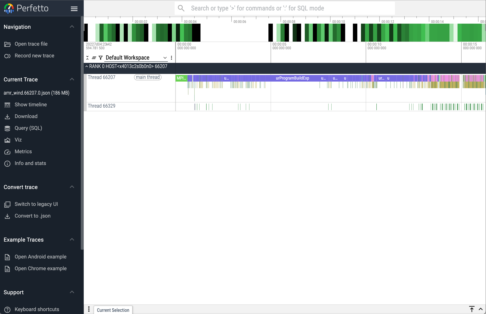

# Unified Tracing and Profiling Tool

## Introduction

This a performance tool for Intel(R) oneAPI applications. It traces and profiles host/device activities, interactions and hardware utilizations for Intel(R) GPU applications.

### Features
* Level Zero (L0) or Level Zero + OpenCL tracking/profiling
* Host activities
* Device and kernel activities
* Trace and profile layers (e.g., MPI, SYCL, CCL, oneDNN) above L0/OpenCL
* Categorizing GPU kernels
* Profile hardware performance metrics

## Instruction

### Loading the module
```
$ module load pti-gpu
$ unitrace --version
2.1.2 (31dd08753125943b26475cec6a489b7c52c064dd)
```

### Usage of `unitrace`
```
$ unitrace --help
Usage: unitrace [options] <application> <args>
Options:
--call-logging [-c]            Trace host API calls
--host-timing  [-h]            Report host API execution time
--device-timing [-d]           Report kernels execution time
--ccl-summary-report [-r]      Report CCL execution time summary
--kernel-submission [-s]       Report append (queued), submit and execute intervals for kernels
--device-timeline [-t]         Report device timeline
--opencl                       Trace OpenCL
--chrome-mpi-logging           Trace MPI
--chrome-sycl-logging          Trace SYCL runtime and plugin
--chrome-ccl-logging           Trace oneCCL
--chrome-dnn-logging           Trace oneDNN
--chrome-call-logging          Trace Level Zero and/or OpenCL host calls
--chrome-kernel-logging        Trace device and host kernel activities
--chrome-device-logging        Trace device activities
--chrome-itt-logging           Trace activities in applications instrumented using Intel(R) Instrumentation and Tracing Technology APIs
--chrome-no-thread-on-device   Trace device activities without per-thread info.
                               Device activities are traced per thread if this option is not present
--chrome-no-engine-on-device   Trace device activities without per-Level-Zero-engine-or-OpenCL-queue info.
                               Device activities are traced per Level-Zero engine or OpenCL queue if this option is not present
--chrome-event-buffer-size <number-of-events>    Size of event buffer on host per host thread(default is -1 or unlimited)
--chrome-device-timeline       DEPRECATED - use --chrome-kernel-logging instead
--chrome-kernel-timeline       DEPRECATED - use --chrome-kernel-logging instead
--chrome-device-stages         DEPRECATED - use --chrome-kernel-logging instead
--verbose [-v]                 Enable verbose mode to show kernel shapes
                               Kernel shapes are always enabled in timelines for Level Zero backend
--demangle                     Demangle kernel names. For OpenCL backend only. Kernel names are always demangled for Level Zero backend
--kernels-per-tile             DEPRECATED - use --separate-tiles instead
--separate-tiles               Trace each tile separately in case of implicit scaling
--tid                          Output TID in host API trace
--pid                          Output PID in host API and device activity trace
--output [-o] <filename>       Output profiling result to file
--conditional-collection       Enable conditional collection
--output-dir-path <path>       Output directory path for result files
--metric-query [-q]            Query hardware metrics for each kernel instance is enabled for level-zero.
--metric-sampling [-k]         Sample hardware performance metrics for each kernel instance in time-based mode
--group [-g] <metric-group>    Hardware metric group (ComputeBasic by default)
--sampling-interval [-i] <interval> Hardware performance metric sampling interval in us (default is 50 us) in time-based mode
--device-list                  Print available devices
--metric-list                  Print available metric groups and metrics
--stall-sampling               Sample hardware execution unit stalls. Valid for Intel(R) Data Center GPU Max Series and later GPUs
--ranks-to-sample <ranks>      MPI ranks to sample. The argument <ranks> is a list of comma separated MPI ranks
--version                      Print version
--help                         Show this help message and exit. Please refer to the README.md file for further details.

```

### Running with an MPI application
```
$ mpirun <mpi arguments> unitrace [options] <application> <args>
```

## Simple examples

### `unitrace` MPI and SYCL tracing for `amr-wind` application with 24 MPI ranks on two Aurora nodes

```console
$ mpirun -n 24 --ppn 12 gpu_tile_compact.sh unitrace --chrome-mpi-logging --chrome-sycl-logging  ../amr_wind abl_godunov.inp  
==============================================================================
                AMR-Wind (https://github.com/exawind/amr-wind)

  AMR-Wind version :: v3.4.2
  AMR-Wind Git SHA :: ed475a0533dfacf1fdff0b707518ccf99040d9f9
  AMReX version    :: 25.04-9-g30a9768150c4

...<skipping application standard output>...

AMReX (25.04-9-g30a9768150c4) finalized

[INFO] Timeline is stored in amr_wind.31084.13.json
[INFO] Timeline is stored in amr_wind.31085.14.json
[INFO] Timeline is stored in amr_wind.31086.15.json
[INFO] Timeline is stored in amr_wind.31088.17.json
[INFO] Timeline is stored in amr_wind.31090.19.json
[INFO] Timeline is stored in amr_wind.31096.21.json
[INFO] Timeline is stored in amr_wind.31089.18.json
[INFO] Timeline is stored in amr_wind.31091.20.json
[INFO] Timeline is stored in amr_wind.31087.16.json
[INFO] Timeline is stored in amr_wind.31099.22.json
[INFO] Timeline is stored in amr_wind.31102.23.json
[INFO] Timeline is stored in amr_wind.31083.12.json
[INFO] Timeline is stored in amr_wind.66221.8.json
[INFO] Timeline is stored in amr_wind.66271.10.json
[INFO] Timeline is stored in amr_wind.66272.11.json
[INFO] Timeline is stored in amr_wind.66270.9.json
[INFO] Timeline is stored in amr_wind.66214.7.json
[INFO] Timeline is stored in amr_wind.66209.2.json
[INFO] Timeline is stored in amr_wind.66211.4.json
[INFO] Timeline is stored in amr_wind.66208.1.json
[INFO] Timeline is stored in amr_wind.66212.5.json
[INFO] Timeline is stored in amr_wind.66213.6.json
[INFO] Timeline is stored in amr_wind.66210.3.json
[INFO] Timeline is stored in amr_wind.66207.0.json

```

Download json files and open them with [Perfetto ](https://ui.perfetto.dev/#!/viewer)

 

")


## References
[unitrace github repository](https://github.com/intel/pti-gpu/tree/master/tools/unitrace)  
[2025 ALCF INCITE Hackathon virtual week](./Presentations/2025_INCITE_Hackathon_Part_1_light-weight-tools-iprof_unitrace_xpu-smi.pdf)


