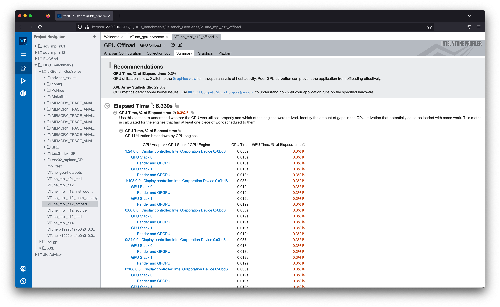
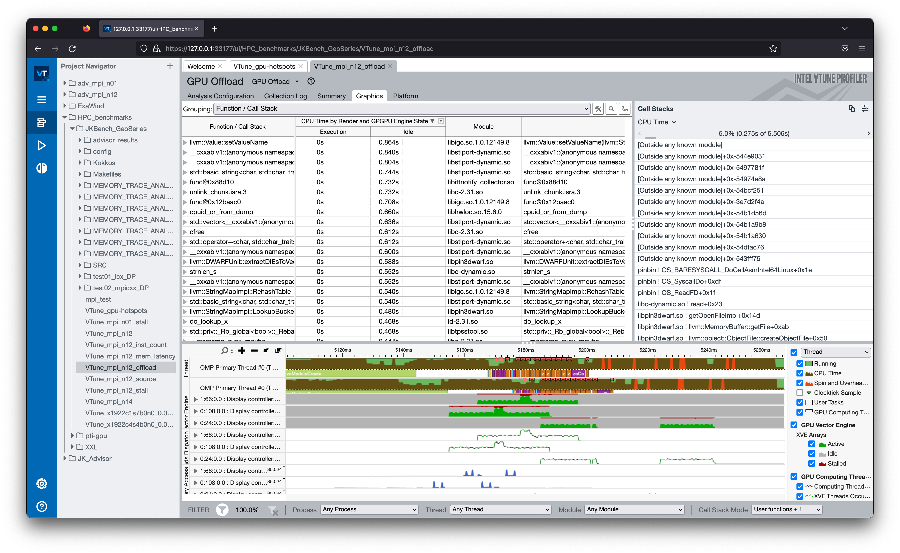
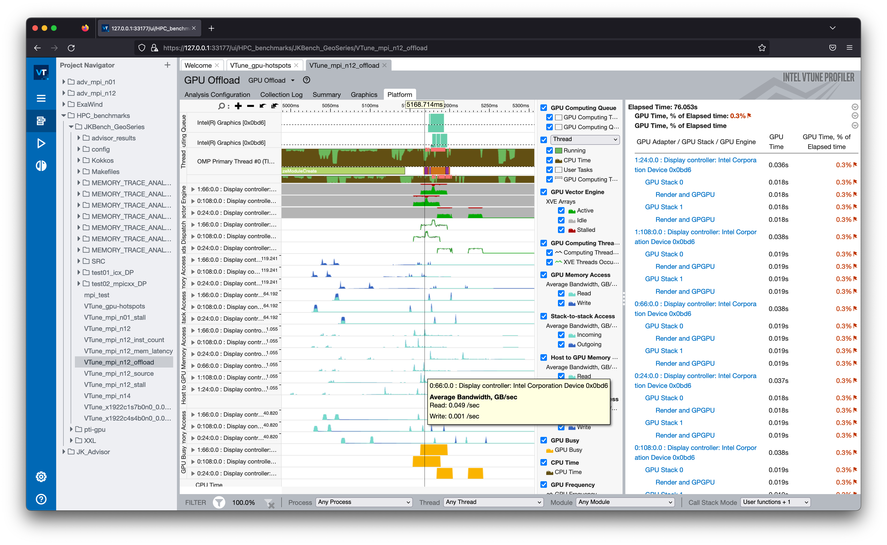
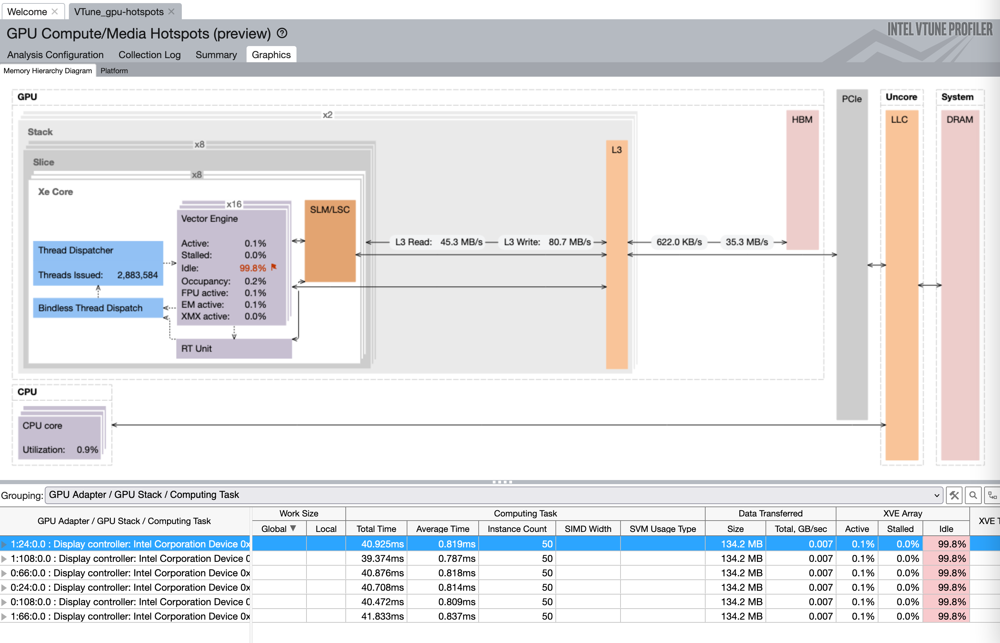
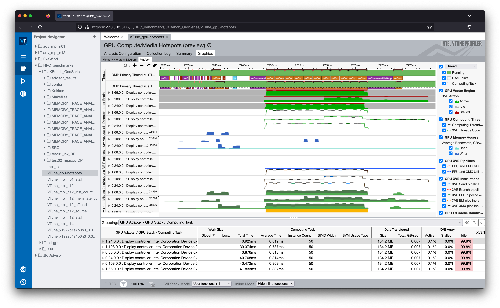
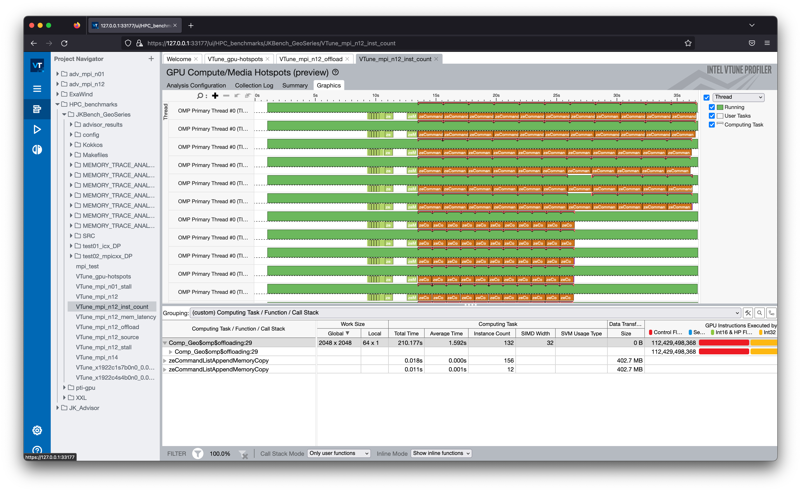
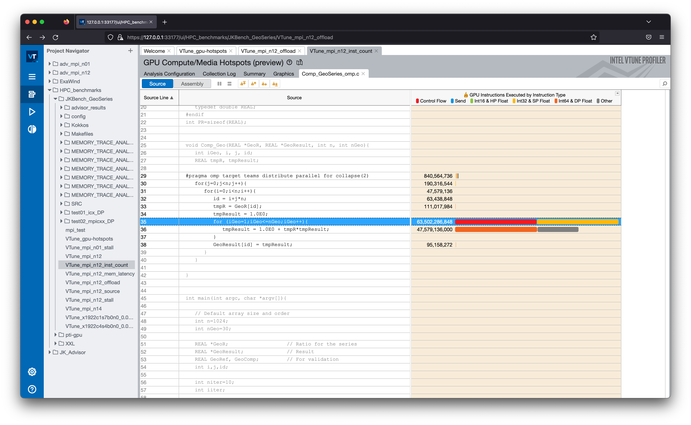
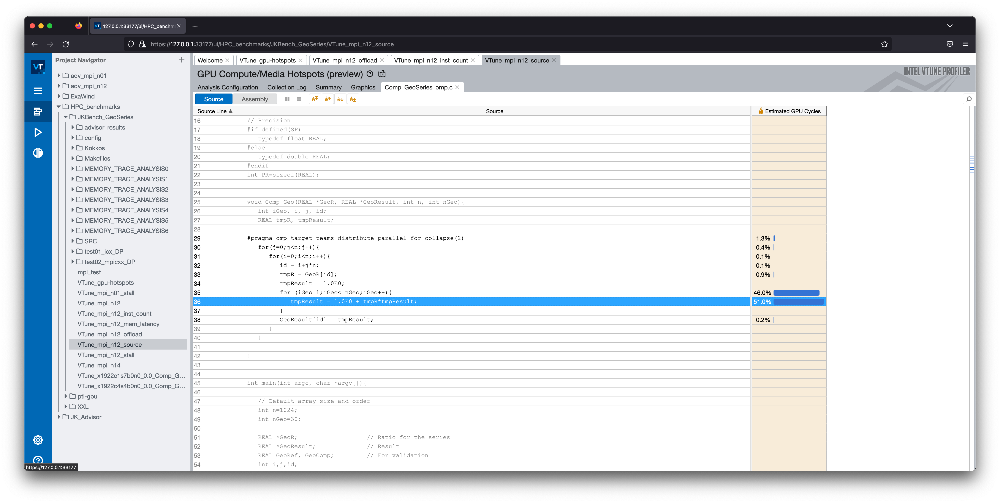
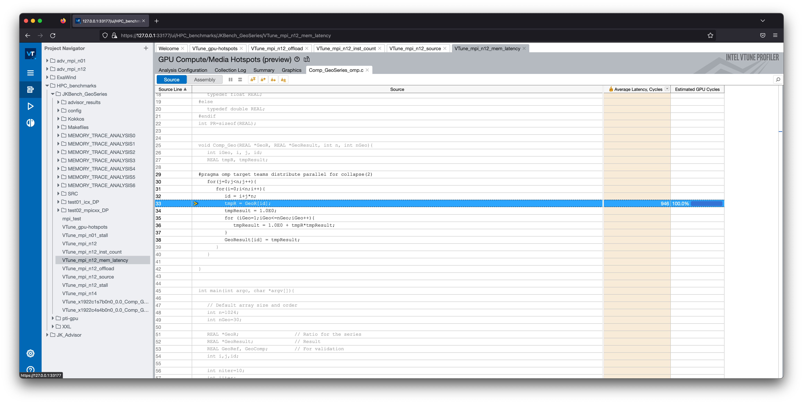

# VTune

## Introduction
Intel VTune Profiler can be used to find and fix performance bottlenecks quickly. There are several options (i.e., GPU Hotspots analysis, GPU Offload analysis, and HPC Performance Characterization analysis) available for Intel CPUs and GPUs on Aurora.

Intel® VTune™ Profiler is a performance analysis tool for serial, multithreaded, GPU-accelerated applications. Use VTune Profiler to analyze your choice of algorithm. Identify potential benefits for your application on Intel CPUs and GPUs on Aurora.

Use VTune Profiler to locate or determine:

* The most time-consuming (hot) functions in your application and/or on the whole system
* Sections of code that do not effectively utilize available processor time
* The best sections of code to optimize for sequential performance and for threaded performance
* Synchronization objects that affect the application performance
* Whether, where, and why your application spends time on input/output operations
* Whether your application is CPU or GPU bound and how effectively it offloads code to the GPU
* The performance impact of different synchronization methods, different numbers of threads, or different algorithms
* Thread activity and transitions
* Hardware-related issues in your code such as data sharing, cache misses, branch misprediction, and others

## VTune analysis types for Intel GPUs

### GPU offload
```bash
vtune –collect gpu-offload <target>
```

This analysis enables you to:
* Identify how effectively your application uses SYCL, OpenMP, or OpenCL kernels and explore them further with GPU Compute/Media Hotspots analysis
* Analyze execution of Intel Media SDK tasks over time
* Explore GPU usage and analyze a software queue for GPU engines at each moment of time

### GPU Compute/Media Hotspots
```bash
vtune –collect gpu-hotspots <target>
```

Use the GPU Compute/Media Hotspots analysis to:
* Explore GPU kernels with high GPU utilization, estimate the effectiveness of this utilization, identify possible reasons for stalls or low occupancy, and options.
* Explore the performance of your application per selected GPU metrics over time.
* Analyze the hottest SYCL* standards or OpenCL™ kernels for inefficient kernel code algorithms or incorrect work item configuration.

The GPU Compute/Media Hotspots analysis is a good next step if you have already run the GPU Offload analysis and identified:
* a performance-critical kernel for further analysis and optimization;
* a performance-critical kernel that is tightly connected with other kernels in the program and may slow down their performance.

For source-level in-kernel profiling, applications should be built with __*-fdebug-info-for-profiling -gline-tables-only*__.

## A quick instruction for VTune analysis on Intel GPUs

GPU hotspots analysis can be used as the first step. Without special knobs, its overhead is minimal, and it provides useful performance data such as kernel time, instance count, SIMD width, EU Array active/stalled/idle ratio, EU occupancy, GPU barriers/atomic, and so on. The following are simple instructions on Intel GPUs:

### Running an application with VTune on Intel GPUs

```bash
module load oneapi

### To run an application on a single stack of a GPU
ZE_AFFINITY_MASK=0.0 vtune -collect gpu-hotspots -r VTune_results_1S -- ./a.out

### To run an application on two stacks of a single GPU
ZE_AFFINITY_MASK=0 vtune -collect gpu-hotspots -r VTune_results_2S -- ./a.out

### To run an MPI application (e.g., 24 MPI ranks on two Aurora nodes)
mpirun -n 24 gpu_tile_compact.sh vtune -collect gpu-hotspots -r VTune_results_MPI -- ./a.out

### To run an MPI application with VTune on a select MPI (e.g., MPI rank 5 out of 24 ranks)
mpirun -n 5 gpu_tile_compact.sh ./a.out : -n 1 gpu_tile_compact.sh vtune -collect gpu-hotspots -r VTune_results_MPI_5 -- ./a.out : -n 18 ./a.out 
```

### Checking if VTune collection is successful or not
After successful VTune analysis, VTune provides *Hottest GPU Computing Tasks with High Sampler Usage* with non-zero data. The following is an example from a GeoSeries benchmark:

```output
Hottest GPU Computing Tasks with High Sampler Usage
Computing Task                                                                                                                         Total Time
-------------------------------------------------------------------------------------------------------------------------------------  ----------
Comp_Geo(cl::sycl::queue, double*, double*, int, int)::{lambda(cl::sycl::handler&)#1}::operator()(cl::sycl::handler&) const::Comp_Geo      0.627s
zeCommandListAppendMemoryCopy         
```

### After collecting the performance data, *VTune profiler web server* can be used for the post-processing.

Step 1: Open a new terminal and log into an Aurora login node (no X11 forwarding required)
```bash
ssh <username>@aurora.alcf.anl.gov
```
Step 2: Start VTune server on an Aurora login node after loading the oneAPI module and setting the corresponding environmental variables for VTune
```bash
module load oneapi
vtune-backend --data-directory=<location of precollected VTune results>
```
Step 3: Open a new terminal and login to the same login node on Step 2 (e.g., if Step 2 uses `aurora-uan-0009`, directly login to `aurora-uan-0009.aurora.alcf.anl.gov`) with SSH port forwarding enabled as follows:
```bash
ssh -L 127.0.0.1:<port printed by vtune-backend>:127.0.0.1:<port printed by vtune-backend> <username>@aurora-uan-00xx.aurora.alcf.anl.gov
```

Step 4: Open the URL printed by VTune server in Firefox web browser on your local computer. For a security warning, click "Advanced..." and then "Accept the Risk and Continue".

* Accept VTune server certificate:
When you open VTune GUI, your web browser will complain about VTune self-signed certificate. You either need to tell the web browser to proceed or install the VTune server certificate on your client machine so that the browser trusts it. To install the certificate, note the path to the public part of the certificate printed by VTune server in the output, copy it to your client machine, and add it to the trusted certificates.

* Set the passphrase:
When you run the server for the first time, the URL that it outputs contains a one-time token. When you open such a URL in the browser, VTune server prompts you to set a passphrase. Other users can't access your VTune server without knowing this passphrase. The hash of the passphrase will be persisted on the server. Also, a secure HTTP cookie will be stored in your browser so that you do not need to enter the passphrase each time you open VTune GUI.


## Simple examples

### VTune gpu-offload analysis

```bash
mpiexec -n 12 gpu_tile_compact.sh vtune -collect gpu-offload -r VTune_gpu-offload ./Comp_GeoSeries_omp_mpicxx_DP 2048 1000
```







### VTune gpu-hotspots analysis

```bash
mpiexec -n 12 gpu_tile_compact.sh vtune -collect gpu-hotspots -r VTune_gpu-hotspots ./Comp_GeoSeries_omp_mpicxx_DP 2048 1000
```






### VTune instruction count analysis

```bash
mpiexec -n 12 gpu_tile_compact.sh vtune -collect gpu-hotspots -knob characterization-mode=instruction-count -r VTune_inst-count ./Comp_GeoSeries_omp_mpicxx_DP 2048 1000
```






### VTune source analysis

```bash
mpiexec -n 12 gpu_tile_compact.sh vtune -collect gpu-hotspots -knob profiling-mode=source-analysis -r VTune_source ./Comp_GeoSeries_omp_mpicxx_DP 2048 1000
```



### VTune memory latency analysis

```bash
mpiexec -n 12 gpu_tile_compact.sh vtune -collect gpu-hotspots -knob profiling-mode=source-analysis -knob source-analysis=mem-latency -r VTune_mem-latency ./Comp_GeoSeries_omp_mpicxx_DP 2048 1000
```




## Known issues and workarounds

* `gpu-offload` analysis may hang with some applications. **Workaround**: add `-run-pass-thru=--perf-threads=none` to the VTune command line

## References  
[Intel VTune Profiler User Guide](https://www.intel.com/content/www/us/en/docs/vtune-profiler/user-guide/current/overview.html)

[Downloadable documents for VTune Profiler](https://d1hdbi2t0py8f.cloudfront.net/vtune-docs/index.html)

[2025 ALCF INCITE Hackathon virtual week](./Presentations/2025_INCITE_Hackathon_Part_2_Intel_Analyzers.pdf)


