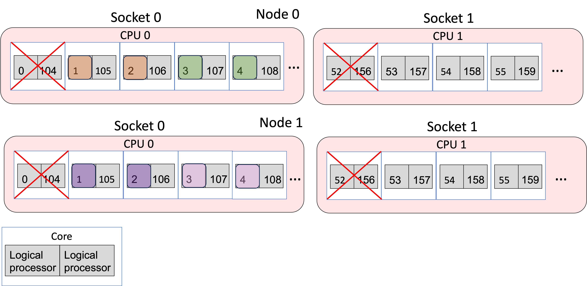
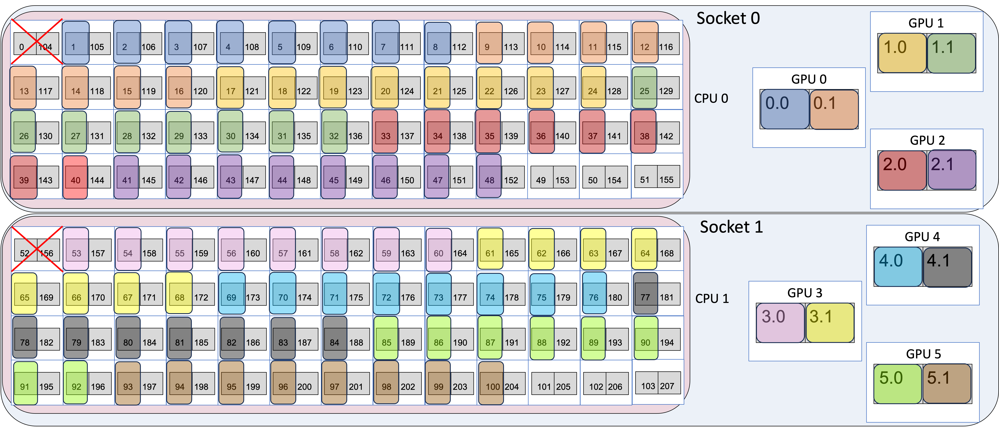

# Running Jobs on Aurora

## <a name="Aurora-Queues"></a>Queues

There are four production queues you can target in your qsub (`-q <queue name>`):

| Queue Name    | Node Min | Node Max | Time Min | Time Max | Notes                                                                                                |
|---------------|----------|----------|----------|----------|------------------------------------------------------------------------------------------------------|
| debug         | 1        | 2        | 5 min    | 1 hr     | 32 exclusive nodes with growth up to 64 nodes;  <br/> Max 1 job running/accruing/queued **per-user** |
| debug-scaling | 2        | 31       | 5 min    | 1 hr     | Max 1 job running/accruing/queued **per-user**                                                       |
| prod          | 32       | 2048     | 5 min    | 18 hrs   | Routing queue for tiny, small, and medium queues; <br/> See table below                              |
| prod-large    | 2048     | 10624    | 5 min    | 24 hrs   | ***By request only*** <br/> Routing queue for large jobs; See table below                            |
| visualization | 1        | 32       | 5 min    | 8 hrs    | ***By request only***                                                                                |

!!! note

  	The debug queue has 32 exclusively dedicated nodes. If there are free nodes in production, then debug jobs can take another 32 nodes for a total of 64.

`prod` and `prod-large` are routing queues and routes your job to one of the following eight execution queues:

| Queue Name      | Node Min | Node Max | Time Min | Time Max | Notes                                                                                              |
|-----------------|----------|----------|----------|----------|----------------------------------------------------------------------------------------------------|
| tiny            | 32       | 512      | 5 min    | 6 hrs    |                                                                                                    |
| small           | 513      | 1024     | 5 min    | 12 hrs   |                                                                                                    |
| medium          | 1025     | 2048     | 5 min    | 18 hrs   |                                                                                                    |
| large           | 2048     | 10624    | 5 min    | 24 hrs   | ***Only accessible with access to prod-large queue***                                              |
| backfill-tiny   | 32       | 512      | 5 min    | 6 hrs    | Low priority, negative project balance                                                             |
| backfill-small  | 513      | 1024     | 5 min    | 12 hrs   | Low priority, negative project balance                                                             |
| backfill-medium | 1025     | 2048     | 5 min    | 18 hrs   | Low priority, negative project balance                                                             |
| backfill-large  | 2049     | 10624    | 5 min    | 24 hrs   | ***Only accessible with access to prod-large queue*** <br/> Low priority, negative project balance |

!!! warning

    You cannot submit to these queues directly; you can only submit to the routing queue `prod` or `prod-large`.

!!! note

      All of these queues have a limit of ten (10) jobs running/accruing per-project.
      All of these queues have a limit of one hundred (100) jobs queued (not accruing score) per-project.

### Submitting a job

Note: Jobs should be submitted only from your allocated project directory and not from your home directory or from `/soft/modulefiles`. Submitting an interactive job from `/soft/modulefiles` will result in your job ending abruptly.

For example, a one-node interactive job requiring access to the `/flare` filesystem can be requested for 30 minutes with the following command, where `<your_ProjectName>` is replaced with an appropriate project name.

```bash
qsub -l select=1 -l walltime=30:00 -l filesystems=flare -A <your_ProjectName> -q debug -I
```
      
For DAOS access, users will need to include either `daos_user` or `daos_perf` (only for select teams approved by ALCF) as a filesystem option. More information can be found on the [DAOS](./data-management/daos/daos-overview.md) page.

!!! tip

      To view the available filesystem options, execute the `qstat -Bf` command and view the `resources_available.valid_filesystems` entry.

Recommended PBSPro options follow.

```bash linenums="1"
#!/bin/bash -l
#PBS -A <your_ProjectName>
#PBS -N <your_JobName>
#PBS -l walltime=<requested_walltime_value>
#PBS -l filesystems=<requested_fs1:requested_fs2>
#PBS -k doe
#PBS -l place=scatter
#PBS -q <requested_Queue>
```

More information on the PBS options above, as well as other PBS options, can be found [here](../running-jobs/job-and-queue-scheduling.md).

## Working Around Node Failures

As Aurora is still a pre-production supercomputer, node failures are a fact of life. If you would like to increase the chances that a large job does not terminate due to a node failure, you may choose to interactively route your MPI job around nodes that fail during your run. To do this, you must run interactively and use must manually adjust your run on the fly to remove nodes that have been marked as failed.

We recommend against using `-W tolerate_node_failures=all` in your qsub command, but we acknowledge its use can be helpful. However, you MUST MANUALLY VERIFY your job and remove faulted nodes from your mpiexec command YOURSELF!

1. Start your interactive job
2. When the job transitions to Running state, run `pbsnodes -l | grep <jobid>`
3. Manually REMOVE all nodes identified in that output from inclusion in your mpiexec

    ```bash linenums="1"
    cat $PBS_NODEFILE > local.hostfile
    # edit local.hostfile to remove problem nodes
    mpiexec --hostfile local.hostfile <other mpiexec arguments>
    ```

4. Continue to execute
5. If other nodes go down during your job, it will not be killed, and you can further exclude those nodes from your mpiexec as needed

It is important to note that all nodes marked as faulty by PBS will not be used in subsequent jobs. This mechanism only provides you with a means to execute additional mpiexec commands under the same interactive job after manually removing nodes identified as faulty. Once your PBS job has exited, those faulty nodes will remain offline until further intervention by Aurora staff.

## <a name="Aurora-MPICH"></a>Aurora MPICH

The standard version of the MPI (Message Passing Interface) library on Aurora is *Aurora MPICH*. This resulted from a collaboration between Intel and the Argonne MPICH developer team. The `mpiexec` and `mpirun` commands used to launch multi-rank jobs come from the Cray PALS (Parallel Application Launch Service) system.

There are many, many configuration and tuning parameters for Aurora MPICH. Simple ASCII text documentation of the environment variables usable to control behavior is in

```bash
$MPI_ROOT/share/doc/mpich/README.envvar
```

This includes, for example, settings to select different optional sub-algorithms used in MPI collective operations.

## <a name="Running-MPI+OpenMP-Applications"></a>Running MPI+OpenMP Applications

Once a submitted job is running calculations can be launched on the compute nodes using `mpiexec` to start an MPI application. Documentation is accessible via `man mpiexec` and some helpful options follow.

* `-n` total number of MPI ranks
* `-ppn` number of MPI ranks per node
* `--cpu-bind` CPU binding for application
* `--depth` number of cpus per rank (useful with `--cpu-bind`)
* `--env` set environment variables (`--env OMP_NUM_THREADS=2`)
* `--hostfile` indicate file with hostnames (the default is `--hostfile $PBS_NODEFILE`)

A sample submission script with directives is below for a 4-node job with 28 MPI ranks on each node and 4 OpenMP threads per rank (1 per CPU core).

```bash linenums="1"
#!/bin/bash -l
#PBS -N AFFINITY
#PBS -l select=4
#PBS -l place=scatter
#PBS -l walltime=0:10:00
#PBS -l filesystems=<fs1:fs2>
#PBS -q debug-scaling
#PBS -A <MYPROJECT>

NNODES=`wc -l < $PBS_NODEFILE`
NRANKS=28 # Number of MPI ranks to spawn per node
NDEPTH=4 # Number of hardware threads per rank (i.e. spacing between MPI ranks)
NTHREADS=4 # Number of software threads per rank to launch (i.e. OMP_NUM_THREADS)

NTOTRANKS=$(( NNODES * NRANKS ))

echo "NUM_OF_NODES= ${NNODES} TOTAL_NUM_RANKS= ${NTOTRANKS} RANKS_PER_NODE= ${NRANKS} THREADS_PER_RANK= ${NTHREADS}"

cd /home/knight/affinity
mpiexec -n ${NTOTRANKS} -ppn ${NRANKS} --depth=${NDEPTH} --cpu-bind depth -env OMP_NUM_THREADS=${NTHREADS} --env OMP_PLACES=cores ./hello_affinity
```

## <a name="Running-GPU-enabled-Applications"></a>Running GPU-enabled Applications
GPU-enabled applications will similarly run on the compute nodes using the above example script.
- The environment variable `MPICH_GPU_SUPPORT_ENABLED=1` needs to be set if your application requires MPI-GPU support whereby the MPI library sends and receives data directly from GPU buffers.
- If running on a specific GPU or subset of GPUs and/or tiles is desired, then the `ZE_AFFINITY_MASK` environment variable can be used. For example, if one only wanted an application to access the first two GPUs on a node, then setting `ZE_AFFINITY_MASK=0,1` could be used.

## MPI rank and thread binding to cores and GPUs

Each node on Aurora has 2 sockets, each with 1 CPU and 3 PVC GPUs. Each CPU has 52 physical cores, with 2 logical processors (provided by Intel hyper threading) per physical core, for a total of 104 physical cores and 208 logical processors on the CPUs per Aurora node. Each GPU has two tiles on it, for a total of 6 GPUs and 12 GPU tiles on the GPUs per Aurora node. When a parallel job is run, the job must have some way of mapping MPI ranks or threads to each of the 208 logical processors and 6 GPUs or 12 GPU tiles. Mapping is typically done by an affinity mask, which assigns hardware resources to each MPI rank or thread to use.

A visual representation of node in Aurora is shown below. Each socket is represented by a large blue bubble. Inside, each CPU is represented by a red bubble. Inside of CPU, the white boxes represent the physical cores, and the two grey squares in each tile represent the two logical processors. Each GPU is represented by a large white box, with two grey boxes inside to represent the two tiles.

<figure markdown>
  { width="1000" }
  <figcaption>Simplified representation of Aurora node </figcaption>
</figure>

For the two CPUs, the numbers inside the boxes identify the specific logical processors in the core. That is, logical processor 0 and 104 are the 2 logical processors on the first physical core. Logical processors 1 and 105 are the 2 logical processors that share the second physical core. Since there are 208 logical processors, the numbers run from 0 to 207. For i from 0 to 51, logical processors i and i+104 share a physical core. 

For the six GPUs, the GPU number identifies the GPU, and the tile numbers identify the tile in the GPU, with tiles from 0 to 5 with each GPU have two tiles each $gpu.0 and $gpu.1.

### Binding MPI ranks and threads to cores

Using the `–cpu-bind` argument to mpiexec, MPI ranks and threads can be assigned to run on specific logical processors on the CPUs. For more information about the flags to `mpiexec`, see [Running MPI+OpenMP Applications](#Running-MPI+OpenMP-Applications). Four examples of using `mpiexec` are given below to show how the `cpu-bind=depth`, `cpu-bind=list`, `--depth` arguments affect where MPI ranks and OpenMP threads are mapped.

#### Example 1: 2 nodes, 4 ranks/node, 1 thread/rank

```
mpiexec -n 8 -ppn 4 --depth 1 --cpu-bind=depth <app> <app_args>
```

- The `-n 8` argument says to use 8 MPI ranks in total and `-ppn 4` places 4 ranks per node.
- The `--depth 1` argument says to use 1 logical processor for each MPI rank.
- The `--cpu-bind depth` argument says to spread out the ranks in a round robin manner across the logical processors, first putting one rank on the first logical processor of one physical core, and then looping back to put a second one on the second logical processor. This is done such that there's N logical processors for each MPI rank, where N is the value from the --depth argument (so it's 1 in this case).

This is the same as

```bash
mpiexec -n 8 -ppn 4 --cpu-bind=list:0:1:2:3 <app> <app_args>
```

- The `--cpu-bind list` argument explicitly lists which logical processor to bind to per node. Each MPI rank is bound to the logical processors that are listed between `:`. So here, rank 0 to logical processor 0, rank 1 to logical processor 1, etc.


#### Resulting mapping
MPI ranks 0,1,2,3,4,5,6,7 map to logical processors 0,1,2,3 on each of the two nodes. Assuming the job was allocated on node 0 and node 1:

- MPI rank 0 → node 0, logical processor 0
- MPI rank 1 → node 0, logical processor 1
- MPI rank 2 → node 0, logical processor 2
- MPI rank 3 → node 0, logical processor 3
- MPI rank 4 → node 1, logical processor 0
- MPI rank 5 → node 1, logical processor 1
- MPI rank 6 → node 1, logical processor 2
- MPI rank 7 → node 1, logical processor 3

The figure below shows the mapping, where the different colors are different MPI ranks.

<figure markdown>
  { width="700" }
  <figcaption>Example 1 Mapping </figcaption>
</figure>


#### Example 2: 2 nodes, 2 ranks/node, 2 thread/rank

```bash
OMP_PLACES=threads OMP_NUM_THREADS=2 mpiexec -n 4 -ppn 2 --depth 2 --cpu-bind=depth <app> <app_args>
```

- The `-n 4` argument says to use 4 MPI ranks in total and `-ppn 2` places 2 ranks per node.
- The `--depth 2` argument says to use 2 logical processor for each MPI rank.
- The `--cpu-bind depth` argument says to spread out the ranks in a round robin manner across the logical processors, first putting one rank on the first logical processor of one physical core, and then looping back to put a second one on the second logical processor. This is done such that there's N logical processors for each MPI rank, where N is the value from the --depth argument (so it's 2 in this case).
- OMP_NUM_THREADS=2 launches two threads per MPI rank
- OMP_PLACES=threads says to bind the OpenMP threads to logical processors

This is the same as:

```bash
OMP_PLACES=threads OMP_NUM_THREADS=2 mpiexec -n 4 -ppn 2 --cpu-bind=list:0,1:2,3 <app> <app_args>
```

- The `--cpu-bind list` argument explicitly lists which logical processor to bind to. Each MPI rank is bound to the logical processors that are listed between `:`. Between `:`, the logical processors to bind to are listed in a comma-separated manner. So here, rank 0 is bound to logical processors 0 and 1, rank 2 to logical processors 2 and 3. OMP_PLACES=threads then binds the specific threads to the logical processors in the list.

#### Resulting mapping
Assuming the job was allocated on node 0 and node 1:

- MPI rank 0, OpenMP thread 0 → node 0, logical processor 0
- MPI rank 0, OpenMP thread 1 → node 0, logical processor 1
- MPI rank 1, OpenMP thread 0 → node 0, logical processor 2
- MPI rank 1, OpenMP thread 1 → node 0, logical processor 3
- MPI rank 2, OpenMP thread 0 → node 1, logical processor 0
- MPI rank 2, OpenMP thread 1 → node 1, logical processor 1
- MPI rank 3, OpenMP thread 0 → node 1, logical processor 2
- MPI rank 3, OpenMP thread 1 → node 1, logical processor 3

The figure below shows the mapping, where the different colors are different MPI ranks.

<figure markdown>
  { width="700" }
  <figcaption>Example 2 Mapping </figcaption>
</figure>

#### Example 3: 2 nodes, 2 ranks/node, 1 thread/rank, compact fashion

```bash
mpiexec -n 4 -ppn 2 --cpu-bind=list:0:104 <app> <app_args>
```

- The `--cpu-bind list` argument explicitly lists which logical processor to bind to per node. Each MPI rank is bound to the logical processors that are listed between `:`. So here, rank 0 to logical processor 0, rank 1 to logical processor 104, which share the same physical core.

#### Resulting mapping
Assuming the job was allocated on node 0 and node 1:

- MPI rank 0 → node 0, logical processor 0
- MPI rank 1 → node 0, logical processor 104
- MPI rank 2 → node 1, logical processor 0
- MPI rank 3 → node 1, logical processor 104

The figure below shows the mapping, where the different colors are different MPI ranks.

<figure markdown>
  { width="700" }
  <figcaption>Example 3 Mapping </figcaption>
</figure>

#### Example 4: 1 node, 12 ranks/node

This setup is a common case for applications: 12 ranks/node, where each rank will offload to one of the 12 GPU tiles. Note that explicit list binding is needed here to avoid binding a MPI rank to a logical processor on different socket than the GPU it might be targetting (as would happen if cpu_bind=depth was used). 

```bash
mpiexec -n 12 -ppn 12 --cpu-bind=list:0-7:8-15:16-23:24-31:32-39:40-47:52-59:60-67:68-75:76-83:84-91:92-99 <app> <app_args>
```

- The `--cpu-bind list` argument explicitly lists which logical processor to bind to per node. Each MPI rank is bound to the logical processors that are listed between `:`. So here, rank 0 to logical processors 0-7, rank 1 to logical processors 8-15, etc.

#### Resulting mapping
Assuming the job was allocated on node 0 and node 1, the mapping looks like:


- MPI rank 0 → node 0, socket 0, logical processors 0-7
- MPI rank 1 → node 0, socket 0, logical processor 8-15
- MPI rank 2 → node 0, socket 0, logical processor 16-23
- MPI rank 3 → node 0, socket 0, logical processor 24-31
- MPI rank 4 → node 0, socket 0, logical processor 32-39
- MPI rank 5 → node 0, socket 0, logical processor 40-47
- MPI rank 6 → node 0, socket 1, logical processor 52-59
- MPI rank 7 → node 0, socket 1, logical processor 60-67
- MPI rank 8 → node 0, socket 1, logical processor 68-75
- MPI rank 9 → node 0, socket 1, logical processor 76-83
- MPI rank 10 → node 0, socket 1, logical processor 84-91
- MPI rank 11 → node 0, socket 1, logical processor 92-99

The important point here is that with explicit binding, we were able to ensure socket 0 had 6 ranks and socket 1 has 6 ranks. Note how MPI rank 5 ends at logical processor 47, but MPI rank 6 begins with logical processor 52, so this involves leaving several cores empty. However, it allows the cores to be spread evenly across the two sockets.   

The figure below shows the mapping, where the different colors are different MPI ranks.

<figure markdown>
  { width="700" }
  <figcaption>Example 4 Mapping </figcaption>
</figure>


If instead we used `--depth` as so:
```bash
mpiexec -n 12 -ppn 12 --depth 8 --cpu-bind=depth <app> <app_args>
```
then the mapping is:

- MPI rank 0 → node 0, socket 0, logical processors 0-7
- MPI rank 1 → node 0, socket 0, logical processor 8-15
- MPI rank 2 → node 0, socket 0, logical processor 16-23
- MPI rank 3 → node 0, socket 0, logical processor 24-31
- MPI rank 4 → node 0, socket 0, logical processor 32-39
- MPI rank 5 → node 0, socket 0, logical processor 40-47
- MPI rank 6 → node 0, socket 0 and socket 1, logical processor 48-55
- MPI rank 7 → node 0, socket 1, logical processor 56-63
- MPI rank 8 → node 0, socket 1, logical processor 64-71
- MPI rank 9 → node 0, socket 1, logical processor 72-79
- MPI rank 10 → node 0, socket 1, logical processor 80-87
- MPI rank 11 → node 0, socket 1, logical processor 88-95


Note that the threads MPI rank 6 are bound to cross both socket 0 and socket 1, which potentially will lead to worse performance than using cpu-bind=list to explicitly spread out the ranks and avoid splitting one over two sockets. This is shown in the image below. Note that the pink MPI rank (rank 6) is split between socket 0 and socket 1.

<figure markdown>
  { width="700" }
  <figcaption>Example 4 Mapping Which Splits a MPI Rank Across Sockets </figcaption>
</figure>

!!! info

	For a script to help provide cpu-bindings, you can use [get_cpu_bind_aurora](https://github.com/argonne-lcf/pbs_utils/blob/main/get_cpu_bind_aurora). Please see [User Guide for Aurora CPU Binding Script](https://github.com/argonne-lcf/pbs_utils/blob/main/doc/guide-get_cpu_bind_aurora.md) for documentation. 

### <a name="Binding-MPI-ranks-to-GPUs"></a>Binding MPI ranks to GPUs
Support in MPICH on Aurora to bind MPI ranks to GPUs is currently work-in-progress. For applications that need this support, this instead can be handled by use of a small helper script that will appropriately set `ZE_AFFINITY_MASK` for each MPI rank. Users are encouraged to use the `/soft/tools/mpi_wrapper_utils/gpu_tile_compact.sh` script for instances where each MPI rank is to be bound to a single GPU tile with a round-robin assignment.

This script can be placed just before the executable in an `mpiexec` command like so.

```bash
mpiexec -n ${NTOTRANKS} --ppn ${NRANKS_PER_NODE} --depth=${NDEPTH} --cpu-bind depth /soft/tools/mpi_wrapper_utils/gpu_tile_compact.sh ./hello_affinity
```

A simple version of this script is below to illustrate how `ZE_AFFINITY_MASK` is uniquely set for each MPI rank.

```bash linenums="1"
#!/bin/bash -l
num_gpu=6
num_tile=2
gpu_id=$(( (PALS_LOCAL_RANKID / num_tile ) % num_gpu ))
tile_id=$((PALS_LOCAL_RANKID % num_tile))
unset EnableWalkerPartition
export ZE_ENABLE_PCI_ID_DEVICE_ORDER=1
export ZE_AFFINITY_MASK=$gpu_id.$tile_id
#echo “RANK= ${PMI_RANK} LOCAL_RANK= ${PMI_LOCAL_RANK} gpu= ${gpu}”
exec "$@"
```

Users with different MPI-GPU affinity needs, such as assigning multiple GPUs/tiles per MPI rank, are encouraged to modify a local copy of `/soft/tools/mpi_wrapper_utils/gpu_tile_compact.sh` to suit their needs.

One example below shows a common mapping of MPI ranks to cores and GPUs.

#### Example 1: 1 node, 12 ranks/node, 1 thread/rank, 1 rank/GPU

```bash
mpiexec -n 12 -ppn 12 --cpu-bind=list:0-7:8-15:16-23:24-31:32-39:40-47:52-59:60-67:68-75:76-83:84-91:92-99 /soft/tools/mpi_wrapper_utils/gpu_tile_compact.sh <app> <app_args>
```

- The `-n 12` argument says to use 12 MPI ranks in total and `-ppn 12` places 12 ranks per node.
- The `--cpu-bind list` argument gives the mapping of MPI ranks to cores, as described in [Binding MPI ranks and threads to cores](#binding-mpi-ranks-and-threads-to-cores).
- The /soft/tools/mpi_wrapper_utils/gpu_tile_compact.sh wrapper sets ZE_AFFINITY_MASK for each of the 12 ranks such that rank 0 maps to GPU 0, Tile 0, rank 1 maps to GPU 0, Tile 1, rank 2 naps to GPU 1, Tile 0 etc. in a round-robin compact fashion.  

#### Resulting mapping

This is one of the most common cases, with 1 MPI rank targeting each GPU tile. A figure representing this is below. The different MPI ranks are represented by different colors. Assuming the job was allocated on node 0 and node 1, the mapping looks like:

- MPI rank 0 → node 0, socket 0, logical processors 0-7, GPU 0, Tile 0
- MPI rank 1 → node 0, socket 0, logical processor 8-15, GPU 0, Tile 1
- MPI rank 2 → node 0, socket 0, logical processor 16-23, GPU 1, Tile 0
- MPI rank 3 → node 0, socket 0, logical processor 24-31, GPU 1, Tile 1
- MPI rank 4 → node 0, socket 0, logical processor 32-39, GPU 2, Tile 0
- MPI rank 5 → node 0, socket 0, logical processor 40-47, GPU 2, Tile 1
- MPI rank 6 → node 0, socket 1, logical processor 52-59, GPU 3, Tile 0
- MPI rank 7 → node 0, socket 1, logical processor 60-67, GPU 3, Tile 1
- MPI rank 8 → node 0, socket 1, logical processor 68-75, GPU 4, Tile 0
- MPI rank 9 → node 0, socket 1, logical processor 76-83, GPU 4, Tile 1
- MPI rank 10 → node 0, socket 1, logical processor 84-91, GPU 5, Tile 0
- MPI rank 11 → node 0, socket 1, logical processor 92-99, GPU 5, Tile 1

<figure markdown>
  { width="700" }
  <figcaption>Example 1 GPU Tile Mapping </figcaption>
</figure>


## <a name="Interactive-Jobs-on-Compute-Nodes"></a>Interactive Jobs on Compute Nodes

Here is how to submit an interactive job to, for example, edit/build/test an application on Aurora compute nodes:

```bash
qsub -I -l select=1,walltime=1:00:00,place=scatter -l filesystems=<fs1:fs2> -A <MYPROJECT> -q debug
```

This command requests 1 node for a period of 1 hour in the `workq` queue. After waiting in the queue for a node to become available, a shell prompt on a compute node will appear. You may then start building applications and testing gpu affinity scripts on the compute node.

!!! warning

	If you want to `ssh` or `scp` to one of your assigned compute nodes you will need to make sure your `$HOME` directory and your `$HOME/.ssh` directory permissions are both set to `700`.

## <a name="Running-with-Multiple-CCS"></a>Running with Multiple Compute Command Streamers (CCSs)

The Intel PVC GPUs contain 4 Compute Command Streamers (CCSs) on each tile, which can be used to group Execution Units (EUs) into common pools. 
These pools can then be accessed by separate processes thereby allowing users to bind multiple processes to a single tile and enabling applications to run up to 48 MPI processes per node on the 6 PVC available.
Enabling multiple CCSs on Aurora is similar to the MPS capabilities on NVIDIA GPUs.
By default, all EUs are assigned to a single CCS, but EUs can be distributed equally into 2 or 4 groups by exposing 2 or 4 CCSs, respectively. 
This feature is enabled with the `ZEX_NUMBER_OF_CCS` environment variable, which takes a comma-separated list of device-mode pairs.
For example, to enable 4 CCSs on all 6 PVC, execute
```bash
export ZEX_NUMBER_OF_CCS=0:4,1:4,2:4,3:4,4:4,5:4
```

!!! info "Additional notes when running with multiple CCSs" 

	- Please be mindful of the device hierarchy selected. When running with `ZE_FLAT_DEVICE_HIERARCHY=COMPOSITE`, 6 PVC are exposed to the applications and the above command should be used, noting that `export ZEX_NUMBER_OF_CCS=0:4` exposes 4 CCSs on both tiles of GPU 0. When running with `ZE_FLAT_DEVICE_HIERARCHY=FLAT`, the 12 PVC tiles are exposed to the applications (tile-as-device), thus `export ZEX_NUMBER_OF_CCS=0:4` only refers to tile 0 of GPU 0. To expose multiple CCSs on all tiles, users should use `export ZEX_NUMBER_OF_CCS=0:4,1:4,2:4,3:4,4:4,5:4,6:4,7:4,8:4,9:4,10:4,11:4`.
	- Users should also be mindful of the CPU binding affinity guidelines described above, ensuring that MPI processes are bound to the correct socket and GPU pairs.
	- `ZE_AFFINITY_MASK` is read by the Level Zero driver prior to `ZEX_NUMBER_OF_CCS`, thus `ZEX_NUMBER_OF_CCS` should refer to the GPU IDs of the masked devices.
	- Users can expose different number of CCSs on the different GPU and tiles, the desired CCS mode does not need to be uniform across the GPUs on a node. 

More information can be found on Intel's [documentation](https://www.intel.com/content/www/us/en/docs/oneapi/optimization-guide-gpu/2024-1/multi-tile-advanced-topics.html) and [GitHub](https://github.com/intel/compute-runtime/blob/master/level_zero/doc/experimental_extensions/MULTI_CCS_MODES.md) pages.


## <a name="Running-Multiple-MPI-Applications-on-a-node"></a>Running Multiple MPI Applications on a node

Multiple applications can be run simultaneously on a node by launching several `mpiexec` commands and backgrounding them. For performance, it will likely be necessary to ensure that each application runs on a distinct set of CPU resources and/or targets specific GPUs and tiles. One can provide a list of CPUs using the `--cpu-bind` option, which when combined with `ZE_AFFINITY_MASK` provides a user with specifying exactly which CPU and GPU resources to run each application on. In the simple example below, twelve instances of the application are simultaneously running on a single node. In the first instance, the application is spawning MPI ranks 0-3 on CPU cores 0-3 and using GPU 0 tile 0.

```bash linenums="1"
export OMP_NUM_THREADS=1
export ZE_ENABLE_PCI_ID_DEVICE_ORDER=1

export ZE_AFFINITY_MASK=0.0
mpiexec --np 4 --ppn 4 --cpu-bind list:0:1:2:3 ./hello_affinity &

export ZE_AFFINITY_MASK=0.1
mpiexec -n 4 --ppn 4 --cpu-bind list:4:5:6:7 ./hello_affinity &

export ZE_AFFINITY_MASK=1.0
mpiexec -n 4 --ppn 4 --cpu-bind list:8:9:10:11 ./hello_affinity &


export ZE_AFFINITY_MASK=5.1
mpiexec -n 4 --ppn 4 --cpu-bind list:40:41:42:43 ./hello_affinity &    

wait
```

Users will likely find it beneficial to launch processes across CPU cores in both sockets of a node.

## <a name="Compute-Node-Access-to-the-Internet"></a>Compute Node Access to the Internet

Currently, the only access to the internet is via a proxy.  Here are the proxy environment variables for Aurora:

```bash
export http_proxy="http://proxy.alcf.anl.gov:3128"
export https_proxy="http://proxy.alcf.anl.gov:3128"
export ftp_proxy="http://proxy.alcf.anl.gov:3128"
```

In the future, though we don't have a timeline on this because it depends on future features in slingshot and internal software development, we intend to have public IP addresses be a schedulable resource.  For instance, if only your head node needed public access your select statement might looks something like: `-l select=1:pubnet=True+63`.

## <a name="Controlling-Where-Your-Job-Runs"></a>Controlling Where Your Job Runs
If you wish to have your job run on specific nodes form your select like this: `-l select=1:vnode=<node name1>+1:vnode=<node name2>...` . Obviously, that gets tedious for large jobs.

If you want to control the location of a few nodes, for example 2 out of 64, but the rest don't matter, you can do something like this: `-l select=1:vnode=<node name1>+1:vnode=<node name2>+62:system=foo`.

<!--
## <a name="Rack-and-Dragonfly-Group-Mappings"></a>Network: Rack and Dragonfly Group Mappings
Content coming soon.
-->
