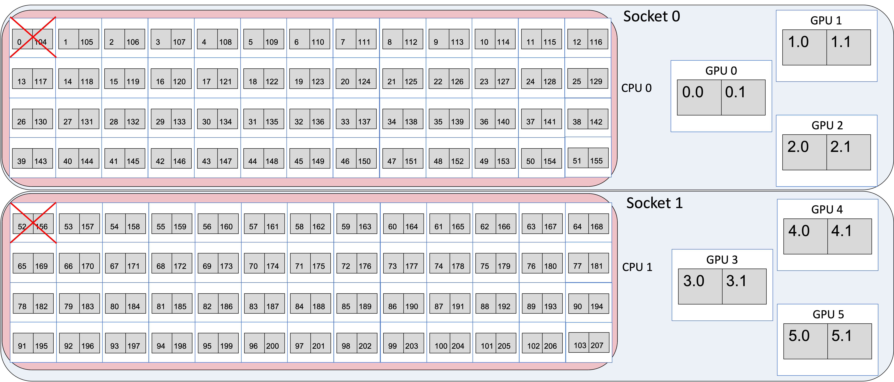
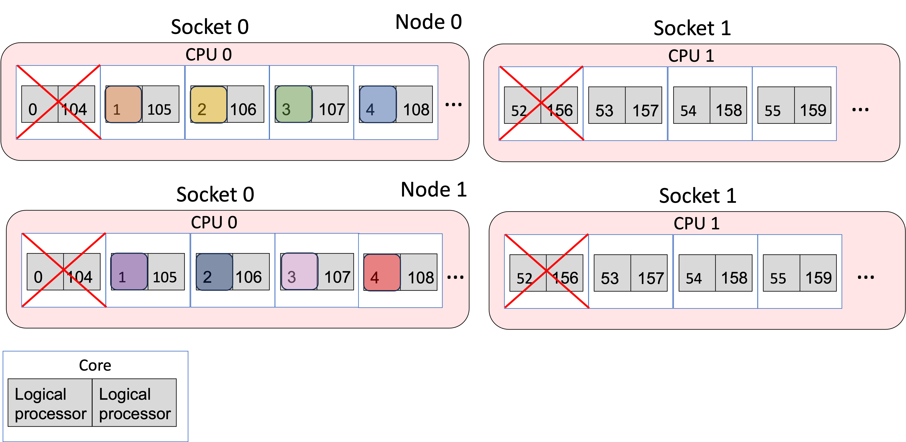
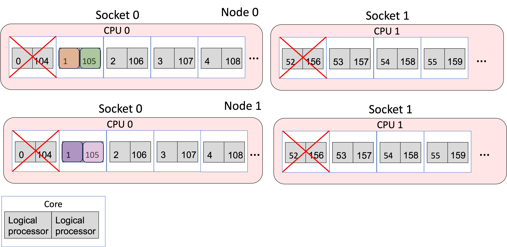
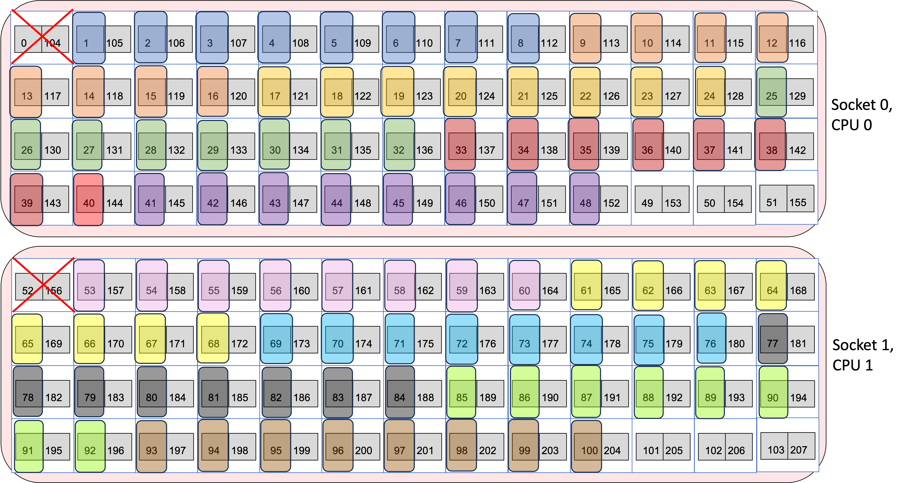
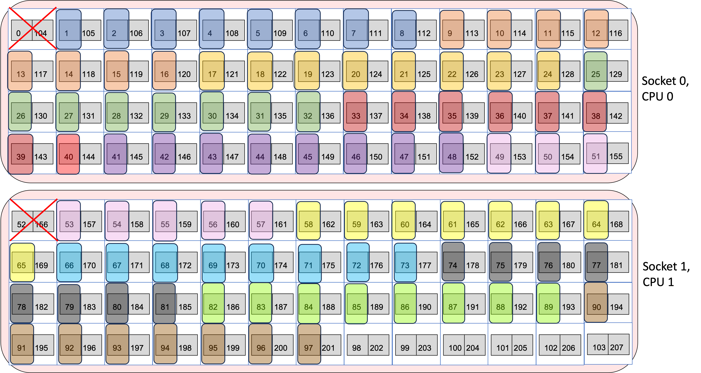
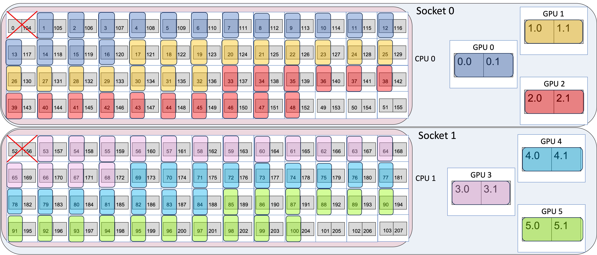

# Running Jobs on Aurora

## <a name="Aurora-Queues"></a>Queues

There are four production queues you can target in your qsub (`-q <queue name>`):

| Queue Name    | Node Min | Node Max | Time Min | Time Max | Notes                                                                                                |
|---------------|----------|----------|----------|----------|------------------------------------------------------------------------------------------------------|
| debug         | 1        | 2        | 5 min    | 1 hr     | 32 exclusive nodes with growth up to 64 nodes;  <br/> Max 1 job running/accruing/queued **per-user** |
| debug-scaling | 2        | 31       | 5 min    | 1 hr     | Max 1 job running/accruing/queued **per-user**                                                       |
| prod          | 1        | 2048     | 5 min    | 18 hrs   | Routing queue for tiny, small, and medium queues; <br/> **See table below for min/max limits**       |
| prod-large    | 2048     | 10624    | 5 min    | 24 hrs   | ***By request only*** <br/> Routing queue for large jobs; See table below                            |
| visualization | 1        | 32       | 5 min    | 8 hrs    | ***By request only***                                                                                |

!!! note

  	The debug queue has 32 exclusively dedicated nodes. If there are free nodes in production, then debug jobs can take another 32 nodes for a total of 64.

`prod` and `prod-large` are routing queues and routes your job to one of the following eight execution queues:

| Queue Name      | Node Min | Node Max | Time Min | Time Max | Notes                                                                                              |
|-----------------|----------|----------|----------|----------|----------------------------------------------------------------------------------------------------|
| tiny            | 1        | 512      | 5 min    | 6 hrs    |                                                                                                    |
| small           | 513      | 1024     | 5 min    | 12 hrs   |                                                                                                    |
| medium          | 1025     | 2048     | 5 min    | 18 hrs   |                                                                                                    |
| large           | 2048     | 10624    | 5 min    | 24 hrs   | ***Only accessible with access to prod-large queue***                                              |
| backfill-tiny   | 1        | 512      | 5 min    | 6 hrs    | Low priority, negative project balance                                                             |
| backfill-small  | 513      | 1024     | 5 min    | 12 hrs   | Low priority, negative project balance                                                             |
| backfill-medium | 1025     | 2048     | 5 min    | 18 hrs   | Low priority, negative project balance                                                             |
| backfill-large  | 2049     | 10624    | 5 min    | 24 hrs   | ***Only accessible with access to prod-large queue*** <br/> Low priority, negative project balance |

!!! warning

    You cannot submit to these queues directly; you can only submit to the routing queue `prod` or `prod-large`.

!!! note

      All of these queues have a limit of ten (10) jobs running/accruing per-project.
      All of these queues have a limit of one hundred (100) jobs queued (not accruing score) per-project.

### Submitting a job

Note: Jobs should be submitted only from your allocated project directory and not from your home directory or from `/soft/modulefiles`. Submitting an interactive job from `/soft/modulefiles` will result in your job ending abruptly.

For example, a one-node interactive job requiring access to the `/flare` filesystem can be requested for 30 minutes with the following command, where `<your_ProjectName>` is replaced with an appropriate project name.

```bash
qsub -l select=1 -l walltime=30:00 -l filesystems=flare -A <your_ProjectName> -q debug -I
```

For DAOS access, users will need to include either `daos_user` or `daos_perf` (only for select teams approved by ALCF) as a filesystem option. More information can be found on the [DAOS](./data-management/daos/daos-overview.md) page.

!!! tip

      To view the available filesystem options, execute the `qstat -Bf` command and view the `resources_available.valid_filesystems` entry.

Recommended PBSPro options follow.

```bash linenums="1"
#!/bin/bash -l
#PBS -A <your_ProjectName>
#PBS -N <your_JobName>
#PBS -l walltime=<requested_walltime_value>
#PBS -l filesystems=<requested_fs1:requested_fs2>
#PBS -k doe
#PBS -l place=scatter
#PBS -q <requested_Queue>
```

More information on the PBS options above, as well as other PBS options, can be found [here](../running-jobs/index.md).

## Working around node failures

As Aurora is in early production stage, node failures are a fact of life. If you would like to increase the chances that a large job does not terminate due to a node failure, you may choose to interactively route your MPI job around nodes that fail during your run. To do this, you must run interactively and use must manually adjust your run on the fly to remove nodes that have been marked as failed.

If you determine a node is bad, please send an email to [support@alcf.anl.gov](mailto:support@alcf.anl.gov) with the node name, reason why you believe it is bad, and a reproducer if one is available.

### Removing "known" bad nodes

If you're encountering the same problematic node(s) repeatedly in your allocations, you can add the following lines in your noninteractive PBS script to exclude them from the MPICH execution command:

```bash linenums="1"
cat $PBS_NODEFILE > local.hostfile
# edit local.hostfile with sed/awk/etc. to remove problem node IDs
mpiexec --hostfile local.hostfile <other mpiexec arguments>
```

### Using `tolerate_node_failures=all`
We recommend against using `-W tolerate_node_failures=all` in your qsub command, but we acknowledge its use can be helpful. However, you MUST MANUALLY VERIFY your job and remove faulted nodes from your mpiexec command YOURSELF!

1. Start your interactive job
2. When the job transitions to Running state, run `pbsnodes -l | grep <jobid>`
3. Manually REMOVE all nodes identified in that output from inclusion in your mpiexec

    ```bash linenums="1"
    cat $PBS_NODEFILE > local.hostfile
    # edit local.hostfile to remove problem nodes
    mpiexec --hostfile local.hostfile <other mpiexec arguments>
    ```

4. Continue to execute
5. If other nodes go down during your job, it will not be killed, and you can further exclude those nodes from your mpiexec as needed

It is important to note that all nodes marked as faulty by PBS will not be used in subsequent jobs. This mechanism only provides you with a means to execute additional mpiexec commands under the same interactive job after manually removing nodes identified as faulty. Once your PBS job has exited, those faulty nodes will remain offline until further intervention by Aurora staff.

See below section for more details on node [Placement](#placement).

## <a name="Aurora-MPICH"></a>Aurora MPICH

The standard version of the MPI (Message Passing Interface) library on Aurora is *Aurora MPICH*. This resulted from a collaboration between Intel and the Argonne MPICH developer team. The `mpiexec` and `mpirun` commands used to launch multi-rank jobs come from the Cray PALS (Parallel Application Launch Service) system.

There are many, many configuration and tuning parameters for Aurora MPICH. Simple ASCII text documentation of the environment variables usable to control behavior is in:

```bash
$MPI_ROOT/share/doc/mpich/README.envvar
```

This includes, for example, settings to select different optional sub-algorithms used in MPI collective operations.

## <a name="Running-MPI+OpenMP+SYCL-Applications"></a>Running MPI+OpenMP+SYCL Applications

A simple MPI+OpenMP+SYCL code snippet (hello_affinity_aurora.out) will be used to clarify the mappings between MPI ranks, CPU logical processors, OpenMP threads, GPU visiblity and GPU-affinity mappings.

```c++ linenums="1"
#include <stdlib.h>
#include <stdio.h>
#include <iostream>
#include <iomanip>
#include <string.h>
#include <mpi.h>
#include <sched.h>
#include <sycl/sycl.hpp>
#include <sys/syscall.h>
#include <omp.h>
#include <sched.h>
#include <unistd.h>

std::string get_cpu_affinity_range() {
  cpu_set_t mask;
  CPU_ZERO(&mask);
  pid_t pid = syscall(SYS_gettid); // You could also use 0 for current process
  if (sched_getaffinity(pid, sizeof(mask), &mask) == -1) {
    perror("sched_getaffinity");
    return "";
  }

  std::string result;
  int i = 0;
  while (i < CPU_SETSIZE) {
    if (CPU_ISSET(i, &mask)) {
      int start = i;
      while (i + 1 < CPU_SETSIZE && CPU_ISSET(i + 1, &mask)) ++i;
      if (!result.empty()) result += ",";
      result += (start == i) ? std::to_string(start)
        : std::to_string(start) + "-" + std::to_string(i);
    }
    ++i;
  }

  return result.empty() ? "No CPUs found in affinity mask." : result;
}

int main(int argc, char *argv[]){

  MPI_Init(&argc, &argv);

  int size;
  MPI_Comm_size(MPI_COMM_WORLD, &size);

  int rank;
  MPI_Comm_rank(MPI_COMM_WORLD, &rank);

  char name[MPI_MAX_PROCESSOR_NAME];
  int resultlength;
  MPI_Get_processor_name(name, &resultlength);

  // If ZE_AFFINITY_MASK is set, capture visible GPUs
  const char* gpu_id_list;
  const char* ze_affinity_mask = getenv("ZE_AFFINITY_MASK");
  if(ze_affinity_mask == NULL){
    gpu_id_list = "N/A";
  }
  else{
    gpu_id_list = ze_affinity_mask;
  }

  // Find how many GPUs L0 runtime says are available
  int num_devices = 0;
  std::vector<sycl::device> sycl_all_devs = sycl::device::get_devices(sycl::info::device_type::gpu);
  num_devices = sycl_all_devs.size();

  std::string hwthread;
  int thread_id = 0;
  std::string busid = "";
  std::string busid_list = "";
  std::string rt_gpu_id_list = "";

  // Loop over the GPUs available to each MPI rank
  for(int i=0; i<num_devices; i++) {
    // Get the PCIBusId for each GPU and use it to query for UUID
    busid = sycl_all_devs[i].get_info<sycl::ext::intel::info::device::pci_address>();

    // Concatenate per-MPIrank GPU info into strings for print
    if(i > 0) rt_gpu_id_list.append(",");
    rt_gpu_id_list.append(std::to_string(i));

    std::string temp_busid(busid);

    if(i > 0) busid_list.append(",");
    busid_list.append(temp_busid.substr(5,2));

  }

#pragma omp parallel default(shared) private(hwthread, thread_id)
  {
#pragma omp critical
    {
      thread_id = omp_get_thread_num();
      hwthread = get_cpu_affinity_range();
      int running_cpu = sched_getcpu();  // This gives current logical core ID

      printf("MPI %03d - OMP %03d - HWT %s (Running on: %03d) - Node %s - RT_GPU_ID %s - GPU_ID %s - Bus_ID %s\n",
             rank, thread_id, hwthread.c_str(), running_cpu, name, rt_gpu_id_list.c_str(), gpu_id_list, busid_list.c_str());
    }
  }

  MPI_Finalize();
  return 0;
}
```

The above code snippet can be compiled via:
```bash
mpicxx -fsycl -qopenmp hello_affinity_aurora.cpp -o hello_affinity_aurora.out
```

Once a submitted job is running calculations can be launched on the compute nodes using `mpiexec` to start an MPI application. Documentation is accessible via `man mpiexec` and some helpful options follow.

* `-n` total number of MPI ranks
* `-ppn` number of MPI ranks per node
* `--cpu-bind` CPU binding for application
* `--depth` number of cpus per rank (useful with `--cpu-bind`)
* `--env` set environment variables (`--env OMP_NUM_THREADS=2`)
* `--hostfile` indicate file with hostnames (the default is `--hostfile $PBS_NODEFILE`)

A sample submission script with directives is below for a 4-node job with 28 MPI ranks on each node and 4 OpenMP threads per rank (1 per CPU core).

```bash linenums="1"
#!/bin/bash -l
#PBS -N AFFINITY
#PBS -l select=4
#PBS -l place=scatter
#PBS -l walltime=0:10:00
#PBS -l filesystems=<fs1:fs2>
#PBS -q debug-scaling
#PBS -A <MYPROJECT>

export TZ='/usr/share/zoneinfo/US/Central'
cd ${PBS_O_WORKDIR}

NNODES=`wc -l < $PBS_NODEFILE`
NRANKS=28 # Number of MPI ranks to spawn per node
NDEPTH=4 # Number of hardware threads per rank (i.e. spacing between MPI ranks)
NTHREADS=4 # Number of software threads per rank to launch (i.e. OMP_NUM_THREADS)

NTOTRANKS=$(( NNODES * NRANKS ))

echo "NUM_OF_NODES= ${NNODES} TOTAL_NUM_RANKS= ${NTOTRANKS} RANKS_PER_NODE= ${NRANKS} THREADS_PER_RANK= ${NTHREADS}"

mpiexec -n ${NTOTRANKS} -ppn ${NRANKS} --depth=${NDEPTH} --cpu-bind depth -env OMP_NUM_THREADS=${NTHREADS} --env OMP_PLACES=cores ./hello_affinity_aurora.out
```

## <a name="Running-GPU-enabled-Applications"></a>Running GPU-enabled Applications

GPU-enabled applications will similarly run on the compute nodes using the above templated PBS job-script.

- The environment variable `MPIR_CVAR_ENABLE_GPU=1` enables GPU-aware MPI support whereby the MPI library sends and receives data directly from GPU buffers. Default value is `MPIR_CVAR_ENABLE_GPU=1`. For applications that doesn't need support for GPU-aware MPI, it is beneficial to disable by setting `MPIR_CVAR_ENABLE_GPU=0`.
- If running on a specific GPU or subset of GPUs and/or tiles is desired, then the `ZE_AFFINITY_MASK` environment variable can be used. For example, if one only wanted an application to access the first two GPUs on a node, then setting `ZE_AFFINITY_MASK=0,1` could be used.

## MPI rank and thread binding to cores and GPUs

!!! warning

    Since March 31, 2025, cores 0 (104) and 52 (156)--the first physical cores on each CPU socket—have been reserved for system services, and are no longer available for user applications.

Each node on Aurora has 2 sockets, each with 1 CPU and 3 PVC GPUs. Each CPU has 52 physical cores, with 2 logical processors (provided by Intel hyper threading) per physical core, for a total of 104 physical cores and 208 logical processors on the CPUs per Aurora node. Each GPU has two tiles on it, for a total of 6 GPUs and 12 GPU tiles on the GPUs per Aurora node. When a parallel job is run, the job must have some way of mapping MPI ranks or threads to each of the 208 logical processors and 6 GPUs or 12 GPU tiles. Mapping is typically done by an affinity mask, which assigns hardware resources to each MPI rank or thread to use.

A visual representation of node in Aurora is shown below. Each socket is represented by a large blue bubble. Inside, each CPU is represented by a red bubble. Inside of CPU, the white boxes represent the physical cores, and the two grey squares in each tile represent the two logical processors. Each GPU is represented by a large white box, with two grey boxes inside to represent the two tiles. As mentioned in the warning above, the cores 0 and 52 are reserved for the OS, and so are crossed out in red.

<figure markdown>
  { width="1000" }
  <figcaption>Simplified representation of Aurora node </figcaption>
</figure>

For the two CPUs, the numbers inside the boxes identify the specific logical processors in the core. That is, logical processor 0 and 104 are the 2 logical processors on the first physical core. Logical processors 1 and 105 are the 2 logical processors that share the second physical core. Since there are 208 logical processors, the numbers run from 0 to 207. For i from 0 to 51, logical processors i and i+104 share a physical core.

For the six GPUs, the GPU number identifies the GPU, and the tile numbers identify the tile in the GPU, with tiles from 0 to 5 with each GPU have two tiles each $gpu.0 and $gpu.1.

### Binding MPI ranks and threads to cores

Using the `--cpu-bind` argument to mpiexec, MPI ranks and threads can be assigned to run on specific logical processors on the CPUs. For more information about the flags to `mpiexec`, see [Running MPI+OpenMP+SYCL Applications](#Running-MPI+OpenMP+SYCL-Applications). Four examples of using `mpiexec` are given below to show how the `cpu-bind=depth`, `cpu-bind=list`, `--depth` arguments affect where MPI ranks and OpenMP threads are mapped. The sample output provides the range of logical processors (or hardware threads) a given MPI rank is bound to via `HWT` and the logical processor ID which the thread is running on via `(Running on: )`.

Note: In this section, we intentionally do not bind GPUs to specific MPI ranks. GPU binding logic is deferred to the next section. As a result, each MPI rank will have visibility to all GPUs available on the node as can be seen from the output of `hello_affinity_aurora.out` executable from the above code snippet `hello_affinity_aurora.cpp`. `RT_GPU_ID` refers to runtime GPU ID as seen by the MPI rank and/or OpenMP thread and/or SYCL runtime. `GPU_ID` refers to the GPU ID as recognized by `ZE_AFFINITY_MASK`.

#### Example 1: 2 nodes, 4 ranks/node, 1 thread/rank

```bash
$ export OMP_NUM_THREADS=1
$ mpiexec -n 8 -ppn 4 --depth 1 --cpu-bind=depth ./hello_affinity_aurora.out | sort
MPI 000 - OMP 000 - HWT 1 (Running on: 001) - Node x4407c6s2b0n0 - RT_GPU_ID 0,1,2,3,4,5 - GPU_ID N/A - Bus_ID 18,42,6c,18,42,6c
MPI 001 - OMP 000 - HWT 2 (Running on: 002) - Node x4407c6s2b0n0 - RT_GPU_ID 0,1,2,3,4,5 - GPU_ID N/A - Bus_ID 18,42,6c,18,42,6c
MPI 002 - OMP 000 - HWT 3 (Running on: 003) - Node x4407c6s2b0n0 - RT_GPU_ID 0,1,2,3,4,5 - GPU_ID N/A - Bus_ID 18,42,6c,18,42,6c
MPI 003 - OMP 000 - HWT 4 (Running on: 004) - Node x4407c6s2b0n0 - RT_GPU_ID 0,1,2,3,4,5 - GPU_ID N/A - Bus_ID 18,42,6c,18,42,6c
MPI 004 - OMP 000 - HWT 1 (Running on: 001) - Node x4407c6s7b0n0 - RT_GPU_ID 0,1,2,3,4,5 - GPU_ID N/A - Bus_ID 18,42,6c,18,42,6c
MPI 005 - OMP 000 - HWT 2 (Running on: 002) - Node x4407c6s7b0n0 - RT_GPU_ID 0,1,2,3,4,5 - GPU_ID N/A - Bus_ID 18,42,6c,18,42,6c
MPI 006 - OMP 000 - HWT 3 (Running on: 003) - Node x4407c6s7b0n0 - RT_GPU_ID 0,1,2,3,4,5 - GPU_ID N/A - Bus_ID 18,42,6c,18,42,6c
MPI 007 - OMP 000 - HWT 4 (Running on: 004) - Node x4407c6s7b0n0 - RT_GPU_ID 0,1,2,3,4,5 - GPU_ID N/A - Bus_ID 18,42,6c,18,42,6c
```

- The `-n 8` argument says to use 8 MPI ranks in total and `-ppn 4` places 4 ranks per node.
- The `--depth 1` argument says to use 1 logical processor for each MPI rank.
- The `--cpu-bind depth` argument says to spread out the ranks in a round robin manner across the logical processors, first putting one rank on the first logical processor of one physical core, and then looping back to put a second one on the second logical processor. This is done such that there's N logical processors for each MPI rank, where N is the value from the --depth argument (so it's 1 in this case).

The same can be achieved with the `--cpu-bind=list` argument that explicitly lists which logical processor to bind to per node. Each MPI rank is bound to the logical processors that are listed between `:`. So here, rank 0 is bound to to logical processor 1, rank 1 to logical processor 2, and so on on each node.

```bash
$ export OMP_NUM_THREADS=1
$ mpiexec -n 8 -ppn 4 --cpu-bind=list:1:2:3:4 ./hello_affinity_aurora.out | sort
MPI 000 - OMP 000 - HWT 1 (Running on: 001) - Node x4407c6s2b0n0 - RT_GPU_ID 0,1,2,3,4,5 - GPU_ID N/A - Bus_ID 18,42,6c,18,42,6c
MPI 001 - OMP 000 - HWT 2 (Running on: 002) - Node x4407c6s2b0n0 - RT_GPU_ID 0,1,2,3,4,5 - GPU_ID N/A - Bus_ID 18,42,6c,18,42,6c
MPI 002 - OMP 000 - HWT 3 (Running on: 003) - Node x4407c6s2b0n0 - RT_GPU_ID 0,1,2,3,4,5 - GPU_ID N/A - Bus_ID 18,42,6c,18,42,6c
MPI 003 - OMP 000 - HWT 4 (Running on: 004) - Node x4407c6s2b0n0 - RT_GPU_ID 0,1,2,3,4,5 - GPU_ID N/A - Bus_ID 18,42,6c,18,42,6c
MPI 004 - OMP 000 - HWT 1 (Running on: 001) - Node x4407c6s7b0n0 - RT_GPU_ID 0,1,2,3,4,5 - GPU_ID N/A - Bus_ID 18,42,6c,18,42,6c
MPI 005 - OMP 000 - HWT 2 (Running on: 002) - Node x4407c6s7b0n0 - RT_GPU_ID 0,1,2,3,4,5 - GPU_ID N/A - Bus_ID 18,42,6c,18,42,6c
MPI 006 - OMP 000 - HWT 3 (Running on: 003) - Node x4407c6s7b0n0 - RT_GPU_ID 0,1,2,3,4,5 - GPU_ID N/A - Bus_ID 18,42,6c,18,42,6c
MPI 007 - OMP 000 - HWT 4 (Running on: 004) - Node x4407c6s7b0n0 - RT_GPU_ID 0,1,2,3,4,5 - GPU_ID N/A - Bus_ID 18,42,6c,18,42,6c
```
The figure below shows the mapping, where the different colors are different MPI ranks.

<figure markdown>
  { width="700" }
  <figcaption>Example 1 Mapping </figcaption>
</figure>

#### Example 2: 2 nodes, 2 ranks/node, 2 thread/rank

```bash
$ OMP_PLACES=threads OMP_NUM_THREADS=2 mpiexec -n 4 -ppn 2 --depth=2 --cpu-bind=depth ./hello_affinity_aurora.out | sort
MPI 000 - OMP 000 - HWT 1 (Running on: 001) - Node x4707c0s0b0n0 - RT_GPU_ID 0,1,2,3,4,5 - GPU_ID N/A - Bus_ID 18,42,6c,18,42,6c
MPI 000 - OMP 001 - HWT 2 (Running on: 002) - Node x4707c0s0b0n0 - RT_GPU_ID 0,1,2,3,4,5 - GPU_ID N/A - Bus_ID 18,42,6c,18,42,6c
MPI 001 - OMP 000 - HWT 3 (Running on: 003) - Node x4707c0s0b0n0 - RT_GPU_ID 0,1,2,3,4,5 - GPU_ID N/A - Bus_ID 18,42,6c,18,42,6c
MPI 001 - OMP 001 - HWT 4 (Running on: 004) - Node x4707c0s0b0n0 - RT_GPU_ID 0,1,2,3,4,5 - GPU_ID N/A - Bus_ID 18,42,6c,18,42,6c
MPI 002 - OMP 000 - HWT 1 (Running on: 001) - Node x4707c0s1b0n0 - RT_GPU_ID 0,1,2,3,4,5 - GPU_ID N/A - Bus_ID 18,42,6c,18,42,6c
MPI 002 - OMP 001 - HWT 2 (Running on: 002) - Node x4707c0s1b0n0 - RT_GPU_ID 0,1,2,3,4,5 - GPU_ID N/A - Bus_ID 18,42,6c,18,42,6c
MPI 003 - OMP 000 - HWT 3 (Running on: 003) - Node x4707c0s1b0n0 - RT_GPU_ID 0,1,2,3,4,5 - GPU_ID N/A - Bus_ID 18,42,6c,18,42,6c
MPI 003 - OMP 001 - HWT 4 (Running on: 004) - Node x4707c0s1b0n0 - RT_GPU_ID 0,1,2,3,4,5 - GPU_ID N/A - Bus_ID 18,42,6c,18,42,6c
```

- The `-n 4` argument says to use 4 MPI ranks in total and `-ppn 2` places 2 ranks per node.
- The `--depth=2` argument says to use 2 logical processors for each MPI rank.
- The `--cpu-bind=depth` argument says to spread out the ranks in a round robin manner across the logical processors, first putting one rank on the first logical processor of one physical processor, and then looping back to put a second one on the second logical processor. This is done such that there's N logical processors for each MPI rank, where N is the value from the `--depth` argument (so it's 2 in this case).
- `OMP_NUM_THREADS=2` launches two threads per MPI rank
- `OMP_PLACES=threads` says to bind the OpenMP threads to logical processors

This is the same as explictly using the `--cpu-bind=list` argument. Each MPI rank is bound to the logical processors that are listed between `:`. Between :, the logical processors to bind to are listed in a comma-separated manner. So here, rank 0 is bound to logical processors 1 and 2, rank 2 to logical processors 3 and 4. `OMP_PLACES=threads` then binds the specific threads to the logical processors in the list.

```bash
$ OMP_PLACES=threads OMP_NUM_THREADS=2 mpiexec -n 4 -ppn 2 --cpu-bind=list:1,2:3,4 ./hello_affinity_aurora.out | sort
MPI 000 - OMP 000 - HWT 1 (Running on: 001) - Node x4707c0s0b0n0 - RT_GPU_ID 0,1,2,3,4,5 - GPU_ID N/A - Bus_ID 18,42,6c,18,42,6c
MPI 000 - OMP 001 - HWT 2 (Running on: 002) - Node x4707c0s0b0n0 - RT_GPU_ID 0,1,2,3,4,5 - GPU_ID N/A - Bus_ID 18,42,6c,18,42,6c
MPI 001 - OMP 000 - HWT 3 (Running on: 003) - Node x4707c0s0b0n0 - RT_GPU_ID 0,1,2,3,4,5 - GPU_ID N/A - Bus_ID 18,42,6c,18,42,6c
MPI 001 - OMP 001 - HWT 4 (Running on: 004) - Node x4707c0s0b0n0 - RT_GPU_ID 0,1,2,3,4,5 - GPU_ID N/A - Bus_ID 18,42,6c,18,42,6c
MPI 002 - OMP 000 - HWT 1 (Running on: 001) - Node x4707c0s1b0n0 - RT_GPU_ID 0,1,2,3,4,5 - GPU_ID N/A - Bus_ID 18,42,6c,18,42,6c
MPI 002 - OMP 001 - HWT 2 (Running on: 002) - Node x4707c0s1b0n0 - RT_GPU_ID 0,1,2,3,4,5 - GPU_ID N/A - Bus_ID 18,42,6c,18,42,6c
MPI 003 - OMP 000 - HWT 3 (Running on: 003) - Node x4707c0s1b0n0 - RT_GPU_ID 0,1,2,3,4,5 - GPU_ID N/A - Bus_ID 18,42,6c,18,42,6c
MPI 003 - OMP 001 - HWT 4 (Running on: 004) - Node x4707c0s1b0n0 - RT_GPU_ID 0,1,2,3,4,5 - GPU_ID N/A - Bus_ID 18,42,6c,18,42,6c
```
The figure below shows the mapping, where the different colors are different MPI ranks.

<figure markdown>
  { width="700" }
  <figcaption>Example 2 Mapping </figcaption>
</figure>

#### Example 3: 2 nodes, 2 ranks/node, 1 thread/rank, compact fashion

```bash
$ export OMP_NUM_THREADS=1
$ mpiexec -n 4 -ppn 2 --cpu-bind=list:1:105 ./hello_affinity_aurora.out | sort
MPI 000 - OMP 000 - HWT 1 (Running on: 001) - Node x4407c6s2b0n0 - RT_GPU_ID 0,1,2,3,4,5 - GPU_ID N/A - Bus_ID 18,42,6c,18,42,6c
MPI 001 - OMP 000 - HWT 105 (Running on: 105) - Node x4407c6s2b0n0 - RT_GPU_ID 0,1,2,3,4,5 - GPU_ID N/A - Bus_ID 18,42,6c,18,42,6c
MPI 002 - OMP 000 - HWT 1 (Running on: 001) - Node x4407c6s7b0n0 - RT_GPU_ID 0,1,2,3,4,5 - GPU_ID N/A - Bus_ID 18,42,6c,18,42,6c
MPI 003 - OMP 000 - HWT 105 (Running on: 105) - Node x4407c6s7b0n0 - RT_GPU_ID 0,1,2,3,4,5 - GPU_ID N/A - Bus_ID 18,42,6c,18,42,6c
```
The `--cpu-bind=list` argument explicitly lists which logical processor to bind to per node. Here, rank 0 is bound to logical processor 0 and rank 1 is bound to logical processor 105, which share the same physical core. The figure below shows the mapping, where the different colors are different MPI ranks.

<figure markdown>
  { width="700" }
  <figcaption>Example 3 Mapping </figcaption>
</figure>

#### Example 4: 1 node, 12 ranks/node

This setup is a common case for applications: 12 ranks/node, where each rank will offload to one of the 12 GPU tiles. Note that explicit list binding to logical processors is needed here to avoid binding a MPI rank to a logical core on different socket than the GPU it might be targetting (as would happen if cpu_bind=depth was used).

```bash
$ export OMP_NUM_THREADS=1
$ export CPU_BIND_SCHEME="--cpu-bind=list:1-8:9-16:17-24:25-32:33-40:41-48:53-60:61-68:69-76:77-84:85-92:93-100"
$ mpiexec -n 12 -ppn 12 ${CPU_BIND_SCHEME} ./hello_affinity_aurora.out | sort
MPI 000 - OMP 000 - HWT 1-8 (Running on: 008) - Node x4407c6s2b0n0 - RT_GPU_ID 0,1,2,3,4,5 - GPU_ID N/A - Bus_ID 18,42,6c,18,42,6c
MPI 001 - OMP 000 - HWT 9-16 (Running on: 016) - Node x4407c6s2b0n0 - RT_GPU_ID 0,1,2,3,4,5 - GPU_ID N/A - Bus_ID 18,42,6c,18,42,6c
MPI 002 - OMP 000 - HWT 17-24 (Running on: 024) - Node x4407c6s2b0n0 - RT_GPU_ID 0,1,2,3,4,5 - GPU_ID N/A - Bus_ID 18,42,6c,18,42,6c
MPI 003 - OMP 000 - HWT 25-32 (Running on: 032) - Node x4407c6s2b0n0 - RT_GPU_ID 0,1,2,3,4,5 - GPU_ID N/A - Bus_ID 18,42,6c,18,42,6c
MPI 004 - OMP 000 - HWT 33-40 (Running on: 040) - Node x4407c6s2b0n0 - RT_GPU_ID 0,1,2,3,4,5 - GPU_ID N/A - Bus_ID 18,42,6c,18,42,6c
MPI 005 - OMP 000 - HWT 41-48 (Running on: 048) - Node x4407c6s2b0n0 - RT_GPU_ID 0,1,2,3,4,5 - GPU_ID N/A - Bus_ID 18,42,6c,18,42,6c
MPI 006 - OMP 000 - HWT 53-60 (Running on: 060) - Node x4407c6s2b0n0 - RT_GPU_ID 0,1,2,3,4,5 - GPU_ID N/A - Bus_ID 18,42,6c,18,42,6c
MPI 007 - OMP 000 - HWT 61-68 (Running on: 068) - Node x4407c6s2b0n0 - RT_GPU_ID 0,1,2,3,4,5 - GPU_ID N/A - Bus_ID 18,42,6c,18,42,6c
MPI 008 - OMP 000 - HWT 69-76 (Running on: 076) - Node x4407c6s2b0n0 - RT_GPU_ID 0,1,2,3,4,5 - GPU_ID N/A - Bus_ID 18,42,6c,18,42,6c
MPI 009 - OMP 000 - HWT 77-84 (Running on: 084) - Node x4407c6s2b0n0 - RT_GPU_ID 0,1,2,3,4,5 - GPU_ID N/A - Bus_ID 18,42,6c,18,42,6c
MPI 010 - OMP 000 - HWT 85-92 (Running on: 092) - Node x4407c6s2b0n0 - RT_GPU_ID 0,1,2,3,4,5 - GPU_ID N/A - Bus_ID 18,42,6c,18,42,6c
MPI 011 - OMP 000 - HWT 93-100 (Running on: 100) - Node x4407c6s2b0n0 - RT_GPU_ID 0,1,2,3,4,5 - GPU_ID N/A - Bus_ID 18,42,6c,18,42,6c
```

- The `--cpu-bind=list:` argument explicitly lists which logical processor to bind to per node. Here, rank 0 is bound to to processors 1-8, rank 1 to processors 9-16, etc.

The figure below shows the mapping, where the different colors are different MPI ranks.

<figure markdown>
  { width="700" }
  <figcaption>Example 4 Mapping </figcaption>
</figure>

The important point here is that with this explicit binding from `cpu-bind=list`, we are able to ensure socket 0 has 6 ranks and socket 1 has 6 ranks. Note how MPI rank 5 ends at logical processor 48, but MPI rank 6 begins with logical processor 53, so this involves leaving several cores empty. However, it allows the cores to be spread evenly across the two sockets. 

If instead we used `--cpu-bind=depth` as below, then the mapping is:
```
$ export OMP_NUM_THREADS=1
$ mpiexec -n 12 -ppn 12 --depth=8 --cpu-bind=depth ./hello_affinity_aurora.out | sort
MPI 000 - OMP 000 - HWT 1-8 (Running on: 008) - Node x4407c6s2b0n0 - RT_GPU_ID 0,1,2,3,4,5 - GPU_ID N/A - Bus_ID 18,42,6c,18,42,6c
MPI 001 - OMP 000 - HWT 9-16 (Running on: 016) - Node x4407c6s2b0n0 - RT_GPU_ID 0,1,2,3,4,5 - GPU_ID N/A - Bus_ID 18,42,6c,18,42,6c
MPI 002 - OMP 000 - HWT 17-24 (Running on: 024) - Node x4407c6s2b0n0 - RT_GPU_ID 0,1,2,3,4,5 - GPU_ID N/A - Bus_ID 18,42,6c,18,42,6c
MPI 003 - OMP 000 - HWT 25-32 (Running on: 032) - Node x4407c6s2b0n0 - RT_GPU_ID 0,1,2,3,4,5 - GPU_ID N/A - Bus_ID 18,42,6c,18,42,6c
MPI 004 - OMP 000 - HWT 33-40 (Running on: 040) - Node x4407c6s2b0n0 - RT_GPU_ID 0,1,2,3,4,5 - GPU_ID N/A - Bus_ID 18,42,6c,18,42,6c
MPI 005 - OMP 000 - HWT 41-48 (Running on: 048) - Node x4407c6s2b0n0 - RT_GPU_ID 0,1,2,3,4,5 - GPU_ID N/A - Bus_ID 18,42,6c,18,42,6c
MPI 006 - OMP 000 - HWT 49-51,53-57 (Running on: 057) - Node x4407c6s2b0n0 - RT_GPU_ID 0,1,2,3,4,5 - GPU_ID N/A - Bus_ID 18,42,6c,18,42,6c
MPI 007 - OMP 000 - HWT 58-65 (Running on: 065) - Node x4407c6s2b0n0 - RT_GPU_ID 0,1,2,3,4,5 - GPU_ID N/A - Bus_ID 18,42,6c,18,42,6c
MPI 008 - OMP 000 - HWT 66-73 (Running on: 073) - Node x4407c6s2b0n0 - RT_GPU_ID 0,1,2,3,4,5 - GPU_ID N/A - Bus_ID 18,42,6c,18,42,6c
MPI 009 - OMP 000 - HWT 74-81 (Running on: 081) - Node x4407c6s2b0n0 - RT_GPU_ID 0,1,2,3,4,5 - GPU_ID N/A - Bus_ID 18,42,6c,18,42,6c
MPI 010 - OMP 000 - HWT 82-89 (Running on: 089) - Node x4407c6s2b0n0 - RT_GPU_ID 0,1,2,3,4,5 - GPU_ID N/A - Bus_ID 18,42,6c,18,42,6c
MPI 011 - OMP 000 - HWT 90-97 (Running on: 097) - Node x4407c6s2b0n0 - RT_GPU_ID 0,1,2,3,4,5 - GPU_ID N/A - Bus_ID 18,42,6c,18,42,6c
```

A small misconfiguration of the `--depth` option for instance, using `--depth=8` can result in unexpectedly bad performance. Note that the threads of MPI rank 6 are bound on both socket 0 and socket 1, which potentially will lead to worse performance than using cpu-bind=list to explicitly spread out the ranks (as above), since the threads can migrate across sockets. This is shown in the image below. Note that the pink MPI rank (rank 6) is split between socket 0 and socket 1.

<figure markdown>
  { width="700" }
  <figcaption>Example 4 Mapping Which Splits a MPI Rank Across Sockets </figcaption>
</figure>

!!! info

    For a script to help provide cpu-bindings, you can use [get_cpu_bind_aurora](https://github.com/argonne-lcf/pbs_utils/blob/main/get_cpu_bind_aurora). Please see [User Guide for Aurora CPU Binding Script](https://github.com/argonne-lcf/pbs_utils/blob/main/doc/guide-get_cpu_bind_aurora.md) for documentation.

### <a name="Binding-MPI-ranks-to-GPUs"></a>Binding MPI ranks to GPUs
In this section, the above mentioned MPI+OpenMP+SYCL affinity code will be used to show how to map MPI processes with GPUs.
The CPU mapping part of this example is very similar to the examples used above, so the focus here will be on the GPU mapping part.

In general, GPU mapping can be accomplished in two different ways: 1) with the `gpu_tile_compact.sh` and `gpu_dev_compact.sh` scripts and 2) with the `--gpu-bind` flag to mpiexec.

#### 1) Binding MPI ranks to GPUs using `gpu_tile_compact.sh` and `gpu_dev_compact.sh` scripts

Users are encouraged to use the `gpu_tile_compact.sh` script provided in the Aurora PE. This script binds each MPI rank to a single GPU tile ("Explicit Scaling") using a round-robin strategy. Note that `gpu_tile_compact.sh` requires the environment variable `ZE_FLAT_DEVICE_HIERARCHY=COMPOSITE`, which is set by default in the Aurora PE. The script can be placed just before the executable in an `mpiexec` command like so.

```bash
mpiexec -n ${NTOTRANKS} --ppn ${NRANKS_PER_NODE} --depth=${NDEPTH} --cpu-bind=depth gpu_tile_compact.sh <app> <app_args>
```

Below is a simplified version of this script, illustrating how the `ZE_AFFINITY_MASK` is uniquely set for each MPI rank.

A simple version of `gpu_tile_compact.sh` script is below to illustrate how `ZE_AFFINITY_MASK` is uniquely set for each MPI rank.
```bash linenums="1"
#!/bin/bash -l
num_gpu=6
num_tile=2
gpu_id=$(( (PALS_LOCAL_RANKID / num_tile ) % num_gpu ))
tile_id=$((PALS_LOCAL_RANKID % num_tile))
export ZE_ENABLE_PCI_ID_DEVICE_ORDER=1
export ZE_AFFINITY_MASK=$gpu_id.$tile_id
#echo “RANK= ${PMI_RANK} LOCAL_RANK= ${PMI_LOCAL_RANK} gpu= ${gpu}”
exec "$@"
```

The `frameworks` module sets `ZE_FLAT_DEVICE_HIERARCHY=FLAT`, treating each tile as a device.
Our current recommendation is to __not__ use the `gpu_tile_compact.sh` script during the job submission while using the `frameworks` module. 
If you wish to bind MPI ranks to devices instead of tiles, this can be done the following way:

```bash linenums="1"
#!/bin/bash
num_gpus=12
gpu_id=$((PMIX_RANK % ${num_gpus} ))
export ZE_AFFINITY_MASK=$gpu_id
exec "$@"
```
Caution: This will narrow the affinity mask down and generate PyTorch warnings. If you want to avoid that, don't use this binding script and do the binding manually inside your apps. 
More information on `ZE_FLAT_DEVICE_HIERARCHY` can be found in [Intel's online documentation](https://www.intel.com/content/www/us/en/developer/articles/technical/flattening-gpu-tile-hierarchy.html).

If an application prefers to bind MPI ranks to entire GPU devices rather than individual tiles, the `gpu_dev_compact.sh` script (also available in your default path) can be used. Binding to a full device instead of a tile is refered to as "Implicit Scaling". Users with different MPI-GPU affinity needs, such as assigning multiple GPUs/tiles per MPI rank, are encouraged to modify a local copy of `gpu_tile_compact.sh` (`which gpu_tile_compact.sh` will show the location of the script) to suit their needs.

##### Example 1: (Explicit Scaling) 1 node, 12 ranks/node, 1 thread/rank, 1 rank/GPU-tile
This example below shows a common mapping of MPI ranks to cores and GPUs.

```bash
$ export OMP_NUM_THREADS=1
$ export CPU_BIND_SCHEME="--cpu-bind=list:1-8:9-16:17-24:25-32:33-40:41-48:53-60:61-68:69-76:77-84:85-92:93-100"
$ mpiexec -n 12 -ppn 12 ${CPU_BIND_SCHEME} gpu_tile_compact.sh ./hello_affinity_aurora.out | sort
MPI 000 - OMP 000 - HWT 1-8 (Running on: 008) - Node x4407c6s2b0n0 - RT_GPU_ID 0 - GPU_ID 0.0 - Bus_ID 18
MPI 001 - OMP 000 - HWT 9-16 (Running on: 016) - Node x4407c6s2b0n0 - RT_GPU_ID 0 - GPU_ID 0.1 - Bus_ID 18
MPI 002 - OMP 000 - HWT 17-24 (Running on: 024) - Node x4407c6s2b0n0 - RT_GPU_ID 0 - GPU_ID 1.0 - Bus_ID 42
MPI 003 - OMP 000 - HWT 25-32 (Running on: 032) - Node x4407c6s2b0n0 - RT_GPU_ID 0 - GPU_ID 1.1 - Bus_ID 42
MPI 004 - OMP 000 - HWT 33-40 (Running on: 040) - Node x4407c6s2b0n0 - RT_GPU_ID 0 - GPU_ID 2.0 - Bus_ID 6c
MPI 005 - OMP 000 - HWT 41-48 (Running on: 048) - Node x4407c6s2b0n0 - RT_GPU_ID 0 - GPU_ID 2.1 - Bus_ID 6c
MPI 006 - OMP 000 - HWT 53-60 (Running on: 060) - Node x4407c6s2b0n0 - RT_GPU_ID 0 - GPU_ID 3.0 - Bus_ID 18
MPI 007 - OMP 000 - HWT 61-68 (Running on: 068) - Node x4407c6s2b0n0 - RT_GPU_ID 0 - GPU_ID 3.1 - Bus_ID 18
MPI 008 - OMP 000 - HWT 69-76 (Running on: 076) - Node x4407c6s2b0n0 - RT_GPU_ID 0 - GPU_ID 4.0 - Bus_ID 42
MPI 009 - OMP 000 - HWT 77-84 (Running on: 084) - Node x4407c6s2b0n0 - RT_GPU_ID 0 - GPU_ID 4.1 - Bus_ID 42
MPI 010 - OMP 000 - HWT 85-92 (Running on: 092) - Node x4407c6s2b0n0 - RT_GPU_ID 0 - GPU_ID 5.0 - Bus_ID 6c
MPI 011 - OMP 000 - HWT 93-100 (Running on: 100) - Node x4407c6s2b0n0 - RT_GPU_ID 0 - GPU_ID 5.1 - Bus_ID 6c
```

- The `-n 12` argument says to use 12 MPI ranks in total and `-ppn 12` places 12 ranks per node.
- The `--cpu-bind=list` argument gives the mapping of MPI ranks to cores, as described in [Binding MPI ranks and threads to cores](#binding-mpi-ranks-and-threads-to-cores).
- The `gpu_tile_compact.sh` wrapper sets ZE_AFFINITY_MASK for each of the 12 ranks such that rank 0 maps to GPU 0:Tile 0, rank 1 maps to GPU 0:Tile 1, rank 2 maps to GPU 1:Tile 0 etc. in a round-robin compact fashion.


<figure markdown>
  { width="700" }
  <figcaption>Example 1 GPU Tile Mapping </figcaption>
</figure>

##### Example 2: (Implicit Scaling) 1 node, 6 ranks/node, 1 thread/rank, 1 rank/GPU

```bash
$ export OMP_NUM_THREADS=1
$ export CPU_BIND_SCHEME="--cpu-bind=list:1-16:17-32:33-48:53-68:69-84:85-100"
$ mpiexec -n 6 -ppn 6 ${CPU_BIND_SCHEME} gpu_dev_compact.sh ./hello_affinity_aurora.out | sort
MPI 000 - OMP 000 - HWT 1-16 (Running on: 016) - Node x4407c6s2b0n0 - RT_GPU_ID 0 - GPU_ID 0 - Bus_ID 18
MPI 001 - OMP 000 - HWT 17-32 (Running on: 032) - Node x4407c6s2b0n0 - RT_GPU_ID 0 - GPU_ID 1 - Bus_ID 42
MPI 002 - OMP 000 - HWT 33-48 (Running on: 048) - Node x4407c6s2b0n0 - RT_GPU_ID 0 - GPU_ID 2 - Bus_ID 6c
MPI 003 - OMP 000 - HWT 53-68 (Running on: 068) - Node x4407c6s2b0n0 - RT_GPU_ID 0 - GPU_ID 3 - Bus_ID 18
MPI 004 - OMP 000 - HWT 69-84 (Running on: 084) - Node x4407c6s2b0n0 - RT_GPU_ID 0 - GPU_ID 4 - Bus_ID 42
MPI 005 - OMP 000 - HWT 85-100 (Running on: 100) - Node x4407c6s2b0n0 - RT_GPU_ID 0 - GPU_ID 5 - Bus_ID 6c
```

- The `-n 6` argument says to use 6 MPI ranks in total and `-ppn 6` places 6 ranks per node.
- The `--cpu-bind=list` argument gives the mapping of MPI ranks to cores, as described in [Binding MPI ranks and threads to cores](#binding-mpi-ranks-and-threads-to-cores).
- The `gpu_dev_compact.sh` wrapper sets ZE_AFFINITY_MASK for each of the 6 ranks such that rank 0 maps to GPU 0, rank 1 maps to GPU 1 etc. in a round-robin compact fashion.

<figure markdown>
  { width="700" }
  <figcaption>Example 1 GPU Device Mapping </figcaption>
</figure>

#### 2) Binding MPI ranks to GPUs using `--gpu-bind` option from MPICH

Similar to the `--cpu-bind` option, which maps MPI ranks to specific CPU cores, the `--gpu-bind` option enables mapping MPI ranks to GPUs. While this feature is still under active development and has several limitations, a common use case is mapping 12 MPI ranks to the 12 GPU tiles available per node.

##### Example 1: (Explicit Scaling) 1 node, 12 ranks/node, 1 thread/rank, 1 rank/GPU-tile

```bash
$ export OMP_NUM_THREADS=1
$ export CPU_BIND_SCHEME="--cpu-bind=list:1-8:9-16:17-24:25-32:33-40:41-48:53-60:61-68:69-76:77-84:85-92:93-100"
$ export GPU_BIND_SCHEME="--gpu-bind=list:0.0:0.1:1.0:1.1:2.0:2.1:3.0:3.1:4.0:4.1:5.0:5.1"
$ mpiexec -n 12 -ppn 12 ${CPU_BIND_SCHEME} ${GPU_BIND_SCHEME} ./hello_affinity_aurora.out | sort
MPI 000 - OMP 000 - HWT 1-8 (Running on: 008) - Node x4407c6s2b0n0 - RT_GPU_ID 0 - GPU_ID 0.0 - Bus_ID 18
MPI 001 - OMP 000 - HWT 9-16 (Running on: 016) - Node x4407c6s2b0n0 - RT_GPU_ID 0 - GPU_ID 0.1 - Bus_ID 18
MPI 002 - OMP 000 - HWT 17-24 (Running on: 024) - Node x4407c6s2b0n0 - RT_GPU_ID 0 - GPU_ID 1.0 - Bus_ID 42
MPI 003 - OMP 000 - HWT 25-32 (Running on: 032) - Node x4407c6s2b0n0 - RT_GPU_ID 0 - GPU_ID 1.1 - Bus_ID 42
MPI 004 - OMP 000 - HWT 33-40 (Running on: 040) - Node x4407c6s2b0n0 - RT_GPU_ID 0 - GPU_ID 2.0 - Bus_ID 6c
MPI 005 - OMP 000 - HWT 41-48 (Running on: 048) - Node x4407c6s2b0n0 - RT_GPU_ID 0 - GPU_ID 2.1 - Bus_ID 6c
MPI 006 - OMP 000 - HWT 53-60 (Running on: 060) - Node x4407c6s2b0n0 - RT_GPU_ID 0 - GPU_ID 3.0 - Bus_ID 18
MPI 007 - OMP 000 - HWT 61-68 (Running on: 068) - Node x4407c6s2b0n0 - RT_GPU_ID 0 - GPU_ID 3.1 - Bus_ID 18
MPI 008 - OMP 000 - HWT 69-76 (Running on: 076) - Node x4407c6s2b0n0 - RT_GPU_ID 0 - GPU_ID 4.0 - Bus_ID 42
MPI 009 - OMP 000 - HWT 77-84 (Running on: 084) - Node x4407c6s2b0n0 - RT_GPU_ID 0 - GPU_ID 4.1 - Bus_ID 42
MPI 010 - OMP 000 - HWT 85-92 (Running on: 092) - Node x4407c6s2b0n0 - RT_GPU_ID 0 - GPU_ID 5.0 - Bus_ID 6c
MPI 011 - OMP 000 - HWT 93-100 (Running on: 100) - Node x4407c6s2b0n0 - RT_GPU_ID 0 - GPU_ID 5.1 - Bus_ID 6c
```

- The `-n 12` argument says to use 12 MPI ranks in total and `-ppn 12` places 12 ranks per node.
- The `--cpu-bind=list` argument gives the mapping of MPI ranks to cores, as described in [Binding MPI ranks and threads to cores](#binding-mpi-ranks-and-threads-to-cores).
- The `--gpu-bind=list` argument gives the mapping of MPI ranks to GPU-tiles.

!!! warning

    There are several limitations with using `--gpu-bind=list` namely (a) for implict-scaling via `--gpu-bind=list:0:1:2:3:4:5`, (b) With a different device-discovery hierarchy, `ZE_FLAT_DEVICE_HIERARCHY=FLAT`. This is mode preferred for AI/ML frameworks.

```bash
$ export CPU_BIND_SCHEME="--cpu-bind=list:1-16:17-32:33-48:53-68:69-84:85-100"
$ export GPU_BIND_SCHEME="--gpu-bind=list:0:1:2:3:4:5"
$ mpiexec -n 6 -ppn 6 ${CPU_BIND_SCHEME} ${GPU_BIND_SCHEME} ./hello_affinity_aurora.out | sort
launch failed on x4520c2s0b0n0: Failed to parse implicit GPU selection
$
$
$ export ZE_FLAT_DEVICE_HIERARCHY=FLAT
$ export CPU_BIND_SCHEME="--cpu-bind=list:1-8:9-16:17-24:25-32:33-40:41-48:53-60:61-68:69-76:77-84:85-92:93-100"
$ export GPU_BIND_SCHEME="--gpu-bind=list:0:1:2:3:4:5:6:7:8:9:10:11"
$ mpiexec -n 12 -ppn 12 ${CPU_BIND_SCHEME} ${GPU_BIND_SCHEME} ./hello_affinity_aurora.out | sort
launch failed on x4520c2s0b0n0: Failed to parse implicit GPU selection
```

## <a name="Interactive-Jobs-on-Compute-Nodes"></a>Interactive Jobs on Compute Nodes

Here is how to submit an interactive job to, for example, edit/build/test an application on Aurora compute nodes:

```bash
qsub -I -l select=1,walltime=1:00:00,place=scatter -l filesystems=<fs1:fs2> -A <MYPROJECT> -q debug
```

This command requests 1 node for a period of 1 hour in the `workq` queue. After waiting in the queue for a node to become available, a shell prompt on a compute node will appear. You may then start building applications and testing gpu affinity scripts on the compute node.

!!! warning

	If you want to `ssh` or `scp` to one of your assigned compute nodes you will need to make sure your `$HOME` directory and your `$HOME/.ssh` directory permissions are both set to `700`.

## <a name="Running-with-Multiple-CCS"></a>Running with Multiple Compute Command Streamers (CCSs)

The Intel PVC GPUs contain 4 Compute Command Streamers (CCSs) on each tile, which can be used to group Execution Units (EUs) into common pools.
These pools can then be accessed by separate processes thereby allowing users to bind multiple processes to a single tile and enabling applications to run up to 48 MPI processes per node on the 6 PVC available.
Enabling multiple CCSs on Aurora is similar to the MPS capabilities on NVIDIA GPUs.
By default, all EUs are assigned to a single CCS, but EUs can be distributed equally into 2 or 4 groups by exposing 2 or 4 CCSs, respectively.
This feature is enabled with the `ZEX_NUMBER_OF_CCS` environment variable, which takes a comma-separated list of device-mode pairs.
For example, to enable 4 CCSs on all 6 PVC, execute
```bash
export ZEX_NUMBER_OF_CCS=0:4,1:4,2:4,3:4,4:4,5:4
```

!!! info "Additional notes when running with multiple CCSs"

	- Please be mindful of the device hierarchy selected. When running with `ZE_FLAT_DEVICE_HIERARCHY=COMPOSITE`, 6 PVC are exposed to the applications and the above command should be used, noting that `export ZEX_NUMBER_OF_CCS=0:4` exposes 4 CCSs on both tiles of GPU 0. When running with `ZE_FLAT_DEVICE_HIERARCHY=FLAT`, the 12 PVC tiles are exposed to the applications (tile-as-device), thus `export ZEX_NUMBER_OF_CCS=0:4` only refers to tile 0 of GPU 0. To expose multiple CCSs on all tiles, users should use `export ZEX_NUMBER_OF_CCS=0:4,1:4,2:4,3:4,4:4,5:4,6:4,7:4,8:4,9:4,10:4,11:4`.
	- Users should also be mindful of the CPU binding affinity guidelines described above, ensuring that MPI processes are bound to the correct socket and GPU pairs.
	- `ZE_AFFINITY_MASK` is read by the Level Zero driver prior to `ZEX_NUMBER_OF_CCS`, thus `ZEX_NUMBER_OF_CCS` should refer to the GPU IDs of the masked devices.
	- Users can expose different number of CCSs on the different GPU and tiles, the desired CCS mode does not need to be uniform across the GPUs on a node.

More information can be found on Intel's [documentation](https://www.intel.com/content/www/us/en/docs/oneapi/optimization-guide-gpu/2024-1/multi-tile-advanced-topics.html) and [GitHub](https://github.com/intel/compute-runtime/blob/master/level_zero/doc/experimental_extensions/MULTI_CCS_MODES.md) pages.


## <a name="Running-Multiple-MPI-Applications-on-a-node"></a>Running Multiple MPI Applications on a node

Multiple applications can be run simultaneously on a node by launching several `mpiexec` commands and backgrounding them. For performance, it will likely be necessary to ensure that each application runs on a distinct set of CPU resources and/or targets specific GPUs and tiles. One can provide a list of CPUs using the `--cpu-bind` option, which when combined with `ZE_AFFINITY_MASK` provides a user with specifying exactly which CPU and GPU resources to run each application on. In the simple example below, twelve instances of the application are simultaneously running on a single node. In the first instance, the application is spawning MPI ranks 0-3 on CPU cores 0-3 and using GPU 0 tile 0.

```bash linenums="1"
export OMP_NUM_THREADS=1
export ZE_ENABLE_PCI_ID_DEVICE_ORDER=1

export ZE_AFFINITY_MASK=0.0
mpiexec --np 4 --ppn 4 --cpu-bind=list:1:2:3:4 ./hello_affinity &

export ZE_AFFINITY_MASK=0.1
mpiexec -n 4 --ppn 4 --cpu-bind=list:5:6:7:8 ./hello_affinity &

export ZE_AFFINITY_MASK=1.0
mpiexec -n 4 --ppn 4 --cpu-bind=list:9:10:11:12 ./hello_affinity &


export ZE_AFFINITY_MASK=5.1
mpiexec -n 4 --ppn 4 --cpu-bind=list:40:41:42:43 ./hello_affinity &

wait
```

Users will likely find it beneficial to launch processes across CPU cores in both sockets of a node.


## Using the HBM on the Sapphire Rapids CPUs

As mentioned about, each node on Aurora has 2 CPUs, each with 52 physical cores. Each CPU has 512 GB DDR memory and 64 GB HBM memory.  Since the CPUs on Aurora are configured in "flat" mode, the DDR and HBM are treated as separate memory regions.

This configuration can be seen from running `numactl -H` on an Aurora node:


```output
available: 4 nodes (0-3)
node 0 cpus: 0 1 2 3 4 5 6 7 8 9 10 11 12 13 14 15 16 17 18 19 20 21 22 23 24 25 26 27 28 29 30 31 32 33 34 35 36 37 38 39 40 41 42 43 44 45 46 47 48 49 50 51 104 105 106 107 108 109 110 111 112 113 114 115 116 117 118 119 120 121 122 123 124 125 126 127 128 129 130 131 132 133 134 135 136 137 138 139 140 141 142 143 144 145 146 147 148 149 150 151 152 153 154 155
node 0 size: 515524 MB
node 0 free: 497948 MB
node 1 cpus: 52 53 54 55 56 57 58 59 60 61 62 63 64 65 66 67 68 69 70 71 72 73 74 75 76 77 78 79 80 81 82 83 84 85 86 87 88 89 90 91 92 93 94 95 96 97 98 99 100 101 102 103 156 157 158 159 160 161 162 163 164 165 166 167 168 169 170 171 172 173 174 175 176 177 178 179 180 181 182 183 184 185 186 187 188 189 190 191 192 193 194 195 196 197 198 199 200 201 202 203 204 205 206 207
node 1 size: 514994 MB
node 1 free: 497013 MB
node 2 cpus:
node 2 size: 65536 MB
node 2 free: 65424 MB
node 3 cpus:
node 3 size: 65536 MB
node 3 free: 65433 MB
node distances:
node   0   1   2   3
  0:  10  21  13  23
  1:  21  10  23  13
  2:  13  23  10  23
  3:  23  13  23  10
```

Here we see that the first CPU on the node (hardware threads 0-51 and 104-155) are associated with 512 GB memory in NUMA node 0 (node 0), and the second CPU (hardware threads 52-103 and 156-207) are also associated with 512 GB memory in `NUMA node 1 (node 1)`. The 64 GB HBM for the first CPU is in `node 2` and the second is `node 3`. Note that the "nodes" listed here refer to a NUMA domain on one node and not a different physical node.

To specify in which memory ranks allocate, you can use several methods:

1. Use the [memkind library](https://github.com/memkind/memkind) with explicit calls like:
      ```c
      void* hbw_malloc(size_t size);
      void hbw_free(void *ptr)
      ```
to allocate and free memory in HBM. By default, `malloc` will be in DDR.

2. Use `numactl` to specify in which NUMA domain (based on `numactl -H` output) to allocate memory. For example, you can use
```
mpirun -n 2 --cpu-bind=list:1-51:53-103 numactl -m 2-3 ./app
```
This uses the `-m` flag to allocate memory only in NUMA node 2 and NUMA node 3, which is the HBM associated with the first and second CPUs, respectively. Or you can use the `--preferred` flag to specify that you would prefer that the memory allocations begin on the HBM, but if memory cannot be allocated there fall back to the DDR. For example, to allocated first in NUMA node 2 and fall back to DDR if needed:
```
mpirun -n 1 --cpu-bind=list:1-51 numactl --preferred 2 ./app
```
Note that `--preferred` takes only one node number, so to set it differently for each MPI rank, a script similar to `gpu_tile_compact.sh` can be written that sets `numactl --preferred` based on the MPI rank.

3. Use the `--mem-bind` flag for `mpirun` to restrict where the MPI ranks can allocate memory. For example,
 to allocate memory for rank 0 in NUMA node 0 (DDR) and rank 1 on NUMA node 1 (DDR):
```
mpirun -n 2 --cpu-bind=list:1-51:53-103 --mem-bind=list:0:1
```
To allocate memory for rank 0 in NUMA node 2 (HBM) and rank 1 in NUMA node 3 (HBM):
```
mpirun -n 2 --cpu-bind=list:1-51:53-103 --mem-bind=list:2:3
```

## <a name="Compute-Node-Access-to-the-Internet"></a>Compute Node Access to the Internet

Currently, the only access to the internet is via a proxy.  Here are the proxy environment variables for Aurora:

```bash
export http_proxy="http://proxy.alcf.anl.gov:3128"
export https_proxy="http://proxy.alcf.anl.gov:3128"
export ftp_proxy="http://proxy.alcf.anl.gov:3128"
```

In the future, though we don't have a timeline on this because it depends on future features in slingshot and internal software development, we intend to have public IP addresses be a schedulable resource.  For instance, if only your head node needed public access your select statement might looks something like: `-l select=1:pubnet=True+63`.

## <a name="Controlling-Where-Your-Job-Runs"></a>Controlling Where Your Job Runs
If you wish to have your job run on specific nodes form your select like this: `-l select=1:vnode=<node name1>+1:vnode=<node name2>...` . Obviously, that gets tedious for large jobs.

If you want to control the location of a few nodes, for example 2 out of 64, but the rest don't matter, you can do something like this: `-l select=1:vnode=<node name1>+1:vnode=<node name2>+62:system=foo`.

<!--
## <a name="Rack-and-Dragonfly-Group-Mappings"></a>Network: Rack and Dragonfly Group Mappings
Content coming soon.
-->

## Placement
On Aurora, racks consist of 8 chassis, each of which holds 8 nodes, for a total of 64 nodes per rack.  The chassis are in a 2-across by 4-high arrangement numbered 0-7, going left to right, bottom to top. Each chassis has switching built in that the nodes plug into, so if you have a job that is 8 nodes or less you can save switch hops if all the nodes are in the same chassis.


/// caption
Figure: Liquid Cooled Cabinet Front and Chassis Numbering (Source: HPE Shasta Hardware Architecture [documentation](https://support.hpe.com/hpesc/public/docDisplay?docId=a00115093en_us&page=Shasta_Hardware_Architecture.html)
///

<!-- This is a very brief guide to translating the node xnames used in the ALCF.  This only addresses the nodes, but every component in the system has an xname that geo-locates it in the system.  For the nodes, an xname is of the form **xPQRRc#s#b#n#** where: -->

<!-- x is always x -->
<!-- P = system; single digit -->
<!-- Q = row; single digit -->
<!-- RR = rack; two digits -->
<!-- c = chassis -->
<!-- s = slot -->
<!-- b = bmc (baseboard management controller) -->
<!-- n = node -->
<!-- # = single digit integers | -->

As an example, for node `x4109c0s0b0n0`, this can be decomposed as:
```
x4109c0s0b0n0 == Rack Identifier x4109, Chassis c0, Slot s0, Board b0, Node n0
```
Note that the node names will always end in b0n0 (board 0, node 0) since there is only 1 board per blade, and 1 node per board.

Every rack is a Dragonfly group, so if your job is 64 nodes or less you can save switch hops if all your nodes are in the same rack.  Every node has a PBS resource called `tier0` with a rack identifier (like `x4519`) and `tier1` with a rack and chassis identifier (like `x4519c3`).  PBS is configured so that it will preferentially place your jobs in the same chassis or rack if it can without delaying the start of your job.  If you want to guarantee all your nodes are grouped in a rack, you can add the group specifier to the `place` statement in PBS:

```bash
qsub -l select=8 -l place=scatter:group=tier0 pbs_submit_script.sh # allocating 8 nodes all in one rack (Dragonfly group)
```

If you wanted everything in the same chassis, replace `tier0` with `tier1`. Note that you must explicitly specify the `place` when you use `group`. If you wanted a specific rack or Dragonfly group instead of any of them, you can use:

```bash
qsub -l select=10:tier0=x4519 -l place=scatter:group=tier0 pbs_submit_script.sh # allocating 10 nodes in rack x4519
qsub -l select=2:tier1=x4519c2 -l place=scatter:group=tier1 pbs_submit_script.sh # allocating 2 nodes in rack x4519 chassis c2
```

Another example that requests 10 nodes (8 unspecified nodes + 2 specific compute nodes) would use:
```bash
#PBS -l select=8:tier1=x4000c0+1:host=x4311c1s0b0n0+1:host=x4311c1s1b0n0
```

You can also easily check what tier a node is a member of before your job submission:

```console
> pbsnodes x4000c0s0b0n0 | grep tier
resources_available.tier0 = x4000
resources_available.tier1 = x4000c0
```

To check if a specific node is available:

```console
> pbsnodes -Sv <node>
```

Another useful shell function for querying the compute node IDs and statuses available in a given `at_queue` (use `lustre_scaling`) and (optionally) matching status type `{free, job-exclusive, down}`:
```bash
pbsnodes_queue() {
  local at_queue="${1}"
  local state="${2:-}"

  if [ -z "${state}" ]; then
    pbsnodes -avF JSON | jq --arg queue "${at_queue}" -r '.nodes[] | select(.resources_available.at_queue|split(",")|.[]|contains($queue)) | [.resources_available.vnode,.state,.comment]|join(",")'
  else
    pbsnodes -avF JSON | jq --arg queue "${at_queue}" --arg state "${state}" -r '.nodes[] | select(.resources_available.at_queue|split(",")|.[]|contains($queue))|select(.state == $state) | [.resources_available.vnode,.state,.comment]|join(",")'
  fi
}
```
If this shell function is defined (e.g. in your local `~/.bashrc`), you can see the nodes that are currently `down` for example:
```console
❯ pbsnodes_queue lustre_scaling down
x4713c3s2b0n0,down,
x4013c0s7b0n0,down,EXECJOB_BEGIN: RECHECK 1/40 grand mdc disconnect threshold exceeded(3/10min) (job 2471003)
x4703c6s4b0n0,down,
x4703c7s4b0n0,down,EXECJOB_END: RECHECK 2/40 grand mdc disconnect threshold exceeded(3/10min) (job 1070810)
x4210c2s1b0n0,down,node down: communication closed
```
