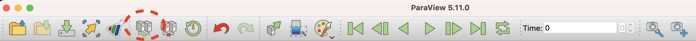
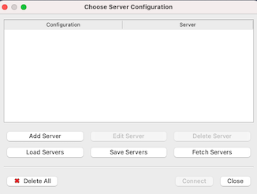
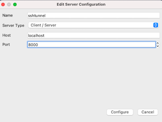

# Manually launching a ParaView server on Aurora

Sometimes it is convenient to manually launch an instance of the ParaView server. In this section, we will explain an alternative method to run the ParaView server on Polaris using an interactive job, where the user can launch the ParaView server from the command line interface.

Note: this method is better suited for experienced users. If you are just starting with ParaView, we recommend the [**client/server**](paraview.md) mode as your primary method for using this tool.

## Setting up ParaView 

From your local client, select Connect, either from the File menu or by clicking on the icon circled below:

 

A new window will open where you can configure a server. Click on Add Server:



Give your server a name, select Client/Server, localhost, and a TCP port (8000 in this example).



Click "Configure". In the next window, there is an option to set up how the ParaView server will be launched, and the default is "Manual". Leave it on "Manual" and click "Save".

You will use these settings when establishing the connection.

## Launching the ParaView server on Aurora

You can launch an interactive session on Aurora compute nodes with the following command (adjust parameters as needed to match your allocation, desired number of nodes, queue, walltime, and filesystems):

```shell
qsub -l walltime=01:00:00 -l select=2 -A yourallocation -q debug -I -l filesystems=home:flare
```

When the job starts, you will receive a prompt on your head node like this:

```
username@x4706c7s4b0n0:~>
```

Make a note of the node hostname (`x4706c7s4b0n0` in the example above). You can also get this information from `qstat -fx jobID`.

Now load the ParaView module:

```
username@x4706c7s4b0n0:~> module use /soft/modulefiles 
username@x4706c7s4b0n0:~> module load paraview/paraview-5.13.2
```

and launch the ParaView server with:

```
username@x4706c7s4b0n0:~> mpiexec -n 8 pvserver --server-port=8000
Waiting for client...
Connection URL: cs://x4706c7s4b0n0:8000
Accepting connection(s): x4706c7s4b0n0:8000
```

In this case, `pvserver` will be listening on TCP port 8000 of your head node. You can change this port if you want.

## Creating a tunnel over ssh

We need to establish an ssh tunnel to connect the client to the server. On your local machine, open a new terminal and type:

```
ssh -v -N -L 8000:x4706c7s4b0n0:8000 aurora.alcf.anl.gov
```

where 8000 is a TCP port and `x4706c7s4b0n0` is the name of your head node. Adjust these values accordingly.

Among multiple lines with debug information, you should see something like:

```
debug1: Local connections to LOCALHOST:8000 forwarded to remote address x4706c7s4b0n0:8000
```

Keep this terminal open for the duration of your session to keep the ssh tunnel active.

Now you are ready to launch your ParaView client locally. Keep in mind that client and server versions must match. The ParaView version currently deployed on Aurora is 5.13.2.

## Connecting to ParaView server

Connect your ParaView client to the server configuration you created above. You can select Connect, either from the File menu or the icon circled in the figure:

  

and select the configuration you created in a previous step.

The connection should point to:

```
localhost:8000
```

In the terminal where you launched the server, you will see now that the connection is established. Note that ParaView may take a few seconds to connect. This is normal behavior.

```
username@x4706c7s4b0n0:~> mpiexec -n 8 pvserver --server-port=8000
Waiting for client...
Connection URL: cs://x4706c7s4b0n0:8000
Accepting connection(s): x4706c7s4b0n0:8000
Client connected.
```

At this point, you can use ParaView normally.
