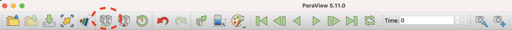
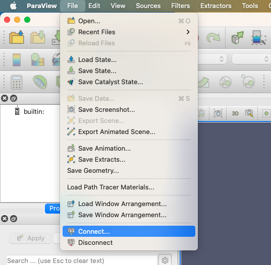
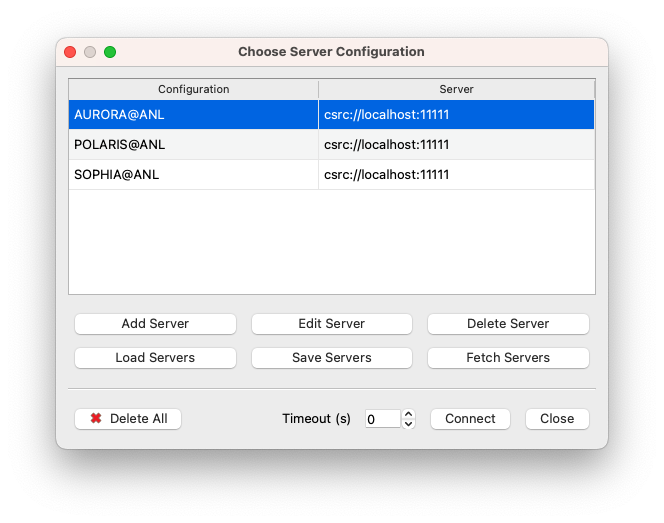
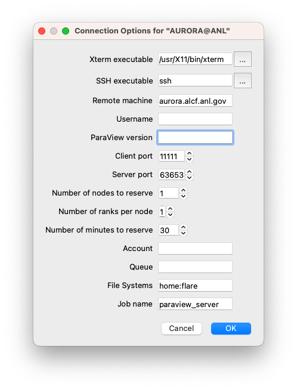
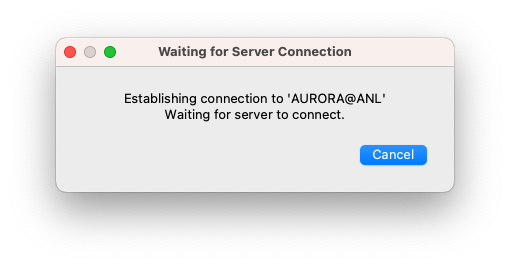
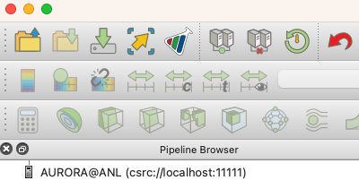

# ParaView on Aurora

The recommended way of running ParaView on Aurora is in client/server mode. This consists of running the ParaView client on your local resource and the ParaView server on the Aurora compute nodes. The ParaView client needs to first be installed on your local resource and must match the version that you run on Aurora.

There may be multiple versions of ParaView installed on Aurora. To find the versions of ParaView currently available on Aurora, run the following command on a login node: 
```
module use /soft/modulefiles
module avail paraview
```

Binary and source packages of the ParaView client for Linux, macOS, and Windows are available from the [ParaView Download Page](https://www.paraview.org/download/). 

## Connecting to the ParaView server on Aurora
This section describes how to launch the ParaView server on Aurora from a local ParaView client.

### Start ParaView Client
First, launch the ParaView client on your local resource. You will need to configure some server settings in the client. This initial setup should only need to be done once and can be reused each time you want to run ParaView on Aurora.

### Server Configuration

#### 1. Select Connect
From the ParaView client, choose to connect to a server by either clicking on the "Connect" icon in the menu bar
 
 

or selecting File->Connect from the main menu.

{ width="700" }

#### 2. Set Up Servers (first time only)
The first time you want to run a server on Aurora and have it connect to your local ParaView client, you will need to set up a server. Once this server is set up, you can reuse it each time you run the ParaView client with the ParaView server on Aurora.

Kitware, the developers of ParaView, maintain a database of server configurations that you can retrieve through the ParaView client.

!!! note "NOTE"
    At this time, there are no specific files for Aurora available from Kitware. We will update this page when the files are available. In the meantime, you can download configuration files here and import them with the `Load Servers` option. Please use the `Save link as` option in your browser. [Mac/Linux](serverfiles/aurora.pvsc)  |  [Windows](serverfiles/windowsToAurora.pvsc)

#### 3. Use ParaView

After the previous step, you can now select AURORA@ANL in the File->Connect menu and press Connect.

{ width="700" }

At this point, a new window will pop up.

{ width="700" }

There are a number of parameters that you must enter manually here:

**Xterm executable:** the path of a terminal on your system. The figure shows the case of a Mac with XQuartz. You may need to change these values for Windows or Linux.

**SSH executable:** the name of your SSH command. It may be different on Windows depending on the SSH client installed (e.g., PuTTY).

**Remote machine:** leave this value at aurora.alcf.anl.gov.

**Username:** your ALCF username.

**ParaView version:** the version of ParaView that you want to use. Verify first that this version is installed on the system (as described at the top of this document).

Example:
```
5.13.2
```

-**Client port:** it is safe to use the default value.

-**Server port:** it is safe to use the default value.

-**Number of nodes to reserve:** enter the number of Aurora compute nodes you want to use for your job.

-**Number of ranks per node:** enter the number of ranks per node.

-**Number of minutes to reserve:** the duration of your job in minutes.

-**Account:** enter here the name of your ALCF allocation.

-**Queue:** the name of the Aurora queue you would like to use (e.g., `debug`, `debug-scaling`, `prod`, `prod-large`).

-**File Systems:** enter here the file systems you need for your job, separated with colons, no spaces. Keep in mind that your job may not run if one of these file systems is not available at that time, so enter these values carefully.

-**Job name:** safe to use the default value. The PBS scheduler will assign this name to your job.

Now you can press OK to establish the connection with a ParaView server on Aurora.

An SSH connection will be established with a Aurora login node, and a password will be requested in a terminal, similar to the process you normally use to connect and work on the system.

After you enter your password, a job will be queued, and you will see a window like this:

{ width="700" }

When the job is launched on the compute nodes, the previous window will go away, and ParaView will show it is connected to Aurora in its Pipeline Browser:

{ width="700" }

At this point, you can open datasets stored on the ALCF file systems and use ParaView normally.

## Additional Information
- [ParaView Documentation](https://docs.paraview.org/en/latest/)
- [ParaView Community Support](https://discourse.paraview.org/)
