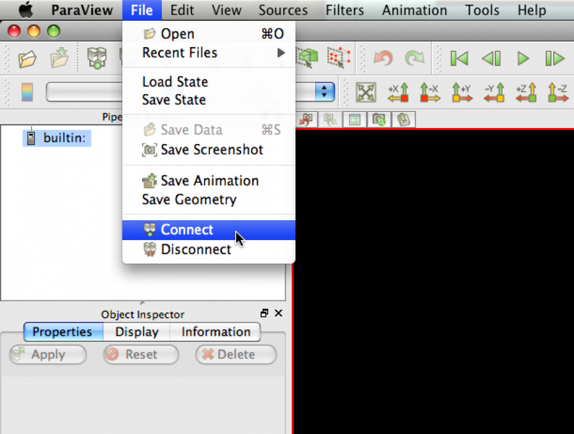
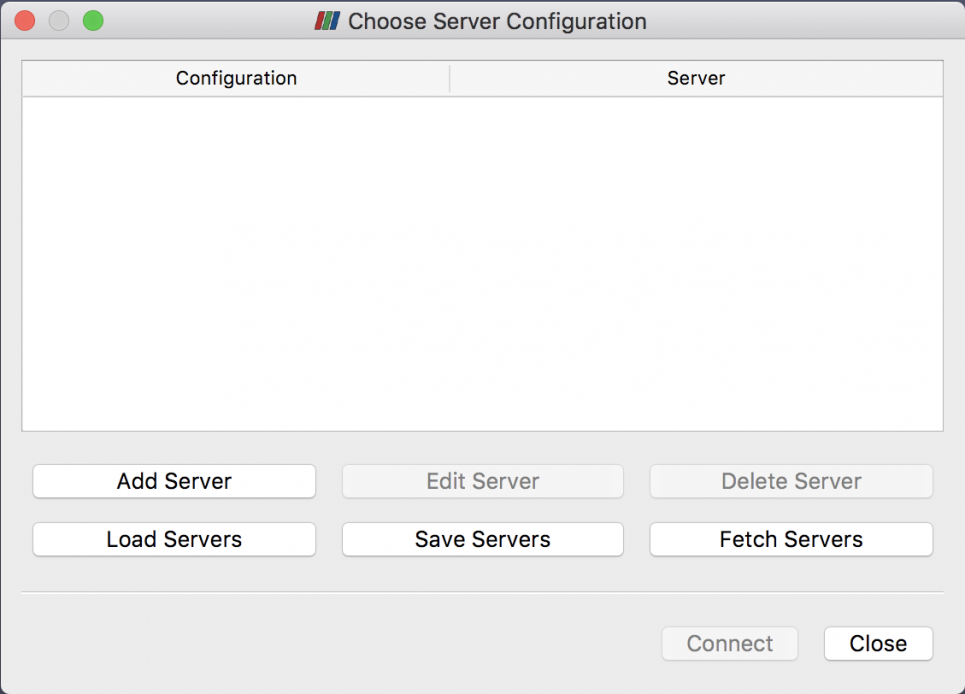
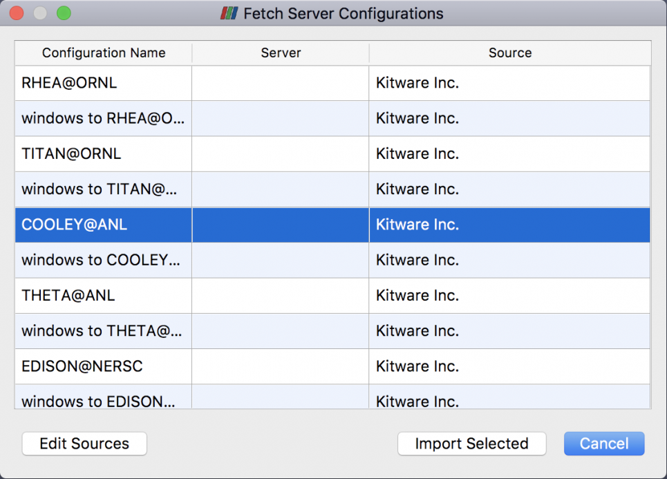
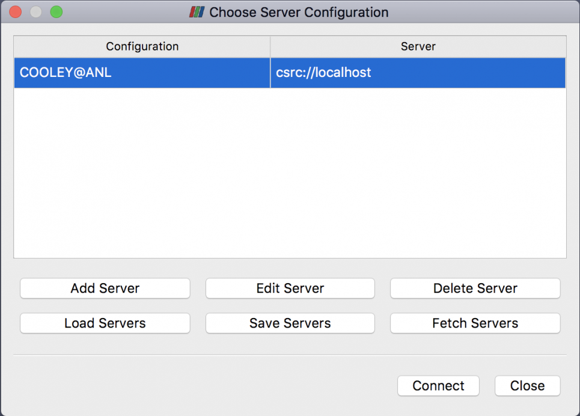
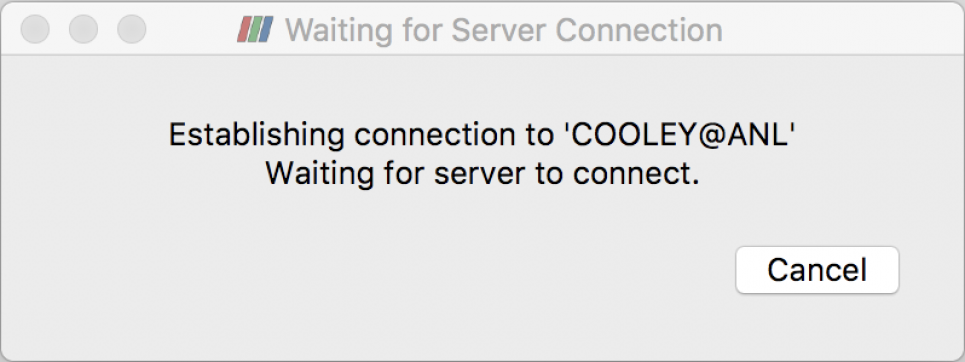
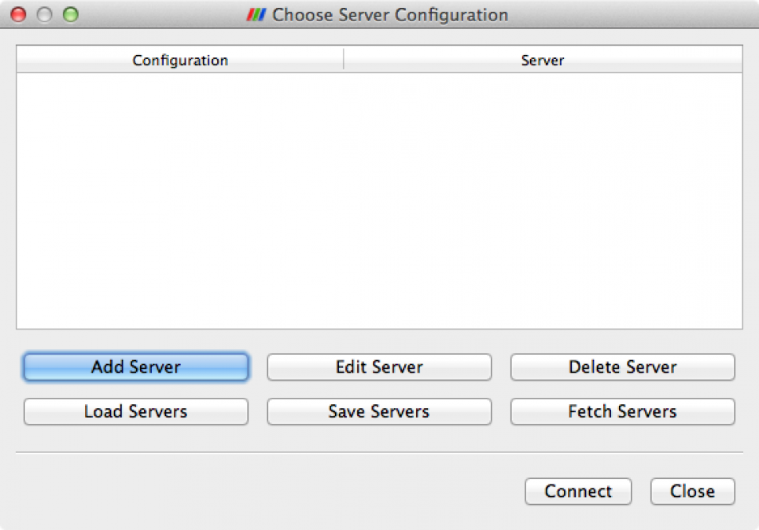
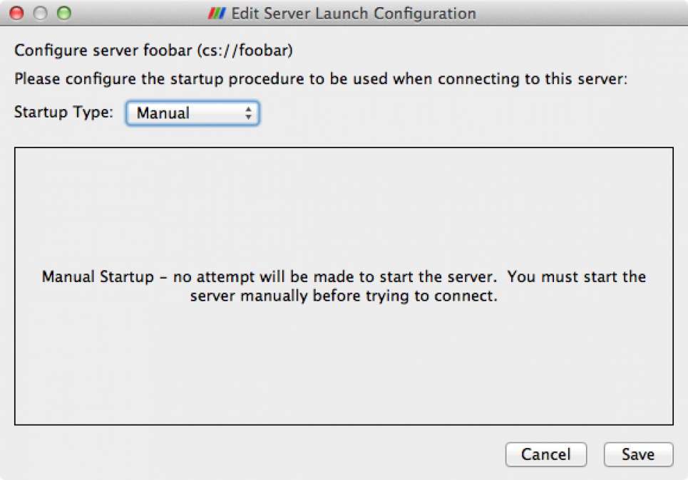
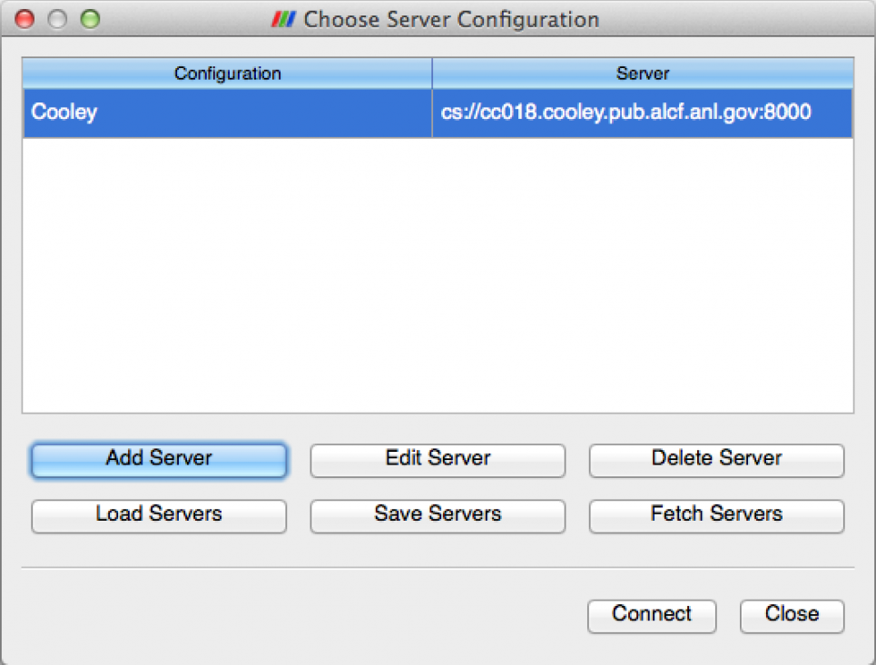

# Paraview on Cooley
The recommended way of running ParaView on Cooley is in client/server mode. This consists of running the ParaView client on your local resource, and the ParaView server (pvserver) on the Cooley visualization nodes. There are two ways to accomplish this, detailed below. In both cases, the ParaView client needs to first be installed on your local resource, and needs to match the version that you run on Cooley.

The most recent production version currently installed on Cooley is ParaView  5.10.0. Binary and source packages for Linux, MacOS, and Windows are available from the [ParaView Download Page](https://www.paraview.org/download/). (Run the 'softenv' command on a Cooley login node to see earlier versions of ParaView that are available.)

As mentioned, there are two ways to run ParaView in client/server mode. For more details, including advantages and disadvantages of each, see the section below on: Trade Offs

The first, and arguably easier, way is to run the ParaView client locally, and have it launch the pvserver on Cooley, and connect back to your local client. For details see the section below on: Automated / Reverse Connection

The other way is to first manually launch the pvserver on Cooley, and then launch the ParaView client locally and connect to your running pvserver. For details see the section below on: Manual / Forward Connection

## Automated / Reverse Connection
This section describes how to launch the pvserver on Cooley from a local ParaView client.

## Start ParaView Client
First, launch the ParaView client on your local resource. In order to launch the pvserver on Cooley and have it connect back to our local client, we will need to configure some server settings in the client. This initial set up should only need to be done once, and can be reused each time you want to run ParaView on Cooley.

## Server Configuration

### 1. Select Connect
From the ParaView client choose to connect to a server by either clicking on the "Connect" icon in the menu bar, or selecting:

File->Connect

From the main menu:

<figure markdown>
  { width="700" }
  <figcaption>Select connect</figcaption>
</figure>

### 2. Fetch Servers (first time only)
The first time we want to run a pvserver on Cooley and have it connect to our local ParaView client, we need to set up a Server. Once we set up this server, we can reuse it each time we run the ParaView client with the pvserver on Cooley.

Kitware, the maintainers of ParaView, maintain a database of server configurations, which we can retrieve through the ParaView client.

Click "Fetch Servers"

<figure markdown>
  { width="700" }
  <figcaption>Fetch servers</figcaption>
</figure>

### 3. Fetch Server Configuration, Cooley
From the list of server configurations, if your local resource is Linux or Mac, select **COOLEY@ANL**

If your local resource is Windows, select  **windows to COOLEY@ANL**

Click "Import Selected"

<figure markdown>
  { width="700" }
  <figcaption>Fetch server configuration Cooley</figcaption>
</figure>

### 4. Connect
Now that we have a server defined and configured, highlight it in the list.

Click "Connect"

<figure markdown>
  { width="700" }
  <figcaption>Connect to Cooley</figcaption>
</figure>

### 5. Configure Server Settings
In order to connect to Cooley and submit a job to launch the pvserver, you'll need to edit a few configuration settings.

First, ParaView needs a way to securely connect to Cooley, in order to run a qsub command to launch the pvserver. On Linux/Mac it does this through Xterm and SSH.  Be sure that the path to the **Xterm executable** is set correctly. On Windows be sure that the path to the **SSH executable** (such as PuTTY) is set correctly.

**Username:** Should be set to your login name on Cooley.

**ParaView version:** Be sure this matches the version of the ParaView client that you are running.

**Client port and Server port:** Can use the default values

Set the Number of nodes to reserve and Number of minutes to reserve accordingly. 

**NOTE:** You will be submitting a job to the queue on Cooley, and the number of nodes you request are not guaranteed to be available.  If they are not, you may have to wait in the queue until the requested number of nodes become available.

**Account:** set to your project id / allocation on Cooley

Click "OK"

<figure markdown>
  { width="700" }
  <figcaption>Configure server settings</figcaption>
</figure>

### 6. Connecting: Enter Password
A window will pop up, indicating that ParaView is connecting to Cooley, and is waiting for the server to connect back to your client.  

A second window will pop up (Xterm on Linux/Mac.  PuTTY, or other local SSH client, on Windows).  Enter your PIN and secure token one time password, just as you would when logging into Cooley.

This will enable ParaView to submit your job to run the pvserver on Cooley.  Once your job starts, and the pvserver connects back to your ParaView client, the **Waiting for Server Connection** window will go away. 

<figure markdown>
  { width="700" }
  <figcaption>Establishing connection to Cooley</figcaption>
</figure>

<figure markdown>
  { width="700" }
  <figcaption>Select connect</figcaption>
</figure>

### 2. Add (or Edit) Server
The first time we connect our local ParaView client to a pvserver on Cooley, we need to Add Server. Once we set up this server, we can reuse it each time we connect the ParaView client to the pvserver on Cooley. We may need to Edit Server in the future if our pvserver ends up on a different host.

Click "Add Server" (first time) or "Edit Server" (subsequent times)

<figure markdown>
  { width="700" }
  <figcaption>Add (or edit) server</figcaption>
</figure>

### 3. Configure Server, Part 1 
Configure the server by first giving it a Name, such as Cooley

Select Server Type: Client/Server

The Host value should be set to the full name of the head node of our job where the pvserver is listening: cc018.cooley.pub.alcf.anl.gov

And the port should be set to the value we used when we started the pvserver: 8000.

Click "Configure"

<figure markdown>
  { width="700" }
  <figcaption>Configure server, part 1 </figcaption>
</figure>

### 4. Configure Server, Part 2
Because we are going to connect to a ParaView server that we have already started, we don't need the ParaView client to start a server for us.

Select Startup Type: Manual

Click "Save"

<figure markdown>
  { width="700" }
  <figcaption>Configure server, part 2</figcaption>
</figure>

### 5. Connect
Now that we have a server defined and configured, highlight it in the list.

Click "Connect"

<figure markdown>
  { width="700" }
  <figcaption>Connect to Cooley</figcaption>
</figure>

### 6. Open File
Now when you select File->Open from the main menu, you will be browsing the filesystem on Cooley. You're ready to go.

