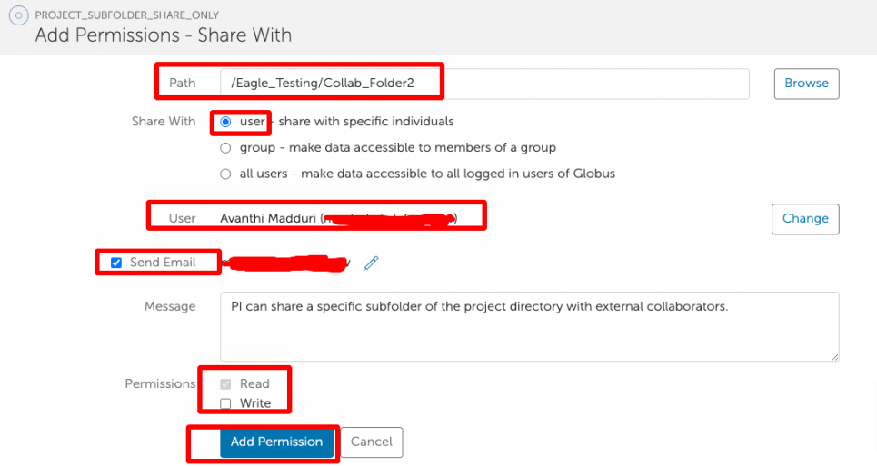
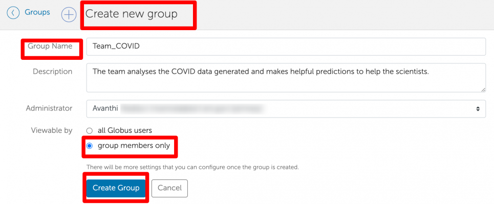
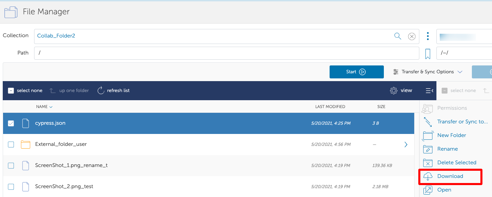
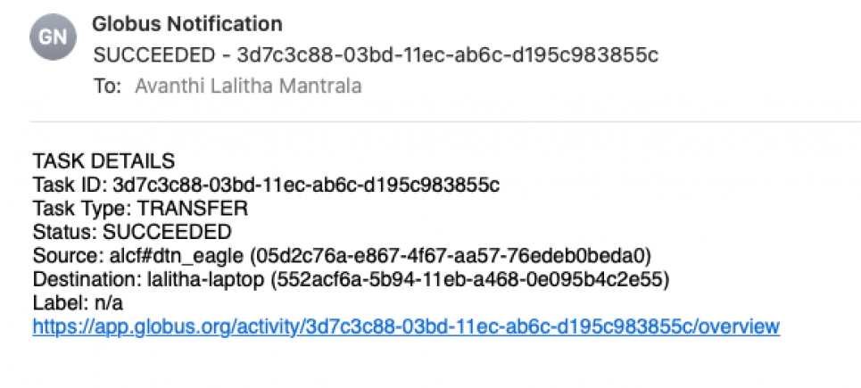
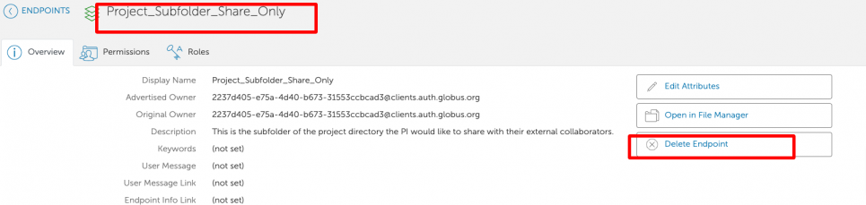
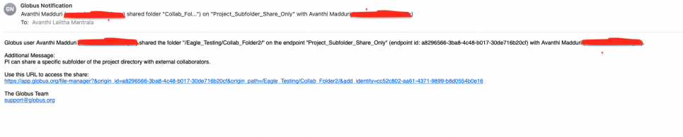
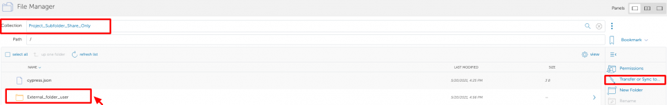
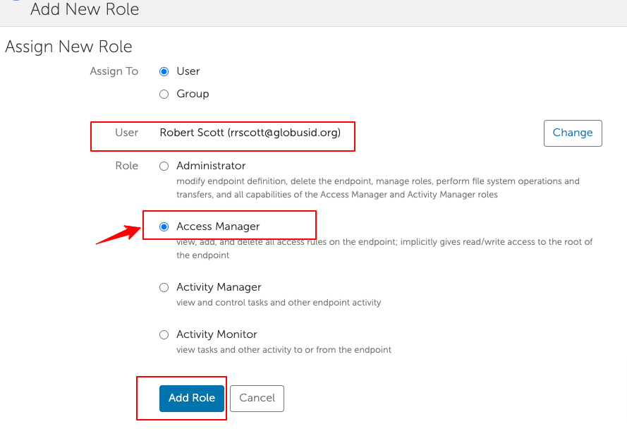

# Sharing Data on Eagle Using Globus Guest Collections

## Overview

Collaborators throughout the scientific community have the ability to write data to and read scientific data from the Eagle filesystem using Globus sharing capability. This capability provides PIs with a natural and convenient storage space for collaborative work.

!!! note

	The project PI needs to have an **active** ALCF account to set up Globus guest collections on Eagle and set permissions for collaborators to access data. If the PI does not have an account or has an inactive account, they will not be able to create a Globus guest collection. If a PI's account goes inactive after the Globus guest collection was created and shared, the collection will become inaccessible until the PI's account is reactivated. Only the project PI has the ability to create a collection; project proxies cannot create a collection.

Globus is a service that provides research data management, including managed transfer and sharing. It makes it easy to move, sync, and share large amounts of data. Globus will manage file transfers, monitor performance, retry failures, recover from faults automatically when possible, and report the status of your data transfer. Globus supports GridFTP for bulk and high-performance file transfer, and direct HTTPS for download. The service allows the user to submit a data transfer request and performs the transfer asynchronously in the background. For more information, see Globus data transfer and Globus data sharing.

## Logging into Globus with your ALCF Login

ALCF researchers can use their ALCF Login username and password to access Globus. Go to the [Globus website](https://www.globus.org/) and click on Log In in the upper right corner of the page.

{ width="700" }
/// caption
Logging into Globus
///

Type or scroll down to "Argonne LCF" in the "Use your existing organizational login" box, and then click "Continue".

{ width="700" }
/// caption
Select Organization Argonne LCF
///

You will be taken to a familiar-looking page for ALCF login. Enter your ALCF login username and password.

## Accessing your Eagle Project Directory

!!! note

    Specifically for PIs with Eagle 'Data-Only' projects (no compute allocations), logging in through Globus is the only way to access the project directory.

PIs with data and compute allocations will have access to the required compute-system login nodes (along with the Globus Web Interface) to access their project directory.

## <a name="Creating-a-Guest-Collection"></a>Creating a Guest Collection

A project PI needs to have an 'active' ALCF account in place to create and share guest collections with collaborators. Please note that ONLY a PI has the ability to create guest collections.

!!! info 

    PIs with an "Inactive/Deleted" ALCF account should submit a reactivation request by filling out this form: [Re-activation Form](https://my.alcf.anl.gov/accounts/#/accountReactivate)

!!! info

    PIs without an ALCF account should submit an ALCF account request by filling out this form: [Account Request Form](https://my.alcf.anl.gov/accounts/#/accountRequest)

### Navigate to the Collections tab

There are multiple ways to navigate to the Collections tab in "Endpoints":

1. [Click the link to get started](https://app.globus.org/file-manager/collections/05d2c76a-e867-4f67-aa57-76edeb0beda0/shares). It will take you to the Collections tab for Eagle. **OR**
2. Click on 'Endpoints' located in the left panel of the [Globus web app](https://app.globus.org/endpoints). Type "alcf#dtn_eagle" (for Eagle) in the search box located at the top of the page and click the magnifying glass to search. Click on the Managed Public Endpoint "alcf#dtn_eagle" from the search results. Click on the Collections tab. **OR**
3. Click on 'File Manager' located in the left panel of the Globus web app. Search for 'alcf#dtn_eagle' and select it in the Collection field. Select your project directory or a subdirectory that you would like to share with collaborators as a Globus guest collection. Click on 'Share' on the right side of the panel, which will take you to the Collections tab.

**Note:** When you select an endpoint to transfer data to/from, you may be asked to authenticate with that endpoint. Follow the instructions on screen to activate the endpoint and to authenticate. You may also have to provide Authentication/Consent for the Globus web app to manage collections on this endpoint.

### Adding a Guest Collection

In the Collections tab, click 'Add a Guest Collection' located at the top right-hand corner.

1. Fill out the form:
    1. If the path to the directory is not pre-populated, click the browse button, navigate and select the directory. Note that you can create a single guest collection and set permissions for folders within a guest collection. There is no reason to create multiple guest collections to share for a single project.
    2. Give the collection a Display Name (choose a descriptive name)

2. Click "Create Collection"

{ width="700" }
/// caption
Create New Guest Collection
///

## Sharing Data with Collaborators Using Guest Collections

Your data in the Guest Collections can be easily shared with collaborators at ALCF or elsewhere. You have full control over which files your collaborators can access, and whether they have read-only or read-write permissions.

To share data with collaborators (that either have a Globus account or an ALCF account), click on 'Endpoints', select your newly created Guest Collection (as described in the section above), and go to the 'Permissions' tab. Click on 'Add Permissions - Share With':

{ width="700" }
/// caption
Add Permissions
///


You can share with other Globus users or Globus Groups (for more information on Groups, scroll down to Groups). You can give the collaborators read, write, or read+write permissions. Once the options have been selected, click 'Add Permission'.

{ width="700" }
/// caption
Add Permissions - Share With
///

PI can also choose to share their data with 'Public' with anonymous read access (and anonymous write disabled). This allows anyone that has access to the data to read and/or download it without authorizing the request.

{ width="700" }
/// caption
Add Permissions - Share With
///

You should then see the share and the people you have shared it with. You can repeat this process for any number of collaborators. At any time, you can terminate access to the directory by clicking the trash can next to the user.

{ width="700" }
/// caption
List of people that you have shared with
///


## Additional information on Globus Guest Collections

1. ONLY a project PI can create guest collections and make them accessible to collaborators. Project proxies cannot create guest collections.
2. You can only share directories, not individual files.
3. Globus allows directory trees to be shared as either read or read/write. This means that any subdirectories within that tree also have the same permissions. Globus supports setting permissions at a folder level, so there is no need to create multiple guest collections for a project. You can create a guest collection at the top level and share sub-directories with the collaborators by assigning the appropriate permissions.
4. When you create a guest collection endpoint and give access to one or more Globus users, you can select whether each person has read or read/write access. If they have write access, they can also delete files within that directory tree, so you should be careful about providing write access.
5. Globus guest collections are created and managed by project PIs. If the PI of a project changes, the new PI will have to create a new guest collection and share them with the users. Contact ALCF Support (support@alcf.anl.gov) in such cases. Globus guest collections' ownership cannot be transferred.
6. Guest collections are active as long as the project directory is available **and** the PI's ALCF account is active. If the PI's ALCF account goes inactive, the collections become inaccessible to all its collaborators. Access is restored once the PI's account is reactivated.
7. All RW actions are performed as the PI when using Guest Collections. If a PI does not have permissions to read or write a file or a directory, then the Globus guest collection users won't either.

## <a name="Creating-a-group"></a>Creating a group

1. Go to Groups on the left panel
2. Click on ‘Create a new group’ at the top
3. Give the group a descriptive name and add a Description for more information
4. Make sure you select the ‘group members only’ radio button
5. Click on ‘Create Group’

{ width="700" }
/// caption
Create new group
///

## Transferring data from Eagle

Log in to [Globus](https://app.globus.org) using your ALCF credentials. After authenticating, you will be taken to the Globus File Manager tab. In the 'Collection' box, type the name of the Eagle managed endpoint (`alcf#dtn_eagle`). Navigate to the folder/file you want to transfer. HTTPS access (read-only) is enabled so you can download files by clicking the "Download" button.

Click on 'Download' to download the required file.

{ width="700" }
/// caption
Download the required file
///

To transfer files to another Globus endpoint, in the "collection" search box in the RHS panel, enter the destination endpoint (which could also be your Globus Connect Personal endpoint).

{ width="700" }
/// caption
Transferring files to another Globus endpoint
///

To transfer files, select a file or directory on one endpoint, and click the blue 'Start' button.

{ width="700" }
/// caption
Transferring files
///

If the transfer is successful, you should see the following message:

{ width="700" }
/// caption
A Successful Transfer
///

Click on 'View details' to display task detail information.

{ width="700" }
/// caption
Transfer completed
///

You will also receive an email when the transfer is complete.

{ width="700" }
/// caption
Email confirmation
///

## Deleting a guest collection

To see all guest collections you have shared, go to 'Endpoints' in the left-hand navigation bar, then 'Administered by You'. Select the guest collection endpoint you wish to delete, and click on 'Delete endpoint'.

{ width="700" }
/// caption
Deleting a guest collection
///

## What to tell your Collaborators

If you set up a shared endpoint and want your collaborator to download the data, this is what you need to tell them.

First, the collaborator needs to get a Globus account. The instructions for setting up a Globus account are as described above. This account is free. They may already have Globus access via their institution.

If the collaborator is downloading the data to his/her personal workstation, they need to install the Globus Connect client. Globus connect clients are available for Mac, Windows, or Linux systems and are free.

If you clicked on the 'notify users via email' button when you added access for this user, they should have received a message that looks like this:

{ width="700" }
/// caption
Click on the 'notify users via email' button for collaborators to receive an email
///

You can, of course, also send an email to your collaborators yourself, telling them you've shared a folder with them. The collaborator should click on the link, which will require logging in with their institutional or Globus login username and password. They should then be able to see the files you shared with them. External collaborator's view of the shared collection is shown below:

{ width="700" }
/// caption
Collaborator transfer or sync to
///

They should click on the files they want to transfer, then 'Transfer or Sync to', enter their own endpoint name and desired path, and click the 'Start' button near the bottom to start the transfer.

{ width="700" }
/// caption
Choosing transfer path
///

## Encryption and Security

Data can be encrypted during Globus file transfers. In some cases, encryption cannot be supported by an endpoint, and Globus Online will signal an error.

For more information, see [How does Globus ensure my data is secure?](https://docs.globus.org/faq/security/#how_does_globus_ensure_my_data_is_secure)

In the Transfer Files window, click on 'More options' at the bottom of the 2 panes. Check the 'encrypt transfer' checkbox in the options.

{ width="700" }
/// caption
Encrypting the transfer
///

Alternatively, you can encrypt the files before transfer using any method on your local system, then transfer them using Globus, then unencrypt on the other end.

!!! danger

	Encryption and verification will slow down the data transfer.

## FAQs

### General FAQs:

**1. What is the Eagle file system?**

They are Lustre file systems residing on an HPE ClusterStor E1000 platform equipped with 100 Petabytes of usable capacity across 8480 disk drives. Each ClusterStor platform also provides 160 Object Storage Targets and 40 Metadata Targets with an aggregate data transfer rate of 650GB/s.

**2. What is the difference between a Guest, Shared, and Mapped collection?**

- Guest collections: A Guest collection is a logical construct that a PI sets up on their project directory in Globus that makes it accessible to collaborators. The PI creates a guest collection at or below their project and shares it with the Globus account holders.
- Shared collection: A guest collection becomes a shared collection when it is shared with a user/group.
- Mapped Collections: Mapped Collections are created by the endpoint administrators. In the case of Eagle, these are created by ALCF.

**3. Who can create Guest collections?**

ONLY a project PI (or project owner) can create guest collections and make them accessible to collaborators.

Project Proxy (on the POSIX side) or Access Manager (on the Globus side) do not have the ability to create guest collections.

**4. Who is an Access Manager?**

Access Manager is someone who can act as a Proxy on behalf of the PI to manage the collection. The Access Manager has the ability to add users, remove users, grant or revoke read/write access privileges for those users on that particular guest collection. However, Access Managers DO NOT have permissions to create guest collections.

**5. What are Groups?**

Groups are constructs that enable multi-user data collaboration. A PI (and an Access Manager) can create new groups, add members to them, and share a guest collection with a group of collaborators.

**Note:** Members of groups do not need to have ALCF accounts.

**6. What are some of the Common Errors you see and what do they mean?**

```output
- EndpointNotFound   -  Wrong endpoint name 
- PermissionDenied    -  If you do not have permissions to view or modify the collection on <endpoint>
- ServiceUnavailable  -  If the service is down for maintenance
```

### PI FAQs:

**1. How can a PI request for a data-only, Eagle storage allocation?**

A project PI can request an allocation by filling out the Director’s Discretionary Allocation Request form: [Request an allocation](https://my.alcf.anl.gov/accounts/#/allocationRequests). The allocations committee reviews the proposals and provides its decision in 1-2 weeks.

**2. Does a PI need to have an ALCF account to create a Globus guest collection?**

Yes. The PI needs to have an 'active' ALCF account in place to create and share guest collections with collaborators.

- PIs with an "Inactive/Deleted" ALCF account should submit a reactivation request by filling out this form: [Re-activation Form](https://my.alcf.anl.gov/accounts/#/accountReactivate)
- PIs without an ALCF account should submit an ALCF account request by filling out this form: [Account Request Form](https://my.alcf.anl.gov/accounts/#/accountRequest)

**3. What endpoint should the PI use?**

`alcf#dtn_eagle` (project on Eagle)

**4. What are the actions a PI can perform?**

- Create and delete guest collections, groups
- Create, delete, and share the data with ALCF users and external collaborators
- Specify someone as a Proxy (Access Manager) for the guest collections
- Transfer data between the guest collection on Eagle and other Globus endpoints/collections

**5. How can a PI specify someone as a Proxy on the Globus side?**

Go to `alcf#dtn_eagle` -> collections -> shared collection -> roles -> select 'Access Manager'

{ width="700" }
///caption
To specify someone as a Proxy, click on "Roles"
///

{ width="700" }
///caption 
Choose Access Manager and "Add Role"
///
  
**6. What is the high-level workflow for setting up a guest collection?**

1. PI requests a compute or data-only allocation project.
2. Once the request is approved, ALCF staff sets up a project, unixgroup, and project directory.
3. A Globus sharing policy is created for the project with appropriate access controls, provided the PI has an active ALCF account.
4. PI creates a guest collection for the project, using the Globus mapped collection for the file system (`alcf#dtn_eagle`)

    - **Note:** PI needs to have an active ALCF Account and will need to log in to Globus using their ALCF credentials.
    - If PI has an existing Globus account, it needs to be linked to their ALCF account.

5. PI adds collaborators to the guest collection. Collaborators can be ALCF users and external collaborators and can be added with Read only or Read-Write permissions

**7. How can project members with ALCF accounts access the project directory via Globus?**

Users that have active ALCF accounts and are part of the project in the ALCF Account and Project Management system will automatically have access to the project directory which they can access by browsing the Globus endpoint `alcf#dtn_eagle`. If they want to access the files using the Globus guest collection set up by the PI, the PI will need to explicitly give them permissions to that guest collection. The purpose of Globus guest collections is to share the data with collaborators that don't have ALCF accounts or are not part of the project in the ALCF Account and Project Management system.

**8. Who has the permissions to create a guest collection?**

Only the PI has the ability to create a guest collection. The Access Manager, along with the PI, has permissions to share it with collaborators (R-only or R-W permissions as needed).

**9. I am the project PI. Why do I see a "Permission Denied" error when I try to CREATE a guest collection?**

If you are a PI and you see this error, it could mean that a sharing policy for the project is missing. Please contact [support@alcf.anl.gov](mailto:support@alcf.anl.gov) so they can set one up.

**10. If a PI added a member as a project proxy on the POSIX-side, is it safe to assume that the Proxy can create guest collections?**

No, project proxies cannot create guest collections, only the PI can.

**11. Who can create groups?**

A PI (and an Access Manager) can create new groups, add members to them, and share a guest collection with a group of collaborators. For more information, refer to: [Creating a group](#Creating-a-group)

**12. What happens when the PI of a project changes? What happens to the guest collection endpoint?**

The new PI will need to create new guest collections and share it with collaborators again. Guest collections are tied to a PI's account and cannot be transferred.

**13. I noticed that I am the owner of all the files that were transferred by external collaborators using the guest collection. Why is that?**

When collaborators read files from or write files to the guest collection, they do so on behalf of the PI. All writes show up as having been carried by the PI. Additionally, if the PI does not have permission to read or write to a file or folder in the directory, then the collaborators will not have those permissions either.

**14. What happens to the guest collections when the PI's account goes inactive?**

The collections go inactive and will remain in that state until the PI's account is re-activated.

**15. How long does it take for the endpoint to become accessible to collaborators after a PI's account is re-activated?**

Right away. The page needs to be refreshed and sometimes you may have to log out and log back in.

### Access Manager FAQs:

**1. What are the actions an Access Manager can perform?**

Access Manager should be able to see the collection under "Shared with you" and "Shareable by you" tabs. They have permissions to add and/or delete collaborators on the shared collection and restrict their R-W access as needed.

**2. Does an Access Manager need to have an ALCF account?**

Not necessary. However, if they need to manage the membership on the POSIX side (or in the ALCF Account and Project Management system), they will need an ALCF account and be a Proxy on the project.

**3. What is the difference between an ALCF project Proxy and a guest collection Access Manager?**

An ALCF Project Proxy has permissions to manage project membership on the POSIX side whereas a guest collection Access Manager has permissions to manage the project membership specific to that guest collection, created by the PI, on the Globus side.

**4. I am an 'Access Manager' on the collection. Why do I see a 'Permission Denied' error when I try to SHARE a guest collection created by the PI?**

If you are a non-PI who is able to access the guest collection but unable to share it, it means that your role on this guest collection is limited to a "Member". If you want the ability to share folders and sub-folders from the collections that are shared with you, please talk to the PI. They will need to set your role to an "Access Manager" for the collection within Globus.

**5. Can an Access Manager give external collaborators access to the collections that are shared with them?**

Yes, an Access Manager will see the "Permissions" tab at the top of the shared collection page and can share it with collaborators and/or a group.

**6. Can an Access Manager create collections using the shared endpoint?**

No. An access manager cannot create a collection, only a PI can do that. The access manager can however share folders and sub-folders from the collections that are shared with them.

**7. Can an Access Manager leave a globus group or withdraw membership request for collaborators?**

Yes. Go to `alcf#dtn_eagle` -> Groups > group_name -> Members -> click on specific user -> Role & Status -> Set the appropriate status.

{ width="700" }
/// caption
If you get this error, you do not have read permissions.

**8. Can an Access Manager delete guest collections created by PI?**

No. Access managers cannot delete guest collections.

### Guest Collection Collaborators FAQs:

**1. What actions can collaborators perform?**

1. Collaborators can read files from a collection[^1]
2. Collaborators can write to a collection[^2]
3. Collaborators can delete files in a collection[^2]

**2. I am a collaborator. Why do I see a 'Permission Denied' error when I try to ACCESS a guest collection created by the PI?**

If you are a non-PI and you see this error while trying to access the collection, it means that you do not have read permissions to access the guest collection. Please contact the PI for required access.

{ width="1000" }
/// caption
If you get this error, you do not have read permissions.
///

[^1]:If the PI has read permissions for those files on the POSIX side and the collaborator is given read permissions in Globus for the guest collection.

[^2]:If the PI has write permissions for those files on the POSIX side and the collaborator is given write permissions in Globus for the guest collection.
