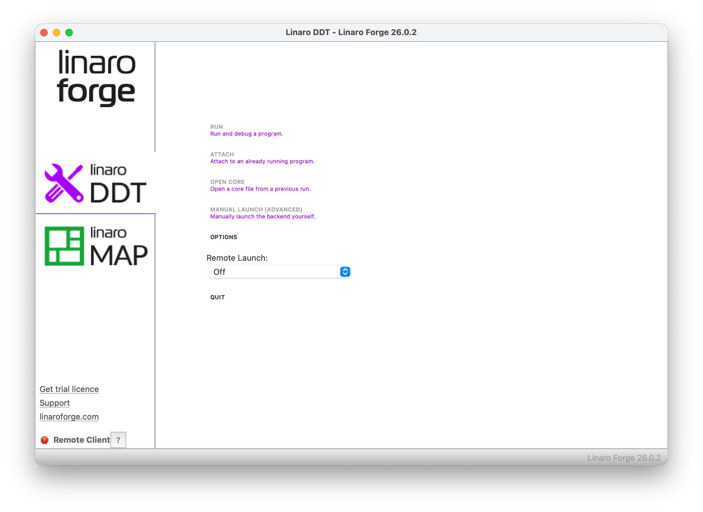
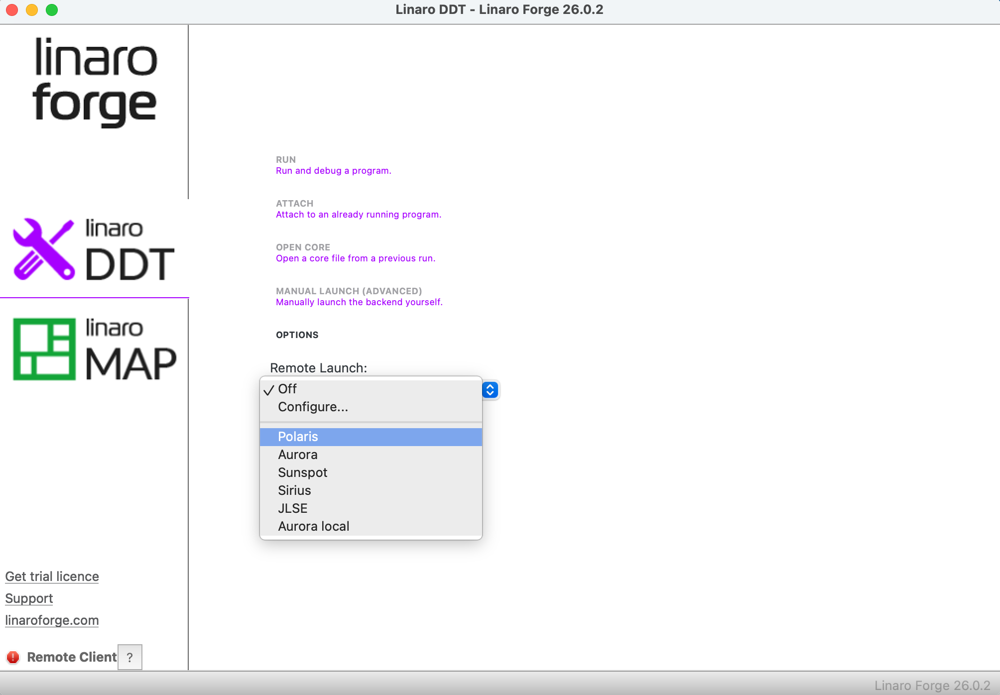
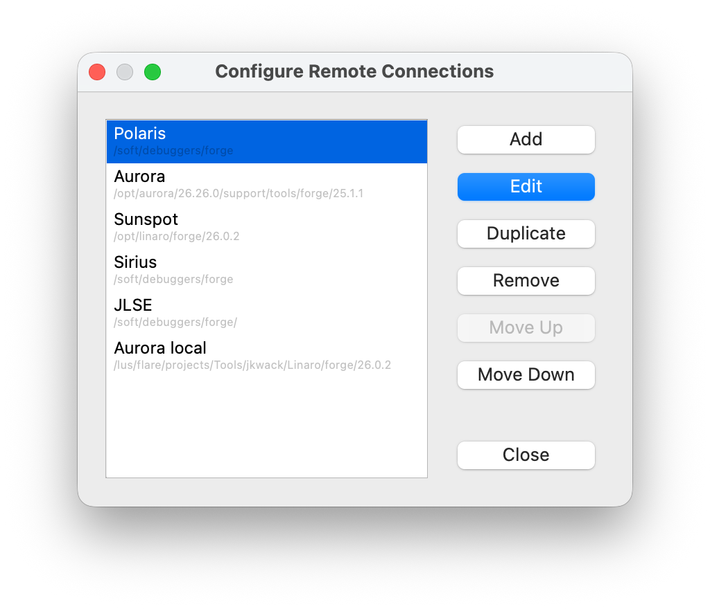
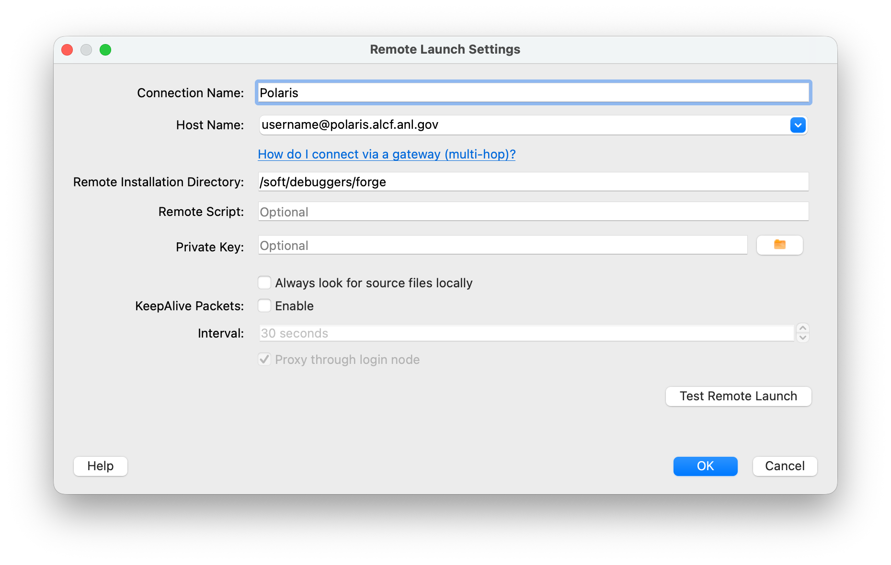
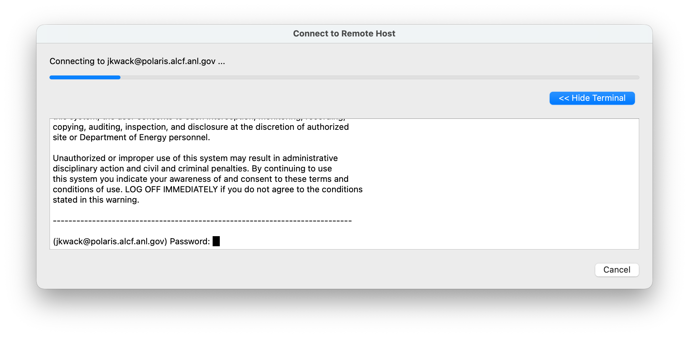
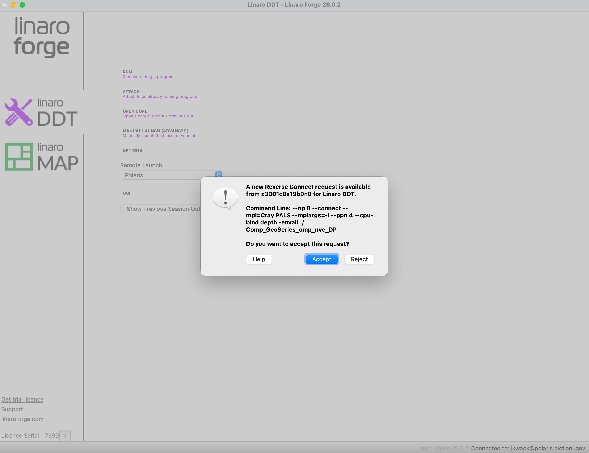
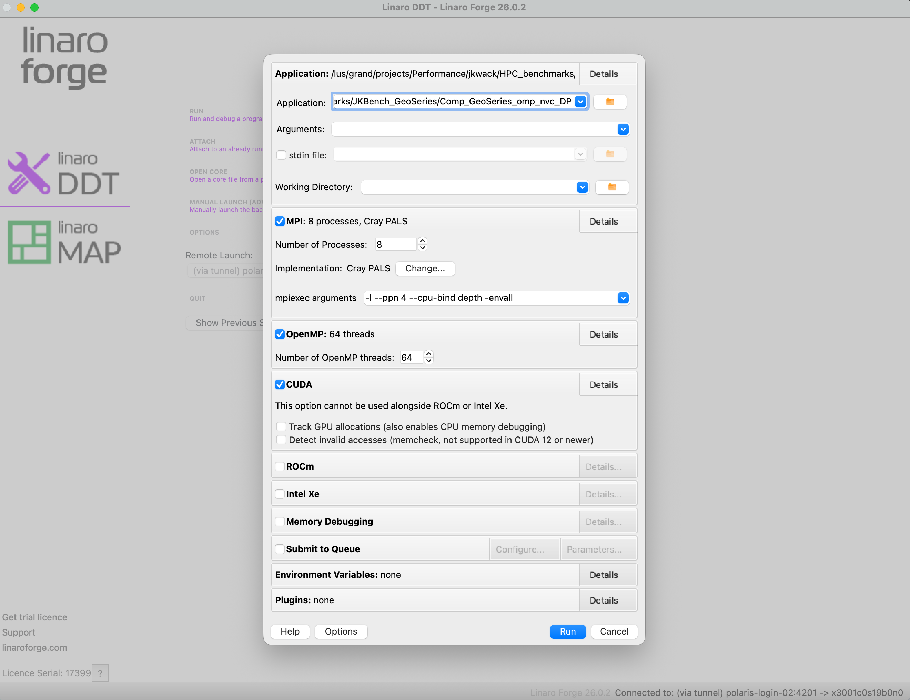
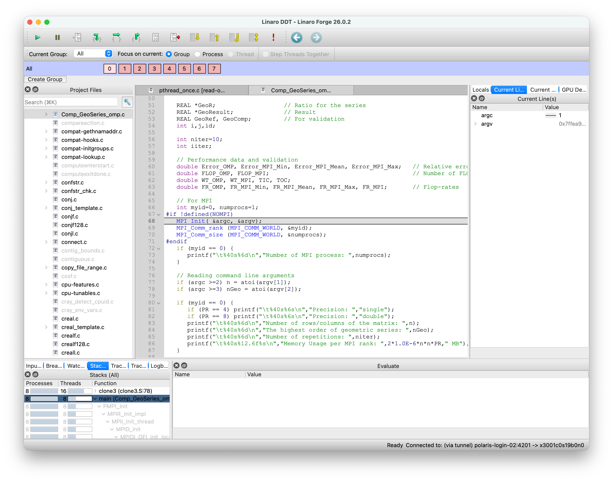

# Debugging on Polaris with DDT

We have licenses for a parallel debugger, Linaro DDT on Polaris. This is not a tutorial on DDT; for that, you should use Linaro's documentation, such as the documentation bundled with their client programs. Here we provide specific information on using DDT interactively in the GUI client-server mode on Polaris.

## Client

Download and install the latest Linaro Forge client for your desktop/laptop system from the [Linaro website](https://www.linaroforge.com/download-documentation/). This is available for Linux, macOS, and Windows systems.

### Configuring the Remote Client

Before you can start a DDT debugging session on Polaris compute nodes, you must set your client for remote connection from Polaris compute nodes. Your client window should look something like this:



Click the Remote Launch pull-down and click Configure to create a connector for Polaris:



Click the Add button on the Configure Remote Connections screen:



Create a configuration named "Polaris", and set it up like this example, replacing "username" with your actual ALCF login name:




You may want to test the configuration. To do that, click the Test Remote Launch button. If you see a login prompt like the following example, use your usual ALCF one-time password:



If the test is successful, you are ready to proceed from a Polaris compute node.

### Invoking the DDT Server from Polaris

To run DDT interactively from Polaris, start up an interactive PBS job. You'll need to load a module to access DDT:

```bash
module load forge
```

To start the DDT server and connect to your client, make sure your client is running and you have selected the remote connection to Polaris you created as shown above. On the Polaris compute node shell prompt, issue the command to debug your binary like this example, which starts up DDT on 2 nodes, with 8 MPI ranks per node:

```bash
ddt --np=8 --connect --mpi="Cray PALS" --mpiargs="-l --ppn 4 --cpu-bind depth -envall" ./a.out
```

Or you may simply prepend `ddt --connect` to your application's MPI command line as follows:

```bash
ddt --connect mpirun -n 8 --ppn 4 --cpu-bind depth ./set_affinity_gpu_polaris.sh ./a.out
```

On the client, you should see a connection pop-up like this:



Click the Accept button. This should bring up a DETAILS pane that looks like the following example. Confirm and adjust the number of OpenMP threads and other parameters to be correct for your run. For GPU debugging, the CUDA box should be checked:



When you are satisfied with the details, click the Run button. This should pop up a window that shows the multiple processes starting up. If that startup completes normally, the pop-up will disappear and your client window should reveal the full DDT debugging GUI interface, something like this example:



From here, you should be able to control starting and stopping processes, ranks, and threads (CPU and GPU threads). If you set a breakpoint or otherwise stop in the source code for a GPU-offloaded kernel, you should be able to click the Thread radio button and see threads with a "GPU" badge on them. 

## Offline debugging

To run your application with DDT wihtout intervention, you can use offline debugging features such as tracepoints and memory debugging enabled, and produces a report at the end of the execution.

```bash
ddt --offline mpirun -n 8 --ppn 4 --cpu-bind depth ./set_affinity_gpu_polaris.sh ./a.out
```


As mentioned above, this is not meant to be full documentation on how to use DDT. A good place to start with that is to open the User Guide from the Help menu in the client application.


## Running a local version on Polaris

You may want to install and run a local version of Forge from the [Linaro website](https://www.linaroforge.com/download-documentation/) on Polaris. Once you install it, you can use the following license file to run the local version with the Forge license on Polaris:

```bash 
FORGE_LICENSE_FILE=/soft/debuggers/forge-site/licences/License.17399.client <path_to_the_local_version>/ddt --connect <other DDT parameters> 
```
