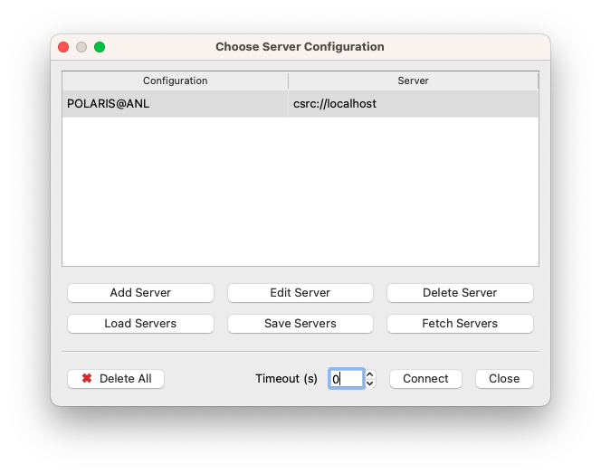

# Paraview on Polaris


The recommended way of running ParaView on Polaris is in client/server mode. This consists of running the ParaView client on your local resource, and the ParaView server (pvserver) on the Polaris compute nodes. There are two ways to accomplish this, detailed below. In both cases, the ParaView client needs to first be installed on your local resource, and needs to match the version that you run on Polaris.


There are multiple versions of Paraview installed on Polaris. To find the versions of Paraview currently available on Polaris run the following command on a login node: 
```
module avail paraview
```

The ParaView client needs to first be installed on your local resource, and needs to match the version that you run on Polaris. Binary and source packages for Linux, MacOS, and Windows are available from the [ParaView Download Page](https://www.paraview.org/download/). 

## Automated / Reverse Connection
This section describes how to launch the Paraview server on Polaris from a local ParaView client.

### Start ParaView Client
First, launch the ParaView client on your local resource. We will need to configure some server settings in the client. This initial set up should only need to be done once, and can be reused each time you want to run ParaView on Polaris.

### Server Configuration

#### 1. Select Connect
From the ParaView client choose to connect to a server by either clicking on the "Connect" icon in the menu bar, or selecting:

File->Connect

From the main menu:

<figure markdown>
  { width="700" }
  <figcaption>Select connect</figcaption>
</figure>

#### 2. Set Up Servers (first time only)
The first time we want to run a server on Polaris and have it connect to our local ParaView client, we need to set up a Server. Once we set up this server, we can reuse it each time we run the ParaView client with the Paraview server on Polaris.

Kitware, the maintainers of ParaView, maintain a database of server configurations, which we can retrieve through the ParaView client. 

!!! note
	At this time, Polaris is not available on the list maintained by Kitware, so you will need to download a file and load it manually.

Download [this](scripts/server_polaris.pvsc) file if you are running MacOS or Linux.

Download [this](scripts/server_polaris_windows.pvsc) file if you are running Windows.

The file contains settings in ASCII, so it is safe to download. If your browser renames it, the file extension should be .pvsc

Click "Load Servers" and load the file you just downloaded.

In the File->Connect menu press the button named "Load Servers", navigate to the directory where you downloaded the above file, select the file, and press OK.

## Setting up Paraview 

From your local client select Connect, either from the File menu, or by clicking on the icon circled below:

 

A new window will open where you can configure a server. Click on Add Server:


<figure markdown>
  { width="700" }
  <figcaption>Load servers</figcaption>
</figure>


Give your server a name, select Client/Server, localhost, and a TCP port (8000 in this example)


Click "Configure". In the next window there is an option to set up how Paraview server will be launched, and the default is "Manual". Leave it on "Manual" and click "Save".

You will use these settings when establishing the connection.


At this point you can use Paraview normally.


