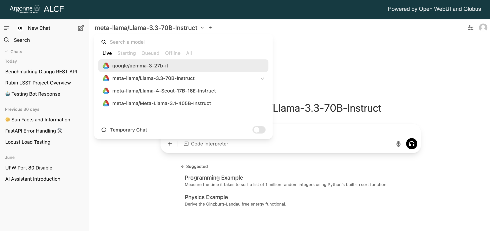

# ALCF Inference Endpoints

Unlock Powerful AI Inference at Argonne Leadership Computing Facility (ALCF). This service provides API access to a variety of state-of-the-art open-source models running on dedicated ALCF hardware.

## Quick Start

This guide will walk you through the fastest ways to start using the ALCF Inference Endpoints.

### Web UI

The easiest way to get started is through the web interface, accessible at [https://inference.alcf.anl.gov/](https://inference.alcf.anl.gov/)

The UI is based on the popular Open WebUI platform. After logging in with your ANL or ALCF credentials, you can:

1.  Select a model from the dropdown menu at the top of the screen.
2.  Start a conversation directly in the chat interface.

In the model selection dropdown, you can see the status of each model:



- **Live:** These models are "hot" and ready for immediate use.
- **Starting:** A node has been acquired and the model is being loaded into memory.
- **Queued:** The model is in a queue waiting for resources to become available.
- **Offline:** The model is available but not currently loaded. It will be queued for loading when a user sends a request.
- **All:** Lists all available models regardless of their status.

!!! note "For Advanced UI Features"
    For a full guide on advanced features like RAG (Retrieval-Augmented Generation), function calling, and more, please refer to the official [Open WebUI documentation](https://docs.openwebui.com/).

### API Access

For programmatic access, you can use the API endpoints directly.

#### 1. Setup Your Environment

You can run the following setup from anywhere (your local machine, or an ALCF machine).

```bash
# Create a new Conda environment
conda create -n globus_env python==3.11.9 --y
conda activate globus_env

# Install necessary packages
pip install openai globus_sdk
```

#### 2. Authenticate

To access the endpoints, you need an authentication token.

```bash
# Download the authentication helper script
wget https://raw.githubusercontent.com/argonne-lcf/inference-endpoints/refs/heads/main/inference_auth_token.py

# Authenticate with your Globus account
python inference_auth_token.py authenticate
```

This will generate and store access and refresh tokens in your home directory. To see how much time you have left before your access token expires, type the following command (`units` can be seconds, minutes, or hours):

```bash
python inference_auth_token.py get_time_until_token_expiration --units seconds
```

!!! warning "Token Validity"
    - Access tokens are valid for 48 hours. The `get_access_token` command will automatically refresh your token if it has expired.
    - An internal policy requires re-authentication every 7 days. If you encounter permission errors, logout from Globus at [app.globus.org/logout](https://app.globus.org/logout) and re-run `python inference_auth_token.py authenticate --force`.

#### 3. Make a Test Call

Once authenticated, you can make a test call using cURL or Python.

=== "cURL"

    ```bash
    #!/bin/bash

    # Get your access token
    access_token=$(python inference_auth_token.py get_access_token)

    curl -X POST "https://inference-api.alcf.anl.gov/resource_server/metis/api/v1/chat/completions" \
         -H "Authorization: Bearer ${access_token}" \
         -H "Content-Type: application/json" \
         -d '{
                "model": "Meta-Llama-3.1-8B-Instruct",
                "messages":[{"role": "user", "content": "Explain quantum computing in simple terms."}]
             }'
    ```

=== "Python (OpenAI SDK)"

    ```python
    from openai import OpenAI
    from inference_auth_token import get_access_token

    # Get your access token
    access_token = get_access_token()

    client = OpenAI(
        api_key=access_token,
        base_url="https://inference-api.alcf.anl.gov/resource_server/metis/api/v1"
    )

    response = client.chat.completions.create(
        model="Meta-Llama-3.1-8B-Instruct",
        messages=[{"role": "user", "content": "Explain quantum computing in simple terms."}]
    )

    print(response.choices[0].message.content)
    ```

## System Details

### Available Clusters

Two clusters are currently active, with additional systems coming soon:

| Cluster | Status | Framework | Base URL | Supported Endpoints |
|---------|--------|-----------|----------|---------------------|
| **[Sophia](https://docs.alcf.anl.gov/sophia/getting-started/)** | Active | vLLM | `/resource_server/sophia/vllm/v1` | `/chat/completions`<br>`/completions`<br>`/embeddings`<br>`/batches` |
| **[SambaNova SN40L (Metis)](https://docs.alcf.anl.gov/ai-testbed/sn40l_inference/)** | Active | SambaNova API | `/resource_server/metis/api/v1` | `/chat/completions` |
| Cerebras CS-3 | Coming Soon | - | - | - |
| GH200 Nvidia | Coming Soon | - | - | - |

!!! info "Cluster Differences"
    - **Sophia** uses [vLLM](https://docs.vllm.ai/) and supports the full range of OpenAI-compatible endpoints including chat, completions, embeddings, and batch processing.
    - **Metis** uses SambaNova's inference API and currently supports only chat completions.

!!! tip "Discovering Available Models"
    You can programmatically query all available models and endpoints:
    ```bash
    access_token=$(python inference_auth_token.py get_access_token)
    curl -X GET "https://inference-api.alcf.anl.gov/resource_server/list-endpoints" \
         -H "Authorization: Bearer ${access_token}"
    ```

## API Usage Examples

### Querying Endpoint Status

??? "Querying Endpoint Status"

    You can check the status of models on the cluster and list all available endpoints programmatically.

    === "Check Job/Model Status"
        This endpoint provides information about what is currently live or queued.
        ```bash
        #!/bin/bash

        # Get your access token
        access_token=$(python inference_auth_token.py get_access_token)

        # Check Sophia cluster status
        curl -X GET "https://inference-api.alcf.anl.gov/resource_server/sophia/jobs" \
         -H "Authorization: Bearer ${access_token}"

        # Check Metis cluster status (replace 'sophia' with 'metis')
        curl -X GET "https://inference-api.alcf.anl.gov/resource_server/metis/jobs" \
         -H "Authorization: Bearer ${access_token}"
        ```

        !!! tip "Switching Between Clusters"
            Replace `/sophia/` with `/metis/` in the URL to query the Metis cluster instead.

    === "List All Available Endpoints"
        This provides a list of all available endpoints.
        ```bash
        #!/bin/bash

        # Get your access token
        access_token=$(python inference_auth_token.py get_access_token)

        curl -X GET "https://inference-api.alcf.anl.gov/resource_server/list-endpoints" \
         -H "Authorization: Bearer ${access_token}"
        ```

### Chat Completions

??? "Chat Completions"

    This endpoint is used for conversational AI.

    === "cURL"

        ```bash
        #!/bin/bash
        access_token=$(python inference_auth_token.py get_access_token)
        
        # Sophia cluster example
        curl -X POST "https://inference-api.alcf.anl.gov/resource_server/sophia/vllm/v1/chat/completions" \
             -H "Authorization: Bearer ${access_token}" \
             -H "Content-Type: application/json" \
             -d '{
                    "model": "meta-llama/Meta-Llama-3.1-8B-Instruct",
                    "temperature": 0.2,
                    "max_tokens": 150,
                    "messages":[{"role": "user", "content": "What are the symptoms of diabetes?"}]
                 }'

        # Metis cluster example (replace '/sophia/vllm' with '/metis/api')
        curl -X POST "https://inference-api.alcf.anl.gov/resource_server/metis/api/v1/chat/completions" \
             -H "Authorization: Bearer ${access_token}" \
             -H "Content-Type: application/json" \
             -d '{
                    "model": "Meta-Llama-3.1-8B-Instruct",
                    "temperature": 0.2,
                    "max_tokens": 150,
                    "messages":[{"role": "user", "content": "What are the symptoms of diabetes?"}]
                 }'
        ```

    === "Python (OpenAI SDK)"

        ```python
        from openai import OpenAI
        from inference_auth_token import get_access_token

        access_token = get_access_token()
        
        # Sophia cluster
        client = OpenAI(
            api_key=access_token,
            base_url="https://inference-api.alcf.anl.gov/resource_server/sophia/vllm/v1"
        )

        response = client.chat.completions.create(
            model="meta-llama/Meta-Llama-3.1-8B-Instruct",
            messages=[{"role": "user", "content": "What are the symptoms of diabetes?"}]
        )
        print(response.choices[0].message.content)

        # Metis cluster (replace '/sophia/vllm' with '/metis/api')
        client_metis = OpenAI(
            api_key=access_token,
            base_url="https://inference-api.alcf.anl.gov/resource_server/metis/api/v1"
        )

        response = client_metis.chat.completions.create(
            model="Meta-Llama-3.1-8B-Instruct",
            messages=[{"role": "user", "content": "What are the symptoms of diabetes?"}]
        )
        print(response.choices[0].message.content)
        ```

    !!! tip "Switching Between Clusters"
        To target a different cluster, simply replace the cluster/framework portion of the URL:
        
        - **Sophia**: `/resource_server/sophia/vllm/v1`
        - **Metis**: `/resource_server/metis/api/v1`

### Vision Language Models

??? "Vision Language Models"

    Use this endpoint to analyze images with text prompts.

    === "Python (OpenAI SDK)"

        ```python
        from openai import OpenAI
        import base64
        from inference_auth_token import get_access_token

        access_token = get_access_token()
        client = OpenAI(
            api_key=access_token,
            base_url="https://inference-api.alcf.anl.gov/resource_server/sophia/vllm/v1"
        )

        def encode_image(image_path):
            with open(image_path, "rb") as image_file:
                return base64.b64encode(image_file.read()).decode('utf-8')

        image_path = "scientific_diagram.png" # Replace with your image
        base64_image = encode_image(image_path)

        response = client.chat.completions.create(
            model="Qwen/Qwen2-VL-72B-Instruct",
            messages=[
                {
                    "role": "user",
                    "content": [
                        {"type": "text", "text": "Describe the key components in this scientific diagram"},
                        {"type": "image_url", "image_url": {"url": f"data:image/png;base64,{base64_image}"}}
                    ]
                }
            ],
            max_tokens=300
        )
        print(response.choices[0].message.content)
        ```

### Embeddings

??? "Embeddings"

    This endpoint generates vector embeddings from text, currently supported by the `infinity` framework.

    === "Python (OpenAI SDK)"

        ```python
        from openai import OpenAI
        from inference_auth_token import get_access_token

        access_token = get_access_token()
        client = OpenAI(
            api_key=access_token,
            base_url="https://inference-api.alcf.anl.gov/resource_server/sophia/vllm/v1"
        )

        response = client.embeddings.create(
          model="mistralai/Mistral-7B-Instruct-v0.3-embed",
          input="The food was delicious and the waiter...",
          encoding_format="float"
        )
        print(response.data[0].embedding)
        ```

For more examples, please see the [inference-endpoints GitHub repository](https://github.com/argonne-lcf/inference-endpoints).

## Available Models

Models are organized by cluster and marked with the following capabilities:

- **B** - Batch Processing Enabled
- **T** - Tool Calling Enabled
- **R** - Reasoning Enabled
- **H** - Always Hot Model

### Sophia Cluster (vLLM)

??? "Chat Language Models"

    **Qwen Family**

    - Qwen/Qwen2.5-7B-Instruct<sup>B</sup><sup>T</sup>
    - Qwen/Qwen2.5-14B-Instruct<sup>B</sup><sup>T</sup>
    - Qwen/QwQ-32B<sup>B</sup><sup>R</sup><sup>T</sup>
    - Qwen/Qwen3-32B<sup>B</sup><sup>R</sup><sup>T</sup><sup>H</sup>
    - Qwen/Qwen3-235B-A22B<sup>T</sup>
    - Qwen/Qwen3-Next-80B-A3B-Instruct<sup>T</sup>
    - Qwen/Qwen3-Next-80B-A3B-Thinking<sup>R</sup><sup>T</sup>

    **Meta Llama Family**

    - meta-llama/Meta-Llama-3.1-8B-Instruct<sup>B</sup><sup>T</sup><sup>H</sup>
    - meta-llama/Meta-Llama-3.1-70B-Instruct<sup>B</sup><sup>T</sup><sup>H</sup>
    - meta-llama/Meta-Llama-3.1-405B-Instruct<sup>B</sup><sup>T</sup>
    - meta-llama/Llama-3.3-70B-Instruct<sup>B</sup><sup>T</sup>
    - meta-llama/Llama-4-Scout-17B-16E-Instruct<sup>B</sup><sup>T</sup><sup>H</sup>
    - meta-llama/Llama-4-Maverick-17B-128E-Instruct<sup>T</sup>

    **Mistral Family**

    - mistralai/Mistral-Large-Instruct-2407
    - mistralai/Mixtral-8x22B-Instruct-v0.1

    **OpenAI Family**

    - openai/gpt-oss-20b<sup>B</sup><sup>R</sup><sup>T</sup><sup>H</sup>
    - openai/gpt-oss-120b<sup>B</sup><sup>R</sup><sup>T</sup><sup>H</sup>

    **Aurora GPT Family**

    - argonne/AuroraGPT-IT-v4-0125<sup>B</sup>
    - argonne/AuroraGPT-Tulu3-SFT-0125<sup>B</sup>
    - argonne/AuroraGPT-DPO-UFB-0225<sup>B</sup>
    - argonne/AuroraGPT-KTO-UFB-0325<sup>B</sup>

    **Other Models**

    - allenai/Llama-3.1-Tulu-3-405B
    - google/gemma-3-27b-it<sup>B</sup><sup>T</sup><sup>H</sup>
    - mgoin/Nemotron-4-340B-Instruct-hf
    - zai-org/GLM-4.5-Air<sup>T</sup>

??? "Vision Language Models"

    - Qwen/Qwen2-VL-72B-Instruct<sup>T</sup>
    - Qwen/Qwen2.5-VL-72B-Instruct<sup>T</sup>
    - meta-llama/Llama-3.2-90B-Vision-Instruct

??? "Embedding Models"

    - mistralai/Mistral-7B-Instruct-v0.3-embed
    - Qwen/Qwen3-Embedding-8B
    - Salesforce/SFR-Embedding-Mistral

### Metis Cluster (SambaNova)

??? "Chat Language Models"

    - DeepSeek-R1<sup>R</sup><sup>H</sup>
    - Meta-Llama-3.1-8B-Instruct<sup>H</sup>
    - Meta-Llama-3.3-70B-Instruct<sup>H</sup>
    - Qwen2.5-Coder-0.5B-Instruct<sup>H</sup>

    !!! note "Metis Limitations"
        - Batch processing and Tool Calling is not currently supported on the Metis cluster
        - Only chat completions endpoint is available

!!! note "Want to add a model?"
    To request a new model, please contact [ALCF Support](mailto:support@alcf.anl.gov?subject=Inference%20Endpoint%20Model%20Request).

## Batch Processing

For large-scale inference, the batch processing service allows you to submit a file with up to 150,000 requests.

!!! warning "Batch Processing Requirements"
    - You must have an active ALCF allocation.
    - Input files and output folders must be located within the `/eagle/argonne_tpc` project space or a world-readable directory.
    - Each line in the input file must be a complete [JSON request object (JSON Lines format)](https://platform.openai.com/docs/guides/batch#1-prepare-your-batch-file).
    - Only models marked with **B** support batch processing.

### Batch API Endpoints

#### Create Batch

??? "Create Batch Request"

    === "cURL"
        ```bash
        #!/bin/bash

        # Get your access token
        access_token=$(python inference_auth_token.py get_access_token)

        # Define the base URL
        base_url="https://inference-api.alcf.anl.gov/resource_server/sophia/vllm/v1/batches"

        # Submit batch request
        curl -X POST "$base_url" \
             -H "Authorization: Bearer ${access_token}" \
             -H "Content-Type: application/json" \
             -d '{
                  "model": "meta-llama/Meta-Llama-3.1-8B-Instruct",
                  "input_file": "/eagle/argonne_tpc/path/to/your/input.jsonl"
                }'

        # Submit batch request with custom output folder
        curl -X POST "$base_url" \
             -H "Authorization: Bearer ${access_token}" \
             -H "Content-Type: application/json" \
             -d '{
                  "model": "meta-llama/Meta-Llama-3.1-8B-Instruct",
                  "input_file": "/eagle/argonne_tpc/path/to/your/input.jsonl",
                  "output_folder_path": "/eagle/argonne_tpc/path/to/your/output/folder/"
                }'
        ```

    === "Python"
        ```python
        import requests
        import json
        from inference_auth_token import get_access_token

        # Get your access token
        access_token = get_access_token()

        # Define headers and URL
        headers = {
            'Authorization': f'Bearer {access_token}',
            'Content-Type': 'application/json'
        }
        url = "https://inference-api.alcf.anl.gov/resource_server/sophia/vllm/v1/batches"

        # Submit batch request
        data = {
            "model": "meta-llama/Meta-Llama-3.1-8B-Instruct",
            "input_file": "/eagle/argonne_tpc/path/to/your/input.jsonl",
            "output_folder_path": "/eagle/argonne_tpc/path/to/your/output/folder/"
        }

        response = requests.post(url, headers=headers, json=data)
        print(response.json())
        ```

#### Retrieve Batch

??? "Retrieve Batch Metrics"

    === "cURL"
        ```bash
        #!/bin/bash

        # Get your access token
        access_token=$(python inference_auth_token.py get_access_token)

        # Get results of specific batch
        batch_id="your-batch-id"
        curl -X GET "https://inference-api.alcf.anl.gov/resource_server/v1/batches/${batch_id}/result" \
             -H "Authorization: Bearer ${access_token}"
        ```

    === "Python"
        ```python
        import requests
        from inference_auth_token import get_access_token

        # Get your access token
        access_token = get_access_token()

        # Define headers and URL
        headers = {
            'Authorization': f'Bearer {access_token}'
        }
        batch_id = "your-batch-id"
        url = f"https://inference-api.alcf.anl.gov/resource_server/v1/batches/{batch_id}/result"

        # Get batch results
        response = requests.get(url, headers=headers)
        print(response.json())
        ```

    **Sample Output:**
    ```json
    {
        "results_file": "/eagle/argonne_tpc/path/to/your/output/folder/<input-file-name>_<model>_<batch-id>/<input-file-name>_<timestamp>.results.jsonl",
        "progress_file": "/eagle/argonne_tpc/path/to/your/output/folder/<input-file-name>_<model>_<batch-id>/<input-file-name>_<timestamp>.progress.json",
        "metrics": {
            "response_time": 27837.440138816833,
            "throughput_tokens_per_second": 3899.833442250346,
            "total_tokens": 108561380,
            "num_responses": 99985,
            "lines_processed": 100000
        }
    }
    ```

#### List Batch

??? "List All Batches"

    === "cURL"
        ```bash
        #!/bin/bash

        # Get your access token
        access_token=$(python inference_auth_token.py get_access_token)

        # List all batches
        curl -X GET "https://inference-api.alcf.anl.gov/resource_server/v1/batches" \
             -H "Authorization: Bearer ${access_token}"

        # Optionally filter by status (pending, running, completed, or failed)
        curl -X GET "https://inference-api.alcf.anl.gov/resource_server/v1/batches?status=completed" \
             -H "Authorization: Bearer ${access_token}"
        ```

    === "Python"
        ```python
        import requests
        from inference_auth_token import get_access_token

        # Get your access token
        access_token = get_access_token()

        # Define headers and URL
        headers = {
            'Authorization': f'Bearer {access_token}'
        }
        url = "https://inference-api.alcf.anl.gov/resource_server/v1/batches"

        # List all batches
        response = requests.get(url, headers=headers)
        print(response.json())

        # Optionally filter by status (pending, running, completed, or failed)
        params = {'status': 'completed'}
        response = requests.get(url, headers=headers, params=params)
        print(response.json())
        ```
    **Sample Output:**
    ```json
    [
      {
        "batch_id": "f8fa8efd-1111-476d-a0a0-111111111111",
        "cluster": "sophia",
        "created_at": "2025-02-20 18:39:58.049584+00:00",
        "framework": "vllm",
        "input_file": "/eagle/argonne_tpc/path/to/your/output/folder/chunk_a.jsonl",
        "status": "pending"
      },
      {
        "batch_id": "4b8a31b8-2222-479f-8c8c-222222222222",
        "cluster": "sophia",
        "created_at": "2025-02-20 18:40:30.882414+00:00",
        "framework": "vllm",
        "input_file": "/eagle/argonne_tpc/path/to/your/output/folder/chunk_b.jsonl",
        "status": "pending"
      }
    ]
    ```

#### Batch Status

??? "Get Batch Status"

    === "cURL"
        ```bash
        #!/bin/bash

        # Get your access token
        access_token=$(python inference_auth_token.py get_access_token)

        # Get status of specific batch
        batch_id="your-batch-id"
        curl -X GET "https://inference-api.alcf.anl.gov/resource_server/v1/batches/${batch_id}" \
             -H "Authorization: Bearer ${access_token}"
        ```

    === "Python"
        ```python
        import requests
        from inference_auth_token import get_access_token

        # Get your access token
        access_token = get_access_token()

        # Define headers and URL
        headers = {
            'Authorization': f'Bearer {access_token}'
        }
        batch_id = "your-batch-id"
        url = f"https://inference-api.alcf.anl.gov/resource_server/v1/batches/{batch_id}"

        # Get batch status
        response = requests.get(url, headers=headers)
        print(response.json())
        ```
    **Batch Status Codes:**
    - **pending**: The request was submitted, but the job has not started yet.
    - **running**: The job is currently running on a compute node.
    - **failed**: An error occurred; the error message will be displayed when querying the result.
    - **completed**: :tada:

#### Cancel Batch

??? "Cancel Submitted Batch"

    The inference team is currently developing a mechanism for users to cancel submitted batches. In the meantime, please contact us with your `batch_id` if you have a batch to cancel.


### Performance and Wait Times

- **Cold Starts:** The first query to an inactive model on Sophia may take 10-15 minutes to load.
- **Queueing:** During high demand, your request may be queued until resources are available.
- **Payload Limits:** Payloads are limited to 10MB per request and is further limited by the model's context window.

On Sophia, from the 10 nodes reserved for inference, 5 nodes are dedicated to serving popular models "hot" for immediate access. The remaining 5 nodes rotate through other models based on user requests. These dynamically loaded models will remain active for up to 24 hours and will be unloaded if not used for 2 hours.

## Important Notes

- If you’re interested in extended model runtimes, reservations, or private model deployments, please contact [ALCF Support](mailto:support@alcf.anl.gov?subject=Inference%20Endpoint).

## Troubleshooting

- **Connection Timeout:** The model you are requesting may be queued as the cluster has too many pending jobs. You can check model status by querying the `/jobs` endpoint. See [Querying Endpoint Status](#querying-endpoint-status) for an example.
- **Permission Denied:** Your token may have expired. Logout from Globus at [app.globus.org/logout](https://app.globus.org/logout) and re-authenticate using the `--force` flag.
- **Batch Permission Error:** Ensure your input/output paths are in a readable location like `/eagle/argonne_tpc`. It is currently internal only to ALCF and will be made public in the future.
- **IdentityMismatchError: Detected a change in identity:** This happens when trying to get an access token using a Globus identity that is not linked to the one you previously used to generate your access tokens. Locate your tokens file (typically at `~/.globus/app/58fdd3bc-e1c3-4ce5-80ea-8d6b87cfb944/inference_app/tokens.json`), delete it, and restart the authentication process.

## Contact Us

For questions or support, please contact [ALCF Support](mailto:support@alcf.anl.gov?subject=Inference%20Endpoint).
