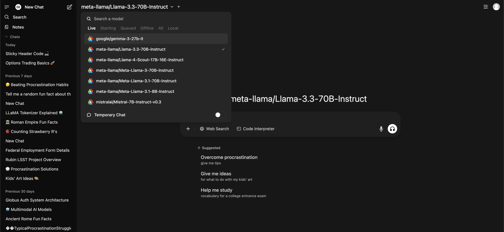

# ALCF Inference Endpoints

Unlock Powerful AI Inference at Argonne Leadership Computing Facility (ALCF). This service provides API access to a variety of state-of-the-art open-source models running on dedicated ALCF hardware. Join our [mailing list](https://mailman.cels.anl.gov/mailman3/lists/inference-service-notify.lists.alcf.anl.gov/) to receive updates and maintenance notifications.

## Quick Start

This guide will walk you through the fastest ways to start using the ALCF Inference Endpoints.

### Supported Identity Providers

To access the ALCF Inference Endpoints via the Web UI or API, you can log in using credentials from any of these institutional identity providers:

/// html | div
    attrs: {class: no-sort}

| alcf.anl.gov | ameslab.gov | anl.gov | bnl.gov | fnal.gov | hpc-dtn-auth.lanl.gov | inl.gov |
|:-:|:-:|:-:|:-:|:-:|:-:|:-:|
| **jlab.org** | **lbl.gov** | **llnl.gov** | **nersc.gov** | **netl.doe.gov** | **nrel.gov** | **nlr.gov** |
| **ornl.gov** | **pppl.gov** | **pnnl.gov** | **sandia.gov** | **slac.stanford.edu** |   |   |

///

### Web UI

The easiest way to get started is through the web interface, accessible at [https://inference.alcf.anl.gov/](https://inference.alcf.anl.gov/)

The UI is based on the popular Open WebUI platform. After logging in with your ANL or ALCF credentials, you can:

1. Select a model from the dropdown menu at the top of the screen.
2. Start a conversation directly in the chat interface.

In the model selection dropdown, you can see the status of each model:



- **Live:** These models are "hot" and ready for immediate use.
- **Starting:** A node has been acquired and the model is being loaded into memory.
- **Queued:** The model is in a queue waiting for resources to become available.
- **Offline:** The model is available but not currently loaded. It will be queued for loading when a user sends a request.
- **All:** Lists all available models regardless of their status.

/// note | For Advanced UI Features
For a full guide on advanced features like RAG (Retrieval-Augmented Generation), function calling, and more, please refer to the official [Open WebUI documentation](https://docs.openwebui.com/).
///

### API Access

For programmatic access, you can use the API endpoints directly.

/// note | Interactive API Documentation
The service publishes a [Swagger UI](https://inference-api.alcf.anl.gov/resource_server/docs) generated from its OpenAPI schema. See [Interactive API Reference](api.md#interactive-api-reference).
///

/// tip | Using the alcf-ai CLI or SDK
The [`alcf-ai`](https://pypi.org/project/alcf-ai/) package provides a CLI and an OpenAI-compatible Python client for the Inference Service, and uses the shared [`alcf-tokens`](https://pypi.org/project/alcf-tokens/) CLI for authentication. See [alcf-ai CLI and SDK](alcf-ai.md) for details.
///

#### 1. Setup Your Environment

You can run the following setup from anywhere (your local machine, or an ALCF machine).

--8<-- "includes/alcf-ai-install.md"

See [Python Environments](../../dev-environment/python-environments.md) for the other supported package managers.

/// tab | alcf-tokens

Install `alcf-ai` and `alcf-tokens` as above. For the Python examples on this page, install the OpenAI SDK in the environment where you run Python:

```bash
pip install openai
```

With `uv`, `uv run --with openai --with alcf-tokens python` starts Python with both packages in a throwaway environment instead.
///

/// tab | Auth script (Deprecated)

```bash
# Create and activate a virtual environment
python -m venv .venv
source .venv/bin/activate

# Install necessary packages
pip install openai globus-sdk

# Download the deprecated authentication helper script
wget https://raw.githubusercontent.com/argonne-lcf/inference-endpoints/refs/heads/main/inference_auth_token.py
# If `wget` is unavailable on your system, try `curl -O` instead.
```
///

#### 2. Authenticate

To access the endpoints, you need an authentication token.

/// tab | alcf-tokens

Use this command to login to the inference service:

```bash
alcf-tokens login inference
```

This requests the inference scopes only, so you are not asked to authorize IRI, Globus Compute, or Globus Flows. See [alcf-ai CLI and SDK](alcf-ai.md) for token verification, and for the `--authorize-transfer` collections that batch processing and data staging require.
///

/// tab | Auth script (Deprecated)

```bash
# Authenticate with your Globus account
python inference_auth_token.py authenticate

# Retrieve a token, or check how long it is valid for
# (`units` can be seconds, minutes, or hours)
python inference_auth_token.py get_time_until_token_expiration --units seconds
python inference_auth_token.py get_access_token
```
///

/// warning | Separate token caches
`alcf-tokens`/`alcf-ai` and the `inference_auth_token.py` helper use **different** Globus token caches, so authenticating with one does not authenticate the other.
///

/// warning | Token Validity
- Access tokens are valid for 48 hours. Both `alcf-tokens get-token inference` and `python inference_auth_token.py get_access_token` will automatically refresh your token if it has expired.
- An internal policy requires re-authentication every 30 days. If you encounter permission errors, logout from Globus at [app.globus.org/logout](https://app.globus.org/logout) and re-run `alcf-tokens login inference` (or `alcf-tokens login` to authorize all services).
///

#### 3. Make a Test Call

Once authenticated, you can make a test call using cURL or Python.

/// tab | cURL

```bash
#!/bin/bash

# Get your access token
access_token=$(alcf-tokens get-token inference)

curl -X POST "https://inference-api.alcf.anl.gov/resource_server/metis/api/v1/chat/completions" \
     -H "Authorization: Bearer ${access_token}" \
     -H "Content-Type: application/json" \
     -d '{
            "model": "gpt-oss-120b",
            "messages":[{"role": "user", "content": "Explain quantum computing in simple terms."}]
         }'
```
///

/// tab | Python (OpenAI SDK)

```python
from openai import OpenAI
from alcf_tokens.auth import get_access_token

# Get your access token
access_token = get_access_token("inference")

client = OpenAI(
    api_key=access_token,
    base_url="https://inference-api.alcf.anl.gov/resource_server/metis/api/v1"
)

response = client.chat.completions.create(
    model="gpt-oss-120b",
    messages=[{"role": "user", "content": "Explain quantum computing in simple terms."}]
)

print(response.choices[0].message.content)
```
///

## System Details

### Available Clusters

Three clusters are currently active, with additional systems coming soon:

| Cluster | Status | Framework | Base URL | Supported Endpoints |
| ------- | ------ | --------- | -------- | ------------------- |
| **[NVIDIA A100 (Sophia)](https://docs.alcf.anl.gov/sophia/getting-started/)** | Active | vLLM | `/resource_server/sophia/vllm/v1` | `/chat/completions`<br>`/responses`<br>`/messages`<br>`/completions`<br>`/embeddings`<br>`/batches` |
| **[SambaNova SN40L (Metis)](https://docs.alcf.anl.gov/ai-testbed/sn40l_inference/)** | Active | SambaNova API | `/resource_server/metis/api/v1` | `/chat/completions`<br>`/responses` |
| **[NVIDIA B200 (Minerva)](https://www.alcf.anl.gov/minerva)** | Active | API | `/resource_server/minerva/api/v1` | `/chat/completions`<br>`/responses`<br>`/messages`<br>`/completions` |

## Important Notes

- If you’re interested in extended model runtimes, reservations, or private model deployments, please contact [ALCF Support](mailto:support@alcf.anl.gov?subject=Inference%20Endpoint).

## Troubleshooting

- **Connection Timeout:** The model you are requesting may be queued as the cluster has too many pending jobs. You can check model status by querying the `/jobs` endpoint. See [Querying Endpoint Status](api.md#querying-endpoint-status) for an example.
- **Permission Denied:** Your token may have expired. Logout from Globus at [app.globus.org/logout](https://app.globus.org/logout) and re-authenticate. With `alcf-tokens`/`alcf-ai`, re-run `alcf-tokens login inference` (or `alcf-tokens login` to authorize all services). With the `inference_auth_token.py` helper, re-run `python inference_auth_token.py authenticate --force`.
- **Batch Permission Error:** Ensure your input/output paths are in a readable location like `/eagle/argonne_tpc`. It is currently internal only to ALCF and will be made public in the future.
- **IdentityMismatchError: Detected a change in identity:** This happens when trying to get an access token using a Globus identity that is not linked to the one you previously used to generate your access tokens. Delete the cached tokens file and restart the authentication process. The file depends on which client you use: the `inference_auth_token.py` helper stores tokens at `~/.globus/app/58fdd3bc-e1c3-4ce5-80ea-8d6b87cfb944/inference_app/tokens.json`, while `alcf-tokens` and `alcf-ai` store them at `~/.globus/app/7f3e61f5-e0de-4e8f-9150-0a62c65dda63/alcf_tokens/tokens.json` (or run `alcf-tokens clear-tokens`).

## Notifications

To receive notifications regarding new model support, maintenances, and policy updates, please join our [mailing list](https://mailman.cels.anl.gov/mailman3/lists/inference-service-notify.lists.alcf.anl.gov/).

## Acknowledgements

This work was supported by the U.S. Department of Energy, Office of Science, Office of Advanced Scientific Computing Research, under Contract No. DE-AC02-06CH11357. This research used resources of the Argonne Leadership Computing Facility, which is a DOE Office of Science User Facility.

### Citations

If you use the Inference Service for your publications, please add the Non-INCITE, Non-ALCC ALCF Acknowledgement from the [ALCF Policies](https://docs.alcf.anl.gov/policies/alcf-acknowledgement-policy).

Additionally, please cite our paper:

```tex
@inproceedings{10.1145/3731599.3767346,
  author = {Tanikanti, Aditya and C\^{o}t\'{e}, Benoit and Guo, Yanfei and Chen, Le and Saint, Nickolaus and Chard, Ryan and Raffenetti, Ken and Thakur, Rajeev and Uram, Thomas and Foster, Ian and Papka, Michael E. and Vishwanath, Venkatram},
  title = {FIRST: Federated Inference Resource Scheduling Toolkit for Scientific AI Model Access},
  year = {2025},
  isbn = {9798400718717},
  publisher = {Association for Computing Machinery},
  address = {New York, NY, USA},
  url = {https://doi.org/10.1145/3731599.3767346},
  doi = {10.1145/3731599.3767346},
  abstract = {We present the Federated Inference Resource Scheduling Toolkit (FIRST), a framework enabling Inference-as-a-Service across distributed High-Performance Computing (HPC) clusters. FIRST provides cloud-like access to diverse AI models, like Large Language Models (LLMs), on existing HPC infrastructure. Leveraging Globus Auth and Globus Compute, the system allows researchers to run parallel inference workloads via an OpenAI-compliant API on private, secure environments. This cluster-agnostic API allows requests to be distributed across federated clusters, targeting numerous hosted models. FIRST supports multiple inference backends (e.g., vLLM), auto-scales resources, maintains "hot" nodes for low-latency execution, and offers both high-throughput batch and interactive modes. The framework addresses the growing demand for private, secure, and scalable AI inference in scientific workflows, allowing researchers to generate billions of tokens daily on-premises without relying on commercial cloud infrastructure.},
  booktitle = {Proceedings of the SC '25 Workshops of the International Conference for High Performance Computing, Networking, Storage and Analysis},
  pages = {52–60},
  numpages = {9},
  keywords = {Inference as a Service, High Performance Computing, Job Schedulers, Large Language Models, Globus, Scientific Computing},
  series = {SC Workshops '25}
}
```

## Contact Us

For questions or support, please contact [ALCF Support](mailto:support@alcf.anl.gov?subject=Inference%20Endpoint).
