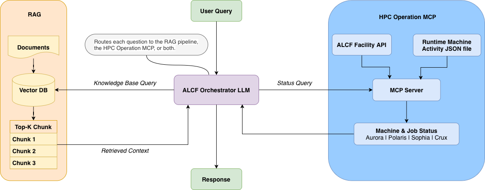
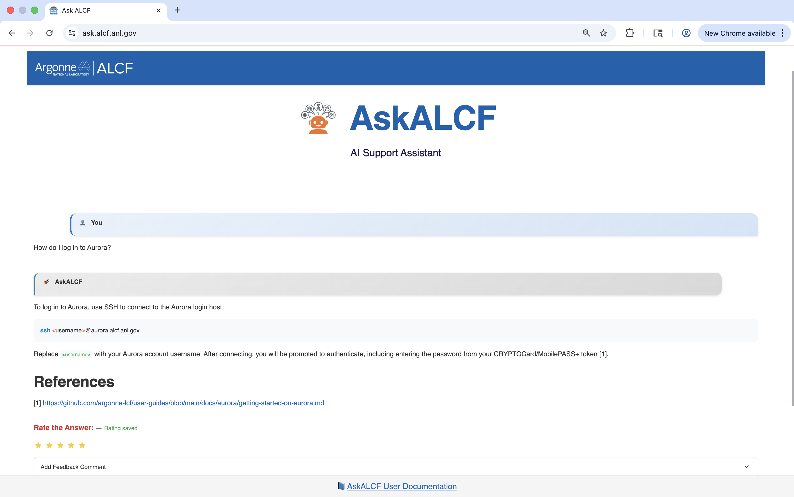
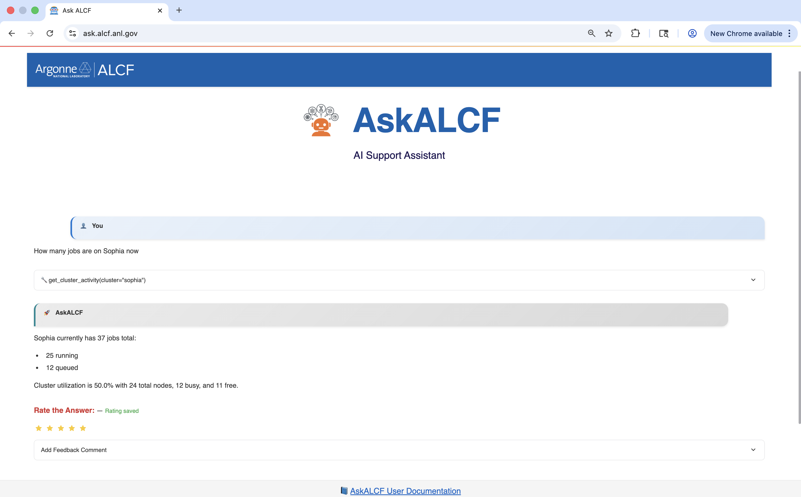
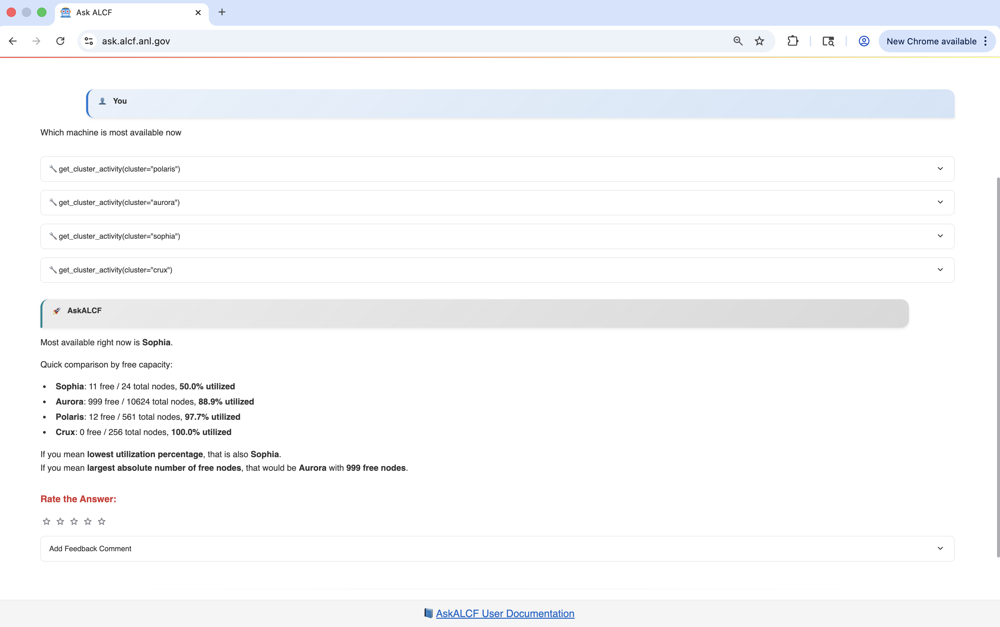

# AskALCF: An AI Support Assistant

!!! warning "Disclaimer"

	AskALCF is an AI-assisted tool designed to help ALCF users quickly access information. Responses are generated using automated methods and may not always be accurate, complete, or current. Users should confirm critical information through official ALCF documentation or by contacting ALCF support.

!!! tip "Feedback"

	We value your input to improve AskALCF. If you encounter incorrect or unclear information, please share your feedback to help us enhance the service.

AskALCF is an intelligent AI support assistant designed to enhance user support at the Argonne Leadership Computing Facility (ALCF). It combines two core capabilities:

- **Retrieval-Augmented Generation (RAG)**: Provides accurate, context-aware responses by retrieving relevant information from a curated HPC-specific knowledge base before generating answers.
- **HPC Operation MCP (Model Context Protocol)**: Enables real-time queries of machine and job status for ALCF systems — **Aurora**, **Polaris**, **Sophia**, and **Crux** — by interfacing with runtime machine activity data and the ALCF Facility API.

{ width="900" }
/// caption
AskALCF architecture: Orchestrator LLM routes each user query to the RAG pipeline, the HPC Operation MCP, or both.
///

## Knowledge Base

Below are the documents curated in the vector database used by AskALCF.

| Data                              | Type / format |
|-----------------------------------|---------------|
| ALCF User Guide               | Markdown      |
| OLCF User Guide             | RST           |
| NERSC Documentation          | Web           |
| LLNL User Guide            | Web           |
| PBS Documentation         | PDF           |
| Slurm Documentation        | Web           |
| CUDA C Programming Guide    | Web           |
| SYCL Documentation         | PDF           |
| AMD HIP Documentation        | Web           |
| Intel OneAPI Documentation  | Web           |

---

## Accessing AskALCF

The chatbot is currently hosted on a CELS Virtual Machine accessible through [https://ask.alcf.anl.gov](https://ask.alcf.anl.gov)

## Example Questions

### Knowledge Base Queries

Ask specific questions about ALCF systems, programming models, and HPC documentation. The more specific your question, the better the response. Examples include:

- How do I log in to Aurora?
- How do I request 8 Aurora nodes all within the same rack using PBS, using the following job parameters? Script:`pbs_submit_script.sh`, Project: `RackTest`, Queue: `prod`, Duration: `1 hr`, Filesystem: `grand`.
- Will my ALCF HPSS home directory remain accessible for my group members after my account termination?
- What is the best environment variable setting for oneCCL?
- How should I use copper to run a Python job at scale on Aurora?
- What is the optimal CPU binding on Aurora?

{ width="900" }
/// caption
Example: Answering a knowledge base query with references
///

### Machine & Job Status Queries

AskALCF can retrieve real-time machine and job status for ALCF systems (Aurora, Polaris, Sophia, Crux) via the HPC Operation MCP. Examples include:

- How many jobs are running on Sophia?
- Which machine is most available right now?
- What is the current status of Aurora?

{ width="900" }
/// caption
Example: Querying job status on Sophia via HPC Operation MCP
///

{ width="900" }
/// caption
Example: Comparing machine availability across ALCF systems
///

## Providing Feedback

- If you have feedback on a specific response, you can rate and comment directly:
    - Click on the stars under **"Rate the Answer"** to submit a rating
    - Click **"Add Feedback Comment"** to provide additional comments
- For high-level comments or feedback, please contact: [support@alcf.anl.gov](mailto:support@alcf.anl.gov)
- All feedback is anonymous by default. If you would like to receive follow-up communication, please provide your contact info.
