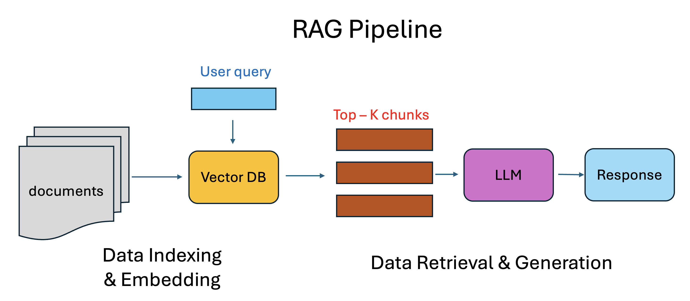

# AskALCF: A RAG-empowered chatbot for User Support

!!! warning "Disclaimer"

	AskALCF is an AI-assisted tool designed to help ALCF users quickly access information. Responses are generated using automated methods and may not always be accurate, complete, or current. Users should confirm critical information through official ALCF documentation or by contacting ALCF support.

!!! tip "Feedback"

	We value your input to improve AskALCF. If you encounter incorrect or unclear information, please share your feedback to help us enhance the service.

AskALCF is an intelligent, Retrieval-Augmented Generation (RAG) powered chatbot system designed to enhance user support at the Argonne Leadership Computing Facility (ALCF). It provides fast, accurate, and context-aware responses to user queries by leveraging a curated HPC-specific knowledge base and state-of-the-art language models.

{ width="500 }
/// caption
Retrieval Augmented Generation (RAG) pipeline: LLM retrieves relevant external documents before generating an answer, grounding its output in factual, up-to-date information.
///

## Knowledge Base

Below are the documents curated in the vector database used by AskALCF chatbot.

| Data                              | Type / format |
|-----------------------------------|---------------|
| ALCF User Guide               | Markdown      |
| OLCF User Guide             | RST           |
| LLNL User Guide            | Web           |
| PBS Documentation         | PDF           |
| Slurm Documentation        | Web           |
| CUDA C Programming Guide    | Web           |
| SYCL Documentation         | PDF           |
| AMD HIP Documentation        | Web           |
| Intel OneAPI Documentation  | Web           |

---

## Accessing AskALCF

The chatbot is currently hosted on a CELS Virtual Machine accessible through [https://ask.alcf.anl.gov](https://ask.alcf.anl.gov)
  
{ width="500 }
/// caption
Example user interaction with AskALCF
///

## Example Questions

Please make your question as specific as possible. This helps the chatbot retrieve the most relevant information and provide a high-quality answer. Examples of high-quality questions include:

- On Aurora, what is the command to log in, and what is the default quota for user home directories?
- How do I request 8 Aurora nodes all within the same rack using PBS, using the following job parameters? Script:`pbs_submit_script.sh`, Project: `RackTest`, Queue: `prod`, Duration: `1 hr`, Filesystem: `grand`.
- Will my ALCF HPSS home directory remain accessible for my group members after my account termination?
- What is the best environment variable setting for oneCCL?
- How should I use copper to run a Python job at scale on Aurora?
- What is the optimal CPU binding on Aurora?

## Providing Feedback

- If you have feedback on a specific query, you can directly rate and comment on the chatbot’s response. We only track queries, responses, and ratings. No personal information is collected through this mechanism:
    - Click “Rate this assistant response”
    - Select a rating
    - Optionally provide additional comments
    - Click “Submit rating”
- For high-level comments or feedback, please contact: [support@alcf.anl.gov](mailto:support@alcf.anl.gov)
- All feedback is anonymous, by default. If you would like to receive follow-up communication, please provide your contact info. 
