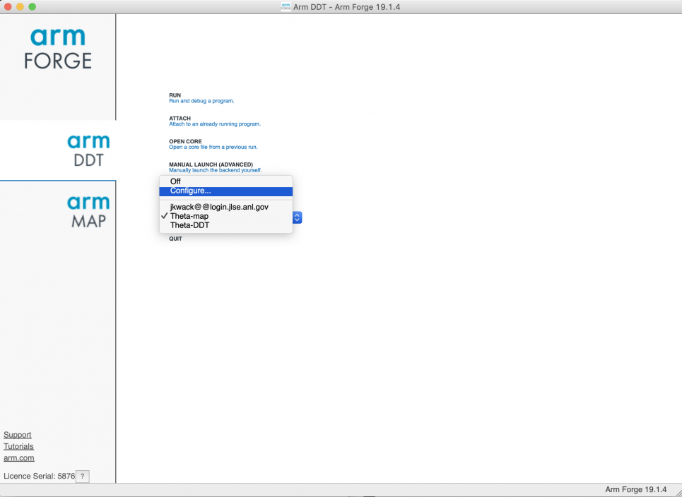
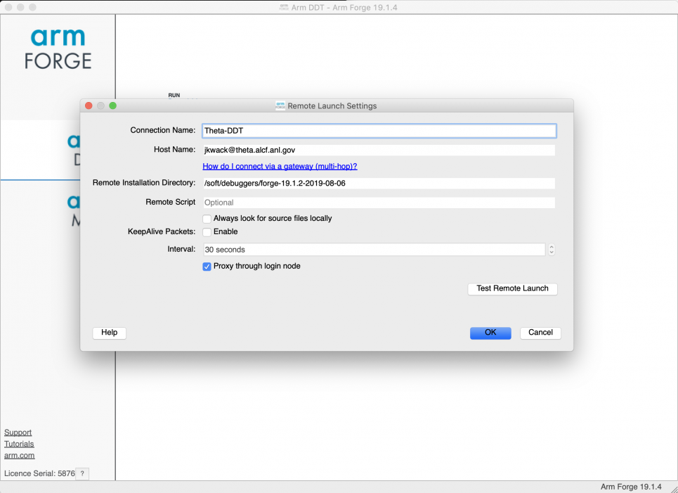
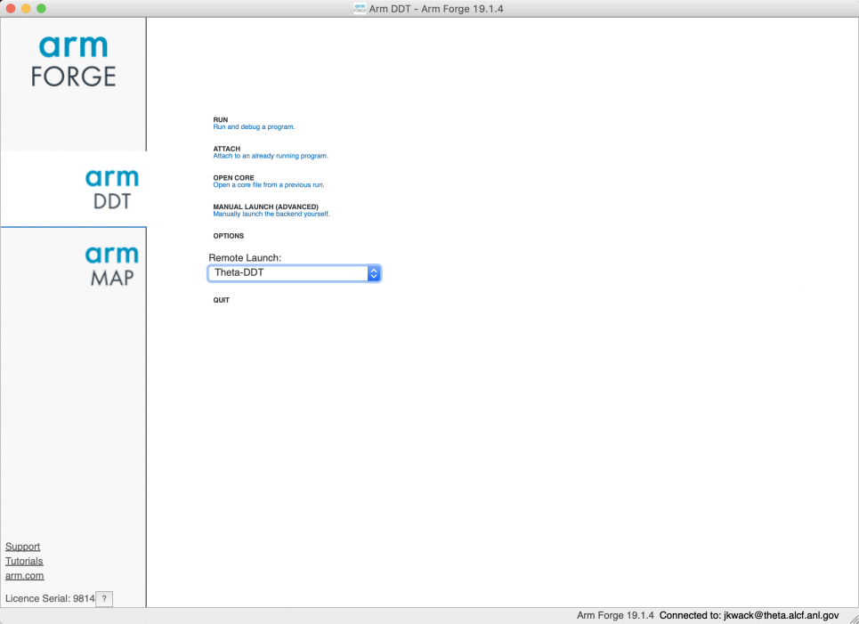
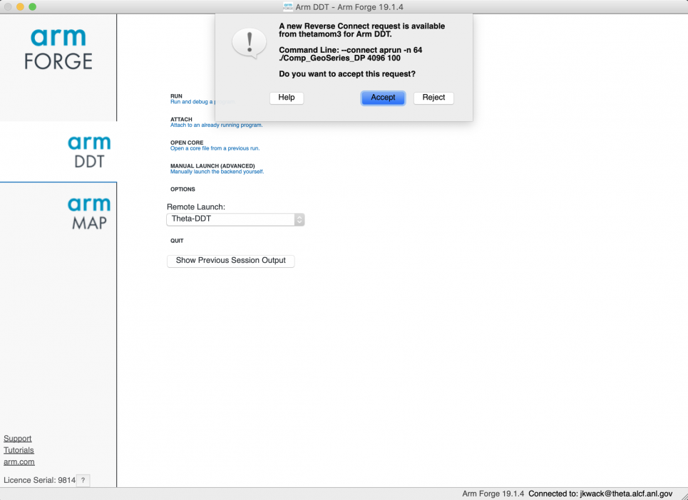
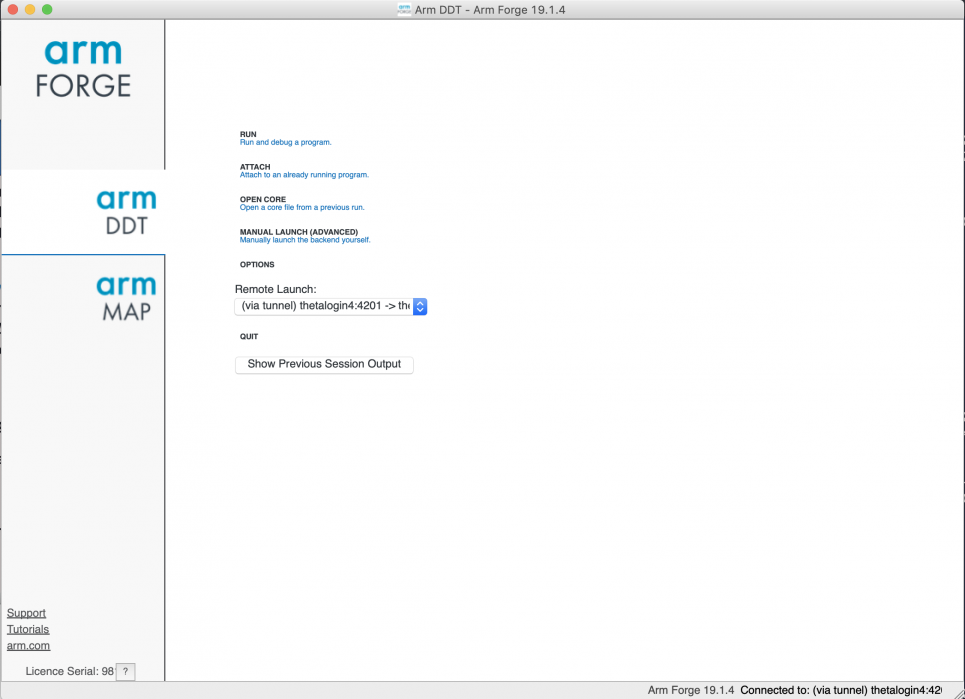
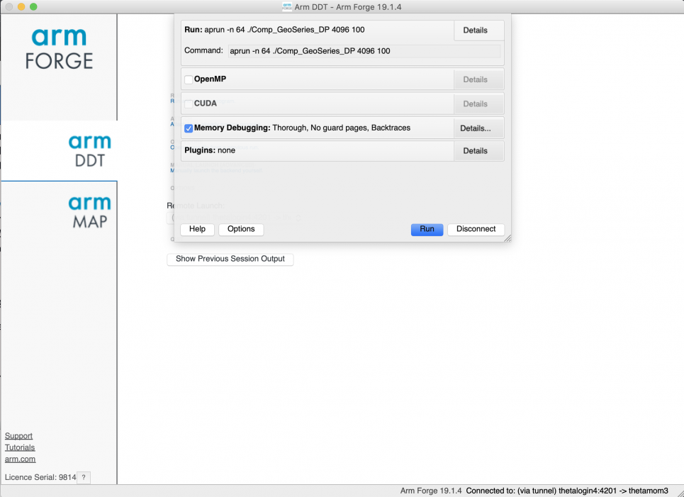
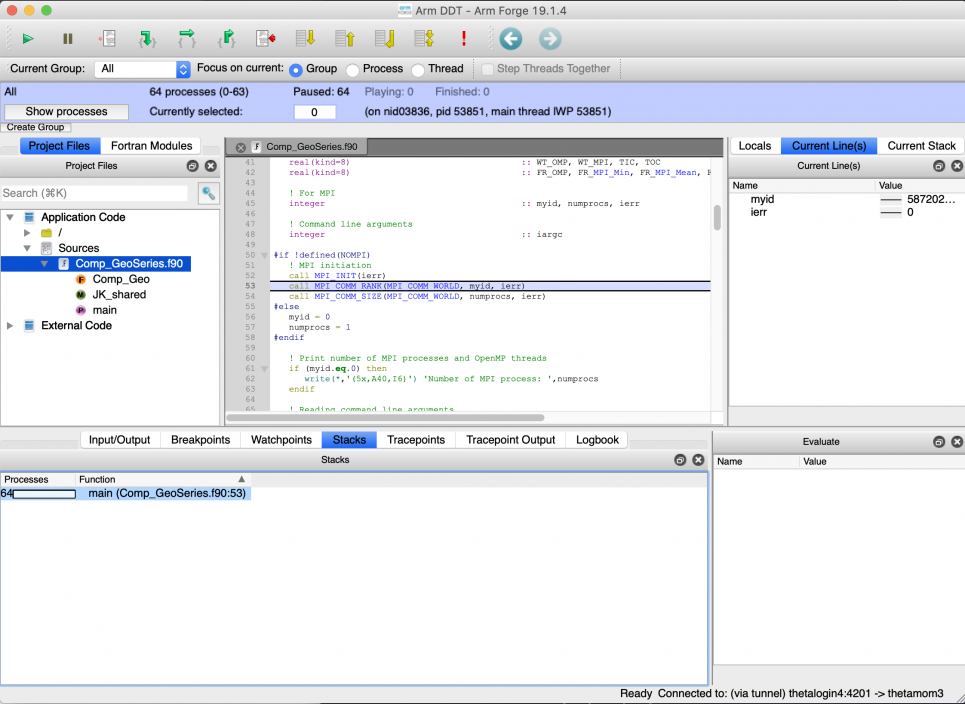

# Arm DDT on Theta
## Availability
You can use the latest Arm (Allinea) DDT debugger on the XC40 system (Theta).

There is no limit to the number of users; however, users have to share the available license tokens.

## Modules and Soft keys
On Theta, for the latest version load the module forge/19.1.2. 
**Note:** When using the Arm Forge Remote Client, specify remote installation directory, ```"/soft/debuggers/forge-19.1.2-2019-08-06”```. The Remote Client version must match.

On the systems managed with softenv (Cooley), use the soft key "+forge" for the latest version available. When using the Allinea Remote Client, specfiy remote installation directory ```"/soft/debuggers/forge"```.

## Debugging with DDT
DDT may be started in two ways.

1. Via Remote Client from your laptop or workstation (**Recommended**)
2. Running the DDT client on a login node and displaying back to you via X11.

### Option A: Via Remote Client (**Recommended**)
This method is best for remote use of DDT because the GUI client runs directly on your laptop or workstation. This has much lower remote bandwith requirements than the other method.

1. Download the remote client at https://developer.arm.com/tools-and-software/server-and-hpc/downloads/arm-forge. 
   - Note: There is a link near the bottom of the page for versions prior to the latest release. You have to use a similar version to the loaded forge module on Theta. For example, you may download Arm Forge Client 19.1.4 for the Theta module forge/19.1.2. 
2. Run the client on your local machine and select Remote Launch->Configure to set up a configuration to connect to the login node.
3. Run your application on Theta with one of the following command lines:
  - ddt --offline aprun -n 48 ./example
  - ddt --connect aprun -n 48 ./example

<figure markdown>
  { width="700" }
  <figcaption>Configure</figcaption>
</figure>

<figure markdown>
  { width="700" }
  <figcaption>Remote launch settings.</figcaption>
</figure>

<figure markdown>
  { width="700" }
  <figcaption>hoose remote launch</figcaption>
</figure>

On an interactive job mode, run your application with ddt --connect.
```
jkwack@thetalogin4:~/HPC_benchmarks/JKBench_GeoSeries> qsub -I -n 1 -t 60 -q debug-cache-quad -A Performance

Connecting to thetamom3 for interactive qsub...

Job routed to queue "debug-cache-quad".

Memory mode set to cache quad for queue debug-cache-quad

Wait for job 414368 to start...

Opening interactive session to 3836

jkwack@thetamom3:/gpfs/mira-home/jkwack> module load forge

jkwack@thetamom3:/gpfs/mira-home/jkwack>cd HPC_benchmarks/JKBench_GeoSeries

jkwack@thetamom3:/gpfs/mira-home/jkwack/HPC_benchmarks/JKBench_GeoSeries> ddt --connect aprun -n 64 ./Comp_GeoSeries_DP 4096 100
```

<figure markdown>
  { width="700" }
  <figcaption>Accept request</figcaption>
</figure>

<figure markdown>
  { width="700" }
  <figcaption>Master thread (thread id 0) associated with an MPI rank on a hardware thread is shown in blue, other active threads are shown in purple, and active hardware threads are numbered.</figcaption>
</figure>

<figure markdown>
  { width="700" }
  <figcaption>Run with Memory Debugging</figcaption>
</figure>

<figure markdown>
  { width="700" }
  <figcaption>Details</figcaption>
</figure>

## References
- [Arm Forge Website](https://www.arm.com/products/development-tools/server-and-hpc/forge)
- [Arm DDT User Guide](https://developer.arm.com/docs/101136/2002/ddt)
- [Debugging and Profiling with DDT and Map (SDL Workshop 2019)](https://www.alcf.anl.gov/sites/default/files/2020-03/Hulguin_SDL_10_2019_Arm_DDT_Map.pdf)

<iframe width="560" height="315" src="https://www.youtube.com/embed/fg-6yFZI25o" title="YouTube video player" frameborder="0" allow="accelerometer; autoplay; clipboard-write; encrypted-media; gyroscope; picture-in-picture" allowfullscreen></iframe>
