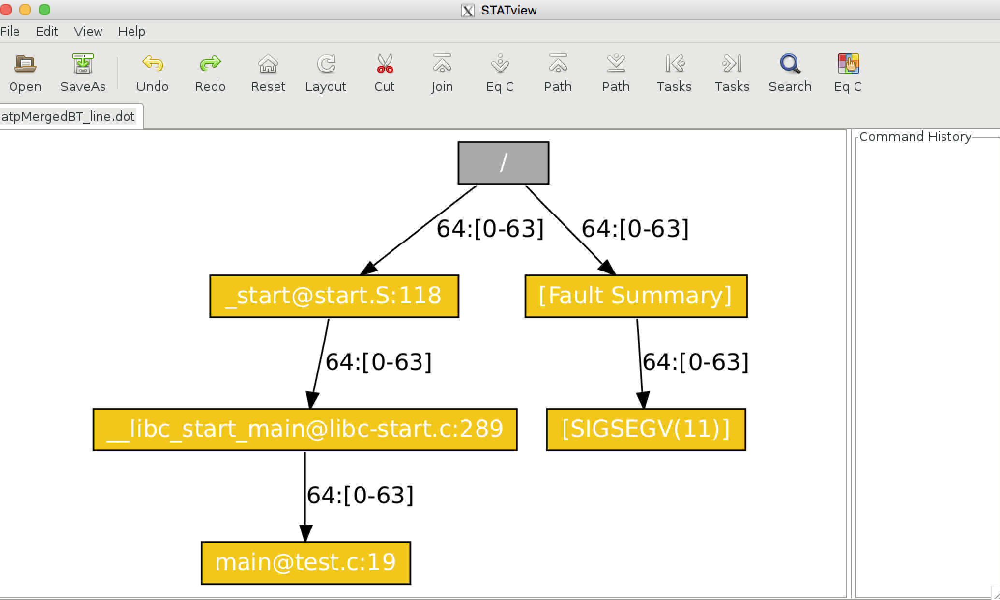

---
search:
  exclude: true
---

# ATP and STAT on Theta
## Introduction

ATP and STAT are tools to debug abnormal program terminations such as segfaults. ATP (Abnormal Termination Processing) monitors a program while it runs.  If the program crashes, ATP will invoke STAT (the Stack Trace Analysis Tool) to merge the stack backtraces of the application processes to an output file "atpMergedBT.dot". This merged stack backtrace file may then be visualized using STAT's visualization tool, stat-view.

## Using ATP with stat-view
Scenario: When you try to run you get a segfault.   After running, the job's ```stderr file (which defaults to $COBALT_JOBID.error)`` contains:
```
user@thetalogin6:~> cat $COBALT_JOBID.error
_pmiu_daemon(SIGCHLD): [NID 03834] [c7-1c2s14n2] [Sat Aug 18 03:21:19 2018] \
                                   PE RANK 30 exit signal Segmentation fault
[NID 03834] 2018-08-18 03:21:19 Apid 4938801: initiated application termination
```
ATP and stat-view can be used to look into the segfault.

## Compile/Link Setup
To use ATP, the ATP module should be loaded before linking your application . By default it is loaded on Theta, but to verify this, run module list, and check that the atp module is loaded.
  
```
user@thetalogin6:~> module list
Currently Loaded Modulefiles:
  1) modules/3.2.10.6
  2) intel/18.0.0.128 
  3) craype-network-aries
  ...     
  16) atp/2.1.2
  17) perftools-base/7.0.2
  ...
 
user@thetalogin6:~> make
```
## Running the code
Next, the environment variable ATP_ENABLED must be set in the job script to enable ATP.
  
```
export ATP_ENABLED=1 # in bash
```
For Intel Fortran programs, also set the environment variable ```FOR_IGNORE_EXCEPTIONS``` in the job script:
```
export FOR_IGNORE_EXCEPTIONS=true # in bash
```
Then start your program with aprun as normal.
```
#!/bin/bash
#COBALT -t 10 -n 1 -q debug-cache-quad

export ATP_ENABLED=1
export FOR_IGNORE_EXCEPTIONS=true
aprun -n 64 -N 64 test.exe
```
If the program crashes, a atpMergedBT.dot should be produced, and the first process to die will write a stack backtrace to the job's stderr file (by default $COBALT_JOBID.error).  For the scenario, this would look like:
  
```
user@thetalogin6:~> ls -ltr
-rw-r--r-- 1 user users      813 Aug 18 03:47 atpMergedBT_line.dot
-rw-r--r-- 1 user users      768 Aug 18 03:48 atpMergedBT.dot
-rw-r--r-- 1 user users     1742 Aug 18 03:48 262891.error
-rw-r--r-- 1 user users      143 Aug 18 03:49 262891.output
-rw-r--r-- 1 user cobalt    1965 Aug 18 03:49 262891.cobaltlog
user@thetalogin6:~> cat 262891.error
Application 4938811 is crashing. ATP analysis proceeding...

ATP Stack walkback for Rank 31 starting:
  _start@start.S:118
  __libc_start_main@libc-start.c:289
  main@test.c:19
ATP Stack walkback for Rank 31 done
Process died with signal 11: 'Segmentation fault'
View application merged backtrace tree with: stat-view atpMergedBT.dot
You may need to: module load stat

_pmiu_daemon(SIGCHLD): [NID 03834] [c7-1c2s14n2] [Sat Aug 18 03:48:09 2018] \
                                               PE RANK 1 exit signal Killed
[NID 03834] 2018-08-18 03:48:09 Apid 4938811: initiated application termination
```
## Looking at the output
The program stat-view (the Stack Trace Analysis Tool viewer) can be used to view the backtrace file atpMergedBT.dot, which shows what the program was doing at the time of abnormal termination.

```user@thetalogin6:~> module load stat```

```user@thetalogin6:~> stat-view atpMergedBT_line.dot```

The difference between ***atpMergedBT_line.dot and atpMergedBT.dot*** is that ***atpMergedBT_line.dot*** should contain line numbers.

The output will look like the following:
<figure markdown>
  { width="700" }
  <figcaption>Difference between atpMergedBT_line.dot and atpMergedBT.dot is that atpMergedBT_line.dot</figcaption>
</figure>

This shows that there is a segfault at line 19 of test.c, the test file. Each box is typically a function in a stack backtrace or a comment, denoted by brackets ( "[ ]" ) and discussed later.

Moving from top to bottom, following the arrows, follows a backtrace. The arrow connecting the boxes is labeled with how many ranks are active for the function, and which ranks. Here we see that for every function, 64 ranks were active, and they are ranks 0-63 (this makes sense since this was done with a single node, 64 rank job). If only a subset of ranks had had a segault, then the graph would label how many segfaulted and which ones.

Some of the boxes are not functions, but are comments, which is denoted by the use of bracket ("[ ]") in the name.  Here, the "[Fault Summary]" box is a summary tree saying that all 64 ranks, 0-63 faulted due to a SIGSEV.

**Note:** To use stat-view, an X display will need to be forwarded from your local machine.  When you connect to the Theta login node, use the -Y or -X option to ssh:
```
user@thetalogin6:~> ssh -Y user@theta.alcf.anl.gov
```

## References
- Man pages: user@thetalogin6:~> man intro_atp
- [Debugging on ALCF Systems](https://www.alcf.anl.gov/sites/default/files/2019-08/Loy-comp_perf_workshop-debugging-2019-v1.2.pdf)
