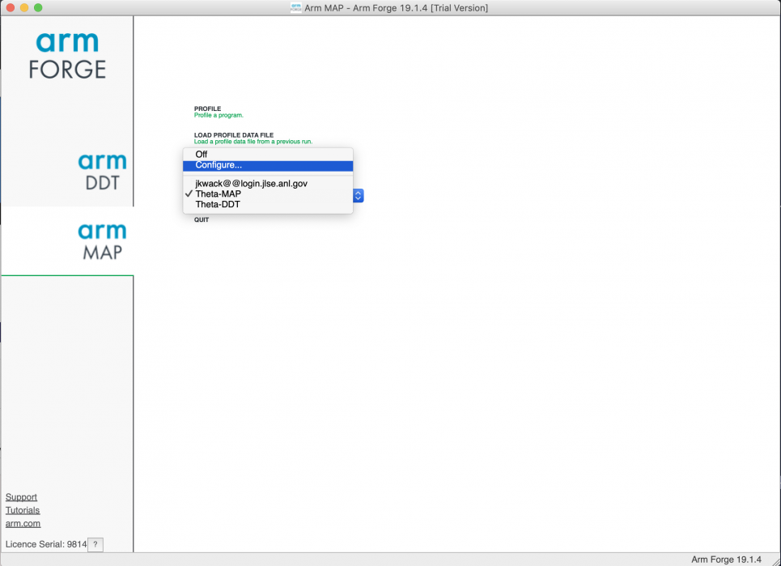
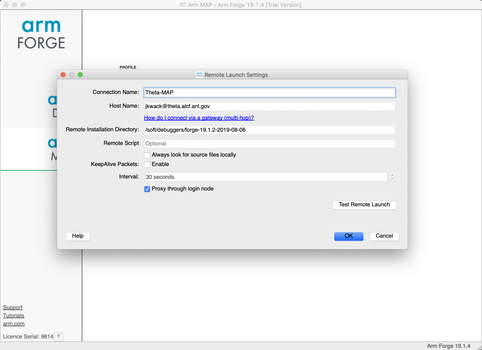
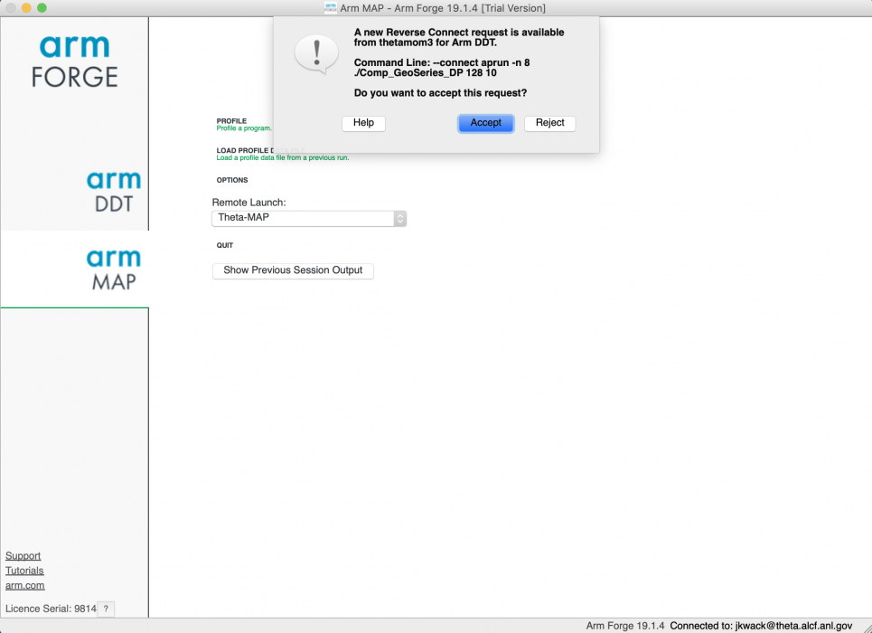

# Arm MAP
## Introduction
Build reliable and optimized code for the right results on multiple Server and HPC architectures, from the latest compilers and C++ standards to Intel, 64-bit Arm, AMD, OpenPOWER and Nvidia GPU hardware. Arm Forge combines Arm DDT, the leading debugger for time-saving high performance application debugging, Arm MAP, the trusted performance profiler for invaluable optimization advice across native and Python HPC codes, and Arm Performance Reports for advanced reporting capabilities. Arm DDT and Arm MAP are also available as standalone products.

## References
- [Arm Forge Website](https://www.arm.com/products/development-tools/server-and-hpc/forge)
- [Arm MAP User Guide](https://developer.arm.com/docs/101136/2002/map)

## Availability
You can use the latest Arm (Allinea) MAP performance profiler on the XC40 system (Theta).

There is no limit to the number of users; however, users have to share the available license tokens.

## Modules and Soft keys
On Theta, for the latest version load the module forge/19.1.2. 

**Note:** When using the Arm Forge Remote Client, specify remote installation directory, "/soft/debuggers/forge-19.1.2-2019-08-06”.  The Remote Client version must match.

On the systems managed with softenv (Cooley), use the soft key "+forge" for the latest version available.  When using the Allinea Remote Client, specfiy remote installation directory "/soft/debuggers/forge".

## Profiling with MAT
MAP may be started in two ways.

- Via Remote Client from your laptop or workstation (Recommended)
- Running the MAP client on a login node and displaying back to you via X11.

### Option A: Via Remote Client (Recommended)
This method is best for remote use of MAP because the GUI client runs directly on your laptop or workstation.  This has much lower remote bandwith requirements than the other method.
1. Download the remote client at https://developer.arm.com/tools-and-software/server-and-hpc/downloads/arm-forge. (Note: There is a link near the bottom of the page for versions prior to the latest release. You have to use a similar version to the loaded forge module on Theta. For example, you may download Arm Forge Client 19.1.4 for the Theta module forge/19.1.2)
2. Run the client on your local machine and select Remote Launch->Configure to set up a configuration to connect to the login node.
3. Run your application on Theta with one of the following command lines:
    - map --offline aprun -n 48 ./example
    - map --connect aprun -n 48 ./example

## Resources
- [Debugging and Profiling with DDT and Map (SDL Workshop 2019)](https://www.alcf.anl.gov/sites/default/files/2020-03/Hulguin_SDL_10_2019_Arm_DDT_Map.pdf)

<figure markdown>
  { width="700" }
</figure>

<figure markdown>
  { width="700" }
  <figcaption>hoose remote launch</figcaption>
</figure>

<figure markdown>
  { width="700" }
</figure>

<iframe width="560" height="315" src="https://www.youtube.com/embed/rcOmqnhP_X4" title="YouTube video player" frameborder="0" allow="accelerometer; autoplay; clipboard-write; encrypted-media; gyroscope; picture-in-picture" allowfullscreen></iframe>
