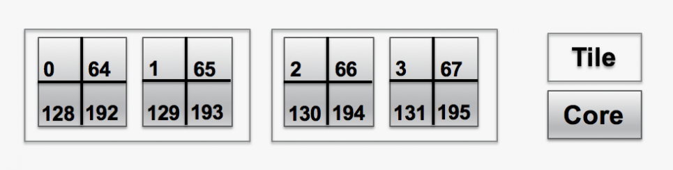
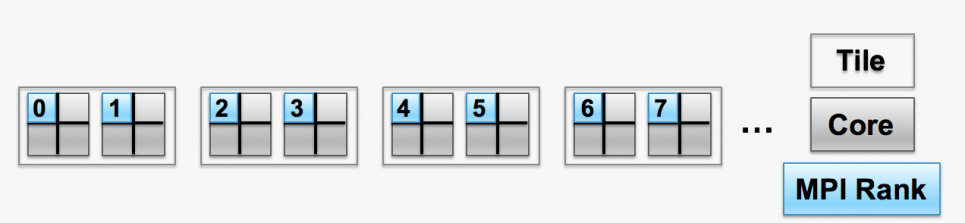
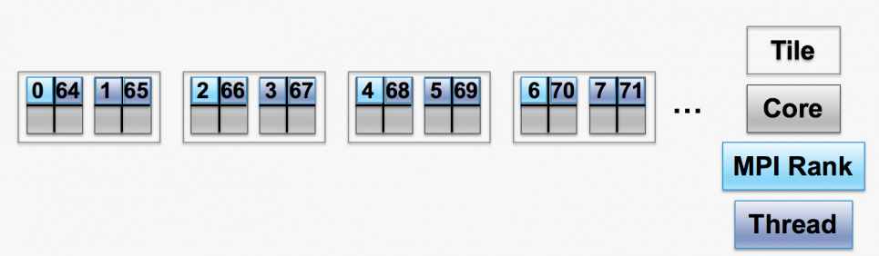

#Affinity on Theta
##Introduction

Each KNL node on Theta has 32 tiles, each with 2 physical cores. Each physical core has 4 hardware threads, for a total of 64 physical cores and 256 hardware threads per KNL node. When a parallel job is run, the job must have some way of mapping specific ranks or threads to each of the 256 hardware threads. Mapping is typically done by an “affinity mask”, which assigns hardware threads to each MPI rank or thread to use.

A visual representation of two tiles in a KNL is shown below. Each tile is represented by a large white rectange. The two large grey squares in each tile represent the physical cores. Inside of each core are four hardware threads, represented by splitting the grey box into four quadrants. 

The numbers inside the quadrants identify the specific hardware threads in the core. That is, hardware threads 0, 64, 128, and 192 are the 4 hardware threads on the first physical core. Hardware threads 1, 65, 129, and 193 are the 4 hardware threads that share the second physical core. Since there are 256 hardware threads (or logical cores), the numbers run from 0 to 255. For i from 0 to 63, hardware threads i, i+64, i+64*2, and i+64*3 share a physical core.

<figure markdown>
  { width="700" }
  <figcaption>Visual representation of two tiles in a KNL</figcaption>
</figure>

Using the -j, -d, and --cc arguments to aprun and environment variables, MPI ranks and threads can be assigned to run on specific hardware threads. For more information about the flags to aprun, {== see  [Running Jobs on Theta](https://about.gitlab.com/). Fix link ==} Four examples of using aprun are given below followed by descriptions of two methods for displaying the mapping produced.

**Note:** Logical core and hardware thread are used interchangeably below.

##Examples of Thread Affinity

###Example 1: 2 nodes, 64 ranks/node, 1 thread/rank, 1 rank/core
The following four examples show how the -j and -d aprun arguments can affect where the MPI ranks and OpenMP threads are mapped.

```
aprun -n 128 -N 64 -d 1 -j 1 --cc depth <app> <app_args>
```
- The "-n 128" argument says to use 128 MPI ranks in total and "-N 64" places 64 ranks per node.
- The "-d 1" argument says to use 1 hardware thread for each MPI rank.
- The "-j 1" argument says to use only one hardware thread per physical core.

####Resulting mapping
MPI ranks 0,1,2,..63 map to hardware threads 0,1,2,...63 on each of the two nodes. Assuming the job was allocated on node 0 and node 1:

- MPI rank 0 → node 0, hardware thread 0

- MPI rank 1 → node 0, hardware thread 1

- MPI rank 2 → node 0, hardware thread 2

...

- MPI rank 64 → node 1, hardware thread 0

- MPI rank 65 → node 1, hardware thread 1

- MPI rank 66 → node 1, hardware thread 2

...

This is shown below, where the presence of an MPI rank on a hardware thread is shown in blue, and the active hardware threads are numbered.

<figure markdown>
  { width="700" }
  <figcaption>MPI rank on a hardware thread is shown in blue, and the active hardware threads are numbered.</figcaption>
</figure>

###Example 2: 2 nodes, 32 ranks/node, 4 threads/rank, 2 threads/core
The example below shows the affinity flags in aprun to map MPI ranks and OpenMP threads for an MPI/OpenMP job.
```
aprun -n 64 -N 32 -d 4 -j 2 --cc depth -e OMP_NUM_THREADS=4 <app> <app_args>
```
- The "-n 64" argument says to use 64 MPI ranks in total and "-N 32" places 32 ranks per node.
- The "-d 4" argument says to use 4 hardware threads for each MPI rank.
- The "-j 2" argument says to use two hardware threads per physical core.
- The "-e OMP_NUM_THREADS=4" arguments tells the application to spawn 4 OpenMP threads per MPI rank.

####Resulting mapping
Assuming the job was allocated on node 0 and node 1:

- MPI rank 0, OpenMP thread 0 → node 0, hardware thread 0

- MPI rank 0, OpenMP thread 1 → node 0, hardware thread 1

- MPI rank 0, OpenMP thread 2 → node 0, hardware thread 64

- MPI rank 0, OpenMP thread 3 → node 0, hardware thread 65

- MPI rank 1, OpenMP thread 0 → node 0, hardware thread 2

- MPI rank 1, OpenMP thread 1 → node 0, hardware thread 3

...

- MPI rank 32, OpenMP thread 0 → node 1, hardware thread 0

- - MPI rank 32, OpenMP thread 1 → node 1, hardware thread 1

MPI rank 32, OpenMP thread 2 → node 1, hardware thread 64

...

The mapping is shown below, where the presence of the master thread (thread id 0) associated with an MPI rank on a hardware thread is shown in blue, other active threads are shown in purple, and active hardware threads are numbered.

<figure markdown>
  { width="700" }
  <figcaption>Master thread (thread id 0) associated with an MPI rank on a hardware thread is shown in blue, other active threads are shown in purple, and active hardware threads are numbered.</figcaption>
</figure>

###Example 3: 1 node, 1 rank/node, 64 threads/rank, 1 thread/core
The example below shows the affinity flags in aprun to map MPI ranks and OpenMP threads for an MPI/OpenMP job.

```
aprun -n 1 -N 1 -d 64 -j 1 -cc depth -e OMP_NUM_THREADS=64 <app> <app_args>
```

- The "-n 1" argument says to use 1 MPI rank in total and "-N 1" places 1 rank per node.
- The "-d 64" argument says to use 64 hardware threads for each MPI rank.
- The "-j 1" argument says to use one hardware thread per physical core.
- The "-e OMP_NUM_THREADS=64" arguments tells the application to spawn 64 OpenMP threads per MPI rank.

####Resulting mapping
64 OpenMP threads are allocated on one node. All 64 physical cores are used and each OpenMP thread is placed on its own physical core, since "-j 1" specifies using one hardware thread per core.

- OpenMP threads 0 to 63 map to hardware threads 0 through 63:

- MPI rank 0, OpenMP thread 0 → node 0, hardware thread 0

- MPI rank 0, OpenMP thread 1 → node 0, hardware thread 1

- MPI rank 0, OpenMP thread 2 → node 0, hardware thread 2

- MPI rank 0, OpenMP thread 3 → node 0, hardware thread 3

- MPI rank 0, OpenMP thread 4 → node 0, hardware thread 4

- MPI rank 0, OpenMP thread 5 → node 0, hardware thread 5

...

###Example 4: 1 node, 1 rank/node, 64 threads/rank, 4 threads/core
The example below shows the affinity flags in aprun to map MPI ranks and OpenMP threads for an MPI/OpenMP job.

```
aprun -n 1 -N 1 -d 64 -j 4 -cc depth -e OMP_NUM_THREADS=64 <app> <app_args>
```

- The "-n 1" argument says to use 1 MPI rank in total and "-N 1" places 1 rank per node.
- The "-d 64" argument says to use 64 hardware threads for each MPI rank.
- The "-j 4" argument says to use four hardware threads per physical core.
- The "-e OMP_NUM_THREADS=64" arguments tells the application to spawn 64 OpenMP threads per MPI rank.

####Resulting mapping
64 OpenMP threads are allocated on one node. Only 16 phyiscal cores are used and all OpenMP threads are packed into the first 16 physical cores, since "-j 4" specifies using all 4 hardware threads per core.

The mapping is shown below where the OpenMP threads given in ranges map to hardware threads given in ranges sequentially:

- MPI rank 0, OpenMP threads 0-15 → node 0, hardware threads 0-15

- MPI rank 0, OpenMP threads 16-31 → node 0, hardware threads 64-79

- MPI rank 0, OpenMP threads 32-47 → node 0, hardware threads 128-143

- MPI rank 0, OpenMP threads 48-63 → node 0, hardware threads 192-207

Since hardware threads 0, 64, 128, and 192 are on same physical core, this means that 4 OpenMP threads (OpenMP threads 0, 16, 32, and 48) share a physical core.

####Methods to display thread affinity:

In the examples below, two methods to display the mapping between MPI rank (or OpenMP thread) to hardware threads are shown. Note that "logical core" and "hardware thread" are used interchangably below.

#####1. sched_getaffinity in the hello_affinity program
One way to display the mapping of ranks to cores is with the "hello_affinity" program on Theta, see: [https://github.com/argonne-lcf/GettingStarted/blob/master/Examples/theta/affinity/submit.sh](https://github.com/argonne-lcf/GettingStarted/blob/master/Examples/theta/affinity/submit.sh). For each OpenMP thread on each rank, "hello_affinity" prints which hardware thread (or logical core) the OpenMP threads map to for the given aprun settings (or environment variables in some cases). One can compare the output for different aprun settings and see how the affinity changes.

As an example, 8 MPI ranks are launched on a single node, with each rank on its own physical core. The output shows that rank 0 maps to hardware thread 0, and rank 1 maps to hardware thread 1, and so on. This means that all 8 ranks are on separate physical cores.

```
user@thetalogin5:~/affinty> cat submit.sh
#!/bin/sh
#COBALT -n 1
#COBALT -t 10
#COBALT -A Performance
#COBALT -q debug-cache-quad
#COBALT --attrs mcdram=cache:numa=quad

# 1 node, 8 ranks/node, 1 thread/rank, 1 thread/core
 aprun -n 8 -N 8 --cc depth -d 1 -j 1 ./hello_affinity


user@thetalogin5:~/affinty> qsub ./submit.sh
Job routed to queue "debug-cache-quad".
Memory mode set to cache quad for queue debug-cache-quad
295130


user@thetalogin5:~/affinty> cat 295130.output
To affinity and beyond!! nname= nid03834  rnk= 3  tid= 0: list_cores= (3) 
To affinity and beyond!! nname= nid03834  rnk= 7  tid= 0: list_cores= (7) 
To affinity and beyond!! nname= nid03834  rnk= 5  tid= 0: list_cores= (5) 
To affinity and beyond!! nname= nid03834  rnk= 6  tid= 0: list_cores= (6) 
To affinity and beyond!! nname= nid03834  rnk= 2  tid= 0: list_cores= (2) 
To affinity and beyond!! nname= nid03834  rnk= 4  tid= 0: list_cores= (4) 
To affinity and beyond!! nname= nid03834  rnk= 0  tid= 0: list_cores= (0) 
To affinity and beyond!! nname= nid03834  rnk= 1  tid= 0: list_cores= (1) 
Application 9888541 resources: utime ~0s, stime ~1s, Rss ~6648, inblocks ~0, outblocks ~8
```

- "nname" is the name of the node.
- "rnk" is the MPI rank.
- "tid" is the thread id (For OpenMP codes, tid is the OpenMP thread. For MPI-only codes, tid is 0 for each rank).
- "list_cores" lists the hardware threads (or logical cores) that the MPI rank and thread map to.

Some other examples are in comments in the submission script on Theta, see [https://github.com/argonne-lcf/GettingStarted/blob/master/Examples/theta/affinity/submit.sh](https://github.com/argonne-lcf/GettingStarted/blob/master/Examples/theta/affinity/submit.sh).

####2. MPICH_CPUMASK_DISPLAY
Another way to display the mapping of ranks to cores is to set the environment variable MPICH_CPUMASK_DISPLAY to true in your submission script. An example that corresponds to the hello_affinity example above is shown below. 

As above, 8 MPI ranks are launched on a single node. For each rank, a cpumask is printed out, showing the mapping of the ranks to logical cores. For each cpumask, the rightmost 64 values correspond to logical cores 0 to 63, the next rightmost are logical cores 64 to 127, the next are 128 to 191, and then 192 to 255. A "1" in a spot within the cpumask list means the MPI rank is allowed to use that logical core/hardware thread.

In this example, PE_0 corresponds to rank 0 and its cpumask shows that it is mapped to logical core 0. PE_1 corresponds to rank 1 and its cpumask shows that it is mapped to logical core 2. In this case, no ranks share a physical core.

```
user@thetalogin5:~/affinty> cat submit.sh 
#!/bin/sh #COBALT -n 1 
#COBALT -t 10 
#COBALT -A Performance 
#COBALT -q debug-cache-quad
#COBALT --attrs mcdram=cache:numa=quad 
export MPICH_CPUMASK_DISPLAY=true aprun -n 8 -N 8 --cc depth -d 1 -j 1 ./hello_world user@thetalogin5:~/affinty> qsub ./submit.sh 

Job routed to queue "debug-cache-quad". Memory mode set to cache quad for queue debug-cache-quad 295129

user@thetalogin5:~/affinty> cat 295129.error [PE_0]:cpumask set to 1 cpu on nid03834,cpumask = 0000000000000000000000000000000000000 \ 0000000000000000000000000000000000000000000000000000000000000000000000000 \ 0000000000000000000000000000000000000000000000000000000000000000000000000 \ 0000000000000000000000000000000000000000000000000000000000000000000000001 

[PE_1]:cpumask set to 1 cpu on nid03834,cpumask = 0000000000000000000000000000000000000 \ 0000000000000000000000000000000000000000000000000000000000000000000000000 \ 0000000000000000000000000000000000000000000000000000000000000000000000000 \ 0000000000000000000000000000000000000000000000000000000000000000000000010 

[PE_2]:cpumask set to 1 cpu on nid03834,cpumask = 0000000000000000000000000000000000000 \ 0000000000000000000000000000000000000000000000000000000000000000000000000 \ 0000000000000000000000000000000000000000000000000000000000000000000000000 \ 0000000000000000000000000000000000000000000000000000000000000000000000100 

[PE_3]:cpumask set to 1 cpu on nid03834,cpumask = 0000000000000000000000000000000000000 \ 0000000000000000000000000000000000000000000000000000000000000000000000000 \ 0000000000000000000000000000000000000000000000000000000000000000000000000 \ 0000000000000000000000000000000000000000000000000000000000000000000001000 

[PE_4]:cpumask set to 1 cpu on nid03834,cpumask = 0000000000000000000000000000000000000 \ 0000000000000000000000000000000000000000000000000000000000000000000000000 \ 0000000000000000000000000000000000000000000000000000000000000000000000000 \ 0000000000000000000000000000000000000000000000000000000000000000000010000 

[PE_5]:cpumask set to 1 cpu on nid03834,cpumask = 0000000000000000000000000000000000000 \ 0000000000000000000000000000000000000000000000000000000000000000000000000 \ 0000000000000000000000000000000000000000000000000000000000000000000000000 \ 0000000000000000000000000000000000000000000000000000000000000000000100000 

[PE_6]:cpumask set to 1 cpu on nid03834,cpumask = 0000000000000000000000000000000000000 \ 0000000000000000000000000000000000000000000000000000000000000000000000000 \ 0000000000000000000000000000000000000000000000000000000000000000000000000 \ 0000000000000000000000000000000000000000000000000000000000000000001000000 

[PE_7]:cpumask set to 1 cpu on nid03834,cpumask = 0000000000000000000000000000000000000 \ 0000000000000000000000000000000000000000000000000000000000000000000000000 \ 0000000000000000000000000000000000000000000000000000000000000000000000000 \ 0000000000000000000000000000000000000000000000000000000000000000010000000
```
###Other resources

- aprun man page
- [Getting Started](files/Knight_GettingStarted2018.pdf)
- [Using OpenMP Effectively on Theta](files/Rosales_SDL_Effective_OMP_9.pdf)