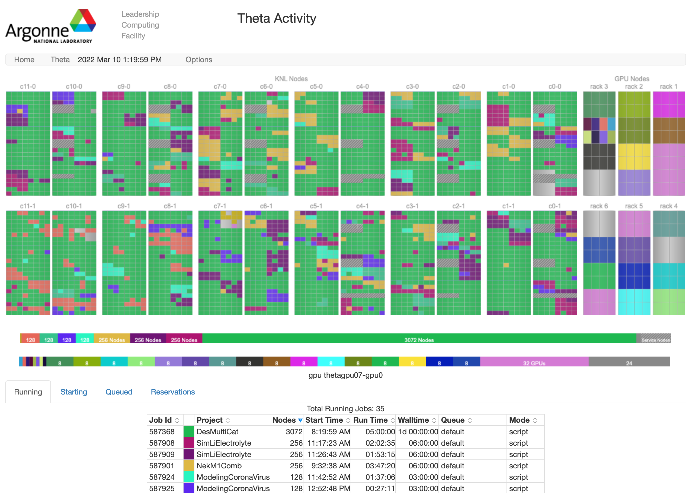
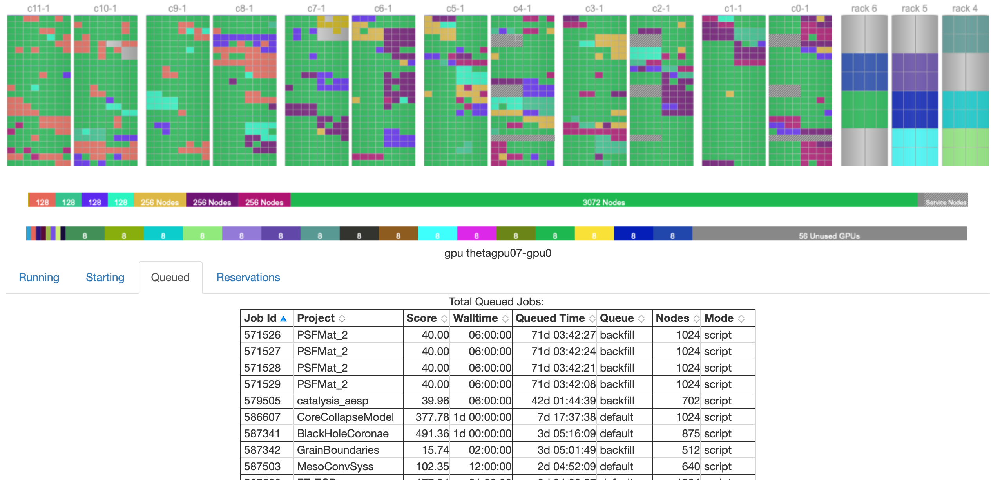
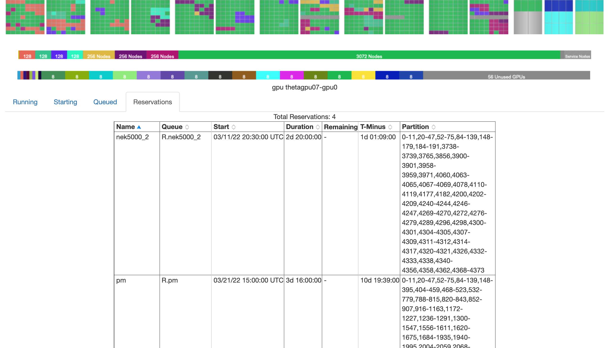
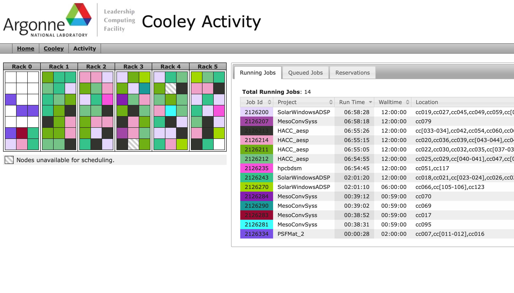

---
search:
  exclude: true
---

# The Gronkulator: Job Status Display

## Overview 
The Gronkulator, or “The Gronk” is a web-based tool that provides a pictorial depiction of the jobs running on ALCF supercomputers. The tool also provides information about the job queue and machine reservations. The tool can be accessed via [status.alcf.anl.gov](https://status.alcf.anl.gov).

**Note:** If you are logged into the system, all of the information contained on the Gronkulator is available via the “qstat” command. There are more options in the qstat command that are not available on the Gronkulator. 

To view machine activity, click on the name of one of our supercomputers. Upon clicking, you will see all the jobs running on the resource. The running jobs are color-coded by the name of the project allocation that the job is being charged to. 

<figure markdown>
  { width="700" }
  <figcaption>Theta activity</figcaption>
</figure>

Under the color-coded blocks, the "Running" tab will be activated. This tab displays the length of time for the job has been running (i.e. “Running Time”), the requested “Wall Time”, its location on the machine (i.e. the specific rack partitions on which the job is running), the number of compute nodes the job is running, and the mode (i.e. the number of MPI threads that the job is running on, on each compute node).

There are three additional tabs: Starting, Queued, and Reservations.

<figure markdown>
  { width="700" }
  <figcaption>Theta queued</figcaption>
</figure>

"Starting" shows the jobs that will run next. "Queued" shows the number of jobs that are queued on the system, and their score. The higher the score the more likelihood of the job running before those that have a lower score, should an appropriately sized partition become available. The third tab “Reservations”, shows if any reservations have been placed. 

<figure markdown>
  { width="700" }
  <figcaption>Theta reservations</figcaption>
</figure>

For instance, if you have submitted a fairly large job in the queue (large by way of the number of nodes on which the job will run, and/or the length of time for which it will run), and you notice that other jobs with a lower score are being transitioned from the “Queued Jobs” state to the “Running Jobs” state, then check if there is an upcoming “reservation” that is causing the system to “drain”. As a note, there is almost always a reservation for “preventative maintenance”.

The layout of Cooley (the visualization system) is a bit different than Theta. The squares under a Rack represents a compute node which has 12 cores.

<figure markdown>
  { width="700" }
  <figcaption>Cooley activity</figcaption>
</figure>

